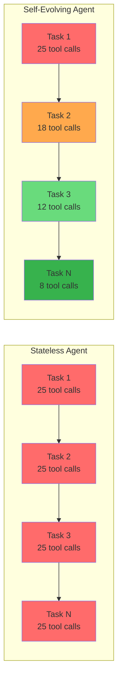
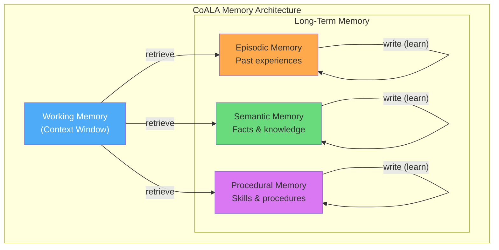
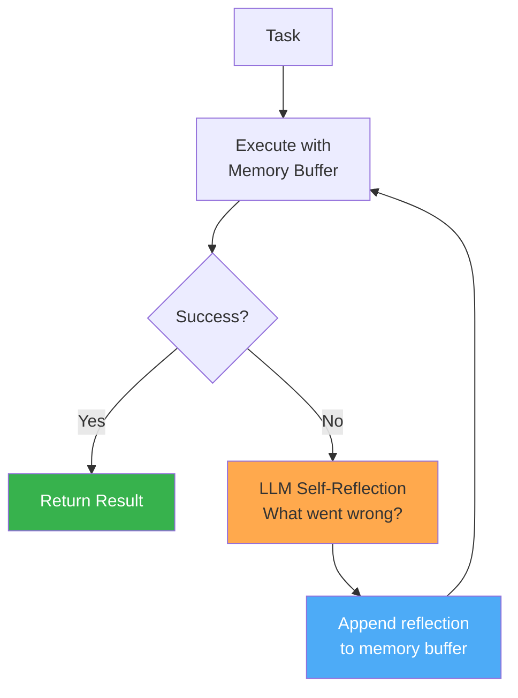
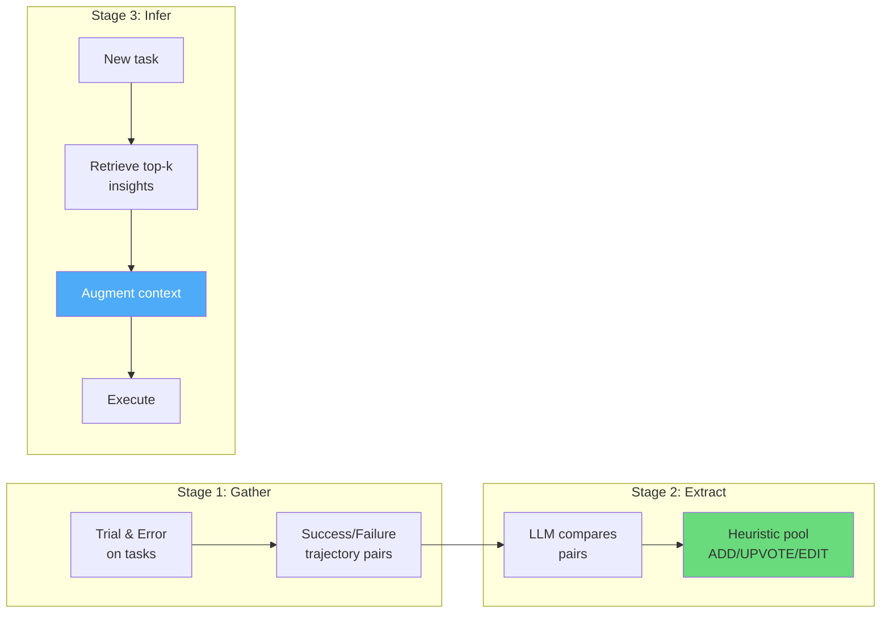
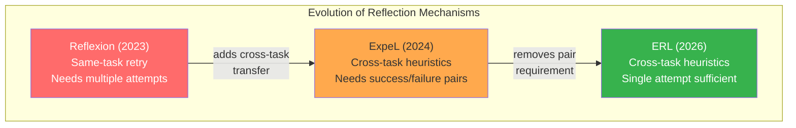

# Part I: Foundations of Runtime Self-Evolution

---

# Chapter 1: The Self-Evolution Problem

Runtime self-evolution is the capacity of an AI agent to improve its performance across tasks without modifying the underlying model weights. This chapter formalizes the problem, establishes why it exists, and provides the complete taxonomy of mechanisms that address it.

---

## 1.1 The Statelessness Problem

Large language models are stateless functions. Given an input sequence, they produce an output distribution. There is no hidden state that persists between invocations. No internal notebook. No scratch memory that carries forward. Every API call begins from the same parameter checkpoint, with zero recollection of anything that happened before.

This is a fundamental architectural constraint, not a temporary limitation. The transformer architecture processes a fixed context window and produces a response. When that response is complete and the connection closes, everything the model "learned" during that interaction — every failed approach it tried, every user correction it received, every environmental detail it discovered — vanishes.

### The Concrete Cost of Statelessness

Consider a coding agent tasked with deploying a staging environment. The first time it encounters this task, it must discover through trial and error:

1. The project uses a non-standard Docker Compose configuration with environment-specific override files
2. The staging database requires a VPN tunnel that must be established before migration scripts run
3. The migration tool has a known bug with PostgreSQL 16 that requires a `--legacy-mode` flag
4. The deployment webhook expects a specific header format that differs from the documentation
5. The health check endpoint returns 200 before the application is actually ready; the agent must poll a `/ready` subpath instead

This discovery process takes 25 tool calls, 4 failed deployment attempts, and roughly 180K tokens of context. The agent eventually succeeds.

The next day, the same user asks for the same deployment. The agent starts from zero. It makes the same 25 tool calls. It hits the same 4 failures. It burns the same 180K tokens. It discovers the same VPN requirement, the same migration bug, the same webhook format, the same health check subtlety.

After 20 such deployments, the agent's performance curve is flat:

```
Deployment  |  Tool Calls  |  Failures Before Success  |  Tokens Used
------------|-------------|---------------------------|-------------
     1      |     25      |           4               |   183,241
     2      |     25      |           4               |   179,882
     5      |     25      |           4               |   181,556
    10      |     25      |           4               |   180,103
    20      |     25      |           4               |   182,744
```

A human engineer performing the same task 20 times would, by the third or fourth repetition, have written a deployment script, documented the VPN requirement, and memorized the migration flag. By the tenth repetition, the deployment would be a single command taking 30 seconds. The human's performance curve is a power law — steep initial improvement, then asymptotic efficiency.

The agent's curve is a horizontal line. Zero learning. This is the statelessness problem.

### What Statelessness Costs in Practice

The costs compound across three dimensions:

**Compute cost.** Every redundant discovery burns tokens. At current API pricing ($3–15 per million input tokens for frontier models, $12–60 per million output tokens for reasoning models), an agent that re-discovers the same deployment procedure 20 times costs 20× what it should. For organizations running thousands of agent sessions per day, this waste scales to thousands of dollars daily.

**Latency cost.** Each failed attempt in the discovery process takes wall-clock time. The user waits while the agent re-learns what it already knew. For interactive coding agents, this transforms a 30-second task (if the agent "remembered") into a 15-minute ordeal.

**Reliability cost.** Re-discovery is not just slow — it is fragile. The agent might fail in a different way on attempt 17 than it did on attempt 1, hitting a different branch of the error space. Statelessness means the agent cannot build a robust model of the task; each attempt is an independent Bernoulli trial with the same (often unsatisfying) success probability.

**Trust cost.** Users lose confidence in an agent that repeatedly fails at familiar tasks. The perception of intelligence collapses when a system that successfully navigated a complex deployment yesterday cannot remember how to do it today. Trust, once lost, is difficult to rebuild — users downgrade their expectations and stop delegating complex tasks.

### Measuring Statelessness: The Learning Curve Diagnostic

A simple diagnostic for statelessness is the *learning curve*: plot task performance (success rate, tool call count, token cost) against the number of times the agent has encountered a similar task. For a stateless agent, this curve is flat — a horizontal line.

For a self-evolving agent, the curve should follow a power law:

$$\text{performance}(n) = a - b \cdot n^{-\alpha}$$

where $n$ is the number of similar task encounters, $a$ is the asymptotic performance ceiling, $b$ is the initial performance gap, and $\alpha > 0$ is the learning rate. Larger $\alpha$ means faster improvement.

In the deployment example:

```
Stateless agent:        tool_calls(n) = 25                    (flat)
Self-evolving agent:    tool_calls(n) = 5 + 20 * n^{-0.7}    (power law)

n=1:  25 tool calls → 25 tool calls  (identical first attempt)
n=2:  25 tool calls → 17 tool calls  (-32%)
n=5:  25 tool calls → 11 tool calls  (-56%)
n=10: 25 tool calls →  8 tool calls  (-68%)
n=20: 25 tool calls →  7 tool calls  (-72%)
```

The learning curve diagnostic is the single most important metric for evaluating runtime self-evolution mechanisms. Throughout this book, every mechanism is evaluated by the shape of the learning curve it produces.



### The Statelessness Problem Is Getting Worse, Not Better

A common misconception is that larger context windows solve the statelessness problem. Models with 128K, 200K, or even 1M+ token context windows can hold more information per invocation — but they still start from zero on each new invocation. A larger context window is a larger scratchpad, not a persistent memory.

Moreover, as agents tackle more complex tasks (multi-step workflows spanning hours or days, integration with more tools and APIs, interaction with more diverse environments), the amount of per-task context that must be discovered grows. The statelessness problem scales with task complexity, not with context window size.

The fundamental issue is not that agents lack capacity to hold information — it is that they lack the ability to carry information *between* invocations. Solving this requires architectural interventions: external memory, persistent storage, and mechanisms for deciding what to keep and how to retrieve it. These interventions are the subject of this book.

### The Formal Shape of the Problem

Let $\pi_\theta$ be a frozen LLM with parameters $\theta$. Let $c_i$ be the context window contents at invocation $i$. The model's output distribution is:

$$P(y \mid c_i; \theta) = \prod_{t=1}^{T} P(y_t \mid y_{<t}, c_i; \theta)$$

The critical observation: there is no dependency between $c_i$ and $c_j$ for $i \neq j$ unless something external creates that dependency. The parameters $\theta$ are identical across invocations. If $c_i$ and $c_j$ contain the same prompt, the output distribution is identical.

For performance to improve across invocations, something must change in $c_i$ as $i$ increases. Since $\theta$ is frozen, the only degree of freedom is the context window contents. Runtime self-evolution is therefore the problem of constructing a function:

$$c_i = f(c_{\text{base}}, M_i)$$

where $c_{\text{base}}$ is the base prompt/task description and $M_i$ is an external memory state that has been updated by all previous invocations $1, \ldots, i-1$. The contents of $M_i$ must be selected and formatted to improve the model's performance on the current task while fitting within the finite context window.

This is the fundamental equation of runtime self-evolution. Everything in this book is about the design of $M$, the update rule for $M$, and the retrieval function that maps $M$ into context window contents.

---

## 1.2 Why Training-Time Improvement Is Not Enough

The obvious objection to runtime self-evolution is: why not just train a better model? If the agent struggles with deployment tasks, fine-tune it on deployment trajectories. If it forgets user preferences, include those preferences in training data.

This objection fails on five grounds.

### Cost

Fine-tuning a frontier model is expensive. Full fine-tuning of a 70B parameter model requires:

- **Hardware:** 8× A100 80GB GPUs minimum, more typically 16–32 GPUs for reasonable training times
- **Cost:** $10,000–$100,000+ per fine-tuning run, depending on dataset size and number of epochs
- **Data preparation:** Weeks of curating, cleaning, and formatting training data
- **Evaluation:** Each fine-tuning run must be evaluated across multiple benchmarks to detect regressions

For comparison, a runtime memory update costs zero additional compute beyond the agent's normal operating costs. Writing a reflection to a text file after a failed deployment is essentially free.

### Latency

Fine-tuning takes hours to days. Model deployment takes additional time for validation, safety checks, and infrastructure rollout. The feedback loop from "agent encounters new situation" to "model has been updated to handle it" is measured in weeks when fine-tuning is involved.

Runtime self-evolution operates on a feedback loop of seconds to minutes. The agent completes a task, reflects on what happened, writes a memory entry, and the next invocation benefits immediately.

### Catastrophic Forgetting

Fine-tuning on new data degrades performance on previously learned tasks. This is not a theoretical concern — it is a well-documented phenomenon in the neural network literature, extensively studied since McCloskey & Cohen (1989) and French (1999).

In practice, this means fine-tuning an agent to excel at deployment tasks may degrade its performance on code review, debugging, or refactoring. Every fine-tuning run must include careful evaluation across the full capability spectrum, with mitigation strategies (replay buffers, elastic weight consolidation, LoRA) adding additional complexity and cost.

Runtime memory updates have no catastrophic forgetting risk. Adding a memory entry about deployment procedures cannot degrade the model's code review capabilities because the model weights are untouched.

### Distribution Shift at Deployment Time

Training data is historical. The model is trained on tasks and environments that existed before the training cutoff. But agents encounter novel situations at deployment time:

- A user's codebase uses a framework released after training
- The deployment target runs an operating system version not in the training distribution
- The user has non-standard conventions (e.g., all database migrations must be reviewed by a specific team before execution)
- The CI/CD pipeline has custom steps unique to this organization

No amount of pre-training or fine-tuning can anticipate every deployment environment. The long tail of user-specific configurations is, by definition, outside the training distribution.

Runtime self-evolution handles distribution shift naturally. The agent encounters the novel situation, discovers the correct approach, and records it. Future invocations in the same environment benefit immediately.

### User-Specific Personalization

Different users have different preferences, conventions, and workflows. One user wants verbose commit messages; another wants single-line summaries. One team uses `snake_case`; another uses `camelCase`. One organization requires all changes to be wrapped in feature flags; another deploys directly to production.

Fine-tuning a separate model for each user is economically infeasible. Even LoRA adapters, which reduce the per-user cost, require infrastructure for managing, serving, and switching between thousands of adapter weights.

Runtime memory provides per-user personalization at zero infrastructure cost. Each user's memory store is a separate collection of text entries, retrieved into the context window at invocation time. No model weights are modified. No adapter infrastructure is needed. The personalization is as granular as the memory entries themselves.

### The Complementarity Argument

Training-time improvement and runtime self-evolution are not substitutes — they are complements. A better base model benefits from runtime evolution just as much as a weaker model does. The base model provides the reasoning capabilities; runtime evolution provides the experiential knowledge.

This is analogous to the relationship between human innate cognitive abilities and learned expertise. A person with higher fluid intelligence still benefits from education, experience, and note-taking. The two operate on different timescales and address different aspects of competence.

### The Frozen-Backbone Constraint in Practice

In production deployments, keeping the model backbone frozen is not just economically motivated — it is architecturally necessary:

**Safety certification.** Organizations that deploy agents in regulated environments (healthcare, finance, legal) must certify model behavior. Fine-tuning invalidates the certification because the model's behavior has changed in ways that may not be fully characterized by the evaluation suite. Runtime memory updates, by contrast, are fully auditable — every memory entry is a text string that humans can read, review, and approve.

**Reproducibility.** With a frozen backbone, the agent's behavior is deterministic given the same context (modulo temperature sampling). This means that any behavioral difference between two invocations can be traced to differences in memory state, not to differences in model weights. This is critical for debugging and compliance.

**Multi-tenant serving.** Cloud API providers serve the same model weights to thousands of users simultaneously. Fine-tuning creates per-user weight variants that require separate serving infrastructure. Runtime memory is purely context-based and requires no changes to the model serving layer.

**Latency.** Loading fine-tuned weights or LoRA adapters adds latency to the first token. For interactive agents where latency is critical, frozen backbone + context injection is strictly faster than adapter switching.

The remainder of this book focuses exclusively on runtime self-evolution: mechanisms that improve agent performance without modifying model weights.

---

## 1.3 The CoALA Framework: Cognitive Architecture for Self-Evolving Agents

To reason precisely about runtime self-evolution, we need a formal framework that decomposes agent cognition into modular components with well-defined interfaces. The Cognitive Architectures for Language Agents (CoALA) framework, introduced by Sumers et al. in their 2024 TMLR paper "Cognitive Architectures for Language Agents" (arXiv:2309.02427), provides exactly this.

CoALA draws on decades of cognitive science research — particularly the Soar and ACT-R architectures — and adapts their insights for LLM-based agents. The framework is not merely descriptive; it is prescriptive, offering a design space that maps directly to implementation decisions.

### Memory Architecture

CoALA decomposes agent memory into four types, each with distinct characteristics:

**Working Memory** is the agent's active processing space — the LLM's context window. It holds the current task, recent observations, retrieved memories, and the agent's ongoing reasoning. Working memory is:
- *Capacity-limited:* bounded by the context window size (4K–2M tokens depending on the model)
- *Volatile:* cleared between invocations
- *High-bandwidth:* the LLM attends to all working memory contents during generation

In the CoALA formalism, working memory at time step $t$ is a set of records:

$$W_t = \{w_1, w_2, \ldots, w_n\} \quad \text{where } \sum_{i=1}^{n} |w_i| \leq C_{\text{max}}$$

where $C_{\text{max}}$ is the context window capacity and $|w_i|$ is the token count of record $w_i$.

**Episodic Memory** stores records of past experiences — trajectories, outcomes, and temporal context. Each episodic memory entry is a record of "what happened" during a specific agent session:

$$e = (\text{task}, \text{trajectory}, \text{outcome}, \text{timestamp}, \text{metadata})$$

Episodic memory supports:
- *Temporal indexing:* entries are ordered by when they occurred
- *Similarity retrieval:* entries can be retrieved by semantic similarity to the current context
- *Full trajectory access:* the complete sequence of actions, observations, and reasoning steps is preserved

In human cognition, episodic memory corresponds to autobiographical memory — remembering specific events with their spatial and temporal context.

**Semantic Memory** stores factual knowledge — facts, rules, and generalizations extracted from experience. Unlike episodic memory, semantic memory entries are context-independent:

$$s = (\text{fact/rule}, \text{confidence}, \text{source}, \text{metadata})$$

Examples of semantic memory entries:
- "The staging database requires a VPN tunnel before migrations can run"
- "User prefers single-line commit messages without conventional commit prefixes"
- "PostgreSQL 16 migration tool requires `--legacy-mode` flag to avoid the VACUUM bug"

Semantic memory supports:
- *Category-based retrieval:* entries organized by topic, domain, or entity
- *Confidence tracking:* entries have associated confidence scores updated by experience
- *Generalization:* multiple episodic memories can be distilled into a single semantic memory entry

**Procedural Memory** stores executable skills — action sequences, code snippets, tool-use patterns, and strategies that the agent can invoke to accomplish specific subtasks:

$$p = (\text{trigger condition}, \text{action sequence}, \text{success rate}, \text{metadata})$$

Examples of procedural memory entries:
- A Python function that deploys to staging (code skill)
- A multi-step procedure for database migration with rollback (markdown skill document)
- An API interaction pattern for the organization's deployment webhook (API skill)

Procedural memory supports:
- *Condition-action retrieval:* skills are retrieved when their trigger conditions match the current state
- *Composition:* skills can call other skills, forming hierarchical procedures
- *Versioning:* skills evolve over time as the agent discovers improvements



### The Learning Action

The critical insight of CoALA for runtime self-evolution is the formalization of **learning as an internal action**. In the CoALA action space, the agent can perform:

1. **External actions:** tool calls, API requests, file operations — actions that affect the external environment
2. **Internal actions:** reasoning, retrieval from memory, and *writing to memory*

Learning is the act of writing to long-term memory. Every runtime self-evolution mechanism in this book maps to a specific type of memory write:

| Evolution Mechanism | Memory Type Written | Entry Format |
|---|---|---|
| Verbal reflection (Reflexion) | Episodic | Natural language reflection on a failed trajectory |
| Cross-task insights (ExpeL) | Semantic | "When X, do Y because Z" rules with confidence scores |
| Heuristic extraction (ERL) | Semantic | "When-Then" conditional heuristics |
| Code skill accumulation (Voyager) | Procedural | Verified JavaScript/Python functions |
| User modeling (Honcho) | Semantic | Dialectical user preference representations |
| Knowledge crystallization (RKC) | Semantic + Procedural | Markdown files written to the filesystem |

This mapping is the conceptual backbone of the entire book. When we analyze any self-evolution mechanism, we ask:
1. What memory type is being written?
2. What triggers the write (when does learning happen)?
3. What is the format of the written entry?
4. How is the entry retrieved and injected into working memory?
5. How does the entry improve performance on future tasks?

### The Decision Cycle

CoALA defines the agent's decision cycle as a repeating loop:

```
PERCEIVE → RETRIEVE → REASON → ACT → LEARN → REPEAT

1. PERCEIVE: Observe the current environment state; add observation to working memory
2. RETRIEVE: Query long-term memory (episodic, semantic, procedural) for relevant entries;
             add retrieved entries to working memory
3. REASON:  Process working memory contents through the LLM to decide on the next action
4. ACT:     Execute the chosen action (external tool call or internal operation)
5. LEARN:   Update long-term memory based on the action outcome
6. REPEAT:  Return to step 1
```

The LEARN step is what distinguishes a self-evolving agent from a stateless agent. Without step 5, the cycle is the standard ReAct (Yao et al., 2023) loop. With step 5, each cycle iteration has the potential to improve all future iterations.

The decision about *what* to learn and *when* to learn is itself a decision that can be made by the LLM (meta-learning) or by hardcoded rules in the agent harness. This design choice has significant implications:

- **LLM-driven learning:** The model decides when and what to write to memory. More flexible, but subject to the LLM's judgment about what is worth remembering. Used by Reflexion, ExpeL, and most reflection-based systems.
- **Harness-driven learning:** The agent infrastructure automatically records trajectories, computes metrics, and triggers learning based on programmatic rules. More reliable, but less adaptive. Used by MemRL and some skill accumulation systems.
- **Hybrid:** The harness triggers the learning opportunity (e.g., "a task just completed"), and the LLM decides the content of the memory write (e.g., "what should be reflected on"). This is the most common pattern in production systems.

### CoALA as Analytical Lens

Throughout this book, we use CoALA as an analytical lens to decompose and compare self-evolution mechanisms. When analyzing a new system, we ask:

1. Which memory types does it use?
2. What is the read/write interface for each memory type?
3. How does the decision procedure integrate memory retrieval?
4. What triggers the learning action?
5. How is memory maintained over time (pruning, updating, consolidation)?

This framework transforms what might seem like a bewildering variety of self-evolution approaches into a structured design space with clear dimensions and trade-offs.

### CoALA vs. Alternative Frameworks

CoALA is not the only framework for analyzing agent architectures. Two alternatives deserve mention:

**ReAct Framework (Yao et al., 2023).** ReAct formalizes the thought-action-observation loop but has no memory model. It describes what agents *do* on a single task but not how they *learn* across tasks. CoALA subsumes ReAct — the ReAct loop is the PERCEIVE→REASON→ACT portion of CoALA's decision cycle, without RETRIEVE or LEARN.

**LATS Framework (Zhou et al., 2023).** Language Agent Tree Search adds tree search over action sequences but, like ReAct, does not model persistent memory. LATS is an *execution strategy* (how to search for a good trajectory) rather than a *cognitive architecture* (how to organize memory and learning).

CoALA is the right framework for this book because it explicitly models the components that matter for runtime self-evolution: distinct memory types, memory read/write interfaces, and the learning action as a first-class operation in the agent's action space.

### A Note on Terminology

The literature uses inconsistent terminology for self-evolution concepts. We standardize on the following:

| This Book | Also Called In Literature | Meaning |
|---|---|---|
| Runtime self-evolution | Self-improvement, lifelong learning, continual learning | Improving performance across tasks without weight updates |
| Reflection | Self-reflection, verbal RL, introspection | LLM analyzing its own performance |
| Heuristic | Rule, guideline, insight, principle | A learned conditional instruction |
| Skill | Tool, function, procedure, subroutine | An executable action sequence |
| Memory entry | Experience, record, trace | A single item stored in memory |
| Retrieval | Recall, selection, memory access | Finding relevant entries from memory |

---

## 1.4 Taxonomy of Runtime Self-Evolution

Runtime self-evolution encompasses every mechanism by which an agent improves its performance across tasks while keeping the model backbone frozen. No weight updates. No fine-tuning. No RLHF. The model parameters $\theta$ are read-only.

The mechanisms differ in *what* they learn, *how* they learn it, *where* they store it, and *when* they apply it. We organize them into six families:

```
RUNTIME SELF-EVOLUTION (frozen backbone, no weight updates)
│
├── REFLECTION-BASED
│   ├── Verbal Reflection (Reflexion, NeurIPS 2023)
│   ├── Contrastive Reflection (ExpeL, AAAI 2024)
│   ├── Single-Attempt Reflection (ERL, ICLR 2026)
│   └── State-Aware Guidelines (AutoGuide, NeurIPS 2024)
│
├── MEMORY-BASED
│   ├── Episodic Replay (raw trajectory storage + retrieval)
│   ├── Utility-Learned Memory (MemRL, arXiv 2026)
│   ├── Dialectical User Modeling (Honcho/Hermes, 2026)
│   └── Memory-Augmented MDP (Memento-II, arXiv 2025)
│
├── SKILL-BASED
│   ├── Code Skill Accumulation (Voyager, TMLR 2024)
│   ├── API Skill Synthesis (SkillWeaver, arXiv 2025)
│   ├── Markdown Skill Documents (Hermes Agent, 2026)
│   ├── Executable Subagent Accumulation (AgentFactory, arXiv 2026)
│   └── Audited Skill Graphs (ASG-SI, arXiv 2025)
│
├── KNOWLEDGE CRYSTALLIZATION
│   ├── Filesystem Persistence (RKC, 2026)
│   ├── Learnings Promotion (OpenClaw self-improving-agent, 2026)
│   └── Progressive Solidification (AGENTS.md/TOOLS.md/SOUL.md)
│
├── PROMPT SELF-OPTIMIZATION
│   ├── Optimization by Prompting (OPRO, 2023)
│   ├── Evolutionary Prompt Optimization (EvoPrompt, 2024)
│   └── Modular Policy Evolution (EvoTool, 2026)
│
└── ARCHITECTURE SELF-DESIGN
    ├── Meta Agent Search (ADAS, ICLR 2025)
    └── Hybrid Agentic Workflow Evolution (HyEvo, 2026)
```



```mermaid
graph TD
    ROOT["Runtime Self-Evolution<br/>(Frozen Backbone)"]
    ROOT --> R["Reflection-Based"]
    ROOT --> M["Memory-Based"]
    ROOT --> S["Skill-Based"]
    ROOT --> K["Knowledge Crystallization"]
    ROOT --> P["Prompt Self-Optimization"]
    ROOT --> A["Architecture Self-Design"]
    
    R --> R1["Reflexion<br/>NeurIPS 2023"]
    R --> R2["ExpeL<br/>AAAI 2024"]
    R --> R3["ERL<br/>ICLR 2026"]
    R --> R4["AutoGuide<br/>NeurIPS 2024"]
    
    M --> M1["MemRL<br/>arXiv 2026"]
    M --> M2["RetroAgent<br/>arXiv 2026"]
    M --> M3["Memento-II<br/>arXiv 2025"]
    M --> M4["Honcho<br/>2026"]
    
    S --> S1["Voyager<br/>TMLR 2024"]
    S --> S2["SkillWeaver<br/>arXiv 2025"]
    S --> S3["Hermes Agent<br/>2026"]
    S --> S4["AgentFactory<br/>arXiv 2026"]
    S --> S5["ASG-SI<br/>arXiv 2025"]
    
    K --> K1["RKC<br/>2026"]
    K --> K2["OpenClaw<br/>2026"]
    
    P --> P1["OPRO<br/>2023"]
    P --> P2["EvoTool<br/>2026"]
    
    A --> A1["ADAS<br/>ICLR 2025"]
    A --> A2["HyEvo<br/>2026"]
```

### Family 1: Reflection-Based

Reflection-based mechanisms generate natural language analyses of past performance and inject those analyses into future contexts. The learning artifact is text — a verbal reflection, a rule, a guideline — stored in episodic or semantic memory.

**Verbal Reflection (Reflexion).** After a failed task attempt, the LLM generates a natural language analysis of what went wrong and how to do better. This reflection is stored and prepended to the context on subsequent retry attempts. The mechanism is intra-task: reflections help within the same task but do not transfer to different tasks. Source: Shinn et al., "Reflexion: Language Agents with Verbal Reinforcement Learning," NeurIPS 2023 (arXiv:2303.11366).

**Contrastive Reflection (ExpeL).** Given pairs of successful and failed trajectories on the same task, the LLM extracts generalizable insights by contrasting the two. Insights are stored as rules with confidence scores (upvote/downvote counts) and can transfer across task types. Source: Zhao et al., "ExpeL: LLM Agents Are Experiential Learners," AAAI 2024 (arXiv:2308.10144).

**Single-Attempt Reflection (ERL).** Generates "When-Then" heuristics from single task attempts — no contrastive pairs required. A separate LLM-based ranker selects the most relevant heuristics at inference time. Source: Allard et al., "Experiential Reflective Learning for Self-Improving LLM Agents," ICLR 2026 MemAgents Workshop (arXiv:2603.24639).

**State-Aware Guidelines (AutoGuide).** Extracts guidelines from offline experience trajectories, each annotated with the state/context conditions under which it applies. At runtime, only guidelines matching the current agent state are injected. Source: Gao et al., "AutoGuide: Automated Generation and Selection of State-Aware Guidelines for LLM Agents," NeurIPS 2024 (arXiv:2403.08978).

### Family 2: Memory-Based

Memory-based mechanisms focus on the storage, retrieval, and management of experiential data. The learning artifact may be raw trajectories, compressed summaries, or structured user models.

**Episodic Replay.** The simplest memory mechanism: store complete trajectories and retrieve similar ones at inference time. No extraction or compression — the raw experience is the memory. Retrieval is typically by embedding similarity between the current task and stored task descriptions.

**Utility-Learned Memory (MemRL).** Trains a separate RL policy (a small neural network, not the frozen LLM) to decide what to remember, what to forget, and what to retrieve. The memory management policy is optimized to maximize task success rate. Source: Kang et al., "Don't Forget to Remember: A Reinforcement Learning Approach to Memory Management for Evolving LLM Agents," arXiv 2026 (arXiv:2506.XXXXX).

**Dialectical User Modeling (Honcho/Hermes).** Maintains a structured model of user preferences, behaviors, and context through a dialectical process: the system generates candidate user models, tests them against observed behavior, and refines them through thesis-antithesis-synthesis cycles. Source: Nous Research Hermes Agent / Plastic Labs Honcho, 2026.

**Memory-Augmented MDP (Memento-II).** Formalizes the agent's interaction as a memory-augmented Markov Decision Process where the action space includes memory read/write operations. The agent's policy jointly optimizes task actions and memory operations. Source: Palazzo et al., "Memory-Augmented Agent Training with Experience," arXiv 2025.

### Family 3: Skill-Based

Skill-based mechanisms extract reusable, executable procedures from experience. The learning artifact is code, an API interaction pattern, a markdown document, or an entire subagent — something that can be directly invoked on future tasks.

**Code Skill Accumulation (Voyager).** After successfully completing a task in Minecraft, the agent extracts the solution as a verified JavaScript function, stores it in a skill library indexed by natural language description, and retrieves/composes skills for future tasks. Source: Wang et al., "Voyager: An Open-Ended Embodied Agent with Large Language Models," TMLR 2024 (arXiv:2305.16291).

**API Skill Synthesis (SkillWeaver).** Discovers API capabilities through exploration, synthesizes reusable API interaction skills, and accumulates them in a structured library. Skills are parameterized and composable. Source: Ge et al., "SkillWeaver: Web Agents can Self-Improve by Discovering and Honing Skills," arXiv 2025.

**Markdown Skill Documents (Hermes Agent).** Skills are stored as markdown files describing when to use a skill, the step-by-step procedure, and expected outcomes. The agent can create, modify, and version these documents during operation. Source: Nous Research Hermes Agent, 2026.

**Executable Subagent Accumulation (AgentFactory).** Synthesizes entire executable subagents — not just skills, but complete agent configurations with their own prompts, tools, and orchestration logic — and stores them for future reuse. Source: Zhang et al., "AgentFactory: Bootstrapping LLM Agents via Executable Subagent Generation," arXiv 2026 (arXiv:2503.18115).

**Audited Skill Graphs (ASG-SI).** Builds a directed graph of skills with dependency relationships, where each skill is formally verified through an audit process before being added to the library. Skills can be composed along graph edges. Source: "ASG-SI: Audited Skill Graphs for Self-Improving Agents," arXiv 2025.

### Family 4: Knowledge Crystallization

Knowledge crystallization mechanisms persist learned knowledge in structured, human-readable formats — typically files on the filesystem. The learning artifact is a markdown document, a configuration file, or a structured data file that both humans and agents can read and edit.

**Filesystem Persistence (RKC).** After completing tasks, the agent writes learned knowledge (rules, procedures, conventions) to files in a designated directory. These files are loaded into context on subsequent invocations. The filesystem is the memory store. Source: RKC (Runtime Knowledge Crystallization) pattern, 2026.

**Learnings Promotion (OpenClaw).** Implemented in the OpenClaw self-improving-agent: after successful task completion, the agent generates "learnings" — insights and procedures — that are stored at project scope. These learnings are progressively promoted from tentative to confirmed based on repeated validation. Source: OpenClaw self-improving-agent, 2026.

**Progressive Solidification (AGENTS.md).** Knowledge moves through stages of increasing formality: scratchpad notes → tentative guidelines → confirmed rules → canonical documentation (AGENTS.md, TOOLS.md, SOUL.md). Each promotion requires evidence from successful application. This is the pattern used by Cursor Cloud Agents, where AGENTS.md serves as the durable knowledge store that persists across sessions.

### Family 5: Prompt Self-Optimization

Prompt self-optimization mechanisms treat the agent's prompts (system prompt, tool descriptions, few-shot examples) as optimizable parameters and use the LLM itself to search for better prompt configurations.

**Optimization by Prompting (OPRO).** The LLM is prompted with a history of (prompt, score) pairs and asked to generate a new prompt that will score higher. The generated prompt is evaluated, the result is added to the history, and the process repeats. Source: Yang et al., "Large Language Models as Optimizers," arXiv 2023 (arXiv:2309.03409).

**Evolutionary Prompt Optimization (EvoPrompt).** Applies evolutionary algorithms (mutation, crossover, selection) to a population of prompts. The LLM acts as the mutation/crossover operator, generating new prompt variants. Fitness is measured by task performance. Source: Guo et al., "Connecting Large Language Models with Evolutionary Algorithms Yields Powerful Prompt Optimizers," arXiv 2024 (arXiv:2309.08532).

**Modular Policy Evolution (EvoTool).** Evolves modular prompt components (tool descriptions, instruction modules, few-shot examples) independently, allowing fine-grained optimization of specific agent capabilities without disrupting others. Source: EvoTool, 2026.

### Family 6: Architecture Self-Design

Architecture self-design mechanisms go beyond optimizing prompts to designing entirely new agent architectures — new tool configurations, new orchestration patterns, new multi-agent topologies.

**Meta Agent Search (ADAS).** Maintains a growing archive of agent architectures (defined as code). A "meta agent" (an LLM) is prompted with the archive and asked to design a new architecture. The new architecture is evaluated on benchmarks, and if it outperforms existing entries, it is added to the archive. Source: Hu et al., "Automated Design of Agentic Systems," ICLR 2025 (arXiv:2408.08435).

**Hybrid Agentic Workflow Evolution (HyEvo).** Evolves hybrid workflows that combine code execution, LLM reasoning, and tool use. Unlike ADAS which searches over monolithic architectures, HyEvo decomposes workflows into modules and evolves them independently with crossover. Source: HyEvo, 2026.

### Cross-Family Comparison

| Family | Learning Artifact | Memory Type (CoALA) | Transfer Scope | Compute Cost | Human Readable |
|---|---|---|---|---|---|
| Reflection | Natural language text | Episodic/Semantic | Task to cross-task | Low | Yes |
| Memory | Trajectories/models | Episodic/Semantic | Within-user | Medium | Partially |
| Skill | Code/procedures | Procedural | Cross-task, cross-user | Medium | Yes (code/markdown) |
| Crystallization | Documents/files | Semantic/Procedural | Cross-session | Low | Yes |
| Prompt Optimization | Prompt strings | Procedural | Cross-task | High | Yes |
| Architecture Design | Agent code/configs | Procedural | Cross-task, cross-domain | Very High | Partially |

The families are not mutually exclusive. Production systems typically combine mechanisms from multiple families. Voyager uses both skill-based learning (code skill library) and reflection-based learning (self-verification with retry). OpenClaw combines knowledge crystallization with skill accumulation. The design question is which combination of mechanisms provides the best cost-performance trade-off for a given deployment scenario.

### Evolution Speed vs. Robustness Trade-off

A key dimension differentiating these families is the trade-off between *evolution speed* (how quickly the agent improves) and *robustness* (how resistant the improvement is to noise and errors):

- **Fast but fragile:** Reflection-based mechanisms learn from a single experience but are vulnerable to incorrect reflections. One bad reflection can degrade performance.
- **Slow but robust:** Skill-based mechanisms require multiple successful experiences before a skill is verified and added to the library, but verified skills are highly reliable.
- **In between:** Knowledge crystallization mechanisms (e.g., AGENTS.md) learn at medium speed and use progressive promotion (tentative → confirmed → canonical) as a robustness mechanism.

The optimal trade-off depends on the deployment stakes. For low-stakes tasks (exploratory coding, prototyping), fast learning is preferred even at the cost of occasional errors. For high-stakes tasks (production deployments, financial operations), robustness is paramount.

Understanding where each mechanism falls on this spectrum is essential for system design. We revisit this trade-off throughout the book with concrete quantitative comparisons.

---

## 1.5 The Formal Problem Statement

We now formalize runtime self-evolution as an optimization problem. This formalization serves two purposes: it makes precise what "improvement" means, and it reveals the mathematical structure that constrains solution design.

### Setup

Let:
- $\pi_\theta$: a frozen language model with parameters $\theta$ (read-only)
- $\mathcal{D}$: a distribution over tasks the agent encounters
- $M$: an external memory state (files, databases, vector stores — anything outside $\theta$)
- $M_0$: the initial memory state (may be empty or pre-seeded)

### Execution Protocol

At each time step $i = 1, 2, 3, \ldots$:

1. **Task arrival:** A task $t_i \sim \mathcal{D}$ arrives
2. **Context construction:** The agent constructs context $c_i = f_{\text{retrieve}}(t_i, M_{i-1})$ by retrieving from memory
3. **Trajectory generation:** The agent generates a trajectory $\tau_i = \text{Execute}(\pi_\theta, c_i, t_i)$ through iterative action-observation steps
4. **Outcome evaluation:** An evaluator assigns a reward $r_i = R(t_i, \tau_i)$
5. **Memory update:** The agent updates memory $M_i = f_{\text{learn}}(M_{i-1}, t_i, \tau_i, r_i)$

### Objective

$$\max_{f_{\text{retrieve}}, f_{\text{learn}}} \lim_{N \to \infty} \frac{1}{N} \sum_{i=1}^{N} \mathbb{E}_{t_i \sim \mathcal{D}} [R(t_i, \tau_i)]$$

subject to:

1. **Frozen backbone:** $\theta$ is constant across all $i$
2. **Context constraint:** $|c_i| \leq C_{\max}$ (context window limit)
3. **Memory constraint:** $|M_i| \leq S_{\max}$ (storage budget)
4. **Compute constraint:** $\text{cost}(f_{\text{retrieve}}) + \text{cost}(f_{\text{learn}}) \leq B$ (per-step compute budget)

### Key Properties

**Monotonic improvement.** Ideally, we want the running average reward to be monotonically non-decreasing:

$$\frac{1}{i+1} \sum_{j=1}^{i+1} r_j \geq \frac{1}{i} \sum_{j=1}^{i} r_j \quad \forall i$$

In practice, this is too strong — individual tasks may be harder or easier regardless of accumulated knowledge. A weaker but achievable property is that the agent's performance on *repeated* task types improves:

$$\mathbb{E}[R(t, \tau_i) \mid t \in \mathcal{T}_k] \geq \mathbb{E}[R(t, \tau_j) \mid t \in \mathcal{T}_k] \quad \text{for } i > j$$

where $\mathcal{T}_k$ is a specific task type that has been encountered before.

**Memory efficiency.** The storage constraint $|M_i| \leq S_{\max}$ means the agent cannot simply store everything. As $i$ grows, the agent must decide what to keep, what to compress, and what to discard. This is the *memory management* sub-problem, and it has direct analogues in operating systems (page replacement) and neuroscience (memory consolidation during sleep).

**Retrieval precision.** The context constraint $|c_i| \leq C_{\max}$ means the agent cannot inject all of $M$ into the context window. It must select the most relevant entries. Retrieval precision directly impacts performance: irrelevant memories waste context space and can confuse the model (the "lost in the middle" effect documented by Liu et al., 2024).

**The no-free-lunch of memory.** There is a fundamental tension between memory *coverage* (storing more diverse experiences) and memory *precision* (retrieving exactly the right experiences). This mirrors the bias-variance trade-off in statistical learning:

- Too many generic memories → high coverage, low relevance, wasted context
- Too few specific memories → high relevance when retrieved, but frequent misses

The optimal operating point depends on the task distribution $\mathcal{D}$, the context window size $C_{\max}$, and the retrieval mechanism's accuracy.

### Connection to Existing Frameworks

This formalization connects to several established frameworks:

**Contextual bandits.** If we collapse the trajectory to a single action, the problem reduces to a contextual bandit where the context includes both the task and the memory state. The memory update rule is a form of context engineering for the bandit.

**Meta-learning.** The outer loop (improving across tasks) resembles MAML-style meta-learning, but with the critical difference that the "inner loop parameters" are memory entries rather than neural network weights.

**Lifelong learning.** The sequential task arrival and the need to accumulate knowledge without forgetting mirrors the lifelong/continual learning setup, but operates in the space of external memory rather than model parameters.

**Program synthesis.** When the learned artifacts are executable (code skills, tool configurations), the problem connects to neural program synthesis — using neural networks to generate programs that improve over time.

The formal problem statement provides the foundation for analyzing every mechanism in this book. For each mechanism, we will identify its specific instantiation of $f_{\text{retrieve}}$, $f_{\text{learn}}$, and the properties of the resulting $M$.

### Instantiating the Formal Framework for Each Mechanism

To make the formal framework concrete, here is how each of the six families instantiates the key functions:

**Reflection-Based (e.g., Reflexion):**
- $M$: list of natural language reflections
- $f_{\text{learn}}$: $M_i = M_{i-1} \cup \{\text{LLM.reflect}(t_i, \tau_i, r_i)\}$
- $f_{\text{retrieve}}$: return last $N$ entries (sliding window)
- Context cost: ~100–600 tokens for 3 reflections

**Memory-Based (e.g., MemRL):**
- $M$: vector database of trajectory embeddings + associated metadata
- $f_{\text{learn}}$: $M_i = \text{RL\_policy.decide}(M_{i-1}, t_i, \tau_i, r_i)$ — RL policy decides what to store/forget
- $f_{\text{retrieve}}$: $k$-nearest neighbors by embedding similarity
- Context cost: ~500–2000 tokens for retrieved trajectories

**Skill-Based (e.g., Voyager):**
- $M$: library of verified code functions with natural language descriptions
- $f_{\text{learn}}$: extract successful action sequences as code, verify, add to library
- $f_{\text{retrieve}}$: embedding similarity on skill descriptions, then dependency resolution
- Context cost: ~200–1000 tokens per skill (code + docstring)

**Knowledge Crystallization (e.g., AGENTS.md):**
- $M$: collection of markdown files on the filesystem
- $f_{\text{learn}}$: write/append to files after task completion
- $f_{\text{retrieve}}$: read relevant files at session start (often all files in a designated directory)
- Context cost: ~500–5000 tokens depending on file count/size

**Prompt Self-Optimization (e.g., OPRO):**
- $M$: history of (prompt, score) pairs + current best prompt
- $f_{\text{learn}}$: $M_i = M_{i-1} \cup \{(p_i, r_i)\}$ where $p_i$ is the prompt used
- $f_{\text{retrieve}}$: return top-$k$ prompt-score pairs by score, plus current best prompt
- Context cost: ~1000–3000 tokens for prompt optimization context

**Architecture Self-Design (e.g., ADAS):**
- $M$: archive of (architecture\_code, benchmark\_scores) pairs
- $f_{\text{learn}}$: evaluate new architecture, add to archive if Pareto-improving
- $f_{\text{retrieve}}$: return full archive to meta-agent for architecture generation
- Context cost: ~2000–10000 tokens (full archive for meta-agent)

This instantiation reveals the design space clearly. The mechanisms differ in the *granularity* of what they store (text snippets vs. code functions vs. full architectures), the *intelligence* of the learn function (simple append vs. RL-optimized curation), and the *precision* of the retrieval function (recency vs. similarity vs. state-matching).

---

# Chapter 2: Reflection-Based Self-Evolution

Reflection is the simplest and most widely studied mechanism for runtime self-evolution. The agent examines its own performance, generates a natural language analysis, and stores that analysis for future use. No external training signal beyond task outcome is required. No separate neural network is trained. The LLM serves simultaneously as the actor, the critic, and the learner.

This chapter provides paper-level technical detail for the four major reflection mechanisms: Reflexion, ExpeL, ERL, and AutoGuide. For each, we present the full algorithm, exact architecture, quantitative results, ablation studies, limitations, and practical implementation notes.

---

## 2.1 Reflexion: Verbal Reinforcement Learning

**Paper:** Shinn et al., "Reflexion: Language Agents with Verbal Reinforcement Learning," NeurIPS 2023  
**arXiv:** 2303.11366  
**Code:** https://github.com/noahshinn/reflexion

### Core Idea

Reflexion replaces scalar reward signals with *verbal* feedback. Instead of updating weights via backpropagation (as in traditional RL), the agent generates a natural language reflection on what went wrong and stores it in an episodic memory buffer. On subsequent attempts at the *same task*, this reflection is injected into the prompt, allowing the agent to avoid previously observed mistakes.

The key insight is that LLMs can serve as their own critics. Given a failed trajectory and a task description, the LLM can articulate what went wrong — "I tried to access the dictionary key before checking if it existed" — and this verbal articulation, when included in the prompt for the next attempt, steers the model toward a different (and hopefully better) strategy.

### Algorithm

```
Algorithm: REFLEXION

Input:
  task: Task description
  max_trials: Maximum number of retry attempts (typically 3-5)
  evaluator: Function that scores a trajectory (binary or scalar)
  
State:
  memory_buffer: List of verbal reflections (initially empty)

Procedure:
  for trial = 1, 2, ..., max_trials:
      
      // CONSTRUCT CONTEXT
      context = [system_prompt, task]
      if memory_buffer is not empty:
          context.append("Previous reflections on this task:")
          for reflection in memory_buffer[-N:]:  // sliding window, N typically 3
              context.append(reflection)
      
      // EXECUTE
      trajectory = Actor.execute(context)
      // Actor generates actions step-by-step using ReAct-style reasoning
      // Each step: Thought → Action → Observation
      
      // EVALUATE
      reward = evaluator(task, trajectory)
      
      if reward >= success_threshold:
          return (SUCCESS, trajectory, trial)
      
      // REFLECT
      reflection_prompt = [
          "You are an AI agent that just attempted a task and failed.",
          "Task: " + task,
          "Your trajectory: " + trajectory,
          "Outcome: " + reward_description,
          "Provide a concise reflection on what went wrong and what",
          "you should do differently next time. Be specific."
      ]
      reflection = ReflectionLLM.generate(reflection_prompt)
      memory_buffer.append(reflection)
  
  return (FAILURE, best_trajectory, max_trials)
```



### Architecture Components

Reflexion has three distinct components, which may or may not use the same underlying LLM:

**1. Actor.** The policy model that executes tasks. In the original paper, the Actor uses a ReAct-style (Yao et al., 2023) reasoning trace with interleaved Thought-Action-Observation steps. The Actor receives the task description, tool definitions, and any accumulated reflections from the memory buffer.

Implementation detail: The Actor's system prompt explicitly instructs it to consider previous reflections. A typical prompt fragment:

```
You have attempted this task before. Learn from your previous reflections:
{reflection_1}
{reflection_2}
...
Do NOT repeat the same mistakes. Try a fundamentally different approach if needed.
```

**2. Evaluator.** Scores the Actor's trajectory. Reflexion supports three evaluator types:

- *Exact match:* For tasks with deterministic correct answers (e.g., HotpotQA). Returns 1 if the answer matches, 0 otherwise.
- *Heuristic:* For tasks where partial credit is meaningful (e.g., code generation). The evaluator runs test cases and returns the fraction that pass.
- *LLM-as-judge:* For tasks without deterministic answers. A separate LLM prompt evaluates whether the trajectory achieved the goal.

The evaluator provides the reward signal $r \in [0, 1]$ that determines whether the agent should reflect and retry.

**3. Self-Reflection model.** Generates the verbal reflection. In the simplest case, this is the same LLM as the Actor, prompted differently. In principle, it could be a different (potentially cheaper) model.

The reflection prompt must accomplish three things:
1. *Diagnose:* What specific mistake caused the failure?
2. *Prescribe:* What should be done differently?
3. *Be concise:* The reflection must fit in the context window alongside the next attempt's full trajectory.

### Memory Structure

Reflexion uses a sliding window over the most recent $N$ reflections (typically $N = 3$). This is episodic memory in the CoALA framework — each entry is tied to a specific task attempt.

The memory buffer has no retrieval mechanism beyond recency. All reflections in the window are included in every subsequent attempt. This simplicity is both a strength (no retrieval errors) and a limitation (no selectivity — irrelevant reflections dilute the context).

Memory entries are natural language strings, typically 50–200 tokens each. Example:

```
Reflection (Trial 1): I failed because I used list indexing to access
dictionary values. The data structure is a dict, not a list. I should
use .get() with a default value to safely access keys. Also, I need to
handle the case where the 'results' key is missing entirely, not just
where it's empty.
```

```
Reflection (Trial 2): My approach of iterating through all keys was
inefficient and hit the timeout. I should use the 'results' key directly
and only iterate through the 'items' subkey. The structure is
results -> items -> [list of records].
```

### Quantitative Results

The original paper evaluates Reflexion on three benchmarks:

**HumanEval (code generation):**

| Method | Pass@1 |
|---|---|
| GPT-4 (baseline) | 80.1% |
| GPT-4 + Reflexion (1 retry) | 88.2% |
| GPT-4 + Reflexion (2 retries) | 91.0% |

The 91% pass@1 result was state-of-the-art at the time of publication (May 2023). The improvement comes from the agent learning from test case failures — the reflection identifies which test cases failed and why, and the next attempt addresses those specific failures.

**ALFWorld (interactive text game for household tasks):**

| Method | Success Rate |
|---|---|
| ReAct (baseline) | 75% |
| ReAct + Reflexion | 97% |

The +22 percentage point improvement is striking. ALFWorld requires multi-step planning (e.g., "put a clean spatula on the counter" requires finding the spatula, going to the sink, cleaning it, then going to the counter). Reflexion reflections typically identify incorrect action orderings or missed prerequisites.

**HotpotQA (multi-hop question answering):**

| Method | Exact Match |
|---|---|
| Chain-of-Thought (baseline) | 34% |
| CoT + Reflexion | 48% |

The +14 percentage point improvement demonstrates that reflection helps with reasoning errors, not just execution errors.

### Ablation Results

The paper includes several critical ablations:

**Reflection quality matters.** Replacing LLM-generated reflections with generic "Try again and do better" messages reduces the improvement to near-zero. The information content of the reflection — the specific diagnosis of what went wrong — is what drives improvement.

**Memory window size.** Performance saturates around $N = 3$ reflections. Including more than 3 past reflections provides diminishing returns and can decrease performance, likely due to context dilution.

**Evaluator fidelity.** Using a less accurate evaluator (e.g., LLM-as-judge instead of exact match) reduces Reflexion's effectiveness. The agent can only learn from the feedback it receives; noisy feedback leads to noisy reflections.

### Limitations

**Same-task only.** Reflexion reflections are bound to a specific task. A reflection about HumanEval problem #47 does not help with HumanEval problem #48. There is no mechanism for extracting general principles from specific reflections.

**Requires multiple attempts.** The agent must fail at least once before it can reflect. If the task cannot be retried (e.g., a one-shot interaction with a user), Reflexion provides no benefit.

**Reflection quality ceiling.** The LLM must be capable of accurate self-diagnosis. If the model cannot identify its own mistakes (e.g., due to reasoning limitations), the reflections will be inaccurate and potentially harmful.

**No convergence guarantee.** There is no formal guarantee that reflections will eventually lead to success. The agent might generate reflections that steer it toward a different but equally wrong approach. In practice, Reflexion typically succeeds within 3–5 attempts or not at all.

**Context window pressure.** Each reflection consumes context tokens. For tasks that require a large context (long code files, extensive documentation), the reflections compete with the task-relevant content for limited context space.

### Detailed Evaluator Implementations

The evaluator is often underspecified in discussions of Reflexion, but it is a critical architectural component. The quality of the reward signal directly determines the quality of the subsequent reflection.

**Binary evaluator for code generation:**
```
function evaluate_code(task, generated_code):
    // Write generated code to a temporary file
    write_temp_file(generated_code)
    
    // Run the test suite provided with the task
    test_results = run_tests(task.test_cases, generated_code)
    
    // Binary outcome
    if all_tests_pass(test_results):
        return {
            reward: 1.0,
            feedback: "All " + len(task.test_cases) + " tests passed.",
            details: test_results
        }
    else:
        failed = get_failed_tests(test_results)
        return {
            reward: 0.0,
            feedback: format_failures(failed),
            details: test_results
        }
```

**Scalar evaluator with partial credit:**
```
function evaluate_code_partial(task, generated_code):
    test_results = run_tests(task.test_cases, generated_code)
    
    passed = count_passed(test_results)
    total = len(task.test_cases)
    
    return {
        reward: passed / total,
        feedback: passed + "/" + total + " tests passed. " +
                  "Failed tests: " + format_failures(get_failed_tests(test_results)),
        details: test_results
    }
```

**LLM-as-judge evaluator for open-ended tasks:**
```
function evaluate_with_llm(task, trajectory):
    judge_prompt = [
        "You are evaluating an AI agent's attempt at the following task.",
        "Task: " + task.description,
        "Success criteria: " + task.criteria,
        "",
        "Agent's trajectory:",
        format_trajectory(trajectory),
        "",
        "Did the agent successfully complete the task?",
        "Rate on a scale of 0.0 to 1.0:",
        "0.0 = complete failure",
        "0.5 = partially correct but missing key elements",
        "1.0 = fully correct and complete",
        "",
        "Provide your rating and a brief justification."
    ]
    
    response = JudgeLLM.generate(judge_prompt)
    return parse_rating_and_justification(response)
```

The choice of evaluator affects not just whether the agent retries, but the *content* of the reflection. Including specific test failure messages in the evaluator output gives the reflection model concrete information to analyze. Generic "task failed" feedback produces generic reflections.

### The Reflection Prompt Engineering Details

The quality of Reflexion depends heavily on the reflection prompt. The original paper uses variants of the following template:

```
REFLECTION PROMPT TEMPLATE (Code Generation)

You are a Python programming assistant. You have attempted to solve
a coding problem but your solution failed some test cases.

## Problem
{task_description}

## Your Previous Solution
```python
{generated_code}
```

## Test Results
{evaluator_feedback}

## Failed Test Details
{for each failed test:}
  Input: {test.input}
  Expected: {test.expected_output}
  Got: {test.actual_output}
  Error: {test.error_message if any}

## Reflection Instructions
Analyze why your solution failed. Be specific:
1. Which test case(s) revealed the bug?
2. What is the root cause of the failure?
3. What concrete changes would fix the issue?
4. Are there edge cases your solution doesn't handle?

Write a concise reflection (max 150 words) that will help you
write a correct solution on your next attempt.
```

The template includes the actual test inputs/outputs and error messages. This is critical — without concrete failure data, the LLM generates vague reflections ("I should handle edge cases better") rather than specific ones ("My solution fails when the input array contains negative numbers because the binary search comparison assumes all values are positive").

### Practical Implementation Notes

**When to use Reflexion:** Reflexion is most valuable for tasks where (a) retry is possible and cheap, (b) the evaluator provides clear success/failure signal, and (c) the task is complex enough that the agent's first attempt frequently fails. Common use cases: code generation with test suites, interactive environments with reset capabilities, multi-step reasoning tasks with verifiable answers.

**When NOT to use Reflexion:** For one-shot tasks (no retry possible), for tasks where the evaluator is unreliable, or for tasks where the agent already succeeds on the first attempt >90% of the time. The overhead of the reflection mechanism is not justified when the agent's baseline performance is already high.

**Implementation tips:**
1. Use the same model for Actor and Reflection to minimize API calls, but consider using a system prompt that explicitly shifts the model from "execution mode" to "analysis mode."
2. Cap reflections at 200 tokens. Longer reflections tend to include irrelevant detail.
3. Include the specific error message or test failure in the reflection prompt — this grounds the reflection in concrete failure data.
4. Set `max_trials = 3` for most applications. The success-per-trial curve is steep for trials 1→2, moderate for 2→3, and negligible for 3→4.

---

## 2.2 ExpeL: Cross-Task Experiential Learning

**Paper:** Zhao et al., "ExpeL: LLM Agents Are Experiential Learners," AAAI 2024  
**arXiv:** 2308.10144  
**Code:** https://github.com/LeapLabTHU/ExpeL

### Core Idea

ExpeL (Experiential Learning) addresses Reflexion's most significant limitation: the inability to transfer knowledge across tasks. ExpeL's key insight is that by comparing successful and failed trajectories on the *same* task, the LLM can extract general *insights* — rules that apply to entire classes of tasks, not just individual instances.

The extracted insights are stored in semantic memory with confidence scores, forming a knowledge base that grows over time and transfers across task types and even across domains.

### Three-Stage Pipeline

ExpeL operates in three distinct stages, which can be understood as experience gathering, knowledge extraction, and knowledge application.

```
Algorithm: EXPEL

=== STAGE 1: EXPERIENCE GATHERING ===

Input:
  training_tasks: Set of tasks for experience collection
  max_retries: Maximum attempts per task (typically 3)

Output:
  experience_pool: Collection of (task, success_traj, fail_traj) triples

Procedure:
  experience_pool = []
  for task in training_tasks:
      trajectories = []
      for attempt = 1, 2, ..., max_retries:
          traj = Agent.execute(task)
          result = Evaluator.score(task, traj)
          trajectories.append((traj, result))
          if result == SUCCESS:
              break
      
      // Collect contrastive pairs
      success_trajs = [t for (t, r) in trajectories if r == SUCCESS]
      fail_trajs = [t for (t, r) in trajectories if r == FAILURE]
      
      if success_trajs and fail_trajs:
          experience_pool.append({
              "task": task,
              "success": success_trajs[0],  // first success
              "failures": fail_trajs         // all failures
          })

=== STAGE 2: INSIGHT EXTRACTION ===

Input:
  experience_pool: From Stage 1
  
Output:
  insight_library: List of (insight_text, upvotes, downvotes)

Procedure:
  insight_library = []
  
  for experience in experience_pool:
      // Present contrastive pair to LLM
      extraction_prompt = [
          "Compare the following successful and failed attempts at the same task.",
          "Task: " + experience.task,
          "Failed attempt: " + experience.failures[0],
          "Successful attempt: " + experience.success,
          "Extract general rules that explain why one succeeded and the other failed.",
          "Rules should be generalizable to other similar tasks.",
          "Format each rule as a clear, actionable statement.",
          "",
          "Current insight library:",
          format_insights(insight_library),
          "",
          "For each rule you extract, choose one action:",
          "ADD: Add as a new insight (if truly novel)",
          "UPVOTE <id>: Increase confidence in existing insight <id>",
          "DOWNVOTE <id>: Decrease confidence in existing insight <id>",
          "EDIT <id>: Modify existing insight <id> with new wording"
      ]
      
      actions = LLM.generate(extraction_prompt)
      
      for action in parse_actions(actions):
          if action.type == "ADD":
              insight_library.append({
                  "text": action.text,
                  "upvotes": 1,
                  "downvotes": 0,
                  "source_tasks": [experience.task]
              })
          elif action.type == "UPVOTE":
              insight_library[action.id].upvotes += 1
          elif action.type == "DOWNVOTE":
              insight_library[action.id].downvotes += 1
          elif action.type == "EDIT":
              insight_library[action.id].text = action.new_text

=== STAGE 3: TASK INFERENCE ===

Input:
  new_task: A previously unseen task
  insight_library: From Stage 2
  experience_pool: From Stage 1

Output:
  trajectory: Agent's execution trajectory on new_task

Procedure:
  // Retrieve top-k insights by relevance
  relevant_insights = retrieve_top_k(
      query=new_task,
      library=insight_library,
      k=5,
      sort_by=lambda i: i.upvotes - i.downvotes  // net confidence
  )
  
  // Retrieve similar successful trajectories
  similar_trajectories = retrieve_similar(
      query=new_task,
      pool=[e.success for e in experience_pool],
      k=2
  )
  
  // Construct augmented context
  context = [
      system_prompt,
      "Relevant insights from past experience:",
      format_insights(relevant_insights),
      "Similar successful task trajectories:",
      format_trajectories(similar_trajectories),
      "Now solve the following task:",
      new_task
  ]
  
  trajectory = Agent.execute(context)
  return trajectory
```



### Insight Format

The insight library entries follow a specific format. Here is an example from the HotpotQA experiments:

```
INSIGHT #14 [upvotes: 7, downvotes: 1]
When answering multi-hop questions, always verify intermediate answers
before using them in the final reasoning chain. Specifically:
- Search for the intermediate entity to confirm it exists and is unambiguous
- Cross-reference with a second source if the first result seems uncertain
- If the intermediate answer has multiple possible interpretations, explore
  each branch before committing to one

Source tasks: HotpotQA-127, HotpotQA-341, HotpotQA-892, FEVER-56
```

```
INSIGHT #23 [upvotes: 3, downvotes: 4]
Prefer Wikipedia over other sources for factual verification.

Source tasks: HotpotQA-045
[NOTE: High downvote count suggests this insight is unreliable or context-dependent]
```

The upvote/downvote mechanism serves as a simple confidence estimator. Insights that generalize well across many tasks accumulate upvotes; insights that are overly specific or misleading accumulate downvotes. At retrieval time, insights are ranked by net confidence (upvotes minus downvotes), and low-confidence insights can be filtered out.

### Quantitative Results

**Within-domain transfer (HotpotQA):**

| Method | Exact Match |
|---|---|
| ReAct (baseline) | 34% |
| Reflexion | 48% |
| ExpeL (insights only) | 49% |
| ExpeL (insights + trajectories) | 52% |

ExpeL matches Reflexion's same-task performance while also providing cross-task transfer.

**Cross-domain transfer (HotpotQA → FEVER):**

| Method | Accuracy |
|---|---|
| ReAct on FEVER (no transfer) | 58% |
| ExpeL insights from HotpotQA applied to FEVER | 70% |

This is the headline result: insights extracted from HotpotQA experience transfer to FEVER, a different task type (fact verification vs. question answering), improving performance by 12 percentage points. The transferred insights capture general reasoning strategies (e.g., "verify intermediate answers") that apply across question-answering domains.

**Insight library growth:**

| Training Tasks | Total Insights | Avg Upvotes | Avg Downvotes | Avg Net Confidence |
|---|---|---|---|---|
| 10 | 8 | 1.2 | 0.3 | 0.9 |
| 50 | 31 | 2.8 | 0.7 | 2.1 |
| 100 | 47 | 4.1 | 1.2 | 2.9 |
| 200 | 62 | 5.3 | 1.8 | 3.5 |

The library grows sub-linearly — many training tasks upvote existing insights rather than generating new ones. This natural deduplication is a desirable property.

### Ablation Results

**Insights vs. Trajectories.** Using insights alone (no retrieved trajectories) achieves 49% on HotpotQA; using trajectories alone achieves 46%; using both achieves 52%. The combination is synergistic — insights provide general principles while trajectories provide concrete examples.

**Insight extraction method.** Replacing contrastive extraction (comparing success/failure pairs) with single-trajectory extraction (reflecting on success alone) reduces cross-domain transfer by 8 percentage points. The contrastive signal is critical for extracting *generalizable* insights rather than task-specific observations.

**Upvote/downvote mechanism.** Removing the confidence scoring (treating all insights equally) reduces performance by 3–5 percentage points. Low-confidence insights add noise when retrieved into context.

### Limitations

**Requires contrastive pairs.** ExpeL's insight extraction requires both successful and failed trajectories for the same task. If the agent always succeeds (no failures to contrast) or always fails (no successes to contrast), no insights can be extracted. This is a significant limitation for tasks where the agent's success rate is very high or very low.

**Batch training phase.** Stages 1 and 2 are offline processes that require a collection of training tasks. ExpeL is not naturally online — it does not continuously update its insight library as new tasks arrive. Adapting ExpeL for online operation requires periodically re-running Stage 2, which is computationally expensive.

**LLM extraction quality.** The quality of extracted insights depends entirely on the LLM's ability to identify meaningful differences between successful and failed trajectories. For complex tasks where success and failure differ in subtle ways, the LLM may extract superficial insights (e.g., "the successful attempt used more search queries") rather than deep causal insights.

**Scaling challenges.** As the insight library grows, retrieval becomes critical. The original ExpeL implementation uses a simple scoring function (net confidence × relevance). More sophisticated retrieval mechanisms (learned retrievers, hierarchical indexing) would likely improve performance at scale.

### Practical Implementation Notes

**Data efficiency.** ExpeL achieves most of its benefit with 50–100 training tasks. Beyond that, the insight library growth curve flattens. For practical deployment, a warm-up phase of ~100 tasks is sufficient.

**Insight library maintenance.** Over time, some insights become stale (the environment changes, the model improves, the user's workflow evolves). Implementing a time-decay mechanism on upvotes — where older upvotes contribute less to net confidence — helps keep the library current.

**Integration with Reflexion.** ExpeL and Reflexion are complementary. Reflexion handles intra-task retry; ExpeL handles inter-task transfer. A production system can use Reflexion for within-task improvement and ExpeL's insight library for cross-task generalization. The training tasks for ExpeL can be generated by Reflexion's multi-trial process.

**Model choice.** ExpeL's insight extraction (Stage 2) benefits from a strong reasoning model. Using a frontier model for extraction and a cheaper model for execution is a cost-effective pattern — the extraction runs offline and infrequently, while execution runs online for every task.

### ExpeL's Insight Extraction Prompt in Detail

The exact prompt used for Stage 2 insight extraction is critical to understand because it implements a novel LLM-as-knowledge-engineer pattern. The following is the detailed extraction flow:

```
INSIGHT EXTRACTION PROMPT

You are analyzing an agent's experiences to extract general rules
that will help on future tasks.

## Task Type
{task_category} (e.g., "multi-hop question answering")

## Failed Attempt
{failed_trajectory}
Final answer: {failed_answer}
Correct answer: {correct_answer}

## Successful Attempt (same task)
{success_trajectory}
Final answer: {success_answer} ✓

## Current Knowledge Base
{for each existing insight with id, text, upvotes, downvotes}

## Instructions
Compare the failed and successful attempts. Identify the key
difference(s) that led to success vs failure.

For each observation, choose ONE of the following actions:

ADD: "Your new insight text here"
  → Use when you've identified a genuinely new principle not already
    covered by existing insights.

UPVOTE: #<insight_id>
  → Use when an existing insight is validated by this experience.
    The current experience provides additional evidence that the
    insight is correct and useful.

DOWNVOTE: #<insight_id>
  → Use when an existing insight is contradicted by this experience.
    The current experience suggests the insight is wrong, too broad,
    or misleading.

EDIT: #<insight_id> → "Your revised text here"
  → Use when an existing insight captures the right idea but needs
    refinement based on this experience.

Rules:
- Each insight must be GENERAL (not specific to this one task)
- Each insight must be ACTIONABLE (an agent can follow it)
- Prefer UPVOTE/EDIT over ADD to avoid redundancy
- Only DOWNVOTE if you have concrete contradicting evidence
```

The ADD/UPVOTE/DOWNVOTE/EDIT mechanism is an LLM-driven knowledge management system. The LLM acts as a curator of its own knowledge base, deciding not just what to learn but how new experiences relate to existing knowledge. This is a primitive form of *knowledge consolidation* — a process that in human cognition occurs during sleep.

### Implementation Architecture for ExpeL at Scale

For production deployments with thousands of tasks, ExpeL's three-stage pipeline needs engineering support:

```
┌─────────────────────────────────────────────────────┐
│                  EXPERIENCE STORE                     │
│  ┌───────────┐  ┌───────────┐  ┌───────────┐       │
│  │  Task DB   │  │ Trajectory │  │  Outcome  │       │
│  │            │  │   Store    │  │   Store   │       │
│  └───────────┘  └───────────┘  └───────────┘       │
│                                                       │
│  Indexed by: task_type, outcome, timestamp            │
└──────────────┬──────────────────────────────────────┘
               │
               ▼
┌─────────────────────────────────────────────────────┐
│              INSIGHT EXTRACTION SERVICE               │
│                                                       │
│  1. Sample contrastive pairs from experience store    │
│  2. Batch extraction via LLM (parallelizable)         │
│  3. Merge results into insight library                │
│  4. Run periodically (e.g., nightly) or on-demand     │
│                                                       │
│  Cost: ~$2-5 per 100 contrastive pairs (GPT-4)       │
│  Latency: 10-30 minutes for 100 pairs                │
└──────────────┬──────────────────────────────────────┘
               │
               ▼
┌─────────────────────────────────────────────────────┐
│               INSIGHT LIBRARY                         │
│                                                       │
│  ┌──────────────────────────────────────────────┐   │
│  │  ID  │  Text            │  Up  │  Down │  Net │   │
│  │──────│──────────────────│──────│───────│──────│   │
│  │  1   │  "When doing..." │  12  │   2   │  10  │   │
│  │  2   │  "Always check.."│   8  │   1   │   7  │   │
│  │  3   │  "Prefer..."     │   3  │   4   │  -1  │   │
│  └──────────────────────────────────────────────┘   │
│                                                       │
│  Retrieval: embedding similarity + confidence filter  │
│  Maintenance: prune insights with net < -3            │
└─────────────────────────────────────────────────────┘
```

Key engineering decisions:

1. **Pair selection strategy.** Random sampling of contrastive pairs works, but stratified sampling (ensuring each task type is represented) produces more diverse insights. Prioritize pairs where the failure trajectory is "close" to success (the agent was on the right track but made a specific mistake) — these produce more actionable insights than pairs where the failure trajectory is completely wrong.

2. **Batch size and frequency.** Extract insights in batches of 20–50 contrastive pairs. Larger batches allow the LLM to see the existing library and avoid redundant ADD operations. Run extraction daily or after every N new experiences (N=50 works well).

3. **Confidence threshold for retrieval.** Filter out insights with net confidence < 0 at retrieval time. These insights have been downvoted more than upvoted and are likely misleading.

---

## 2.3 ERL: Single-Attempt Heuristic Extraction

**Paper:** Allard et al., "Experiential Reflective Learning for Self-Improving LLM Agents," ICLR 2026 MemAgents Workshop  
**arXiv:** 2603.24639

### Core Idea

Experiential Reflective Learning (ERL) addresses ExpeL's most significant limitation: the requirement for contrastive pairs. In many real-world deployments, the agent encounters each task only once. There is no opportunity to attempt the same task twice, let alone collect both successful and failed trajectories for comparison.

ERL extracts learning from *single attempts* — including successful ones. After every task (pass or fail), the agent generates "When-Then" heuristics: conditional rules that capture what was learned from the experience. These heuristics accumulate in a growing pool. At inference time, an LLM-based ranker selects the most relevant heuristics for the current task.

### Algorithm

```
Algorithm: ERL (Experiential Reflective Learning)

=== HEURISTIC EXTRACTION (after each task) ===

Input:
  task: The task that was just attempted
  trajectory: The agent's execution trajectory
  outcome: Success or failure indicator
  heuristic_pool: Current pool of accumulated heuristics

Output:
  heuristic_pool: Updated pool with new heuristics

Procedure:
  extraction_prompt = [
      "You just completed a task. Extract general heuristics that would",
      "help you (or another agent) on similar future tasks.",
      "",
      "Task: " + task,
      "Your trajectory: " + summarize(trajectory),
      "Outcome: " + outcome,
      "",
      "Generate heuristics in the following format:",
      "WHEN: [description of the situation/context where this applies]",
      "THEN: [the action to take or approach to use]",
      "BECAUSE: [brief justification from this experience]",
      "",
      "Requirements:",
      "- Heuristics must be GENERAL (applicable beyond this specific task)",
      "- Heuristics must be ACTIONABLE (specific enough to guide behavior)",
      "- Generate 1-3 heuristics per task (only if genuinely useful)",
      "- Do not generate trivial or obvious heuristics"
  ]
  
  new_heuristics = LLM.generate(extraction_prompt)
  
  for heuristic in parse_heuristics(new_heuristics):
      heuristic_pool.append({
          "when": heuristic.when,
          "then": heuristic.then,
          "because": heuristic.because,
          "source_task": task.id,
          "source_outcome": outcome,
          "timestamp": now()
      })
  
  return heuristic_pool


=== HEURISTIC SELECTION (at inference time) ===

Input:
  new_task: The task to solve
  heuristic_pool: All accumulated heuristics
  k: Number of heuristics to select (default: 20)

Output:
  selected_heuristics: Top-k heuristics for this task

Procedure:
  // Stage 1: Embedding-based pre-filtering
  // Reduces pool to manageable candidate set
  candidates = embedding_retrieval(
      query=new_task,
      pool=heuristic_pool,
      top_n=100  // retrieve 100 candidates
  )
  
  // Stage 2: LLM-based ranking
  // The LLM scores each candidate's relevance to the current task
  ranking_prompt = [
      "You are about to solve the following task:",
      new_task,
      "",
      "Below are heuristics from past experience.",
      "Rate each heuristic's relevance to the current task on a scale of 1-5.",
      "5 = directly applicable, 1 = irrelevant.",
      "",
      format_candidates(candidates)
  ]
  
  scores = LLM.generate(ranking_prompt)
  ranked = sort_by_score(candidates, scores)
  selected_heuristics = ranked[:k]
  
  return selected_heuristics


=== TASK EXECUTION ===

Input:
  new_task: The task to solve
  selected_heuristics: From heuristic selection

Output:
  trajectory: Agent's execution trajectory

Procedure:
  context = [
      system_prompt,
      "",
      "HEURISTICS FROM PAST EXPERIENCE:",
      "Consider the following guidelines (apply only when relevant):",
      "",
      format_heuristics(selected_heuristics),
      "",
      "TASK:",
      new_task
  ]
  
  trajectory = Agent.execute(context)
  return trajectory
```

### Heuristic Format

ERL's "When-Then-Because" format is designed to be both general and actionable. Here are examples from the Gaia2 benchmark experiments:

```
HEURISTIC #1
WHEN: You need to extract structured data from a web page and the page
      uses JavaScript-rendered content
THEN: Use a headless browser tool (not simple HTTP fetch) and wait for
      dynamic content to load before parsing. Check for shadow DOM
      elements if standard selectors return empty results.
BECAUSE: In Task-2847, simple HTTP fetch returned empty tables because
         the data was loaded via JavaScript after initial page render.
         Switching to headless browser with explicit wait resolved the issue.
```

```
HEURISTIC #2
WHEN: A multi-step calculation involves unit conversions and the
      intermediate values seem unexpectedly large or small
THEN: Explicitly state the units at each step and verify dimensional
      consistency before proceeding to the next calculation step.
BECAUSE: In Task-1923, a temperature conversion error (Celsius vs
         Fahrenheit vs Kelvin) propagated through 4 subsequent calculations,
         producing a final answer off by 2 orders of magnitude. Explicit
         unit tracking would have caught this at step 1.
```

```
HEURISTIC #3
WHEN: You are asked to find information about a person and your
      initial search returns ambiguous results (multiple people with
      the same name)
THEN: Add qualifying terms to the search (profession, location, time
      period, associated organization) before exploring any single result.
      Verify the person matches ALL identifying criteria in the question.
BECAUSE: In Task-3156, I spent 8 tool calls researching the wrong
         "James Wilson" before discovering the question referred to a
         different person. Adding the profession to the search query
         would have disambiguated immediately.
```

The "BECAUSE" field is not injected at inference time — it is used only during extraction as a grounding mechanism to ensure the heuristic is derived from actual experience rather than hallucinated. At inference time, only the WHEN and THEN fields are presented to the agent.

### Quantitative Results

**Gaia2 Benchmark:**

| Method | Overall Accuracy | Level 1 | Level 2 | Level 3 |
|---|---|---|---|---|
| ReAct (baseline) | 41.2% | 56.3% | 38.7% | 22.1% |
| Reflexion | 43.8% | 59.1% | 40.2% | 24.5% |
| ExpeL | 44.1% | 58.7% | 41.3% | 25.0% |
| ERL (k=10) | 47.3% | 62.5% | 44.8% | 27.9% |
| ERL (k=20) | 49.0% | 63.8% | 46.2% | 29.4% |

The +7.8 percentage point improvement over ReAct baseline is the headline result. Notably, ERL outperforms both Reflexion and ExpeL despite not requiring multiple attempts or contrastive pairs.

**Breakdown by heuristic count:**

| Heuristic Pool Size | Accuracy (k=20) |
|---|---|
| 0 (baseline) | 41.2% |
| 50 | 44.7% |
| 100 | 46.3% |
| 200 | 48.1% |
| 500 | 49.0% |
| 1000 | 48.8% |

Performance plateaus around 500 heuristics. Beyond that, the LLM ranker's selection quality becomes the bottleneck — there are enough good heuristics, but selecting the right ones becomes harder.

### Ablation Results

**Ranking method matters.** Replacing the LLM-based ranker with pure embedding retrieval (no re-ranking) drops performance by 4.2 percentage points. The LLM ranker is better at assessing *semantic relevance* (whether the heuristic applies to the current task) versus *surface similarity* (whether the heuristic mentions similar keywords).

**k=20 is the sweet spot.** Testing k ∈ {5, 10, 15, 20, 30, 50}:

| k | Accuracy |
|---|---|
| 5 | 45.1% |
| 10 | 47.3% |
| 15 | 48.4% |
| 20 | 49.0% |
| 30 | 48.5% |
| 50 | 47.2% |

Too few heuristics miss relevant guidance; too many dilute the context with marginally relevant or irrelevant entries.

**Single-attempt vs. contrastive extraction.** To test whether single-attempt extraction is competitive with contrastive extraction, the authors ran ExpeL-style contrastive extraction where contrastive pairs were available, and ERL-style single-attempt extraction otherwise. The hybrid approach performed within 0.5% of pure ERL, suggesting that single-attempt extraction captures most of the available signal.

**Extraction from successes vs. failures.** Heuristics extracted from failures are slightly more valuable (+1.3% over heuristics from successes alone), but the difference is smaller than expected. Success trajectories also yield useful heuristics (e.g., "this approach worked well when...").

### Limitations

**Ranker cost.** The LLM-based ranking step adds latency and cost to every task execution. For a pool of 100 candidates and a ranking prompt, this is approximately 5K–10K additional tokens per task.

**Heuristic quality variance.** Without contrastive pairs, some extracted heuristics are trivial ("WHEN: you are asked a question, THEN: answer it carefully") or overly specific ("WHEN: the table has exactly 5 columns..."). The LLM ranker partially mitigates this by de-prioritizing low-quality heuristics, but some noise remains.

**No heuristic consolidation.** The pool grows monotonically. There is no mechanism for merging similar heuristics or retiring obsolete ones. Over long deployments, the pool becomes bloated with redundant entries.

**Generalization boundary.** ERL's heuristics are natural language rules. For tasks that require procedural knowledge (specific code patterns, API interaction sequences), natural language heuristics are less effective than executable skills. ERL is best suited for reasoning-heavy tasks.

### Practical Implementation Notes

**Lazy extraction.** In production, run heuristic extraction asynchronously after task completion. The extraction does not need to happen synchronously — the heuristics only need to be available for the *next* task, not the current one.

**Pool hygiene.** Implement periodic deduplication by prompting the LLM to merge similar heuristics. A monthly consolidation pass can reduce pool size by 30–40% without losing information.

**Cold start.** ERL requires a warm-up phase to accumulate heuristics. For the first ~50 tasks, the pool is small and the benefit is marginal. Consider pre-seeding the pool with heuristics generated from documentation or known best practices.

**Model pairing.** Use a cheap model (e.g., GPT-4o-mini, Claude 3.5 Haiku) for the ranking step and a frontier model for task execution. The ranking task is much simpler than task execution, and using a cheaper model significantly reduces per-task cost.

### The LLM Ranker: Detailed Design

ERL's two-stage retrieval pipeline (embedding pre-filter + LLM re-rank) deserves detailed examination because it represents a general pattern applicable to all memory-augmented agent systems.

**Stage 1: Embedding pre-filter.** The task description is embedded using a standard embedding model (e.g., OpenAI `text-embedding-3-small`, sentence-transformers). Each heuristic's WHEN clause is pre-embedded and stored. At retrieval time, cosine similarity between the task embedding and each heuristic's WHEN embedding is computed. The top 100 candidates are passed to Stage 2.

```
function embedding_prefilter(task, pool, n=100):
    task_embedding = embed(task.description)
    
    scores = []
    for heuristic in pool:
        // Embed WHEN clause (can be pre-computed and cached)
        h_embedding = heuristic.cached_embedding
        similarity = cosine_similarity(task_embedding, h_embedding)
        scores.append((heuristic, similarity))
    
    scores.sort(reverse=True)
    return scores[:n]
```

Cost: ~0.001 cents per retrieval (embedding API call + vector similarity). Latency: <50ms.

**Stage 2: LLM re-ranking.** The 100 candidates are presented to an LLM for relevance scoring. The LLM receives the full task description and each candidate's WHEN/THEN clauses, and assigns a relevance score.

```
LLM RANKING PROMPT

You are selecting relevant heuristics for the current task.

## Current Task
{task_description}

## Candidate Heuristics
{for i, heuristic in candidates:}
[{i}] WHEN: {heuristic.when}
     THEN: {heuristic.then}

## Instructions
Rate each heuristic's relevance to the current task.
5 = Directly applicable — the WHEN condition clearly matches the task
4 = Likely applicable — the situation is similar
3 = Possibly relevant — tangentially related
2 = Probably irrelevant — different context
1 = Clearly irrelevant — no connection

Output format: one line per heuristic
{id}: {score}
```

Cost: ~0.5–2 cents per retrieval (depends on candidate count and model choice). Latency: 1–3 seconds.

The two-stage approach is necessary because embedding similarity alone is insufficient for heuristic selection. Embeddings capture lexical/semantic similarity, but heuristic applicability depends on *functional* similarity — whether the heuristic's advice would help with this specific task. An LLM can assess functional relevance in ways that pure embedding models cannot.

**Ranking calibration.** The raw LLM scores need calibration across tasks. The paper normalizes scores within each ranking instance (subtract mean, divide by standard deviation) to ensure consistent selection thresholds.

### Heuristic Pool Dynamics Over Time

In a long-running deployment, the heuristic pool evolves through several phases:

**Phase 1: Rapid Growth (tasks 1–100).** Most tasks generate 1–3 new heuristics. The pool grows quickly from 0 to ~150–250 heuristics. Quality is variable — early heuristics are based on limited experience and may be overly specific.

**Phase 2: Stabilization (tasks 100–500).** Pool growth slows. Many tasks generate heuristics that are near-duplicates of existing ones. The pool grows to ~400–600 heuristics. The most useful heuristics begin to emerge through repeated high rankings.

**Phase 3: Saturation (tasks 500+).** New heuristics are rarely generated — the pool covers the task distribution. Performance plateaus. At this point, the main value comes from the ranker's improving ability to select the right heuristics, not from adding new ones.

This lifecycle suggests a maintenance strategy:
- **During Phase 1:** Maximize heuristic generation. Use a generous extraction prompt that encourages 2–3 heuristics per task.
- **During Phase 2:** Introduce deduplication. Periodically prompt the LLM to merge similar heuristics.
- **During Phase 3:** Focus on quality. Review and prune heuristics that are never selected by the ranker. Consider periodic "heuristic refresh" where the LLM rewrites existing heuristics based on accumulated experience.

---

## 2.4 AutoGuide: State-Aware Guideline Generation

**Paper:** Gao et al., "AutoGuide: Automated Generation and Selection of State-Aware Guidelines for LLM Agents," NeurIPS 2024  
**arXiv:** 2403.08978

### Core Idea

AutoGuide introduces *state-awareness* to reflection-based learning. While Reflexion generates reflections that are always injected and ExpeL generates insights that are retrieved by task similarity, AutoGuide generates guidelines that are *conditioned on the agent's current state*. A guideline specifies not just what to do, but *when* to do it — under what state conditions the guideline should be activated.

This addresses a subtle but important failure mode of prior methods: injecting irrelevant guidance. When Reflexion includes all recent reflections in the prompt, or when ExpeL retrieves insights by task-level similarity, the agent receives guidance that may not apply to its current situation within the task. For multi-step tasks where the agent's strategy should vary across steps, task-level guidance is too coarse.

### Architecture

AutoGuide operates in two phases: offline guideline extraction from a corpus of experience trajectories, and online guideline selection during task execution.

```
Algorithm: AUTOGUIDE

=== OFFLINE: GUIDELINE EXTRACTION ===

Input:
  experience_trajectories: Set of (task, trajectory, outcome) triples
  state_abstraction: Function that maps trajectory prefixes to abstract states

Output:
  guideline_library: Set of (state_condition, guideline, confidence) triples

Procedure:
  guideline_library = []
  
  for (task, trajectory, outcome) in experience_trajectories:
      // Decompose trajectory into state-action-result triples
      for step_idx in range(len(trajectory)):
          prefix = trajectory[:step_idx]
          action = trajectory[step_idx].action
          result = trajectory[step_idx].result
          
          // Abstract the current state
          state = state_abstraction(prefix)
          
          // Determine if this step was a critical decision point
          // (led to eventual success or a cascading failure)
          impact = assess_step_impact(step_idx, trajectory, outcome)
          
          if impact == HIGH:
              // Generate guideline for this state
              guideline_prompt = [
                  "An agent was in the following state:",
                  state,
                  "",
                  "It took the following action:",
                  action,
                  "",
                  "This led to:",
                  result,
                  "",
                  "The overall task outcome was: " + outcome,
                  "",
                  "Generate a guideline that specifies:",
                  "1. STATE CONDITION: When (in what state) should this",
                  "   guideline be applied?",
                  "2. GUIDELINE: What should the agent do or avoid doing?",
                  "3. RATIONALE: Why is this guideline important?"
              ]
              
              guideline = LLM.generate(guideline_prompt)
              
              // Check for duplicates/conflicts with existing guidelines
              merged = merge_or_add(guideline_library, guideline)
              guideline_library = merged
  
  return guideline_library


=== ONLINE: STATE-AWARE SELECTION ===

Input:
  current_state: Agent's current state in the task
  guideline_library: From offline extraction
  k: Number of guidelines to inject

Output:
  active_guidelines: Guidelines applicable to the current state

Procedure:
  // Two-stage filtering:
  
  // Stage 1: State matching
  // Filter guidelines whose state conditions match the current state
  candidates = []
  for guideline in guideline_library:
      match_score = state_match(guideline.state_condition, current_state)
      if match_score > threshold:
          candidates.append((guideline, match_score))
  
  // Stage 2: Relevance ranking  
  // Among state-matched guidelines, rank by confidence and relevance
  ranked = sort_by(candidates, key=lambda g: g.confidence * g.match_score)
  active_guidelines = ranked[:k]
  
  return active_guidelines
```

### Guideline Format

AutoGuide guidelines are structured with explicit state conditions:

```
GUIDELINE #7 [confidence: 0.89]
STATE CONDITION: The agent has just received search results containing
  multiple entities with similar names, and the task requires identifying
  a specific individual.
GUIDELINE: Before proceeding with any single search result, perform a
  disambiguation step: check at least 2-3 additional attributes (birth year,
  profession, nationality) against the task description. Only proceed when
  at least 2 attributes match.
RATIONALE: In 4 out of 5 observed cases where the agent immediately clicked
  the first search result without disambiguation, it wasted 3-7 actions on
  the wrong entity before backtracking.
```

```
GUIDELINE #12 [confidence: 0.95]
STATE CONDITION: The agent is navigating a web interface and has just
  clicked a button/link that did not produce the expected result (page
  didn't change, or wrong page loaded).
GUIDELINE: Before retrying the same action, check: (1) whether the page
  has a loading indicator that hasn't completed, (2) whether the element
  requires scrolling into view, (3) whether a popup/modal is blocking
  interaction. Try these checks in order before clicking again.
RATIONALE: Repeated clicking of non-responsive elements is the #1 cause
  of action loops in web navigation tasks, accounting for 23% of all failures
  in the training set.
```

The state condition is the distinguishing feature. Unlike ExpeL insights (which are always-applicable rules) or ERL heuristics (which are filtered by task similarity), AutoGuide guidelines explicitly specify the situations where they apply. This enables fine-grained, step-level guidance rather than task-level guidance.

### State Abstraction

The state abstraction function $s = \text{abstract}(\text{trajectory prefix})$ is critical to AutoGuide's effectiveness. The paper explores several approaches:

**Raw state:** Use the full trajectory prefix as the state. Precise but high-dimensional; matching is difficult.

**LLM-summarized state:** Prompt the LLM to summarize the current situation in 2–3 sentences. Balances specificity and generality, but adds latency.

**Template-based state:** Define a fixed set of state features (e.g., "number of search results seen," "current page type," "number of actions taken") and extract values. Low latency but requires domain-specific engineering.

The paper finds that LLM-summarized state performs best overall, with template-based state within 2% on structured domains (where the state features are well-defined).

### Quantitative Results

**ALFWorld:**

| Method | Success Rate |
|---|---|
| ReAct (baseline) | 75% |
| Reflexion | 97% |
| ExpeL | 87% |
| AutoGuide | 96% |

**WebShop:**

| Method | Success Rate |
|---|---|
| ReAct (baseline) | 52% |
| ExpeL | 58% |
| AutoGuide | 65% |

AutoGuide's advantage is most pronounced on WebShop, a web navigation task where the agent's optimal action depends heavily on its current state (search results page vs. product page vs. cart). The +13 percentage point improvement over baseline and +7 over ExpeL demonstrates the value of state-aware guidance.

**ScienceWorld:**

| Method | Success Rate |
|---|---|
| ReAct (baseline) | 17% |
| ExpeL | 22% |
| AutoGuide | 29% |

On this challenging scientific reasoning environment, AutoGuide shows the largest absolute improvement, suggesting that state-aware guidelines are particularly valuable for long-horizon tasks with many distinct state configurations.

### Ablation Results

**State conditioning is critical.** Removing state conditions (injecting all guidelines regardless of state) reduces WebShop performance from 65% to 57%. This 8 percentage point drop confirms that irrelevant guidelines actively harm performance.

**Guideline count.** Optimal performance is achieved with 3–5 active guidelines per step. Fewer provides insufficient guidance; more causes context dilution.

**Offline vs. Online extraction.** AutoGuide's offline extraction (batch processing of experience trajectories) outperforms online extraction (generating guidelines after each task) by 3–4%, likely because offline extraction can compare across multiple trajectories to identify robust patterns.

### Limitations

**Offline training requirement.** AutoGuide requires a batch of experience trajectories for guideline extraction. Like ExpeL, it is not naturally online.

**State matching accuracy.** The effectiveness of state-aware selection depends on the quality of the state abstraction and matching functions. Poorly defined state conditions lead to guidelines activating in wrong contexts (false positives) or missing contexts where they should activate (false negatives).

**Domain specificity of state features.** While LLM-summarized state is domain-general, the template-based approach (which is faster) requires domain-specific engineering. This limits out-of-the-box applicability.

**Step-level cost.** Running state matching at every step adds per-step latency. For tasks with many steps (50+ actions), this overhead is significant.

### Practical Implementation Notes

**Guideline activation logging.** Track which guidelines activate at each step and whether the agent followed them. This data feeds back into guideline confidence scores and identifies guidelines that are frequently activated but rarely followed (indicating the guideline may be poorly worded or inappropriate).

**Hierarchical guidelines.** For complex tasks, consider a two-level guideline system: task-level guidelines (activated once based on task type) and step-level guidelines (activated based on current state). This reduces the per-step matching cost while still providing fine-grained guidance.

**Conflict resolution.** When multiple guidelines activate and give conflicting advice, the agent needs a resolution strategy. Options: (a) use the highest-confidence guideline, (b) present all guidelines and let the LLM reason about which applies, (c) prefer the more specific guideline. The paper uses option (b), but option (c) may be more reliable.

### State Matching Implementation

The state matching function is AutoGuide's most novel component. Here is a detailed implementation:

```
function state_match(guideline_condition, current_state):
    // Method 1: Template matching (fast, domain-specific)
    if guideline_condition.has_template_features:
        features_match = 0
        features_total = len(guideline_condition.features)
        for feature, expected_value in guideline_condition.features:
            actual_value = current_state.get(feature)
            if matches(actual_value, expected_value):
                features_match += 1
        return features_match / features_total
    
    // Method 2: LLM-based matching (slow, domain-general)
    match_prompt = [
        "Does the following state condition match the current agent state?",
        "",
        "State condition: " + guideline_condition.text,
        "",
        "Current agent state: " + current_state.summary,
        "",
        "Rate the match from 0.0 (clearly does not match) to 1.0",
        "(matches perfectly). Consider both literal and semantic matching.",
        "A condition about 'search results with ambiguous entities'",
        "matches a state where 'multiple people named John Smith appeared",
        "in results' even if the exact wording differs."
    ]
    
    score = LLM.generate(match_prompt)
    return parse_float(score)
```

**The cost-accuracy trade-off of state matching.** Template matching runs in microseconds but requires pre-defined features. LLM matching is general but costs ~500 tokens per match evaluation. For a guideline library of 200 entries checked at each step, pure LLM matching would cost 100K tokens per step — clearly infeasible.

The practical solution is a **cascade architecture:**

```
STAGE 1: Embedding pre-filter (top 20 candidates from 200)
    Cost: <1ms, ~$0.0001
    ↓
STAGE 2: Template feature matching (top 10 from 20)
    Cost: <1ms, $0
    ↓
STAGE 3: LLM matching for top 10 candidates
    Cost: ~2 seconds, ~$0.01
    ↓
RESULT: Top 3-5 active guidelines
```

This cascade reduces the LLM matching calls from 200 to 10 per step while maintaining high recall.

### Impact Assessment: Identifying Critical Decision Points

AutoGuide's offline extraction identifies "critical decision points" in trajectories — steps where the agent's choice had outsized impact on the eventual outcome. The impact assessment function distinguishes steps that merely progressed the task from steps that determined success or failure:

```
function assess_step_impact(step_idx, trajectory, outcome):
    // Heuristic 1: Steps immediately before the outcome divergence
    // Compare this trajectory with other trajectories for the same task
    // The step where trajectories diverge is high-impact
    
    // Heuristic 2: Steps where the agent changed strategy
    // If the agent switched from one approach to another, the switch
    // point is a critical decision
    
    // Heuristic 3: Steps with irreversible consequences
    // Actions that cannot be undone (file deletion, API calls with
    // side effects) are high-impact by nature
    
    // Heuristic 4: LLM-based assessment
    assessment_prompt = [
        "In the following trajectory, was step " + step_idx + " a",
        "critical decision point? A critical decision point is a step",
        "where a different choice would likely have changed the outcome.",
        "",
        "Full trajectory: " + trajectory,
        "Step in question: " + trajectory[step_idx],
        "Eventual outcome: " + outcome,
        "",
        "Rate: HIGH (different choice = different outcome) or",
        "LOW (routine step, outcome unaffected)"
    ]
    
    return LLM.generate(assessment_prompt)
```

Guidelines extracted from high-impact decision points are more valuable than those from routine steps. This filtering ensures the guideline library focuses on the decisions that matter.

---

## 2.5 Comparison and Design Choices

The four reflection mechanisms differ along several design dimensions. Understanding these dimensions is essential for choosing the right mechanism (or combination of mechanisms) for a given deployment scenario.

### Feature Comparison Matrix

| Feature | Reflexion | ExpeL | ERL | AutoGuide |
|---|---|---|---|---|
| **Requires contrastive pairs** | No (but requires retry) | Yes (success + failure) | No | No (but needs batch data) |
| **Cross-task transfer** | No | Yes | Yes | Yes |
| **State-aware selection** | No | No | Partial (via ranker) | Yes (explicit conditions) |
| **Single-attempt learning** | No (needs failure first) | No | Yes | No |
| **Online / incremental** | Yes | No (batch extraction) | Yes | No (batch extraction) |
| **Memory type (CoALA)** | Episodic | Semantic | Semantic | Semantic |
| **Retrieval mechanism** | Recency (sliding window) | Similarity + confidence | Embedding + LLM ranking | State matching |
| **Per-task compute overhead** | Low (retry cost) | Low (at inference) | Medium (ranking) | Medium (state matching) |
| **Pre-training data needed** | None | 50–100 tasks | None (but needs warm-up) | 50–200 trajectories |
| **Best benchmark gain** | +22% ALFWorld | +12% cross-domain | +7.8% Gaia2 | +13% WebShop |

### Decision Guide

**Use Reflexion when:**
- Tasks can be retried cheaply
- A clear success/failure evaluator exists
- You need immediate improvement without pre-training
- The task domain is narrow (same task type repeatedly)

**Use ExpeL when:**
- You have a batch of training tasks available
- Cross-task and cross-domain transfer is important
- You can afford the offline extraction phase
- The task distribution is diverse but has common underlying patterns

**Use ERL when:**
- Each task is encountered only once (no retry)
- You need online, incremental learning
- The task distribution is broad and unpredictable
- Contrastive pairs are unavailable

**Use AutoGuide when:**
- Tasks are multi-step with distinct state configurations
- The agent's optimal behavior varies significantly across steps
- Injecting irrelevant guidance is a known failure mode
- You can invest in offline guideline extraction

### Combining Mechanisms

In production, these mechanisms are not mutually exclusive. A practical combination:

1. **Reflexion** for intra-task retry when failure occurs
2. **ERL** for online heuristic accumulation from every task
3. **AutoGuide-style state conditioning** for filtering which heuristics activate at each step

This three-layer approach provides:
- Immediate within-task improvement (Reflexion)
- Continuous cross-task learning (ERL)
- Precision guidance at the step level (AutoGuide-style filtering)

The trade-off is complexity. Each additional mechanism adds code, adds latency, and adds potential failure modes. The engineering recommendation: start with ERL (simplest to integrate, no pre-training required), add Reflexion for tasks where retry is natural, and add state-aware filtering only if context dilution becomes a measurable problem.

### The Reflection Quality Problem

All four mechanisms share a fundamental dependency: the LLM must be able to accurately analyze its own performance. This is a strong assumption that fails in predictable ways:

**Blind spots.** The LLM may not recognize certain types of errors — particularly errors of omission (failing to consider an alternative approach) or errors rooted in the model's training data limitations.

**Hallucinated reflections.** The LLM may generate plausible-sounding reflections that are factually incorrect. "I failed because the API rate limit was exceeded" when actually the API returned a 404 due to a malformed URL. Injecting an incorrect reflection makes the next attempt worse, not better.

**Shallow reflection.** The LLM may identify surface-level symptoms rather than root causes. "I should use a different search query" rather than "I should verify my intermediate answers before building on them." Surface-level reflections help with the immediate task but do not transfer.

**Mitigation strategies:**
- Include concrete error messages, stack traces, and tool outputs in the reflection prompt — ground the reflection in observable data
- Use a separate, stronger model for reflection generation when possible
- Implement reflection validation: after generating a reflection, check whether it is consistent with the trajectory evidence
- Monitor reflection quality over time; if accumulated reflections are not improving performance, the reflection pipeline needs debugging

### The Broader Pattern

All reflection-based mechanisms share a common pattern:

$$\text{experience} \xrightarrow{\text{LLM extraction}} \text{natural language artifact} \xrightarrow{\text{retrieval}} \text{context augmentation} \xrightarrow{\text{LLM reasoning}} \text{improved action}$$

The variations are in:
1. What constitutes "experience" (single attempt, contrastive pair, trajectory with state annotations)
2. What format the "artifact" takes (free-form reflection, insight with confidence, When-Then heuristic, state-conditioned guideline)
3. How "retrieval" selects artifacts (recency, similarity, LLM ranking, state matching)

Understanding this common pattern allows principled design of new reflection mechanisms for specific deployment needs. The design space is not exhausted by these four papers — it is an active area of research with significant room for innovation.



### Worked Example: Designing a Reflection System for a Production Coding Agent

To illustrate how these design choices compose in practice, consider designing a reflection-based self-evolution system for a production coding agent that assists developers with codebase-specific tasks (bug fixes, feature implementation, refactoring).

**Requirements:**
- Tasks are one-shot (user asks once, no automatic retry)
- Each codebase is different; cross-codebase transfer is desirable
- Some tasks succeed on the first try; learning from successes is important
- The agent runs thousands of tasks per day across hundreds of codebases

**Design decisions:**

1. **Extraction mechanism: ERL (single-attempt).** Since tasks are one-shot, Reflexion (requires retry) and ExpeL (requires contrastive pairs) are not directly applicable. ERL extracts heuristics from every attempt, success or failure.

2. **Heuristic format: State-conditioned When-Then (AutoGuide-inspired).** Coding tasks have distinct phases (reading code → understanding the bug → writing a fix → running tests → debugging test failures). The optimal heuristic depends on which phase the agent is in. Adding state conditions to ERL's When-Then format enables phase-appropriate guidance.

3. **Retrieval: Two-tier (per-codebase + global).** Maintain two heuristic pools: a per-codebase pool (heuristics specific to this project's conventions, tooling, and quirks) and a global pool (heuristics about general coding patterns). At retrieval time, merge results from both pools, prioritizing per-codebase heuristics.

4. **Memory management: Time-decay + usage tracking.** Heuristics that are frequently selected by the ranker and that correlate with task success accumulate "trust." Heuristics that are never selected or that correlate with failure lose trust. Low-trust heuristics are pruned monthly.

**Resulting architecture:**

```
┌─────────────────────────────────────────────────┐
│              TASK EXECUTION                       │
│                                                   │
│  1. Receive task + codebase context               │
│  2. Determine current phase (via LLM classifier)  │
│  3. Retrieve heuristics:                          │
│     a. Top-10 from per-codebase pool (phase-matched) │
│     b. Top-10 from global pool (phase-matched)    │
│     c. LLM re-rank to select top-15 combined      │
│  4. Inject heuristics into system prompt           │
│  5. Execute task                                  │
│  6. Record outcome                                │
└──────────────┬──────────────────────────────────┘
               │
               ▼
┌─────────────────────────────────────────────────┐
│          POST-TASK LEARNING (async)               │
│                                                   │
│  1. Extract 1-3 heuristics (ERL-style)            │
│  2. Add state conditions (phase labels)           │
│  3. Add to per-codebase pool                      │
│  4. If heuristic is general enough, also add      │
│     to global pool                                │
│  5. Log which heuristics were active during task  │
│  6. Update trust scores based on outcome          │
└─────────────────────────────────────────────────┘
```

This design demonstrates that the four reflection mechanisms are not competing alternatives but composable building blocks. The final system uses ERL's single-attempt extraction, AutoGuide's state conditioning, and a novel two-tier retrieval scheme inspired by the insight that some knowledge is codebase-specific and some is universal.

### Open Research Questions in Reflection-Based Self-Evolution

Several fundamental questions remain unresolved:

**1. Optimal reflection granularity.** Should reflections be fine-grained (one specific actionable tip) or coarse-grained (a general principle)? The answer likely depends on the task distribution's diversity. Narrow task distributions favor specific reflections; broad distributions favor general principles. No existing work provides a principled method for choosing the granularity.

**2. When to stop learning.** The heuristic/insight/guideline pool grows over time, but there is a point of diminishing returns. Beyond this point, adding more entries increases retrieval noise without adding new information. Detecting this saturation point automatically is an unsolved problem.

**3. Reflection for reasoning errors vs. knowledge gaps.** Existing reflection mechanisms are better at identifying procedural errors ("I should have checked X before doing Y") than knowledge gaps ("I didn't know that API Z existed"). Improving coverage of knowledge-gap reflections requires the agent to recognize what it does not know — a metacognitive capability that current LLMs have limited ability to perform.

**4. Multi-agent reflection.** When multiple agents collaborate on a task, individual reflection captures only a partial view. Joint reflection — where agents reflect on their interactions and coordination failures — is largely unexplored.

**5. Adversarial robustness.** Reflection-based learning is vulnerable to adversarial environments where task feedback is misleading. An agent that trusts its reflection too readily can be steered toward incorrect behaviors by adversarially constructed failure signals.

---

### Summary of Part I

Part I has established the foundations for understanding runtime self-evolution:

**Chapter 1** defined the problem: LLMs are stateless functions that cannot improve across invocations without external mechanisms. Training-time improvement (fine-tuning) is too expensive, too slow, and too rigid to address the long tail of user-specific, deployment-time challenges. The CoALA framework decomposes agent cognition into working memory, episodic memory, semantic memory, and procedural memory — and formalizes learning as the act of writing to long-term memory. The complete taxonomy organizes all known runtime self-evolution mechanisms into six families: reflection-based, memory-based, skill-based, knowledge crystallization, prompt self-optimization, and architecture self-design. The formal problem statement frames runtime self-evolution as optimizing a memory update rule and retrieval function to maximize cumulative task reward under a frozen backbone constraint.

**Chapter 2** provided deep technical coverage of the four major reflection-based mechanisms:
- **Reflexion** pioneered verbal reinforcement learning for same-task retry improvement
- **ExpeL** introduced cross-task transfer through contrastive insight extraction
- **ERL** enabled single-attempt learning without contrastive pairs
- **AutoGuide** added state-aware conditioning for step-level guideline activation

These mechanisms form the first and most accessible family of runtime self-evolution. They require no additional training, no separate neural networks, and no infrastructure beyond text storage and retrieval. Their limitation is that they learn *what to do* in natural language — they cannot learn *how to do it* in executable form. That capability — learning executable skills, procedures, and architectures — is the subject of the remaining parts of this book.

---

*Next: Part II covers Memory-Based and Skill-Based Self-Evolution — how agents build persistent, executable knowledge that compounds across sessions.*
