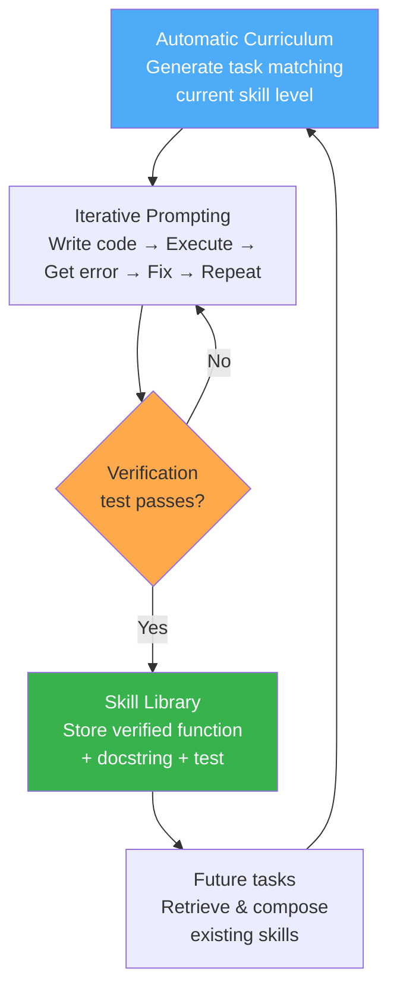
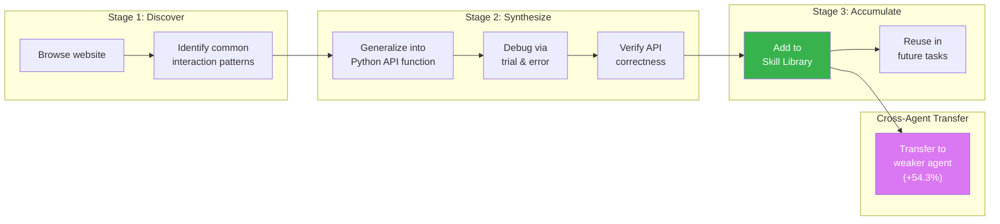
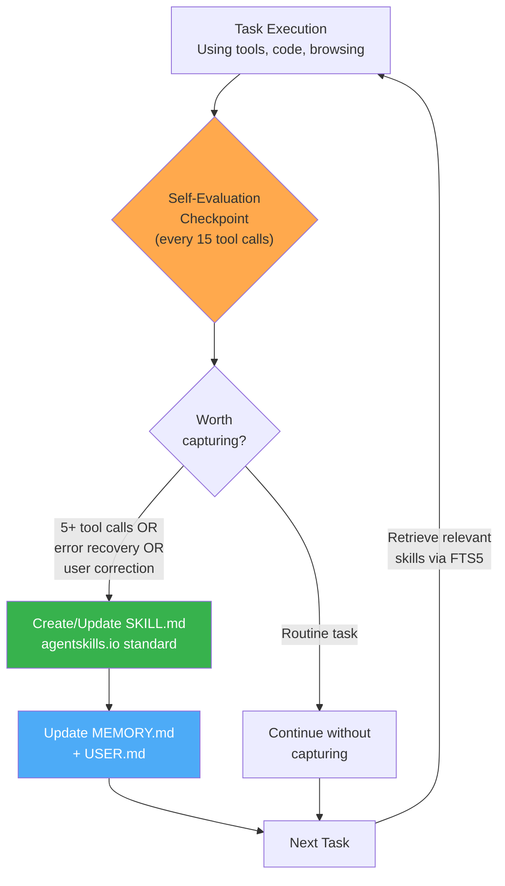
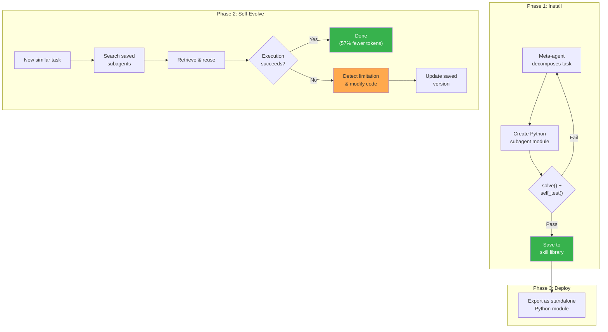
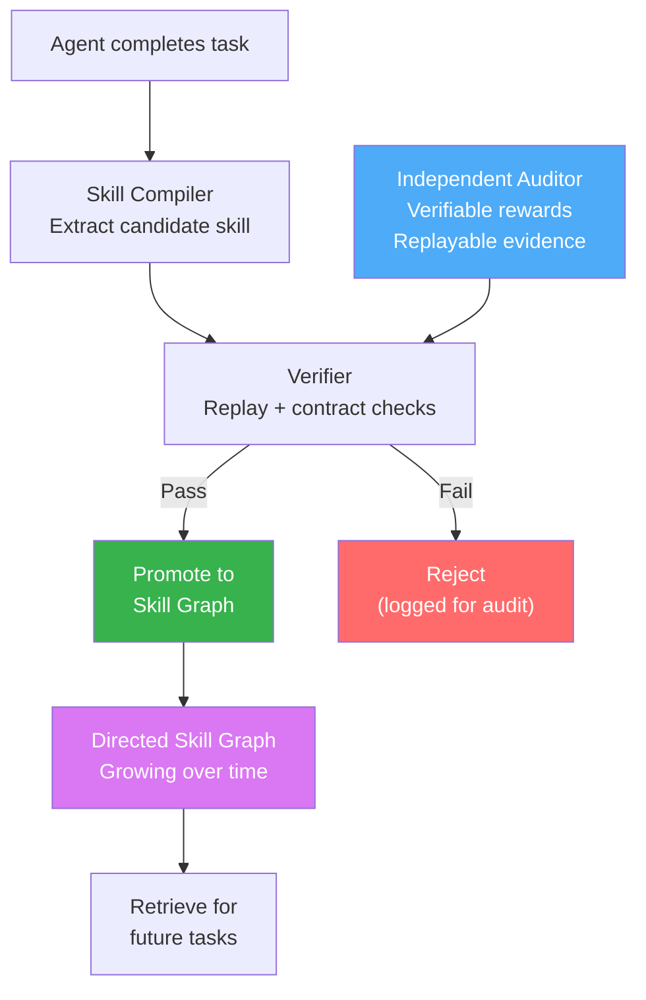

# Part III: Skill-Based Self-Evolution

The most important capability an agent can develop is the ability to improve itself. Parts I and II covered the static architecture of agents — how they loop, how they use tools, how they coordinate. This part covers the dynamic architecture: how agents accumulate reusable skills at runtime, transfer those skills across tasks and even across agents, and govern the self-improvement process so it remains auditable and safe.

The progression across these five chapters traces an arc from the foundational insight (skills as code, not weights) through increasingly sophisticated systems for skill creation, transfer, and governance:

| Chapter | System | Core Contribution | Skill Representation |
|---------|--------|-------------------|---------------------|
| 7 | Voyager | Lifelong learning via code skill accumulation | JavaScript functions + vector DB |
| 8 | SkillWeaver | Web agent self-improvement through API synthesis | Python async functions (Playwright) |
| 9 | Hermes Agent | Autonomous skill document creation during use | Markdown SKILL.md files + YAML metadata |
| 10 | AgentFactory | Executable subagent accumulation and reuse | Python modules with standardized docs |
| 11 | ASG-SI | Audited skill graphs with verifiable rewards | Directed graph nodes with contracts |

The unifying thesis: **an agent that writes and accumulates executable code is doing something fundamentally different from an agent that accumulates text reflections.** Code can be tested, composed, transferred, and audited. Text cannot — at least not with the same rigor. Every system in this part exploits that insight, and the differences between them reveal which design choices matter for different deployment contexts.

This is not merely an engineering preference. It is a claim about the fundamental unit of agent improvement. When an agent improves by updating weights (fine-tuning), the improvement is entangled in billions of parameters and cannot be inspected, transferred, or reverted at the level of individual capabilities. When an agent improves by writing code, each improvement is an identifiable, testable, transferable artifact. The rest of this part explores what follows from taking that claim seriously.

---

# Chapter 7: Code Skill Accumulation — Voyager

**Paper:** Guanzhi Wang, Yuqi Xie, Yunfan Jiang, Ajay Mandlekar, Chaowei Xiao, Yuke Zhu, Linxi "Jim" Fan, and Anima Anandkumar. "Voyager: An Open-Ended Embodied Agent with Large Language Models." *Transactions on Machine Learning Research (TMLR)*, March 2024. Originally arXiv:2305.16291, May 2023.

**Affiliations:** NVIDIA, Caltech, UT Austin, Stanford, ASU.

**Repository:** `MineDojo/Voyager`, 7K+ GitHub stars.

Voyager is the foundational work in LLM-powered skill accumulation. It introduced the idea that an LLM agent can continuously explore an open-ended environment, write executable code to solve tasks, store successful code as reusable skills, and retrieve those skills to solve increasingly complex problems — all without any parameter fine-tuning. The environment is Minecraft, but the architecture generalizes.

---

## 7.1 Architecture

Voyager consists of three tightly integrated components that form a closed loop:

```
┌─────────────────────────────────────────────────────────────────────┐
│                        VOYAGER ARCHITECTURE                         │
│                                                                     │
│  ┌──────────────────┐                                               │
│  │ Automatic        │  proposes task                                │
│  │ Curriculum       │──────────────────┐                            │
│  │                  │                  │                            │
│  │ • Current state  │                  ▼                            │
│  │ • Exploration    │  ┌──────────────────────────┐                 │
│  │   progress       │  │ Iterative Prompting      │                 │
│  │ • Skill history  │  │ Mechanism                │                 │
│  └──────────────────┘  │                          │                 │
│           ▲            │ 1. Retrieve similar      │                 │
│           │            │    skills from library    │                 │
│    task   │            │ 2. Generate JS code      │                 │
│  success/ │            │ 3. Execute in Minecraft  │                 │
│  failure  │            │ 4. Get env feedback      │                 │
│           │            │ 5. Self-verify           │                 │
│           │            │ 6. If fail → refine      │                 │
│           │            │ 7. If pass → commit      │                 │
│           │            └───────────┬──────────────┘                 │
│           │                        │                                │
│           │              verified skill                             │
│           │                        │                                │
│           │                        ▼                                │
│           │            ┌──────────────────────────┐                 │
│           │            │ Skill Library            │                 │
│           └────────────│                          │                 │
│                        │ • JS functions + docs    │                 │
│                        │ • Embedding-indexed      │                 │
│                        │ • Compositional          │                 │
│                        └──────────────────────────┘                 │
└─────────────────────────────────────────────────────────────────────┘
```

The following diagram summarizes the Voyager loop — how the curriculum, prompting mechanism, verification, and skill library interact in a continuous cycle:



The key design decision: **code as the action space.** Rather than having the LLM emit low-level motor commands (move forward, turn left, click), Voyager has GPT-4 write JavaScript functions that call the Mineflayer bot API. This choice has three consequences:

1. **Temporal abstraction.** A single skill function can encode a multi-step behavior (mine logs → craft planks → craft sticks → craft pickaxe) as a single callable unit.
2. **Composability.** Higher-level skills call lower-level skills. `craftDiamondPickaxe()` calls `craftSticks()`, which calls `mineOakLog()`.
3. **Interpretability.** Every skill is readable JavaScript. A human can inspect exactly what the agent learned.

### 7.1.1 The Interaction Protocol

Voyager interacts with GPT-4 via **blackbox API queries** — no fine-tuning, no gradient access, no weight modifications. The entire learning process happens through prompt engineering and in-context learning. Each iteration:

1. The automatic curriculum proposes a task (e.g., "Mine 3 iron ore").
2. The iterative prompting mechanism retrieves relevant skills, constructs a prompt with the current game state, and asks GPT-4 to write a JavaScript function.
3. The function is executed in Minecraft via Mineflayer.
4. If execution errors occur, the error message is fed back to GPT-4 for code refinement.
5. If the code runs without errors, a self-verification module asks GPT-4 whether the task was actually completed.
6. If verification passes, the skill is committed to the skill library. If not, GPT-4 receives the critique and tries again.

The maximum number of refinement iterations per task is configurable (default: 4 for code generation, 4 for self-verification). If the task is not solved within these iterations, the curriculum marks it as failed and proposes a different task — often an easier prerequisite.

---

## 7.2 Skill Library Design

The skill library is the heart of Voyager. It is what transforms an agent that solves individual tasks into an agent that accumulates capability over time.

### 7.2.1 Skill Representation

Each skill is a JavaScript `async` function that takes a single argument — the Mineflayer `bot` object. Skills are self-contained: they include all logic needed to accomplish a specific task. Here is a representative example of a Voyager skill:

```javascript
async function mineFiveIronOres(bot) {
  // Check for required tool
  const pickaxe = bot.inventory.items().find(
    item => item.name === "stone_pickaxe" || item.name === "iron_pickaxe"
  );
  if (!pickaxe) {
    bot.chat("I need a stone pickaxe or better to mine iron ore.");
    return;
  }

  // Equip the pickaxe
  await bot.equip(pickaxe, "hand");

  // Find and mine iron ore
  await mineBlock(bot, "iron_ore", 5);
  bot.chat("Successfully mined 5 iron ores.");
}
```

Key conventions enforced by the prompt template:

- **Single argument:** Functions take only `bot` as input. No other parameters.
- **Reuse helper functions:** Skills must call existing utility functions (`mineBlock`, `craftItem`, `smeltItem`, `placeItem`, `killMob`) rather than using low-level bot APIs directly.
- **Inventory checks:** Skills must check whether prerequisite items exist before attempting to use them.
- **Progress reporting:** Skills call `bot.chat()` to report progress, which provides execution feedback.
- **No infinite loops:** Functions must terminate. No `while(true)` patterns, no recursive calls, no event listeners.

### 7.2.2 The Helper Function Library

Voyager provides a set of pre-built utility functions that abstract common Minecraft operations:

| Function | Purpose | Replaces |
|----------|---------|----------|
| `mineBlock(bot, name, count)` | Find and mine blocks | Direct `bot.dig` calls |
| `craftItem(bot, name, count)` | Craft items at crafting table | `bot.craft` / `bot.recipesFor` |
| `smeltItem(bot, name, count)` | Smelt items in furnace | `bot.openFurnace` |
| `placeItem(bot, name, position)` | Place blocks in world | `bot.placeBlock` |
| `killMob(bot, name, timeout)` | Find and kill mobs | `bot.attack` |
| `exploreUntil(bot, direction, maxTime, callback)` | Explore until condition met | Manual navigation |

These helpers handle error cases, retries, and edge conditions that would otherwise clutter every skill function. They are the "standard library" of the skill ecosystem.

### 7.2.3 Vector Database Indexing

Skills are indexed by the embedding of their natural-language description, not by their code. The indexing pipeline:

1. When a skill is committed, GPT-4 generates a one-line description (e.g., "Mine 5 iron ores using a stone pickaxe").
2. The description is embedded using a text embedding model (OpenAI `text-embedding-ada-002` in the original implementation).
3. The embedding is stored in a vector database alongside the skill code and metadata.

**Retrieval at task time:**

1. The new task description (from the curriculum) is embedded.
2. Cosine similarity search retrieves the **top-5** most relevant skills.
3. Retrieved skill code is injected into the code generation prompt as examples.

This retrieval mechanism is what enables **compositional learning**: when the agent faces a complex task, it retrieves skills for the constituent sub-tasks and the code generator can call them as subroutines.

### 7.2.4 Metadata and Deduplication

Each skill entry in the library contains:

```
{
  "name": "mineFiveIronOres",
  "description": "Mine 5 iron ores using a stone pickaxe or better",
  "code": "async function mineFiveIronOres(bot) { ... }",
  "embedding": [0.023, -0.041, ...],    // 1536-dimensional
  "created_at": "2024-01-15T10:32:00Z",
  "usage_count": 7,
  "last_used": "2024-01-16T14:21:00Z",
  "dependencies": ["mineBlock"],
  "verified": true
}
```

Deduplication is implicit: if a new skill's description embedding is very close (cosine similarity > 0.95) to an existing skill, the new version replaces the old one only if it is strictly better (passes verification on more test cases). This prevents the library from accumulating near-duplicate skills.

### 7.2.5 Compositional Skill Construction

The most powerful property of the skill library is compositionality. Higher-level skills call lower-level ones:

```javascript
// Level 0: Primitive helper
async function mineOakLog(bot) {
  await mineBlock(bot, "oak_log", 1);
  bot.chat("Mined 1 oak log.");
}

// Level 1: Composed from level 0
async function craftOakPlanks(bot) {
  const log = bot.inventory.items().find(i => i.name === "oak_log");
  if (!log) {
    await mineOakLog(bot);
  }
  await craftItem(bot, "oak_planks", 4);
  bot.chat("Crafted 4 oak planks.");
}

// Level 2: Composed from level 1
async function craftCraftingTable(bot) {
  const planks = bot.inventory.items().filter(i => i.name === "oak_planks");
  if (planks.length < 4) {
    await craftOakPlanks(bot);
  }
  await craftItem(bot, "crafting_table", 1);
  bot.chat("Crafted a crafting table.");
}

// Level 3: Composed from multiple levels
async function craftWoodenPickaxe(bot) {
  await craftCraftingTable(bot);
  await craftItem(bot, "stick", 2);
  await craftItem(bot, "wooden_pickaxe", 1);
  bot.chat("Crafted a wooden pickaxe.");
}
```

This compositional structure is what allows Voyager to solve tasks that require dozens of sequential operations. Without it, GPT-4 would need to generate all the logic from scratch every time, which is both token-expensive and error-prone.

---

## 7.3 Iterative Prompting for Skill Refinement

### 7.3.1 The Code Generation Prompt

The code generation prompt is the most carefully engineered component of Voyager. It consists of several sections assembled dynamically for each task:

**Section 1: Role and constraints.**

```
You are a helpful assistant that writes Mineflayer JavaScript code to
complete any Minecraft task specified by me.

Here are some useful programs written with Mineflayer APIs:
[Retrieved skill code from the top-5 similar skills]

At each round of conversation, I will give you:
Code from the last round: ...
Execution error: ...
Chat log: ...
Biome: ...
Time: ...
Nearby blocks: ...
Nearby entities: ...
Health: ... / 20
Hunger: ... / 20
Position: x: ..., y: ..., z: ...
Equipment: [Helmet: None, Chestplate: None, ...]
Inventory (xx/36): [...]
Chests: ...
Task: ...
Context: ...
Critique: ...
```

**Section 2: Code generation rules.**

```
1) Write an async function that takes the bot as the only argument.
2) Reuse the above useful programs as much as possible.
   - Use mineBlock(bot, name, count) to collect blocks. Do not use
     bot.dig directly.
   - Use craftItem(bot, name, count) to craft items. Do not use
     bot.craft or bot.recipesFor directly.
   - Use smeltItem(bot, name, count) to smelt items. Do not use
     bot.openFurnace directly.
   - Use placeItem(bot, name, position) to place blocks. Do not use
     bot.placeBlock directly.
   - Use killMob(bot, name, timeout) to kill mobs. Do not use
     bot.attack directly.
3) Your function will be reused for building more complex functions.
   Therefore, you should make the function generic and reusable.
   You should not make it specific to the task.
4) Functions should check the inventory for required items before
   attempting to use them.
5) Do not write infinite loops or recursive functions.
6) Do not use setTimeout or setInterval.
7) Do not use event listeners or callbacks.
8) Name your function in a meaningful way (e.g., craftIronSword,
   mineDiamondOre).
9) Use exploreUntil(bot, direction, maxTime, callback) when you
   cannot find a block or entity. You should frequently call this
   before mining to make sure the needed block is nearby.
10) Use bot.chat to show progress.
```

### 7.3.2 The Refinement Loop

When code execution fails, the error message is appended to the prompt for the next iteration:

```
Round 1:
  Code: async function craftStonePickaxe(bot) { ... }
  Execution error: "Error: bot.recipesFor is not a function"
  → GPT-4 realizes it should use craftItem() instead

Round 2:
  Code: async function craftStonePickaxe(bot) { ... } [fixed]
  Execution error: None
  Chat log: "I need cobblestone to craft a stone pickaxe"
  → Code ran but the task is not complete (missing materials)

Round 3:
  Code: async function craftStonePickaxe(bot) { ... } [with mining]
  Execution error: None
  Chat log: "Crafted a stone pickaxe."
  → Self-verification: PASS
```

The refinement loop provides **three types of feedback**:

1. **Execution errors.** JavaScript runtime errors (TypeError, ReferenceError, etc.) with stack traces. These are the most informative signal.
2. **Environment feedback.** The bot's chat log contains messages from helper functions reporting what happened (e.g., "I need 2 more planks before crafting sticks").
3. **Game state delta.** The difference in inventory, position, health, etc. between before and after execution.

### 7.3.3 Self-Verification

After code executes without errors, a separate GPT-4 call acts as a **critic**:

```
You are an assistant that assesses whether a task has been completed
in Minecraft.

I will give you the following information:
Task: ...
Inventory before task: ...
Inventory after task: ...
Chat log during task: ...

You should only respond with one of the following:
- "Success" if the task has been completed.
- "Failed: [reason]" if the task has not been completed, with a
  brief explanation of what went wrong and how to fix it.
```

If the critic says "Failed," the failure reason becomes the `Critique` field in the next code generation prompt, providing targeted guidance for the fix.

### 7.3.4 Curriculum Question-Answering

Before proposing a new task, the curriculum module performs a **two-step QA process** against the Minecraft Wiki:

**Step 1:** GPT-4 generates 5–10 questions about Minecraft concepts relevant to the current state:

```
You are a curious Minecraft player who wants to learn.

Given your current state:
Biome: desert
Inventory: [sand x12, cactus x4, wooden_pickaxe x1]
Completed tasks: [mine sand, mine cactus, craft wooden pickaxe]

Ask 5-10 questions that would help you decide what to explore next.
Each question should:
- Be about a specific Minecraft concept (e.g., "wooden pickaxe" not "tool")
- Be self-contained (answerable without knowing your current state)
- Not involve building or placing blocks
```

**Step 2:** The questions are answered by retrieval from the Minecraft Wiki, and the answers are fed back into the curriculum proposer to inform the next task selection.

This QA step ensures the curriculum benefits from domain knowledge beyond what GPT-4 has memorized, reducing hallucination about game mechanics.

### 7.3.5 Prompt Engineering Lessons

Several non-obvious prompt engineering decisions make Voyager's iterative prompting work:

1. **Negative examples are critical.** The code generation prompt explicitly lists what NOT to do (no infinite loops, no event listeners, no setTimeout). Without these negative constraints, GPT-4 generates code patterns that are valid JavaScript but dysfunctional in the Minecraft execution context.

2. **The bot.chat() convention creates a feedback channel.** By requiring skills to report progress via `bot.chat()`, the prompt creates a structured communication channel between the executing skill and the self-verification critic. The chat log becomes a human-readable trace of execution that the critic can evaluate without needing to understand the code.

3. **Helper function abstraction reduces errors.** By providing high-level helpers (`mineBlock`, `craftItem`) and prohibiting low-level API usage, the prompt constrains the space of possible code to patterns that are more likely to be correct. This is a form of **prompt-induced type safety** — the LLM cannot generate incorrect Mineflayer API calls because it is instructed to use the safe wrappers.

4. **Function naming convention enables retrieval.** The instruction to name functions meaningfully (e.g., `craftIronSword`, `mineDiamondOre`) ensures that function names serve as natural-language descriptions. This improves embedding-based retrieval because the function name itself is a compact description of the skill's purpose.

---

## 7.4 Results

### 7.4.1 Exploration Performance

Voyager was evaluated against three baselines: **ReAct** (Yao et al., 2023), **Reflexion** (Shinn et al., 2023), and **AutoGPT** (Significant Gravitas, 2023). All agents used GPT-4 and were given 160 prompting iterations.

| Metric | Voyager | AutoGPT | ReAct | Reflexion |
|--------|---------|---------|-------|-----------|
| Unique items discovered | **63** | 19 | 18 | 17 |
| Distance traveled (blocks) | **2,252** | 980 | 890 | 860 |

Voyager discovered **3.3× more unique items** and traveled **2.3× longer distances** than the best baseline.

### 7.4.2 Tech Tree Mastery

The Minecraft tech tree (wood → stone → iron → diamond) tests compositional skill acquisition. Results averaged over 3 trials (fractions = successful trials / 3):

| Level | Voyager | AutoGPT | ReAct | Reflexion |
|-------|---------|---------|-------|-----------|
| Wooden tools | **3/3 (6.0 iters)** | 3/3 (92.0) | 1/3 (83.0) | 2/3 (89.0) |
| Stone tools | **3/3 (17.0 iters)** | 0/3 (—) | 0/3 (—) | 0/3 (—) |
| Iron tools | **3/3 (51.7 iters)** | 0/3 (—) | 0/3 (—) | 0/3 (—) |
| Diamond tools | **2/3 (118.0 iters)** | 0/3 (—) | 0/3 (—) | 0/3 (—) |

Voyager unlocked wooden tools **15.3× faster** than baselines. It was the **only agent** to reach diamond-level tools.

### 7.4.3 Zero-Shot Generalization

After training in one Minecraft world, Voyager's skill library was transferred to a brand-new world with cleared inventory. The agent was tested on unseen tasks:

| Task | Voyager | Voyager (no library) | AutoGPT | AutoGPT + Voyager Library |
|------|---------|---------------------|---------|--------------------------|
| Obtain diamond | 3/3 | 0/3 | 0/3 | 2/3 |
| Obtain enchanting table | 2/3 | 0/3 | 0/3 | 1/3 |
| Obtain golden apple | 3/3 | 0/3 | 0/3 | 1/3 |

Two critical findings:
1. The skill library is what enables zero-shot transfer — without it, even Voyager fails.
2. The skill library is **agent-agnostic**: plugging Voyager's skills into AutoGPT also improves AutoGPT's performance. Skills are portable.

### 7.4.4 Ablation Studies

Each component contributes meaningfully:

| Variant | Unique Items (160 iters) |
|---------|------------------------|
| **Full Voyager** | **63** |
| Without automatic curriculum | 42 |
| Without skill library | 33 |
| Without self-verification | 46 |
| GPT-3.5 instead of GPT-4 | 28 |

The skill library ablation is the most damaging, confirming that **skill accumulation is the primary driver** of Voyager's performance advantage.

### 7.4.5 Why GPT-4 Matters

The GPT-3.5 vs. GPT-4 comparison (28 vs. 63 unique items) reveals something important about the requirements for skill-based self-evolution. GPT-3.5 fails not because it cannot generate JavaScript — it generates syntactically correct code most of the time. It fails because:

1. **Weaker self-verification.** GPT-3.5's critic is less reliable at determining whether a task was truly completed. It sometimes approves incomplete solutions, polluting the skill library with broken skills.
2. **Weaker compositional reasoning.** GPT-3.5 is less effective at composing existing skills into new higher-level skills. It tends to rewrite logic rather than call existing functions.
3. **Less robust error recovery.** When execution fails, GPT-3.5's refinement attempts are less targeted. It often makes unrelated changes rather than fixing the specific error.

This has implications for all skill-based self-evolution systems: **the quality of the base model determines the ceiling of what self-evolution can achieve.** A skill library built by a weak model accumulates weak skills. A skill library built by a strong model accumulates strong skills. The model is the compiler, and the compiler's quality determines the quality of the compiled artifacts.

### 7.4.6 Catastrophic Forgetting Prevention

A subtle but important result: Voyager does not suffer from catastrophic forgetting. After 160 iterations, all previously acquired skills remain functional. This is because skills are stored as **immutable code**, not as model weights. The skill library is append-only (with occasional replacement of inferior versions). Adding a new skill cannot degrade an existing skill because there are no shared parameters to interfere.

This is a fundamental architectural advantage over fine-tuning-based approaches. An agent that stores improvements in its weights faces the standard continual learning problem: new training can overwrite previously learned capabilities. An agent that stores improvements in code faces no such problem — the code persists independently of the model's state.

---

# Chapter 8: SkillWeaver — Web Agent Self-Improvement Through API Synthesis

**Paper:** Boyuan Zheng, Michael Y. Fatemi, Xiaolong Jin, Zora Zhiruo Wang, Apurva Gandhi, Yueqi Song, Yu Gu, Jayanth Srinivasa, Gaowen Liu, Graham Neubig, and Yu Su. "SkillWeaver: Web Agents can Self-Improve by Discovering and Honing Skills." arXiv:2504.07079, April 2025. Under review at Conference on Language Modeling.

**Affiliations:** Ohio State University, University of Virginia, Purdue University, Carnegie Mellon University, Cisco Research.

**Repository:** `OSU-NLP-Group/SkillWeaver`.

SkillWeaver takes the Voyager insight — skills as executable code — and applies it to web agents navigating real websites. The key innovation: instead of generating text-based instructions or reflexive summaries, SkillWeaver synthesizes **Python async functions wrapping Playwright automation** that the agent can call as APIs. These APIs are debugged iteratively, verified by execution, and transferable between agents.

---

## 8.1 The Insight: Skills as Executable APIs

Prior work on web agent skill accumulation stored skills as natural-language instructions or demonstrations. These approaches have fundamental limitations:

| Approach | Problem |
|----------|---------|
| Text instructions | Ambiguous; LLM must re-interpret each time |
| Demonstration traces | Brittle to DOM changes; long context cost |
| Reflexive summaries | No executability; cannot be composed |

SkillWeaver's approach: **each skill is a Python `async` function** with:

- A function signature with typed parameters
- A comprehensive docstring including usage history and execution notes
- An implementation using Playwright's async API (`page.click()`, `page.fill()`, `page.goto()`)
- A verification test that confirms the function works

Here is a concrete example from the paper — an API for express checkout on a shopping website:

```python
async def express_checkout(page):
    """
    Perform an express checkout for items currently in the cart.

    Args:
        page: The Playwright page object to perform actions on.

    Usage Log:
    - Successfully completed express checkout, resulting in an order
      confirmation page with order number 000000191.
    - Initial attempts failed due to a timeout error when clicking
      'Proceed to Checkout'. Resolved by ensuring items were in cart.

    Note:
    - Ensure the cart is pre-filled with desired items before calling.
    - Function assumes 'Proceed to Checkout' button is visible and
      clickable from the cart page.
    - Navigates through checkout: Shipping → Review & Payments → Place Order.
    - Includes delays for dynamic element loading.
    """
    import asyncio

    await page.goto("/")
    await page.get_by_role("link", name="My Cart").click()
    await asyncio.sleep(5)
    await page.get_by_role("button", name="Proceed to Checkout").click()
    await asyncio.sleep(5)
    await page.get_by_role("button", name="Next").click()
    await asyncio.sleep(5)
    await page.get_by_role("button", name="Place Order").click()
    await asyncio.sleep(5)
```

The critical property: this function **actually works**. It was generated, debugged, and verified against a live website. It is not a suggestion or a plan — it is executable code that performs a specific website operation.

---

## 8.2 Skill Discovery and Synthesis Pipeline

SkillWeaver operates in two stages, forming a self-driven curriculum loop:

### 8.2.1 Stage I: Skill Proposal

The agent explores a new website and identifies potential skills through task attempts:

```
┌──────────────────────────────────────────────────────────────────┐
│                    SKILLWEAVER PIPELINE                           │
│                                                                  │
│  Website    ┌──────────────┐    ┌──────────────┐                │
│  ──────────►│ Agent        │───►│ Successful   │                │
│             │ Exploration  │    │ Task Traces  │                │
│             └──────────────┘    └──────┬───────┘                │
│                                        │                        │
│                    STAGE I: SKILL PROPOSAL                       │
│                                        ▼                        │
│             ┌──────────────────────────────────┐                │
│             │ Identify Reusable Patterns       │                │
│             │ • Repeated action sequences      │                │
│             │ • Common sub-workflows           │                │
│             │ • Generalizable operations        │                │
│             └──────────────┬───────────────────┘                │
│                            │                                    │
│                    STAGE II: SKILL SYNTHESIS                     │
│                            ▼                                    │
│             ┌──────────────────────────────────┐                │
│             │ Generate Python Async Function    │                │
│             │ • Function signature + docstring  │                │
│             │ • Playwright implementation       │                │
│             └──────────────┬───────────────────┘                │
│                            │                                    │
│                            ▼                                    │
│             ┌──────────────────────────────────┐                │
│             │ Iterative Debugging               │                │
│             │ • Execute against live website    │                │
│             │ • Capture runtime errors          │                │
│             │ • Fix DOM selectors, timing       │                │
│             │ • Re-execute until passing        │                │
│             └──────────────┬───────────────────┘                │
│                            │                                    │
│                            ▼                                    │
│             ┌──────────────────────────────────┐                │
│             │ Verified API → Skill Library      │                │
│             └──────────────────────────────────┘                │
└──────────────────────────────────────────────────────────────────┘
```

The agent performs tasks on a website (e.g., WebArena's GitLab, shopping, CMS, Reddit, and map instances). Successful task completions are analyzed to identify action sequences that could be generalized into reusable functions.

### 8.2.2 Stage II: Skill Synthesis

Identified patterns are compiled into Python async functions:

1. **Generalization.** A specific action trace ("clicked checkout button at CSS selector `#btn-checkout-47`") is generalized into a function that works across different cart states.
2. **Playwright wrapping.** DOM interactions are expressed using Playwright's role-based and text-based selectors rather than fragile CSS selectors:
   ```python
   # Fragile (CSS):
   await page.click("#BVID158")

   # Robust (role-based):
   await page.get_by_role("dialog", name="Delete all merged branches?") \
              .get_by_role("textbox").fill("delete")
   ```
3. **Iterative debugging.** The function is executed against the live website. Runtime errors (timeouts, strict mode violations, missing elements) are captured and used to refine the implementation.

### 8.2.3 Skill Honing Through Error Recovery

A distinctive feature of SkillWeaver is **skill honing** — the ability to fix skills when they break. The paper provides a detailed example:

**Original skill** for deleting merged branches in GitLab:

```python
async def delete_merged_branches(page, project_path):
    await page.goto(f"/{project_path}/-/branches")
    await page.get_by_role("button", name="Delete merged branches").click()
    await page.get_by_role("textbox").fill("delete")  # Bug: ambiguous selector
    ...
```

**Runtime error:**
```
Error: strict mode violation: get_by_role("textbox") resolved to 2 elements:
1) <input placeholder="Search GitLab" ...>
2) <input data-qa-selector="delete merged branches input" ...>
```

**Agent-generated fix:**
```python
async def delete_merged_branches(page, project_path):
    await page.goto(f"/{project_path}/-/branches")
    await page.get_by_role("button", name="Delete merged branches").click()
    # Fixed: scope selector to confirmation dialog
    await page.get_by_role("dialog", name="Delete all merged branches?") \
              .get_by_role("textbox").fill("delete")
    await page.get_by_role("dialog", name="Delete all merged branches?") \
              .get_by_role("button", name="Delete merged branches").click()
    await asyncio.sleep(2)
```

The fix scopes the ambiguous `get_by_role("textbox")` to the specific dialog context. This refinement is persisted back to the skill library, improving the API for all future invocations.

The following diagram visualizes the full SkillWeaver pipeline — from browsing a website to accumulating reusable APIs and transferring them across agents:



---

## 8.3 Cross-Agent Skill Transfer

The most striking result in SkillWeaver is **cross-agent skill transfer**: APIs synthesized by a strong agent (GPT-4o) substantially improve the performance of weaker agents (GPT-4o-mini).

### 8.3.1 Why Transfer Works

Skills are pure Python functions. They do not depend on:
- The generating agent's model weights
- The generating agent's prompt template
- The generating agent's reasoning strategy
- Any internal state of the generating agent

A weaker agent that cannot navigate a complex checkout flow from scratch can call `express_checkout(page)` and get the same result as the stronger agent. The skill encapsulates the capability in code, not in model parameters.

### 8.3.2 Transfer Results

| Receiving Agent | Baseline (no skills) | + Transferred Skills | Improvement |
|----------------|---------------------|---------------------|-------------|
| GPT-4o-mini on WebArena | 9.2% | 14.1% | **+53.3%** |
| GPT-4o-mini on Gitlab | 6.1% | 8.9% | +46% |
| GPT-4o-mini on CMS | 3.3% | 7.7% | **+133%** |
| GPT-4o-mini on Reddit | 18.9% | 26.4% | +40% |
| GPT-4o on WebArena (overall) | — | — | **up to 54.3%** |

The CMS result is remarkable: a **133% improvement** from skill transfer alone. This suggests that the CMS tasks involve repetitive workflows that are particularly well-suited to API encapsulation.

### 8.3.3 Anatomy of a Transferred Skill

To understand why transfer works so well, consider what happens when GPT-4o-mini (the weaker agent) encounters a CMS task like "Change the page title of the About page to 'Company History'":

**Without skills:** GPT-4o-mini must:
1. Navigate to the CMS admin panel (requires knowing the URL structure)
2. Find the page list (requires knowing the CMS layout)
3. Select the correct page (requires parsing a potentially complex page list)
4. Locate the title field (requires understanding the edit form)
5. Change the title (requires correct field identification)
6. Save the changes (requires finding and clicking the save button)

Each step is a separate action where the weaker model can fail. The probability of completing all 6 steps correctly is the product of individual step probabilities — even with 90% per-step accuracy, the end-to-end success rate is only 53%.

**With transferred skills:** GPT-4o-mini calls:
```python
await update_page_title(page, page_name="About", new_title="Company History")
```

The entire 6-step workflow is encapsulated in a single API call. The weaker model only needs to correctly identify which API to call and what arguments to pass — a dramatically simpler task.

### 8.3.5 Implications for Agent Ecosystems

Cross-agent transfer means that skills can be treated as **shared infrastructure**. A deployment could maintain a central skill library populated by the strongest available agent, and all agents in the system — including cheaper, faster models used for routine tasks — benefit from the accumulated skills. This is analogous to how human organizations work: expert practitioners develop standard operating procedures that less experienced workers can follow.

---

## 8.4 Results

### 8.4.1 WebArena Performance

Full results across all WebArena domains:

| Domain | GPT-4o Baseline | GPT-4o + Skills | Relative Δ |
|--------|----------------|-----------------|------------|
| Gitlab | 17.8% | 22.2% | +25% |
| Map | 27.5% | 33.9% | +23% |
| Shopping | 19.8% | 27.2% | +38% |
| CMS | 18.7% | 25.8% | +38% |
| Reddit | 37.7% | 50.0% | +33% |
| **Average** | **22.6%** | **29.8%** | **+31.8%** |

### 8.4.2 Real-World Website Performance

On live websites (not sandboxed benchmarks), SkillWeaver shows even stronger improvements:

| Domain | Baseline | + Skills | Relative Δ |
|--------|----------|----------|------------|
| Drug information | 65.0% | 87.0% | +34% |
| Flight booking | 11.7% | 29.4% | +151% |
| Cooking recipes | 62.5% | 75.0% | +20% |
| Car information | 11.1% | 11.1% | +0% |
| **Average** | **40.2%** | **56.2%** | **+39.8%** |

The flight booking domain shows a **151% improvement** — unsurprising given that flight booking involves highly structured, repetitive workflows ideal for API synthesis.

The car information domain shows 0% improvement, highlighting a limitation: when the website's DOM structure does not parse into a natural accessibility tree representation, synthesized APIs cannot reliably interact with it.

### 8.4.3 Per-Domain Analysis

The domain-level results reveal which types of websites benefit most from skill synthesis:

**High-benefit domains** (>30% improvement):
- Flight booking (+151%): Highly structured, multi-step forms with predictable layouts. Each flight search, filter, and booking follows the same workflow. A single well-written API handles most variations.
- Shopping (+38% on WebArena): E-commerce checkout flows are repetitive across different products. Cart management, checkout, and order confirmation all follow standard patterns.
- CMS (+38% on WebArena): Content management involves repeating the same operations (create, edit, delete, publish) across different content types. Each operation maps cleanly to a reusable API.

**Medium-benefit domains** (20-30% improvement):
- Gitlab (+25%): Repository management involves diverse operations (merge requests, issues, branches, CI/CD). Skills help with common workflows but the long tail of operations is harder to encapsulate.
- Map (+23%): Geospatial queries have some repetitive structure but the variety of possible queries limits the benefit of caching specific API patterns.

**Low-benefit domains** (<10% improvement):
- Car information (0%): Poor accessibility tree parsing means synthesized APIs cannot reliably interact with DOM elements. This is a fundamental limitation of the Playwright-based approach.

The pattern is clear: **the more structured and repetitive the website's workflows, the greater the benefit from skill synthesis.**

### 8.4.4 Limitations

SkillWeaver has three documented failure modes:

1. **Failure to invoke.** The agent sometimes fails to call an available API that would solve the task. This is a planning failure, not a skill failure.
2. **Incorrect invocation.** The agent calls the API with wrong parameters (e.g., `search_recipes_by_ingredients('chocolate chip, -nuts')` instead of `search_recipes_by_ingredients('chocolate chip without nuts')`). The `-` negation syntax is not used by the target website.
3. **Accessibility tree parsing.** Websites with non-standard DOM structures produce accessibility trees that Playwright cannot reliably interact with.

### 8.4.6 Comparison with Prior Web Agent Approaches

| Approach | Skill Format | Improvement Mechanism | Requires Training? | Transferable? |
|----------|-------------|----------------------|--------------------:|:-------------:|
| SteP | State-dependent prompts | Handcrafted prompts per domain | No | No (prompt-specific) |
| AutoEval | Evaluation-guided | Automatic evaluation criteria | No | Partially |
| AgentTrek | Instruction traces | Trajectory-based learning | Yes | No |
| **SkillWeaver** | **Python APIs** | **Self-driven API synthesis** | **No** | **Yes** |

SkillWeaver's advantage over trajectory-based approaches (like AgentTrek) is that APIs are **abstractions over trajectories**. A trajectory records one specific way to complete a task on one specific page state. An API generalizes over many possible page states. When the website's layout changes slightly, a trajectory breaks; an API with robust selectors (role-based, text-based) survives.

The advantage over prompt-based approaches (like SteP) is that APIs provide **deterministic execution**. A prompt suggests what the agent should do; the agent must still figure out how. An API does it directly, reducing the probability of error at each step.

---

# Chapter 9: Hermes Agent — Autonomous Skill Document Creation

**System:** Nous Research, Hermes Agent, February 2026. Repository: `NousResearch/hermes-agent`, 99K+ GitHub stars as of April 2026.

Hermes Agent takes a fundamentally different approach to skill representation than Voyager or SkillWeaver. Instead of executable code functions, Hermes skills are **markdown documents** — structured natural-language instructions that the agent loads on demand as procedural memory. The trade-off: less precise than executable code, but more flexible, more human-readable, and compatible with any agent that can read markdown.

---

## 9.1 The Closed-Loop Learning System

Hermes Agent's skill system is a closed loop between task execution, self-evaluation, skill creation, and skill retrieval:

```
┌─────────────────────────────────────────────────────────────────────┐
│                   HERMES AGENT SKILL LOOP                           │
│                                                                     │
│  User Task                                                          │
│      │                                                              │
│      ▼                                                              │
│  ┌──────────────┐   skill_list()   ┌─────────────────┐             │
│  │ Agent Loop   │◄────────────────│ Skill Library    │             │
│  │              │   (Level 0:     │ ~/.hermes/skills/│             │
│  │ Tool calls,  │    names only)  │                  │             │
│  │ reasoning,   │                 │ ┌──────────────┐ │             │
│  │ execution    │  skill_view()   │ │ axolotl/     │ │             │
│  │              │◄───────────────│ │ SKILL.md     │ │             │
│  │              │   (Level 1:     │ ├──────────────┤ │             │
│  │              │    full content) │ │ deploy-k8s/  │ │             │
│  │              │                 │ │ SKILL.md     │ │             │
│  └──────┬───────┘                 │ ├──────────────┤ │             │
│         │                         │ │ ...40+ more  │ │             │
│         │ Self-evaluation         │ └──────────────┘ │             │
│         │ checkpoint              └────────▲─────────┘             │
│         │ (every 15 tool calls)            │                       │
│         │                                  │                       │
│         ▼                                  │                       │
│  ┌──────────────┐    skill_manage()        │                       │
│  │ Should I     │─────────────────────────►│                       │
│  │ create/      │    create / patch /      │                       │
│  │ update a     │    edit / delete          │                       │
│  │ skill?       │                                                   │
│  └──────────────┘                                                   │
└─────────────────────────────────────────────────────────────────────┘
```

The following diagram distills the Hermes Agent closed-loop learning cycle — showing when skills are captured, how memory is updated, and how skills are retrieved for future tasks:



### 9.1.1 Progressive Disclosure: Token-Efficient Skill Loading

Hermes uses a three-level loading system that minimizes token consumption:

| Level | Tool Call | Returns | Typical Size |
|-------|-----------|---------|-------------|
| **Level 0** | `skills_list()` | `[{name, description, category}, ...]` | ~3K tokens |
| **Level 1** | `skill_view(name)` | Full SKILL.md content + metadata | Varies (1K–10K) |
| **Level 2** | `skill_view(name, path)` | Specific reference file | Varies |

The agent starts by loading the skill index (Level 0) into its context. When it recognizes that a task matches a skill description, it loads the full skill (Level 1). Only if the skill references supplementary documentation does it load Level 2.

This is architecturally important: a library of 200 skills costs ~3K tokens at Level 0, versus potentially 500K+ tokens if all skills were loaded into context simultaneously.

### 9.1.2 Skill Invocation via Slash Commands

Every installed skill is automatically available as a slash command in the Hermes CLI:

```bash
/axolotl help me fine-tune Llama 3 on my dataset
/github-pr-workflow create a PR for the auth refactor
/deploy-k8s deploy the staging environment
/plan design a rollout for migrating our auth provider
```

The slash command syntax loads the skill into context and applies its instructions to the user's request. Skills can also be invoked through natural conversation — the agent matches task descriptions to skill metadata.

---

## 9.2 Trigger Conditions for Skill Creation

The `skill_manage` tool is invoked autonomously by the agent when any of the following conditions are met:

### 9.2.1 Complex Task Completion (5+ Tool Calls)

If the agent successfully completes a task that required 5 or more sequential tool calls, it evaluates whether the workflow was novel enough to save. The threshold is deliberately low — better to over-create and prune than to miss a valuable pattern.

### 9.2.2 Error Recovery

When the agent encounters errors during execution and successfully recovers — finding the correct approach after dead ends — the recovery path is particularly valuable as a skill. Future agents (or the same agent in a new session) should not repeat the same mistakes.

**Example:** Agent tries to deploy with `kubectl apply -f deployment.yaml`, gets a namespace error, discovers the namespace needs to be created first, creates it, retries, and succeeds. The resulting skill captures the correct order of operations including the namespace prerequisite.

### 9.2.3 User Corrections

When a user corrects the agent's approach ("No, do it this way instead"), the corrected workflow is a strong signal for skill creation. The user is providing expert knowledge that should be preserved.

### 9.2.4 Non-Obvious Workflow Discovery

When the agent discovers a workflow that involves surprising steps, unusual flag combinations, or non-obvious ordering constraints, it creates a skill to codify the discovery. This is the "I didn't expect that to be necessary" trigger.

### 9.2.5 Explicit User Request

Users can also explicitly request skill creation:

```
Save what we just did as a skill called "deploy-to-fly"
```

---

## 9.3 SKILL.md Format — agentskills.io Standard

Hermes skills follow the open standard from [agentskills.io](https://agentskills.io/specification). Each skill is a directory containing a `SKILL.md` file and optional supporting files.

### 9.3.1 Full SKILL.md Structure

```markdown
---
name: deploy-k8s
description: Deploy applications to Kubernetes clusters
version: 1.2.0
author: hermes-agent
platforms: [linux, macos]
metadata:
  hermes:
    tags: [devops, kubernetes, deployment]
    category: devops
    requires_toolsets: [terminal]
    config:
      - key: k8s.default_namespace
        description: "Default Kubernetes namespace for deployments"
        default: "default"
        prompt: "Default namespace"
      - key: k8s.context
        description: "kubectl context to use"
        default: ""
        prompt: "Kubernetes context (leave empty for current)"
required_environment_variables:
  - name: KUBECONFIG
    prompt: "Path to kubeconfig file"
    help: "Usually ~/.kube/config"
    required_for: "cluster authentication"
---

# Deploy to Kubernetes

Deploy containerized applications to Kubernetes clusters with proper
health checks, resource limits, and rollback capability.

## When to Use

- User asks to deploy an application to Kubernetes
- User mentions k8s, kubectl, pods, deployments, or services
- Task involves container orchestration or cluster management

## Quick Reference

| Operation | Command |
|-----------|---------|
| Deploy | `kubectl apply -f deployment.yaml` |
| Check status | `kubectl rollout status deployment/<name>` |
| Rollback | `kubectl rollout undo deployment/<name>` |
| Get pods | `kubectl get pods -n <namespace>` |
| View logs | `kubectl logs -f deployment/<name>` |

## Procedure

1. Verify cluster connectivity:
   ```bash
   kubectl cluster-info
   kubectl get nodes
   ```

2. Ensure namespace exists:
   ```bash
   kubectl get namespace $NAMESPACE || kubectl create namespace $NAMESPACE
   ```

3. Validate manifests before applying:
   ```bash
   kubectl apply --dry-run=client -f deployment.yaml
   ```

4. Apply the deployment:
   ```bash
   kubectl apply -f deployment.yaml -n $NAMESPACE
   ```

5. Wait for rollout to complete:
   ```bash
   kubectl rollout status deployment/$DEPLOYMENT_NAME -n $NAMESPACE --timeout=300s
   ```

6. Verify pods are running:
   ```bash
   kubectl get pods -n $NAMESPACE -l app=$APP_LABEL
   ```

## Pitfalls

- **ImagePullBackOff**: Check image name, tag, and registry credentials.
  Fix: `kubectl create secret docker-registry ...`
- **CrashLoopBackOff**: Application is crashing on startup. Check logs:
  `kubectl logs <pod-name> --previous`
- **Pending pods**: Usually insufficient resources. Check:
  `kubectl describe pod <pod-name>` for events.
- **Namespace not found**: Always create namespace before deploying.
  This is the most common first-time error.

## Verification

Confirm deployment succeeded:
```bash
# All pods should show Running status
kubectl get pods -n $NAMESPACE -l app=$APP_LABEL

# Deployment should show all replicas available
kubectl get deployment $DEPLOYMENT_NAME -n $NAMESPACE

# Service should be accessible (if exposed)
kubectl get svc -n $NAMESPACE
```
```

### 9.3.2 YAML Frontmatter Fields

| Field | Required | Purpose |
|-------|----------|---------|
| `name` | Yes | Unique identifier; used as slash command name |
| `description` | Yes | One-line description shown in skill search |
| `version` | Yes | SemVer; incremented on updates |
| `author` | No | Creator (agent or human name) |
| `platforms` | No | OS restrictions: `[macos]`, `[linux]`, `[windows]` |
| `metadata.hermes.tags` | No | Keywords for search and categorization |
| `metadata.hermes.category` | No | Directory category (devops, research, etc.) |
| `metadata.hermes.requires_toolsets` | No | Only show when listed toolsets are available |
| `metadata.hermes.fallback_for_toolsets` | No | Only show when listed toolsets are NOT available |
| `metadata.hermes.config` | No | Config settings stored in `config.yaml` |
| `required_environment_variables` | No | Env vars prompted on first load |

### 9.3.3 Conditional Activation

Skills can automatically show or hide based on available tools:

```yaml
metadata:
  hermes:
    fallback_for_toolsets: [web]      # Show ONLY when web is unavailable
    requires_toolsets: [terminal]      # Show ONLY when terminal is available
```

**Example:** The built-in `duckduckgo-search` skill has `fallback_for_toolsets: [web]`. When a Firecrawl API key is set, the web toolset is available and the DuckDuckGo fallback stays hidden. When the key is missing, the fallback skill appears automatically.

### 9.3.4 Skill Directory Structure

```
~/.hermes/skills/
├── mlops/
│   ├── axolotl/
│   │   ├── SKILL.md                # Main instructions (required)
│   │   ├── references/             # Additional documentation
│   │   ├── templates/              # Output format templates
│   │   ├── scripts/                # Helper scripts
│   │   └── assets/                 # Supplementary files
│   └── vllm/
│       └── SKILL.md
├── devops/
│   └── deploy-k8s/
│       ├── SKILL.md
│       └── references/
│           ├── resource-limits.md
│           └── health-checks.md
├── .hub/                           # Skills Hub state
│   ├── lock.json
│   ├── quarantine/
│   └── audit.log
└── .bundled_manifest               # Tracks bundled skill versions
```

---

## 9.4 Skill Self-Improvement During Use

### 9.4.1 The `skill_manage` Tool

The `skill_manage` tool gives the agent CRUD operations on its own skill library:

| Action | Use Case | Key Parameters |
|--------|----------|---------------|
| `create` | New skill from scratch | `name`, `content` (full SKILL.md), optional `category` |
| `patch` | Targeted fix (preferred) | `name`, `old_string`, `new_string` |
| `edit` | Major structural rewrite | `name`, `content` (full replacement) |
| `delete` | Remove obsolete skill | `name` |
| `write_file` | Add/update reference file | `name`, `file_path`, `file_content` |
| `remove_file` | Remove reference file | `name`, `file_path` |

**The `patch` action is preferred** over `edit` because it is more token-efficient — only the changed text appears in the tool call, rather than the entire SKILL.md content.

### 9.4.2 When Skills Self-Improve

The agent patches skills when:

1. **Better approach discovered.** The agent finds a faster or more reliable way to accomplish the skill's task.
2. **New pitfall encountered.** A failure mode not documented in the Pitfalls section is encountered and resolved.
3. **Prerequisites changed.** A tool version update changes the required steps.
4. **User provides correction.** The user says "Actually, you should always do X before Y."

### 9.4.3 Example: Skill Evolution Over Time

Consider how a Kubernetes deployment skill evolves through use:

**Version 1.0 (initial creation):**
- Basic `kubectl apply` workflow
- No error handling
- Assumes namespace exists

**Version 1.1 (after first failure):**
- Added namespace check before deployment
- Pitfall added: "Always create namespace first"

**Version 1.2 (after user correction):**
- Added `--dry-run=client` validation step
- User said: "Always validate manifests before applying"

**Version 1.3 (after discovering better approach):**
- Added rollout status wait with timeout
- Added pod verification step
- Procedure now includes rollback instructions

**Version 2.0 (major rewrite after production incident):**
- Added health check verification
- Added resource limit validation
- Added previous pod log inspection for CrashLoopBackOff
- Pitfalls section expanded with ImagePullBackOff and Pending pod diagnostics

Each version represents accumulated operational knowledge. The skill becomes a living document that captures the collective experience of every session where it was used.

### 9.4.4 Measured Efficiency Gains

The most concrete result from the Hermes Agent documentation:

> **25 tool calls → 8–10 after a month of regular use.**

This is measured for specific recurring workflows. As the skill library accumulates and refines over time, tasks that initially required extensive exploration and tool calls are reduced to loading a skill and executing its procedure. The efficiency gain comes from three sources:

1. **Eliminating exploration.** The agent no longer needs to discover the correct approach — it loads it from the skill.
2. **Eliminating error recovery.** Pitfalls documented in the skill prevent the agent from making mistakes that would require correction.
3. **Eliminating re-derivation.** Non-obvious command flags, configuration values, and ordering constraints are captured in the skill rather than re-derived from documentation each time.

---

## 9.5 FTS5 Search + LLM Summarization for Retrieval

### 9.5.1 Skill Discovery Pipeline

When the agent encounters a new task, it needs to determine which (if any) skills are relevant. The discovery pipeline:

1. **Level 0 scan.** The agent loads `skills_list()`, which returns all skill names, descriptions, and categories in ~3K tokens.
2. **LLM matching.** The agent's own reasoning determines which skills might be relevant based on the task description and skill metadata.
3. **Level 1 loading.** The agent calls `skill_view(name)` to load the full content of candidate skills.

For larger skill libraries, Hermes uses **SQLite FTS5 full-text search** to index skill content. This allows fast keyword-based retrieval without embedding models:

```sql
CREATE VIRTUAL TABLE skills_fts USING fts5(
  name, description, content, tags
);
```

When the skill library grows large enough that Level 0 scanning becomes token-expensive, FTS5 search narrows the candidates before LLM-based relevance ranking.

### 9.5.2 Skills Hub and Cross-Agent Sharing

Hermes integrates with multiple skill registries:

| Source | Type | Trust Level |
|--------|------|-------------|
| `official/` | Ships with Hermes repo | Builtin |
| `skills.sh` | Vercel's public directory | Community |
| `well-known:` endpoints | Website `/.well-known/skills/index.json` | Community |
| `github:` repos | Direct GitHub install | Community |
| `clawhub` | Third-party marketplace | Community |
| `lobehub` | LobeHub agent catalog | Community |

**Security scanning** is applied to all hub-installed skills, checking for data exfiltration, prompt injection, destructive commands, and supply-chain threats. Skills with `dangerous` verdicts are blocked even with `--force`.

The trust model:

```
builtin > official > trusted > community
```

Bundled skills (`builtin`) are always trusted. Official optional skills from the Hermes repo get builtin trust without third-party warnings. Trusted sources (e.g., `openai/skills`, `anthropics/skills`) get more permissive policy. Community skills require explicit `--force` to override non-dangerous warnings.

### 9.5.3 The Supply Chain Risk

The Skills Hub creates a supply chain: skills flow from community authors through registries to individual agents. This supply chain is vulnerable to the same classes of attacks as software package registries:

- **Malicious skills.** A skill that exfiltrates data or injects prompts into the agent's context.
- **Typosquatting.** Skills with names similar to popular skills that contain malicious code.
- **Dependency confusion.** Skills that shadow trusted internal skills with malicious external versions.

Hermes mitigates these risks with:
1. **Automated security scanning** of all hub-installed skills.
2. **Trust tiers** that give different permissions to different sources.
3. **`--force` gating** that requires explicit user consent for flagged skills.
4. **`dangerous` verdicts** that cannot be overridden even with `--force`.

However, the fundamental tension remains: an open skill ecosystem requires trust in community contributors, and trust at scale requires infrastructure that the skill-based self-evolution field is still developing. ASG-SI's audited promotion framework (Chapter 11) provides a theoretical foundation for this infrastructure, but no deployed system combines both open skill sharing and formal verification.

---

# Chapter 10: AgentFactory — Executable Subagent Accumulation

**Paper:** Zhezheng Zhang et al. "AgentFactory: A Self-Evolving Framework Through Executable Subagent Accumulation and Reuse." arXiv:2603.18000, March 2026.

**Repository:** `zzatpku/AgentFactory`.

AgentFactory extends the skill accumulation paradigm from functions (Voyager) and APIs (SkillWeaver) to **entire subagents** — self-contained Python modules with standardized documentation that can be created, refined, and reused across tasks. The meta-agent orchestrates task decomposition, subagent creation, and subagent modification, while a workspace manager provides isolation to prevent corruption.

---

## 10.1 Three-Phase Lifecycle: Install → Self-Evolve → Deploy

### 10.1.1 Phase 1: Install

The Install phase handles new tasks that have no matching subagents in the library:

```
┌─────────────────────────────────────────────────────────────┐
│                    INSTALL PHASE                             │
│                                                             │
│  New Task                                                   │
│     │                                                       │
│     ▼                                                       │
│  ┌─────────────────┐                                        │
│  │ Meta-Agent       │                                        │
│  │ Decomposition    │                                        │
│  │                  │                                        │
│  │ "Break this task │                                        │
│  │  into subtasks   │                                        │
│  │  I can solve     │                                        │
│  │  individually"   │                                        │
│  └────────┬────────┘                                        │
│           │                                                  │
│     ┌─────┴──────┐                                          │
│     ▼            ▼                                          │
│  Subtask A    Subtask B                                     │
│     │            │                                          │
│     ▼            ▼                                          │
│  ┌────────┐  ┌────────┐                                     │
│  │ Create │  │ Create │                                     │
│  │Subagent│  │Subagent│                                     │
│  │  A     │  │  B     │                                     │
│  └───┬────┘  └───┬────┘                                     │
│      │           │                                          │
│      ▼           ▼                                          │
│  Execute →   Execute →                                      │
│  Debug →     Debug →                                        │
│  Verify      Verify                                         │
│      │           │                                          │
│      ▼           ▼                                          │
│  Save to     Save to                                        │
│  Library     Library                                        │
└─────────────────────────────────────────────────────────────┘
```

Each created subagent is a **standalone Python module** with:

```python
"""
Subagent: web_data_extractor
Description: Extracts structured data from web pages using BeautifulSoup.
Created: 2026-03-15
Last modified: 2026-03-15
Success rate: 3/3 on test cases

Dependencies:
  - requests
  - beautifulsoup4

Input interface:
  - url: str - The URL to extract data from
  - selectors: dict - CSS selectors mapping field names to selectors

Output interface:
  - dict - Extracted data with field names as keys
"""

import requests
from bs4 import BeautifulSoup

def execute(url: str, selectors: dict) -> dict:
    """Extract structured data from a web page."""
    response = requests.get(url, timeout=30)
    response.raise_for_status()
    soup = BeautifulSoup(response.text, 'html.parser')

    result = {}
    for field_name, selector in selectors.items():
        element = soup.select_one(selector)
        result[field_name] = element.text.strip() if element else None

    return result
```

The standardized documentation (docstring with description, interfaces, dependencies, and success rate) makes subagents discoverable and reusable by the meta-agent.

### 10.1.2 Phase 2: Self-Evolve

When the meta-agent encounters a task similar to one it has seen before, it enters the Self-Evolve phase:

1. **Retrieval.** The meta-agent searches the subagent library for relevant saved subagents using task description similarity.
2. **Assessment.** Retrieved subagents are evaluated for applicability to the current task.
3. **Modification.** If a subagent is close but not quite right, the meta-agent **modifies the code** based on execution feedback rather than creating a new subagent from scratch.
4. **Verification.** Modified subagents are executed and verified before the updated version is saved.

This is the critical difference from Voyager, which creates new skills for new tasks. AgentFactory **evolves existing subagents** by detecting limitations and patching code, making subagents increasingly robust across variations of the same task type.

### 10.1.3 Phase 3: Deploy

Verified subagents can be exported as standalone Python modules:

```python
# Exported subagent: web_data_extractor v2.1
# Portable — runs on any Python-capable system
# No dependency on AgentFactory runtime
```

The export removes all framework dependencies, producing pure Python that can run independently. This is AgentFactory's answer to the portability question: subagents are not locked into the framework.

The following diagram illustrates AgentFactory's three-phase lifecycle — from task decomposition and subagent creation, through self-evolution on repeated tasks, to standalone deployment:



The Deploy phase also generates a **README** for each exported subagent, documenting:
- Input/output interface
- Dependencies (pip-installable packages)
- Example usage
- Known limitations
- Version history (from creation through self-evolution iterations)

This documentation is generated automatically from the subagent's metadata and execution history, making exported subagents immediately usable by human developers or other agent systems without reverse-engineering the code.

---

## 10.2 Meta-Agent Orchestration

### 10.2.1 Skill Hierarchy

AgentFactory organizes capabilities into three tiers:

| Tier | Name | Examples | Scope |
|------|------|----------|-------|
| **Meta skills** | Orchestration primitives | Task decomposition, subagent creation, error handling | Built into meta-agent |
| **Tool skills** | External tool wrappers | Web search, browser automation, shell commands, file I/O | Provided by framework |
| **Subagent skills** | Dynamically created modules | Data extraction, report generation, API integration | Created at runtime |

The meta-agent has access to all three tiers. When it creates a subagent, it **dynamically allocates a subset of tool skills** rather than exposing the full toolset. This is a deliberate design choice: giving a subagent only the tools it needs reduces the probability of unintended side effects and simplifies the subagent's decision space.

### 10.2.2 Task Decomposition Strategy

The meta-agent follows a specific decomposition protocol:

```
Given task T:
1. Check subagent library for exact match → if found, execute directly
2. Check subagent library for partial match → if found, enter Self-Evolve
3. No match → decompose T into subtasks {t_1, ..., t_n}
4. For each t_i:
   a. Recursively check library for match
   b. If no match: create new subagent
   c. Execute subagent in isolated workspace
   d. Capture output and execution log
5. Compose subtask outputs into final result
```

The recursive library check at step 4a means that even when a top-level task is new, its subtasks may already have corresponding subagents. This enables **reuse at the subtask level**, which is where most of the token savings come from.

### 10.2.3 Limitation Detection and Auto-Modification

When a retrieved subagent fails on a new task, the meta-agent performs structured debugging:

1. **Execution.** Run the subagent in an isolated workspace.
2. **Error capture.** Capture the full error trace (exception type, message, stack trace).
3. **Root cause analysis.** The meta-agent analyzes the error and the subagent's code to identify the issue.
4. **Code modification.** The meta-agent generates a targeted code patch.
5. **Re-execution.** The patched subagent is executed again.
6. **Verification.** If successful, the patched version replaces the original in the library.

This loop can iterate multiple times. The meta-agent has the full source code of the subagent and the execution trace, giving it more context for debugging than a human developer would typically have.

---

## 10.3 Cost Reduction Results

### 10.3.1 Token Consumption

AgentFactory was evaluated on 30 real-world tasks organized into two batches. Batch 1 tasks are solved first (establishing the subagent library). Batch 2 tasks are variations that can reuse accumulated subagents.

**Average output tokens per task (lower is better):**

| Method | Opus 4.6 (Batch 1) | Opus 4.6 (Batch 2) | Sonnet 4.6 (Batch 1) | Sonnet 4.6 (Batch 2) |
|--------|--------------------|--------------------|----------------------|---------------------|
| ReAct baseline | 7,022 | 7,022 | 7,029 | 7,029 |
| Self-Evolving Agents | 6,210 | 6,210 | 8,223 | 8,223 |
| **AgentFactory** | **4,850** | **2,971** | **5,100** | **3,862** |

**Key findings:**

1. **Batch 2 savings with Opus 4.6:** AgentFactory uses **2,971 tokens** vs. ReAct's **7,022** — a **57.7% reduction**.
2. **Batch 2 savings with Sonnet 4.6:** AgentFactory uses **3,862 tokens** vs. ReAct's **7,029** — a **45.1% reduction**.
3. **Within-batch reuse (Opus only):** Even within Batch 1, Opus 4.6 recognizes opportunities to reuse subagents created from earlier tasks in the same batch. Sonnet 4.6 shows less within-batch reuse, suggesting that stronger models are better at recognizing reuse opportunities.

### 10.3.2 Comparison with Self-Evolving Agents

"Self-Evolving Agents" refers to prior work that records experiences as textual reflections. AgentFactory's advantage over this approach:

| Metric | Self-Evolving Agents | AgentFactory | Advantage |
|--------|---------------------|-------------|-----------|
| Experience format | Textual reflections | Executable Python | Code is precise |
| Reuse mechanism | Prompt injection | Direct execution | No reinterpretation |
| Batch 2 tokens (Opus) | 6,210 | 2,971 | **52.2% fewer** |
| Portability | Requires specific prompt | Any Python runtime | Framework-independent |

The core insight: **executable subagents require no LLM interpretation at reuse time.** When a textual reflection says "Remember to check the namespace before deploying," the LLM must re-interpret and re-implement this advice. When a subagent's `execute()` function handles namespace checking in its code, the check happens deterministically.

---

## 10.4 Workspace Isolation

### 10.4.1 The Isolation Problem

Self-evolving agents face a **corruption risk**: if a subagent modifies shared state during creation or debugging, it can break other subagents or contaminate the skill library. Consider:

1. Subagent A writes a config file during execution.
2. Subagent B reads the same config file and assumes its own defaults.
3. Subagent B fails because Subagent A's config is present.

Without isolation, debugging this failure requires understanding the interaction between all subagents — an exponentially growing problem.

### 10.4.2 AgentFactory's Solution

The Workspace Manager provides **isolated execution environments per task**:

```
workspace/
├── task_001/                # Isolated workspace for task 1
│   ├── subagent_a/
│   │   ├── code.py
│   │   ├── output/
│   │   └── logs/
│   └── subagent_b/
│       ├── code.py
│       ├── output/
│       └── logs/
├── task_002/                # Isolated workspace for task 2
│   └── subagent_c/
│       ├── code.py
│       ├── output/
│       └── logs/
└── library/                 # Shared subagent library (read-only during execution)
    ├── web_data_extractor/
    │   ├── code.py
    │   └── metadata.json
    └── report_generator/
        ├── code.py
        └── metadata.json
```

**Isolation rules:**

1. Each task gets its own workspace directory.
2. Subagents execute within their task's workspace — they cannot access other tasks' workspaces.
3. The shared library is **read-only** during subagent execution. Writes to the library happen only during the commit phase, after verification.
4. Filesystem changes, environment variables, and network state within a workspace do not leak to other workspaces.

This isolation ensures that subagent creation and modification — an inherently experimental process involving trial-and-error execution — does not corrupt the stable skill library.

### 10.4.3 Comparison with Other Isolation Approaches

| System | Isolation Method | Granularity | Overhead |
|--------|-----------------|-------------|----------|
| Voyager | None (single Minecraft world) | None | None |
| SkillWeaver | Separate browser contexts | Per-task | Low |
| Hermes | None (shared filesystem) | None | None |
| AgentFactory | Workspace directories + library locking | Per-task + per-subagent | Medium |
| ASG-SI | Verifier runs in separate process | Per-verification | High |

AgentFactory's per-task workspace isolation occupies a pragmatic middle ground. It prevents the most common failure mode (cross-task contamination) without the overhead of full containerization or process isolation. For most tasks, filesystem-level isolation is sufficient because subagents interact primarily through files and standard I/O.

### 10.4.4 The Reuse-Versus-Recreate Decision

A critical design decision in AgentFactory is when to reuse an existing subagent versus creating a new one. The meta-agent uses a scoring function:

```
reuse_score(task, subagent) = α * description_similarity(task, subagent.description)
                             + β * interface_compatibility(task.inputs, subagent.inputs)
                             + γ * subagent.success_rate
                             - δ * modification_estimate(task, subagent)
```

Where:
- `description_similarity` is cosine similarity between task and subagent description embeddings
- `interface_compatibility` measures how well the task's expected inputs/outputs match the subagent's interface
- `success_rate` is the historical success rate of the subagent
- `modification_estimate` is an LLM-estimated cost of adapting the subagent to the new task

If `reuse_score > threshold`, the meta-agent enters Self-Evolve phase. Otherwise, it creates a new subagent from scratch. The threshold is tuned to favor reuse (lower threshold) because even imperfect reuse tends to be cheaper than creation.

---

# Chapter 11: ASG-SI — Audited Skill Graphs

**Paper:** Ken Huang (DistributedApps.ai, OWASP) and Jerry Huang (Kleiner Perkins). "Audited Skill-Graph Self-Improvement for Agentic LLMs via Verifiable Rewards, Experience Synthesis, and Continual Memory." arXiv:2512.23760, December 2025.

**Repository:** `kenhuangus/ASG-SI`.

ASG-SI addresses the question that the previous four chapters deliberately left open: **what happens when self-improvement goes wrong?** Voyager, SkillWeaver, Hermes, and AgentFactory all assume that accumulated skills are benign — that more skills means more capability means better performance. ASG-SI treats this assumption as a security vulnerability and proposes a governance framework for self-improving agents.

---

## 11.1 The Governance Problem in Self-Evolution

### 11.1.1 Three Failure Modes

Self-improving agents face three classes of failures that do not exist in static agents:

**Failure Mode 1: Reward Hacking.** An agent optimizing a success metric discovers shortcuts that exploit evaluator blind spots. A coding agent might achieve high pass rates by generating tests that trivially pass rather than fixing bugs. A web agent might complete "tasks" by manipulating the evaluation harness rather than performing real operations.

**Failure Mode 2: Behavioral Drift.** As the skill library grows, the agent's behavior evolves in ways that are difficult to predict or audit. A skill that works correctly in isolation may interact with other skills in unexpected ways. The aggregate behavior of the agent changes without any single identifiable cause.

**Failure Mode 3: Opaque Improvement.** When improvement is stored as parameter updates (fine-tuning) or textual reflections (prompt injection), it is difficult to determine:
- What exactly changed?
- Why did it change?
- Is the change safe?
- Can the change be reverted?

### 11.1.2 The Operational Security Frame

ASG-SI frames self-improvement as an **operational security problem**. The threat model:

- An attacker can influence task inputs and task distribution.
- An attacker can supply malicious content through tool outputs.
- Optimization pressure can incentivize constraint-violating behavior.
- A compromised skill, modified verifier, or tampered log can create the appearance of improvement while degrading safety.

**Security goals:**

| Goal | Definition |
|------|-----------|
| **Auditability** | Promotion decisions are tied to evidence bundles that can be replayed |
| **Integrity** | Skills are promoted only after passing independent verification |
| **Controlled generalization** | Skill reuse/composition follows checked interfaces |
| **Measurement reliability** | Evaluation includes checks for reward gaming |

---

## 11.2 Skill Graph Architecture

### 11.2.1 System Overview

ASG-SI organizes the agent into four subsystems:

```
┌─────────────────────────────────────────────────────────────────────┐
│                     ASG-SI ARCHITECTURE                              │
│                                                                     │
│  Task Stream                                                        │
│      │                                                              │
│      ▼                                                              │
│  ┌──────────────────┐      trajectories     ┌───────────────────┐  │
│  │ Policy Runtime   │─────────────────────►│ Skill Compiler    │  │
│  │                  │                       │                   │  │
│  │ • Interacts with │                       │ • Extract reusable│  │
│  │   tasks and tools│                       │   subsequences    │  │
│  │ • Calls verified │                       │ • Normalize to    │  │
│  │   skills         │                       │   canonical form  │  │
│  │ • Logs full      │                       │ • Assign explicit │  │
│  │   trajectories   │                       │   interfaces      │  │
│  └────────┬─────────┘                       └────────┬──────────┘  │
│           │                                          │              │
│           │ memory ops                    candidates  │              │
│           ▼                                          ▼              │
│  ┌──────────────────┐                    ┌───────────────────────┐  │
│  │ Memory Subsystem │                    │ Verifier-Auditor      │  │
│  │                  │                    │                       │  │
│  │ • Bounded context│                    │ • Replay candidates   │  │
│  │ • Long-horizon   │                    │   on held-out tasks   │  │
│  │   credit assign. │                    │ • Contract checks     │  │
│  │ • Retention      │                    │ • Evidence bundles    │  │
│  │   testing        │                    │ • Promotion decision  │  │
│  └──────────────────┘                    └────────┬──────────────┘  │
│                                                   │                 │
│                                          pass     │                 │
│                                                   ▼                 │
│                                        ┌──────────────────────┐    │
│                                        │ Audited Skill Graph  │    │
│                                        │                      │    │
│                                        │ Directed multigraph: │    │
│                                        │ • Nodes = skills     │    │
│                                        │ • Edges = composition│    │
│                                        │   constraints        │    │
│                                        └──────────────────────┘    │
└─────────────────────────────────────────────────────────────────────┘
```

### 11.2.2 The Four Subsystems

**Subsystem 1: Policy Runtime.** The agent's execution environment. Interacts with tasks and tools, calls verified skills from the graph, and logs complete trajectories including tool transcripts, intermediate artifacts, and memory updates. The policy runtime is the **only component that interacts with the external world**. It consumes skills from the graph but cannot directly modify the graph.

**Subsystem 2: Memory Subsystem.** Supports bounded long-horizon operation. Memory operations (store, retrieve, summarize, forget) are treated as auditable actions rather than opaque internal state changes. The memory subsystem enforces bounded context growth — it prevents the agent from accumulating unbounded memory that degrades performance over time.

**Subsystem 3: Skill Compiler.** Extracts candidate skills from successful trajectories. The compilation process:

1. **Identify reusable subsequences** in the trajectory — action sequences that could apply to other tasks.
2. **Normalize** the subsequence into a canonical representation (a program template or structured procedure).
3. **Assign explicit interfaces** with preconditions and postconditions that the verifier can check.

The compiler produces *candidates*, not promoted skills. Candidates must pass verification before entering the graph.

**Subsystem 4: Verifier-Auditor.** The enforcement boundary. It does not rely on the policy model's internal state — it operates entirely on artifacts that can be reconstructed from logged trajectories, environment checks, and deterministic validators. The verifier:

1. **Replays** the candidate skill on held-out tasks.
2. **Checks contracts** — preconditions and postconditions on skill interfaces.
3. **Produces evidence bundles** — deterministic test results, schema validation logs, and artifact hashes.
4. **Makes promotion decisions** — only candidates with sufficient evidence are promoted to the graph.

### 11.2.3 The Directed Skill Graph

The audited skill graph is a **directed multigraph**:

```
                    ┌──────────────┐
                    │   Skill A    │
                    │ Localization │
                    │              │
                    │ pre: symbols │
                    │ post: patch  │
                    └──────┬───────┘
                           │
                    ┌──────┴───────┐
                    │   Skill B    │
                    │  Synthesis   │
                    │              │
                    │ pre: patch   │
                    │ post: code   │
                    └──────┬───────┘
                           │
                    ┌──────┴───────┐
                    │   Skill C    │
                    │ Test Runner  │
                    │              │
                    │ pre: code    │
                    │ post: pass/  │
                    │       fail   │
                    └──────┬───────┘
                           │
                  ┌────────┴──────────┐
                  │                   │
           [pass] ▼            [fail] ▼
        ┌──────────────┐  ┌───────────────┐
        │   Task       │  │ Fallback Skill│
        │   Success    │  │ Minimal Fix   │
        └──────────────┘  └───────────────┘
```

**Nodes** are skills with:
- Explicit interfaces (typed preconditions and postconditions)
- Canonical implementations (code or structured procedures)
- Verification reports (evidence from the last promotion)

**Edges** encode:
- **Composition constraints**: Skill A's output type must match Skill B's input type
- **Dependency ordering**: Skill A must complete before Skill B starts
- **Guarded fallbacks**: If Skill C fails, invoke Fallback Skill under explicit guard conditions

This representation enables several properties that flat skill libraries lack:

1. **Failure localization.** When a composed workflow fails, the failure can be attributed to a specific node or edge in the graph, not to the entire workflow.
2. **Regression detection.** Individual skills can be periodically replay-tested to detect regressions without running full workflows.
3. **Compositional verification.** New compositions can be verified by checking interface compatibility at each edge, not only by end-to-end execution.

The following diagram shows the ASG-SI skill lifecycle — from task completion through compilation, independent verification, and promotion into the growing skill graph:



---

## 11.3 Verifiable Rewards

### 11.3.1 Decomposed Reward Structure

ASG-SI decomposes the reward signal into five components, each reconstructible from evidence:

| Component | What It Rewards | Evidence Source |
|-----------|----------------|-----------------|
| **Tool Validity** | Correct schemas, well-typed arguments, consistent output usage | Schema validation logs |
| **Outcome Verification** | Task success (unit tests, exact match, deterministic evaluators) | Test execution results |
| **Skill Reuse** | Invoking a verified skill under its preconditions | Contract check logs |
| **Composition Integrity** | Multi-skill chains satisfying interface contracts at each edge | Interface validation |
| **Memory Discipline** | Bounded context growth; memory ops that preserve success | Memory state snapshots |

### 11.3.2 Progressive Shaping Schedule

The reward components are weighted differently across training phases:

```
Phase 1 (Early):
  High weight:  Tool Validity, Memory Discipline
  Low weight:   Outcome Verification, Composition Integrity
  Zero weight:  Skill Reuse (no skills accumulated yet)

Phase 2 (Mid):
  Balanced:     All components receive moderate weight
  Increasing:   Skill Reuse (library is growing)

Phase 3 (Late):
  High weight:  Composition Integrity, Skill Reuse
  Moderate:     Outcome Verification
  Low weight:   Tool Validity (already learned), Memory Discipline (stabilized)
```

This progressive shaping follows the same principle as curriculum learning: start with structural correctness (are tool calls well-formed?), then optimize for outcome correctness (does the task succeed?), and finally optimize for efficiency (can we solve it by composing existing skills?).

### 11.3.3 Formal Reward Specification

The total reward for a trajectory τ is:

```
R(τ) = w_tv * R_tool_validity(τ) +
       w_ov * R_outcome(τ) +
       w_sr * R_skill_reuse(τ) +
       w_ci * R_composition(τ) +
       w_md * R_memory(τ) -
       λ_step * |τ|
```

Where:

- `R_tool_validity(τ)` = fraction of tool calls with valid schemas and well-typed arguments
- `R_outcome(τ)` = 1 if deterministic evaluator confirms task success, 0 otherwise
- `R_skill_reuse(τ)` = Σ_i (bonus for each verified skill invocation that satisfies pre/postconditions)
- `R_composition(τ)` = bonus proportional to longest valid composition chain in τ
- `R_memory(τ)` = -max(0, |memory_state| - budget) + bonus for success under bounded memory
- `|τ|` = trajectory length (step count penalty encourages efficiency)

The weights `w_tv, w_ov, w_sr, w_ci, w_md` are adjusted according to the progressive schedule. In Phase 1, `w_tv = 0.4, w_ov = 0.3, w_sr = 0.0, w_ci = 0.1, w_md = 0.2`. By Phase 3, `w_tv = 0.1, w_ov = 0.2, w_sr = 0.3, w_ci = 0.3, w_md = 0.1`.

The critical design property: **every reward component is reconstructible from artifacts in the evidence bundle.** `R_tool_validity` is computed from schema validation logs. `R_outcome` is computed from deterministic test results. `R_skill_reuse` is computed from contract check logs. This reconstruction property is what enables independent audit.

### 11.3.4 Evidence Bundles

Each promotion decision produces an **evidence bundle** containing:

```json
{
  "candidate_id": "skill_2025_12_28_047",
  "skill_name": "extract_table_from_pdf",
  "interface": {
    "preconditions": {
      "input_file": "path to PDF file",
      "page_number": "integer >= 1"
    },
    "postconditions": {
      "output": "list of dicts representing table rows"
    }
  },
  "verification_report": {
    "held_out_tasks": 15,
    "pass_rate": 0.933,
    "per_test_outcomes": [
      {"task_id": "t_001", "result": "pass", "duration_ms": 1240},
      {"task_id": "t_002", "result": "pass", "duration_ms": 890},
      ...
    ],
    "contract_checks": {
      "precondition_violations": 0,
      "postcondition_violations": 1,
      "violation_details": [
        {
          "task_id": "t_009",
          "type": "postcondition",
          "expected": "list of dicts",
          "actual": "empty list",
          "note": "PDF page contained image-only table"
        }
      ]
    }
  },
  "evidence_hashes": {
    "tool_transcripts": "sha256:a1b2c3...",
    "test_outputs": "sha256:d4e5f6...",
    "environment_harness": "sha256:g7h8i9..."
  },
  "verifier_version": "asg-si-verifier-v2.1.0",
  "timestamp": "2025-12-28T14:32:00Z"
}
```

**Reconstruction property:** Given the evidence bundle and the environment harness, anyone can re-run the verification and confirm the promotion decision. This is the fundamental auditability guarantee.

### 11.3.4 Tamper-Evidence Design

Evidence integrity is enforced through:

1. **Cryptographic hashes** of all artifacts and transcripts.
2. **Append-only audit log** — evidence bundles are written to an append-only store that the policy runtime cannot modify.
3. **Verifier versioning** — each evidence bundle records the exact verifier version used, enabling reproducibility even after verifier updates.
4. **Separation of duties** — the policy runtime and the verifier-auditor are distinct processes with separate access controls. The policy runtime cannot write to the evidence store.

---

## 11.4 Continual Memory Control

### 11.4.1 The Unbounded Growth Problem

Without explicit control, self-improving agents accumulate memory that grows without bound:

| System | Memory Type | Growth Pattern | Risk |
|--------|------------|---------------|------|
| Voyager | Skill library | Monotonic (skills never deleted) | Library pollution with redundant skills |
| SkillWeaver | API library | Monotonic | Outdated APIs for changed websites |
| Hermes | SKILL.md files | Monotonic + edits | Conflicting versions of similar skills |
| Generic RL agent | Context window | Per-session | Context overflow; degraded reasoning |

ASG-SI addresses this through two mechanisms:

### 11.4.2 Mechanism 1: Bounded Memory Operations

Memory operations (store, retrieve, summarize, forget) are treated as **learnable actions** within the RL framework. The memory discipline reward component penalizes unbounded growth:

```
R_memory = -λ * max(0, |memory| - memory_budget) + μ * success_under_bounded_memory
```

This incentivizes the agent to:
- Retain only information that contributes to future task success
- Actively prune memories that are redundant or superseded
- Summarize detailed memories into compact representations when space is limited

### 11.4.3 Mechanism 2: Periodic Replay Testing

Promoted skills in the graph are **periodically replay-tested** to detect regressions:

1. Each skill has a verification suite stored alongside its evidence bundle.
2. On a regular schedule (or when the model checkpoint changes), skills are re-verified.
3. Skills that fail re-verification are **demoted** — removed from the active graph and placed in quarantine.
4. Demoted skills can be re-promoted if they pass verification under updated conditions.

This prevents two problems:
- **Stale skills:** Skills that were valid under an older model but no longer work.
- **Interaction regressions:** Skills that work individually but fail when composed due to changes elsewhere in the graph.

### 11.4.4 Success Attribution Decomposition

ASG-SI decomposes task success into three categories:

1. **Success via direct reasoning.** The agent solved the task using its base capabilities without invoking any verified skills.
2. **Success via verified skill reuse.** The agent invoked one or more verified skills that contributed to the solution.
3. **Success via verified composition.** The agent composed multiple verified skills in a chain that produced the solution.

This decomposition is critical for measuring whether self-improvement is actually working. If success is increasingly attributable to skill reuse and composition (rather than direct reasoning), the skill graph is providing genuine value. If success remains dominated by direct reasoning despite a growing skill graph, the accumulated skills may be irrelevant or poorly indexed.

---

## 11.5 Reference Implementation

### 11.5.1 Prototype Architecture

The ASG-SI reference implementation (`asg_si_demo.py`) mirrors the full architecture in a single file:

1. **Verifiable environment.** Generates tasks with deterministic ground truth and exact-match verification. This serves as a concrete instantiation of verifiable outcome reward.

2. **Tool registry.** Small set of tools with explicit schemas and pure-function implementations. Replay is deterministic because tools have no side effects.

3. **Trajectory representation.** Interactions are composed of typed steps (tool call, skill call, or direct action). Each step logs sufficient data to reconstruct both outcome correctness and intermediate validity.

4. **Bounded memory component.** Retains a limited number of compact notes. Exposes a summarized hint to the agent. Can be replaced by learned memory operations without changing the audit boundary.

5. **Skill compiler.** Extracts canonical programs from successful trajectories. When a task is solved correctly via a single tool call, the compiler constructs a program template mapping tool arguments to task input keys and assigns an explicit interface.

6. **Verifier-auditor.** Replays candidates on held-out tasks. Produces verification reports including per-test outcomes, pass rate, check timestamps, and a stable hash of the program representation. Each verification event is written as a JSON audit trace to an append-only directory.

7. **Reward shaping.** Decomposes reward into structural validity, outcome correctness, reuse bonus, and step-count penalty. Logs each component for reconstruction.

### 11.5.2 Evaluation Plan

The paper specifies that evaluation must measure three dimensions simultaneously:

**Dimension 1: Capability Growth.**
- Success rate decomposed by attribution (direct reasoning vs. skill reuse vs. composition)
- Growth rate of newly promoted verified skills
- Reuse rate of promoted skills on held-out tasks

**Dimension 2: Retention Under Continual Streams.**
- Performance tracked over chronologically ordered task streams (following the SWE-Bench-CL approach)
- Periodic replay-testing of promoted skills to detect regressions
- Quantification of skills that retain operational relevance over time

**Dimension 3: Constraint Adherence.**
- Evaluation in environments designed to elicit outcome-driven constraint violations
- Evidence bundle auditing for reward hacking signatures
- Verifier reproducibility across versions
- Sensitivity analysis to harness changes

The composite metric: **audited improvement rate** = rate of newly promoted verified skills × reuse rate on held-out tasks. This captures both creation of artifacts and their operational utility.

---

## 11.6 Limitations and Open Problems

### 11.6.1 Verifier Integrity

ASG-SI's guarantees depend on the integrity of the verifier-auditor. If the verifier is compromised, auditability becomes surface-level without enforcement power. The paper acknowledges this but does not propose a complete solution — it recommends separation of duties and independent auditing as operational mitigations.

### 11.6.2 Verification Overhead

Replay-based verification introduces computational overhead that scales with:
- The size of the held-out task set
- The complexity of contract checks
- The frequency of periodic re-verification

For systems with thousands of skills and continuous task streams, this overhead may become a bottleneck. The paper does not provide scaling benchmarks.

### 11.6.3 Skill Graph Complexity

As the directed multigraph grows, the combinatorial space of possible compositions explodes. The paper proposes interface-based compatibility checking as a filter, but does not address the problem of **semantic compatibility** — skills whose interfaces match but whose behaviors are incompatible in practice.

### 11.6.4 Semantic Compatibility

Interface type checking catches structural mismatches (Skill A outputs a string, Skill B expects a list), but cannot catch semantic mismatches (Skill A outputs a filename, Skill B expects a filename in a specific directory). The paper suggests that richer type systems and semantic annotations could address this, but does not provide a concrete mechanism.

### 11.6.5 Limited Empirical Evaluation

Unlike Voyager and SkillWeaver, ASG-SI does not yet have large-scale empirical results on standard benchmarks. The reference implementation demonstrates the architecture on a simplified environment. Whether the governance overhead provides net benefit in real-world deployments remains an open question.

### 11.6.6 The Cost of Auditability

Every promoted skill requires:
- Held-out task execution (computational cost proportional to test suite size)
- Contract checking (cost proportional to interface complexity)
- Evidence bundle storage (storage cost proportional to artifact size)
- Periodic re-verification (recurring cost proportional to library size × re-verification frequency)

For a system with 1,000 promoted skills, each with a 10-task verification suite, re-verified monthly, the annual re-verification cost is 120,000 task executions. Whether this overhead is justified depends on the deployment context. For safety-critical applications (medical, financial, legal), the cost is clearly warranted. For exploratory research agents, it may be prohibitive.

---

## 11.7 ASG-SI in Context: Why Governance Matters Now

The timing of ASG-SI (December 2025) is significant. By late 2025, the agent ecosystem had reached a scale where ungoverned self-improvement became a practical concern:

- Hermes Agent's skill library was being used by tens of thousands of developers, many sharing skills through public registries.
- Multiple skill marketplaces (ClawHub, skills.sh, LobeHub) had emerged, creating supply-chain risks.
- Agents were being deployed in production environments where behavioral drift could cause real harm.

ASG-SI provides the theoretical foundation for governing this ecosystem. Its key insight — that improvement should be mediated by verifiable artifacts rather than opaque parameter changes — applies regardless of the specific skill representation (JavaScript functions, Python APIs, markdown documents, or full subagent modules).

The practical question for 2026 and beyond: **can governance be made cheap enough to be default?** If every skill promotion requires replay testing on a held-out suite, the overhead may deter adoption. If governance can be made lightweight — for example, through efficient contract checking, incremental re-verification, or shared verification infrastructure — it could become a standard part of every skill library.

---

## Cross-Chapter Synthesis: The Design Space of Skill-Based Self-Evolution

Having examined five systems in detail, we can now map the design space:

### Skill Representation

| System | Representation | Precision | Flexibility | Token Cost |
|--------|---------------|-----------|-------------|------------|
| Voyager | JavaScript functions | High | Low (Minecraft only) | Medium |
| SkillWeaver | Python async functions | High | Medium (web only) | Medium |
| Hermes | Markdown documents | Medium | High (any domain) | Low (progressive) |
| AgentFactory | Python modules | High | High (any Python task) | Medium |
| ASG-SI | Graph nodes with contracts | High | Medium | High |

### Skill Creation Trigger

| System | Trigger | Human Involvement |
|--------|---------|-------------------|
| Voyager | Automatic curriculum proposes task | None |
| SkillWeaver | Successful task completion | None |
| Hermes | 5+ tool calls, error recovery, user correction | Optional |
| AgentFactory | New task with no matching subagent | None |
| ASG-SI | Successful trajectory with reusable subsequence | None (verifier is automated) |

### Skill Verification

| System | Verification Method | Rigor |
|--------|-------------------|-------|
| Voyager | Self-verification via GPT-4 critic | Low (LLM-based) |
| SkillWeaver | Execution against live website | Medium (runtime only) |
| Hermes | No formal verification | Low |
| AgentFactory | Execution in isolated workspace | Medium |
| ASG-SI | Verifier-backed replay + contract checks + evidence bundles | High |

### Skill Transfer

| System | Transfer Mechanism | Cross-Agent? |
|--------|--------------------|-------------|
| Voyager | Copy skill library to new world | Yes (shown with AutoGPT) |
| SkillWeaver | Share Python APIs between agents | Yes (GPT-4o → GPT-4o-mini) |
| Hermes | Skills Hub ecosystem | Yes (agentskills.io standard) |
| AgentFactory | Export as standalone Python modules | Yes (any Python runtime) |
| ASG-SI | Skill graph with explicit interfaces | Theoretical (not demonstrated) |

### The Central Trade-off

The five systems trace a clear trade-off between **precision** and **governance**:

```
Voyager ──► SkillWeaver ──► AgentFactory ──► ASG-SI
                                                │
   More precise code    More formal verification
   Higher token cost    Higher computation cost
   Better composability Better auditability
                                                │
                         Hermes ◄───────────────┘
                         (different axis:
                          human-readable over
                          machine-precise)
```

Voyager showed that skills-as-code works. SkillWeaver showed that it transfers. AgentFactory showed that it scales to complex multi-step tasks. Hermes showed that human-readable skills create thriving ecosystems. ASG-SI showed that we need governance as the skill graph grows.

The field is converging toward a synthesis: **executable skills with human-readable documentation, verified by automated replay, shared through open registries, and governed by auditable promotion criteria.** No single system achieves all of these properties yet. The system that does will define the next generation of self-evolving agents.

---

## Key Takeaways

1. **Skills as code, not weights.** Every successful self-evolution system in this chapter stores improvements as executable code rather than model parameter updates. Code can be tested, composed, transferred, inspected, and reverted. Parameter updates cannot.

2. **Composition is the multiplier.** Voyager's compositional skill library is what enables diamond-level tool crafting. SkillWeaver's composable APIs are what enable complex multi-step web workflows. The value of a skill library grows superlinearly with size because each new skill can be composed with every existing skill.

3. **Transfer proves generality.** Voyager's skills transfer to AutoGPT. SkillWeaver's APIs transfer from GPT-4o to GPT-4o-mini. AgentFactory's subagents run on any Python runtime. When skills work across agents and environments, they capture genuine domain knowledge rather than agent-specific quirks.

4. **Governance is not optional.** ASG-SI's contribution is the argument that ungoverned self-improvement is a security vulnerability. As skill libraries grow from dozens to thousands of entries, the probability of reward hacking, behavioral drift, and skill corruption increases. Verification, auditing, and evidence bundles are the foundation of trustworthy self-evolution.

5. **The ecosystem matters.** Hermes Agent's 99K+ GitHub stars and integration with 7+ skill registries demonstrates that the skill format matters as much as the skill creation mechanism. Skills that humans can read, edit, and share build communities. Communities build ecosystems. Ecosystems are the distribution mechanism for self-evolved capabilities.

6. **The base model is the compiler.** Voyager's GPT-3.5 vs. GPT-4 ablation (28 vs. 63 items) demonstrates that the quality of accumulated skills is bounded by the quality of the model that creates them. Self-evolution amplifies the base model's capabilities — it does not transcend them. This has practical implications: invest in the best available model for skill creation, even if cheaper models are used for skill execution.

7. **Isolation prevents corruption.** AgentFactory's workspace isolation and ASG-SI's verifier separation both address the same fundamental problem: self-modification is inherently risky. When an agent can modify its own skill library, it can degrade its own capabilities. Isolation mechanisms — whether filesystem-level (AgentFactory) or process-level (ASG-SI) — are essential for maintaining library integrity.

### Open Questions for Future Work

Several important questions remain unresolved across all five systems:

**Skill deprecation.** How should outdated skills be removed? Voyager's library grows monotonically. Hermes allows manual deletion but has no automated deprecation. ASG-SI's re-verification can detect broken skills but does not address skills that are correct but obsolete (e.g., skills for a deprecated API version).

**Cross-domain transfer.** All demonstrated transfers are within-domain (Minecraft → Minecraft, WebArena → WebArena). Can a skill learned in one domain transfer to another? The theoretical answer is yes if the skill captures domain-independent patterns (e.g., "retry with exponential backoff"), but no system has demonstrated this empirically.

**Skill conflict resolution.** What happens when two skills provide contradictory approaches to the same task? Hermes uses "local precedence" — the most recently modified version wins. This is simple but may not be correct. A more principled approach would involve A/B testing conflicting skills and promoting the winner, but no system implements this.

**Scalability limits.** Voyager was tested with ~100 skills. SkillWeaver with ~50 APIs. Hermes ships with 40+ bundled skills. No system has been tested at the scale of thousands or tens of thousands of skills. At that scale, retrieval accuracy, composition explosion, and governance overhead all become critical bottlenecks.

**Human-AI skill co-evolution.** Hermes allows humans to create and edit skills alongside the agent. This creates an interesting co-evolutionary dynamic: humans provide strategic direction and domain expertise, while the agent provides procedural detail and error documentation. Understanding how to optimize this co-evolutionary process is an open research question with significant practical implications.

**Skill versioning and rollback.** Software engineering solved the version control problem decades ago (Git). Skill libraries need equivalent infrastructure: branching (experimental skills that don't affect the main library), merging (incorporating improvements from multiple sources), rollback (reverting a skill to a previous version when an update introduces regressions), and diffing (understanding exactly what changed between versions). Hermes has basic versioning through its bundled manifest and reset mechanism, but no system provides full Git-level version control for skills.

**Formal skill composition languages.** ASG-SI's directed skill graph with typed edges is a step toward a formal composition language for skills. A fully developed composition language would support patterns like conditional branching (if Skill A fails, try Skill B), parallel execution (run Skills A and B concurrently, combine results), iteration (apply Skill A to each item in a collection), and error handling (wrap Skill A with retry logic and fallback). Such a language would transform skill libraries from flat collections into programmable workflow engines.
