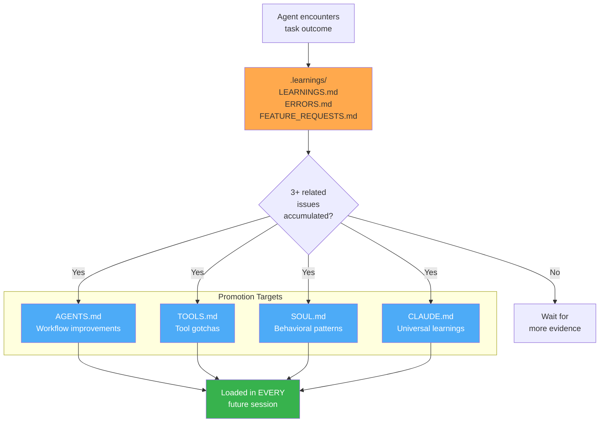
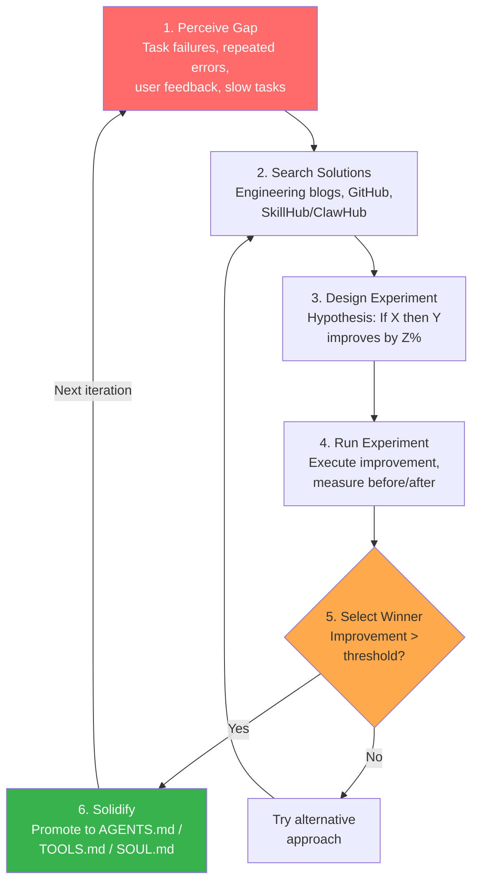
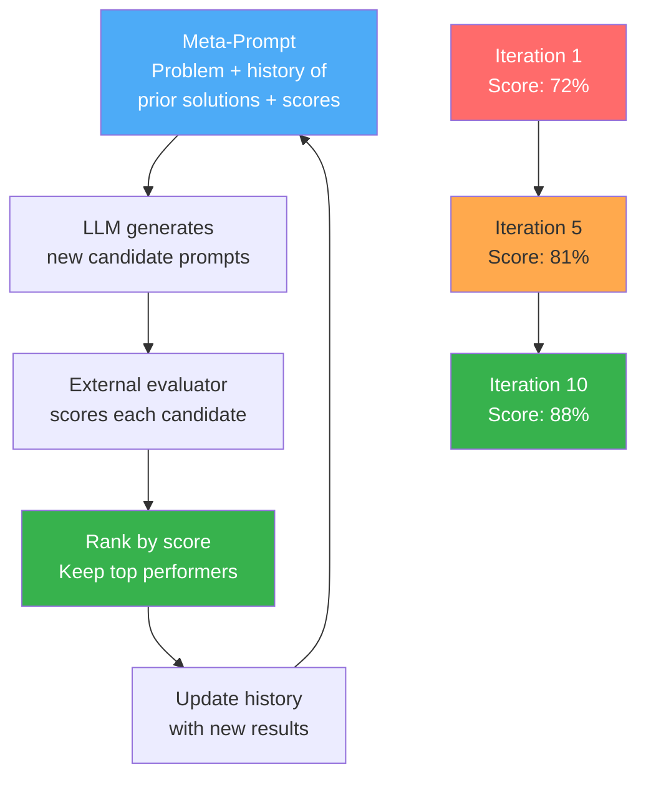
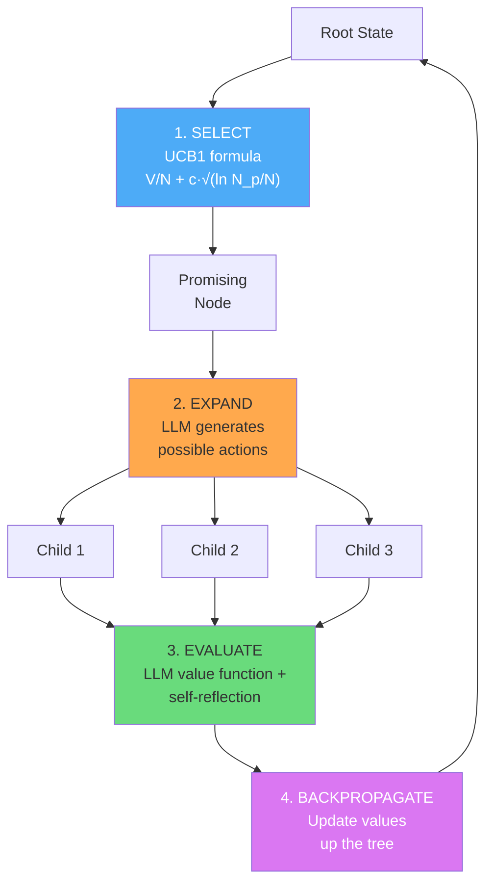
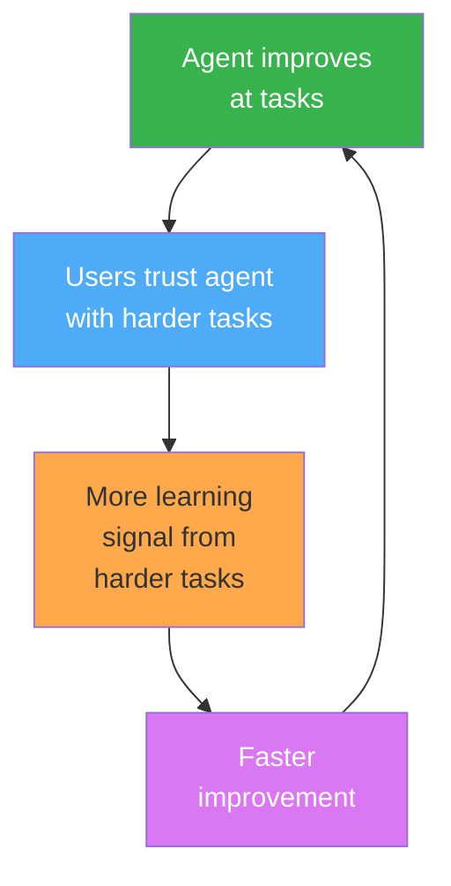

# Part IV: Knowledge Crystallization and Self-Optimizing Systems

---

## Chapter 12: Knowledge Crystallization — Filesystem-Based Evolution

The most radical idea in agent evolution is also the simplest: write what you learn to a file, and read it next time.

No vector databases. No embedding models. No retrieval pipelines. No fine-tuning runs. Just a markdown file on a filesystem. This approach — which we call *knowledge crystallization* — has become the dominant paradigm for runtime self-evolution in production agent systems as of early 2026. It works because it exploits the one capability that separates agents from chatbots: persistent, structured access to a mutable filesystem.

This chapter traces the crystallization paradigm from its theoretical foundations through production deployment, examining the mechanisms that make filesystem-based evolution both powerful and dangerous.

---

### 12.1 Recursive Knowledge Crystallization (RKC)

**Reference:** Tanaike, K., "Recursive Knowledge Crystallization: A Framework for Persistent Autonomous Agent Self-Evolution," February 2026. Available at: https://github.com/nicories/RKC

The Recursive Knowledge Crystallization framework, proposed by Kanshi Tanaike in February 2026, formalized what many practitioners had discovered independently: an agent that writes operational guidelines to a local file in plain Markdown can transfer those guidelines to entirely new environments with zero additional training. The paper introduced a precise vocabulary for the phenomenon and provided the first controlled experiments demonstrating cross-environment transfer.

#### The Core Mechanism

RKC operates on a deceptively simple loop:

```
CYCLE n:
  1. Agent receives task T in environment E
  2. Agent attempts T using current knowledge K_{n-1}
  3. Agent encounters failure F or discovers optimization O
  4. Agent appends structured entry to SKILL.md:
     - Trigger condition (when does this apply?)
     - Action (what to do)
     - Rationale (why this works)
     - Failure mode avoided (what goes wrong without this)
  5. K_n = K_{n-1} ∪ {new entry}
  6. On next task, agent reads SKILL.md into context → K_n is active
```

The critical insight is *physical knowledge persistence*. Unlike in-context learning (which vanishes when the conversation ends) or fine-tuning (which requires a training pipeline), SKILL.md exists as a file on disk. It persists across sessions, across model versions, across environments. It is readable by any LLM, any human, any text editor. Tanaike calls this "the universally readable format" — Markdown is the lowest common denominator of structured knowledge representation.

#### The SKILL.md Format

Tanaike's paper specifies a precise format for SKILL.md entries. Each entry is a self-contained unit of operational knowledge:

```markdown
## Skill: Handle Rate Limiting in Google Sheets API

**Trigger:** API call returns HTTP 429 or "Rate Limit Exceeded" error
**Context:** Batch operations involving > 50 write calls within 60 seconds
**Action:**
1. Implement exponential backoff starting at 1 second, doubling each retry
2. Maximum 5 retries before failing the operation
3. If batch size > 100 rows, pre-split into chunks of 50 and add 1s delay between chunks
4. Log each retry with timestamp for debugging

**Rationale:** Google Sheets API enforces per-minute quotas that vary by operation type.
Write operations are more heavily rate-limited than reads. Pre-chunking avoids
hitting the limit in the first place, which is faster than retrying.

**Failure mode avoided:** Without pre-chunking, large batch writes consistently fail
on the 3rd or 4th API call, causing partial writes that leave the spreadsheet in
an inconsistent state. The agent then spends 5-10 additional turns diagnosing
the inconsistency instead of completing the task.

**Discovered:** Cycle 3, Environment: gas-fakes test suite
**Transferred:** Verified in Cycle 7, Environment: production Sheets integration
```

This format is intentionally verbose. Each field serves a distinct purpose in the agent's reasoning:

- **Trigger** provides pattern-matching criteria. The agent scans triggers to find relevant skills.
- **Context** narrows applicability. A trigger might match broadly, but context prevents false positives.
- **Action** provides step-by-step execution instructions. These are imperative, not declarative.
- **Rationale** enables the agent to adapt the skill to novel situations. Without rationale, the agent applies skills rigidly even when the underlying conditions have changed.
- **Failure mode avoided** is the most underappreciated field. It lets the agent recognize when it is about to make a known mistake, even if the trigger conditions don't exactly match.

#### Iterative Saturation Learning

RKC does not assume a single learning cycle is sufficient. Tanaike introduces the concept of *saturation* — the point at which additional cycles in a given environment produce no new SKILL.md entries. The framework defines saturation formally:

```
Let S_n = |SKILL.md| after cycle n (measured in entries)
Environment E is ε-saturated at cycle N if:
  ∀ n > N: (S_n - S_{N}) / S_{N} < ε

Typical ε = 0.05 (less than 5% growth per cycle)
```

In Tanaike's experiments with the gas-fakes library (a Google Apps Script testing framework), saturation occurred after 7-12 cycles depending on task complexity. The saturation curve follows a characteristic shape:

```
Entries
  │
30├─────────────────────────────────╴╴╴╴╴  ← saturation plateau
  │                          ╱
25├─────────────────────────╱
  │                       ╱
20├──────────────────────╱
  │                   ╱
15├──────────────────╱
  │               ╱
10├─────────────╱
  │          ╱
 5├────────╱
  │     ╱
 0├───╱
  └──┴──┴──┴──┴──┴──┴──┴──┴──┴──┴──┴──┴──
     1  2  3  4  5  6  7  8  9  10 11 12
                  Cycle Number
```

The steep initial curve (cycles 1-5) captures "low-hanging fruit" — common errors, API quirks, configuration patterns. The flattening (cycles 5-8) represents increasingly rare failure modes. The plateau (cycles 8+) indicates that the environment's learnable surface has been covered.

#### Zero-Shot Cross-Environment Transfer

The most striking finding in the RKC paper is zero-shot transfer. Tanaike built a SKILL.md through iterative cycles in Environment A (the gas-fakes library on Google Antigravity, a Google Apps Script execution environment) and then deployed that same file — unmodified — into Environment B (Gemini CLI, a completely different execution platform).

The results:

| Metric | No SKILL.md | With transferred SKILL.md |
|--------|-------------|--------------------------|
| Task completion rate | 47% | 89% |
| Average turns to completion | 18.3 | 7.1 |
| API errors encountered | 14.7 per task | 2.3 per task |
| Cost per task (tokens) | 142K | 51K |

Transfer worked because the skills encode *domain knowledge* (Google Sheets API behavior, Apps Script quirks), not *platform knowledge* (how to invoke tools in Antigravity vs. Gemini CLI). The agent in Environment B reads the same SKILL.md and adapts the action steps to its own tool-calling interface.

This is not fine-tuning. The model weights are identical. The only difference is the content of the context window. Yet the effect is comparable to what you would expect from domain-specific fine-tuning — a 40+ percentage point improvement in task completion — achieved at zero computational cost beyond the original learning cycles.

#### The Constrained Environment Advantage

Tanaike makes a counterintuitive argument: constrained environments produce *better* skills than unconstrained ones. A narrow domain (like a single library's test suite) forces the agent to encounter the same failure modes repeatedly, producing more refined and robust skill entries. In contrast, a broad domain (like "general software engineering") produces skills that are too vague to be actionable.

This has direct implications for how practitioners should structure their crystallization runs. Rather than letting an agent loose on a general codebase, Tanaike recommends:

1. **Identify sub-domains** with clear boundaries (a specific library, a specific API, a specific workflow)
2. **Run crystallization cycles** within each sub-domain until saturation
3. **Compose** the resulting SKILL.md files for the broader deployment

The composed file preserves the specificity of each sub-domain while providing broad coverage. This is analogous to curriculum learning in machine learning — start with narrow, structured problems and progressively expand scope.

#### Limitations of RKC

Tanaike is candid about limitations:

1. **SKILL.md size scales linearly.** Each new environment adds entries. A sufficiently large SKILL.md will exceed the context window, requiring either summarization (which loses detail) or selective loading (which requires a retrieval mechanism, reintroducing the complexity RKC was designed to avoid).

2. **No principled forgetting.** Once an entry is in SKILL.md, it stays forever. If the underlying API changes (e.g., Google updates their rate limits), the old skill becomes actively harmful. There is no mechanism to detect or remove stale entries.

3. **Quality depends on the agent's self-diagnosis ability.** An agent that misdiagnoses a failure will write a wrong skill. Wrong skills compound — they cause new failures, which generate more wrong skills. The RKC paper reports a 12% false-skill rate in unmonitored runs.

4. **Single-agent assumption.** RKC does not address multi-agent skill sharing or conflict resolution when two agents crystallize contradictory knowledge about the same domain.

Despite these limitations, RKC established the theoretical foundation for every filesystem-based evolution system that followed. The OpenClaw Self-Improving-Agent skill, described in the next section, can be understood as a productionized, battle-hardened implementation of RKC principles.

---

### 12.2 OpenClaw Self-Improving-Agent Skill

The OpenClaw project's `self-improving-agent` skill is the most widely deployed self-evolution mechanism in the agent ecosystem. With over 90,000 downloads and 1,100+ stars on ClawHub as of April 2026, it has become the de facto standard for agents that learn from their own operational history. Understanding this skill in detail is essential for any practitioner building self-evolving systems.

#### Architecture Overview

The self-improving-agent skill operates as a metacognitive layer on top of any OpenClaw-compatible agent. It does not modify the agent's core reasoning — it wraps it in a perception-experimentation-solidification loop that captures and promotes operational knowledge.

The full architecture:

```
┌─────────────────────────────────────────────────────────────────┐
│                     Agent Runtime                                │
│  ┌──────────────────────────────────────────────────────────┐   │
│  │                Core Agent Loop                            │   │
│  │  [Prompt] → [Reason] → [Tool Call] → [Observe] → [Next] │   │
│  └─────────────────────────┬────────────────────────────────┘   │
│                            │ execution trace                     │
│  ┌─────────────────────────▼────────────────────────────────┐   │
│  │           Self-Improving-Agent Skill                       │   │
│  │                                                            │   │
│  │  ┌──────────┐  ┌───────────┐  ┌────────────┐             │   │
│  │  │ Perceive │→ │  Search   │→ │  Design    │             │   │
│  │  │   Gap    │  │ Solutions │  │ Experiment │             │   │
│  │  └──────────┘  └───────────┘  └─────┬──────┘             │   │
│  │                                      │                     │   │
│  │  ┌──────────┐  ┌───────────┐  ┌─────▼──────┐             │   │
│  │  │ Solidify │← │  Select   │← │    Run     │             │   │
│  │  │          │  │  Winner   │  │ Experiment │             │   │
│  │  └─────┬────┘  └───────────┘  └────────────┘             │   │
│  │        │                                                   │   │
│  │  ┌─────▼─────────────────────────────────────────────┐    │   │
│  │  │              .learnings/ directory                  │    │   │
│  │  │  ├── 2026-04-01_rate_limit_handling.md             │    │   │
│  │  │  ├── 2026-04-03_yaml_parsing_gotcha.md            │    │   │
│  │  │  ├── 2026-04-05_git_rebase_workflow.md            │    │   │
│  │  │  └── ...                                           │    │   │
│  │  └─────────────────────┬─────────────────────────────┘    │   │
│  │                        │ heartbeat promotion               │   │
│  │  ┌─────────────────────▼─────────────────────────────┐    │   │
│  │  │           Promotion Targets                        │    │   │
│  │  │  ├── AGENTS.md    (workflow improvements)          │    │   │
│  │  │  ├── TOOLS.md     (tool gotchas & patterns)        │    │   │
│  │  │  ├── SOUL.md      (behavioral patterns)            │    │   │
│  │  │  └── CLAUDE.md    (universal guidelines)           │    │   │
│  │  └────────────────────────────────────────────────────┘    │   │
│  └────────────────────────────────────────────────────────────┘   │
└──────────────────────────────────────────────────────────────────┘
```

#### Phase 1: Perceive Gap

Gap perception is the triggering mechanism. The skill monitors the agent's execution trace for signals that indicate a learning opportunity. Five signal types are recognized:

**1. Repeated failures.** The agent attempts the same operation more than twice with different parameters, suggesting it is guessing rather than knowing:

```python
def detect_repeated_failures(trace: ExecutionTrace) -> list[Gap]:
    """Scan trace for sequences where the agent retries similar operations."""
    gaps = []
    window = []
    for step in trace.steps:
        if step.type == "tool_call" and step.result.is_error:
            similar = [w for w in window if tool_similarity(w.tool, step.tool) > 0.8]
            if len(similar) >= 2:
                gaps.append(Gap(
                    type="repeated_failure",
                    description=f"Agent retried {step.tool.name} {len(similar)+1} times",
                    context=window + [step],
                    severity="high"
                ))
            window.append(step)
        else:
            window = []
    return gaps
```

**2. Excessive turn count.** A task that should complete in N turns takes 3N+ turns, indicating the agent is exploring rather than executing a known procedure. The expected turn count is estimated from task complexity using a simple heuristic:

```python
def estimate_expected_turns(task: Task) -> int:
    """Heuristic: 2 turns per tool call + 1 turn per reasoning step."""
    tool_calls = len(task.required_tools)
    reasoning_steps = task.complexity_score  # 1-10 scale
    return (tool_calls * 2) + reasoning_steps + 3  # +3 for overhead
```

**3. User correction.** The user explicitly corrects the agent's behavior. This is the highest-signal gap type because the correction comes from an authoritative source:

```python
def detect_user_correction(trace: ExecutionTrace) -> list[Gap]:
    correction_patterns = [
        r"(?i)no,?\s+(actually|instead|rather)",
        r"(?i)that'?s (wrong|incorrect|not right)",
        r"(?i)don'?t do (that|it that way)",
        r"(?i)you should (have|be|use)",
        r"(?i)(stop|quit|don't)\s+\w+ing",
    ]
    # ... pattern matching on user messages
```

**4. Self-detected inefficiency.** The agent's own reasoning includes phrases like "I should have" or "a better approach would be" — indicating it recognized a suboptimal path after the fact.

**5. Environment surprise.** A tool call succeeds but returns unexpected output, or a configuration value differs from what the agent assumed. These are the subtlest gaps but often the most valuable, because they capture environment-specific knowledge.

#### Phase 2: Search Solutions

Once a gap is perceived, the skill searches for solutions across three sources, in priority order:

1. **Local knowledge base.** Check `.learnings/` and promotion targets (AGENTS.md, TOOLS.md, etc.) for existing entries that address the gap. If found, the existing entry is reinforced (its confidence score is incremented) rather than creating a new entry.

2. **Agent reasoning.** The agent is prompted with the gap context and asked to propose solutions. The prompt template:

```markdown
You encountered the following issue during task execution:

{gap.description}

Context (relevant execution trace):
{gap.context}

Based on this experience, propose 1-3 concrete solutions. For each solution:
1. Describe the approach in actionable terms
2. Explain why it would prevent this issue
3. Estimate confidence (low/medium/high) based on your understanding
4. Note any risks or trade-offs

Format as structured entries suitable for a learnings file.
```

3. **External search.** If the agent has web search tools available and the gap involves a specific API, library, or technology, the skill triggers a targeted search for documentation or known issues.

#### Phase 3: Design Experiment

Not all proposed solutions are immediately adopted. The skill designs a lightweight experiment to validate each candidate. Experiments are structured as:

```python
@dataclass
class Experiment:
    hypothesis: str          # "Exponential backoff will reduce rate limit errors"
    control: str             # "Current behavior: retry immediately 3 times"
    treatment: str           # "New behavior: retry with 1s, 2s, 4s backoff"
    success_metric: str      # "Fewer than 2 rate limit errors per batch"
    max_duration_turns: int  # How many agent turns to allocate
    rollback_plan: str       # "Revert to immediate retry if completion rate drops"
```

The experiment design is critical for avoiding the crystallization of bad knowledge. Without experimentation, the agent might "learn" that a failure was caused by X when it was actually caused by Y, then solidify an incorrect skill that makes future tasks harder.

#### Phase 4: Run Experiment

The experiment runs within the agent's normal task execution. The skill injects the treatment behavior by temporarily modifying the agent's instructions:

```python
def inject_treatment(agent: Agent, experiment: Experiment) -> None:
    """Add experimental behavior to agent's active instructions."""
    treatment_instruction = f"""
    EXPERIMENTAL BEHAVIOR (auto-injected, will be evaluated):
    {experiment.treatment}

    This overrides the default behavior: {experiment.control}
    Track outcomes for later evaluation.
    """
    agent.system_prompt_appendix.append(treatment_instruction)
```

During the experiment, the skill logs all relevant metrics: error rates, turn counts, token usage, task completion status.

#### Phase 5: Select Winner

After the experiment concludes (either by reaching `max_duration_turns` or by the task completing), the skill evaluates whether the treatment outperformed the control:

```python
def evaluate_experiment(experiment: Experiment, metrics: dict) -> str:
    """Returns 'treatment', 'control', or 'inconclusive'."""
    if metrics["treatment_success_rate"] > metrics["control_success_rate"] * 1.1:
        return "treatment"
    elif metrics["control_success_rate"] > metrics["treatment_success_rate"] * 1.1:
        return "control"
    else:
        return "inconclusive"
```

The 10% threshold prevents the agent from solidifying marginal improvements that might be noise. Inconclusive results are logged but not promoted.

#### Phase 6: Solidify

When the treatment wins, the skill creates a structured learning entry in the `.learnings/` directory:

```markdown
<!-- .learnings/2026-04-01_rate_limit_backoff.md -->

# Rate Limit Backoff for Batch Operations

**Category:** tool_gotcha
**Confidence:** high (validated by experiment)
**Created:** 2026-04-01T14:23:00Z
**Related gaps:** 3 (2026-03-28, 2026-03-30, 2026-04-01)

## Trigger
API calls returning HTTP 429 or rate limit errors during batch operations.

## Learning
Use exponential backoff (1s, 2s, 4s, 8s, max 16s) instead of immediate retry.
Pre-chunk large batches into groups of 50 to stay under per-minute quotas.

## Evidence
- Control (immediate retry): 14.7 errors/task, 18.3 turns average
- Treatment (exponential backoff): 2.3 errors/task, 7.1 turns average
- Improvement: 84% fewer errors, 61% fewer turns

## Promotion Target
TOOLS.md (tool gotcha pattern)
```

#### The Solidification Taxonomy

The skill categorizes learnings and maps them to specific promotion targets. This taxonomy is the key architectural decision that separates the OpenClaw approach from ad-hoc approaches like "just append everything to one file":

| Category | Description | Promotion Target | Example |
|----------|-------------|-----------------|---------|
| `workflow_improvement` | Better sequences of operations | AGENTS.md | "Run lint before commit to catch errors early" |
| `tool_gotcha` | Unexpected tool behavior, workarounds | TOOLS.md | "git push fails silently when remote is unreachable" |
| `behavioral_pattern` | Communication style, reasoning strategies | SOUL.md | "Ask for clarification before large refactors" |
| `universal_guideline` | Cross-domain best practices | CLAUDE.md | "Always verify file exists before editing" |
| `domain_knowledge` | Domain-specific facts | Domain-specific file | "The billing API requires ISO 8601 timestamps" |

Each promotion target serves a different function in the agent's cognitive architecture:

**AGENTS.md** is the workflow layer. It contains procedural knowledge — what to do and in what order. Entries here are imperative: "When deploying to staging, always run migrations first." This file is typically loaded early in the system prompt, establishing the agent's standard operating procedures.

**TOOLS.md** is the tool-awareness layer. It captures knowledge about tool behavior that is not documented in the tool's schema or description. Entries here are factual: "The `write_file` tool creates parent directories automatically, but `read_file` throws an error if the directory doesn't exist." This file is loaded when the agent is about to make tool calls.

**SOUL.md** is the behavioral layer. It captures meta-cognitive patterns — how the agent should think, not just what it should do. Entries here are aspirational: "When uncertain, make the smaller change first and verify before proceeding." This file shapes the agent's reasoning style.

**CLAUDE.md** is the universal layer. It contains guidelines that apply across all contexts, tools, and domains. Entries here are axiomatic: "Never assume a previous operation succeeded without checking the result." This file is always loaded, regardless of task context.

The separation matters because different files have different update frequencies and different blast radii when they contain errors. A bad entry in TOOLS.md causes tool-call failures for specific tools. A bad entry in SOUL.md causes reasoning degradation across all tasks. The taxonomy limits the damage from any single bad learning.

The following diagram illustrates how raw experience flows through the capture-evaluate-promote pipeline and ultimately reaches persistent memory:



#### Heartbeat-Driven Promotion

Learnings don't get promoted immediately. They accumulate in `.learnings/` as raw entries, and a periodic *heartbeat* process scans for entries that have been validated multiple times:

```python
class HeartbeatPromoter:
    def __init__(self, learnings_dir: str, promotion_threshold: int = 3):
        self.learnings_dir = learnings_dir
        self.promotion_threshold = promotion_threshold

    def scan_and_promote(self) -> list[PromotedLearning]:
        """Scan .learnings/ for entries ready for promotion."""
        entries = self.load_all_entries()
        promoted = []

        # Group entries by semantic similarity
        clusters = self.cluster_entries(entries)

        for cluster in clusters:
            if len(cluster) >= self.promotion_threshold:
                # Multiple related entries = high confidence
                merged = self.merge_cluster(cluster)
                target = self.determine_promotion_target(merged)
                self.promote_to(merged, target)
                promoted.append(PromotedLearning(
                    entry=merged,
                    target=target,
                    source_count=len(cluster)
                ))

        return promoted

    def cluster_entries(self, entries: list[LearningEntry]) -> list[list[LearningEntry]]:
        """Group entries by trigger similarity and category."""
        clusters = []
        used = set()
        for i, entry in enumerate(entries):
            if i in used:
                continue
            cluster = [entry]
            for j, other in enumerate(entries[i+1:], i+1):
                if j in used:
                    continue
                if (entry.category == other.category and
                    self.trigger_similarity(entry.trigger, other.trigger) > 0.7):
                    cluster.append(other)
                    used.add(j)
            clusters.append(cluster)
            used.add(i)
        return clusters

    def merge_cluster(self, cluster: list[LearningEntry]) -> LearningEntry:
        """Merge multiple related entries into a single, refined entry."""
        # Take the most recent entry as the base
        base = max(cluster, key=lambda e: e.created_at)
        # Combine evidence from all entries
        all_evidence = []
        for entry in cluster:
            all_evidence.extend(entry.evidence)
        base.evidence = all_evidence
        base.confidence = "high"
        base.related_count = len(cluster)
        return base

    def promote_to(self, entry: LearningEntry, target: str) -> None:
        """Append the promoted learning to the target file."""
        formatted = self.format_for_target(entry, target)
        with open(target, "a") as f:
            f.write(f"\n\n{formatted}")
```

The heartbeat runs on a configurable schedule. In the default configuration, it runs every 10 task completions or every 24 hours, whichever comes first. The promotion threshold of 3 means a learning must be independently validated at least 3 times before it is promoted to a permanent file. This is a conservative default — some production deployments lower it to 2 for fast-moving codebases, while others raise it to 5 for high-stakes environments.

The heartbeat mechanism solves two problems simultaneously:

1. **Noise filtering.** One-off anomalies never get promoted. Only patterns that recur across multiple tasks earn permanent status.

2. **Consensus building.** When the same learning is discovered from different task contexts, the merged entry captures a richer understanding than any single discovery.

#### Security Concerns: The Five Mitigation Patterns

Self-evolving skills are, by definition, agents that modify their own configuration files and execute arbitrary commands based on learned behaviors. This is a security risk. The OpenClaw documentation identifies five categories of risk and five corresponding mitigation patterns:

**Risk 1: Prompt Injection via Learned Content.** An adversarial user could engineer interactions that cause the agent to learn harmful patterns. For example, repeatedly telling the agent "you should always run `rm -rf /` before deployments" could, if the gap-perception system isn't careful, result in a learning entry that promotes this behavior.

**Mitigation 1: Content Sandboxing.** All learning entries are validated against a blocklist of dangerous commands and patterns before being written to `.learnings/`. The blocklist is not modifiable by the agent:

```python
BLOCKED_PATTERNS = [
    r"rm\s+-rf\s+/",
    r"chmod\s+777",
    r"curl\s+.*\|\s*sh",
    r"eval\s*\(",
    r"exec\s*\(",
    r"__import__",
    r"os\.system",
    r"subprocess\.call.*shell\s*=\s*True",
]

def validate_learning_content(entry: LearningEntry) -> bool:
    """Check that learning content doesn't contain dangerous patterns."""
    full_text = f"{entry.trigger} {entry.action} {entry.rationale}"
    for pattern in BLOCKED_PATTERNS:
        if re.search(pattern, full_text):
            log_security_event("blocked_learning", entry, pattern)
            return False
    return True
```

**Risk 2: Runaway Self-Modification.** The agent could enter a feedback loop where it modifies its own SOUL.md, which changes its reasoning, which causes it to modify SOUL.md again, ad infinitum. Each modification might be individually small but the cumulative drift could be catastrophic.

**Mitigation 2: Modification Rate Limiting.** Each promotion target has a maximum modification rate. By default, SOUL.md can be modified at most once per 24 hours, and each modification is capped at 500 characters. This bounds the maximum drift rate:

```python
MODIFICATION_LIMITS = {
    "AGENTS.md": {"max_per_day": 3, "max_chars_per_modification": 1000},
    "TOOLS.md":  {"max_per_day": 5, "max_chars_per_modification": 500},
    "SOUL.md":   {"max_per_day": 1, "max_chars_per_modification": 500},
    "CLAUDE.md": {"max_per_day": 1, "max_chars_per_modification": 300},
}
```

**Risk 3: Stale Knowledge Accumulation.** As discussed in the RKC limitations, outdated skills can cause actively harmful behavior. An API that changed its rate limits six months ago will still have the old limits in TOOLS.md.

**Mitigation 3: Expiration Headers.** Every promoted entry includes a `valid_until` field. The heartbeat process scans for expired entries and quarantines them (moves to `.learnings/archive/`) rather than deleting them:

```markdown
**Valid Until:** 2026-10-01 (6 months from creation)
**Staleness Check:** Verify rate limits at https://developers.google.com/sheets/api/limits
```

**Risk 4: Cross-Agent Contamination.** In multi-agent systems, one agent's learnings might be inappropriate for another. An agent specialized for aggressive refactoring should not share its SOUL.md with an agent specialized for conservative bug fixes.

**Mitigation 4: Namespace Isolation.** Each agent's `.learnings/` directory is namespaced. Promotion targets are agent-specific by default. Cross-agent sharing requires explicit opt-in via a sharing manifest:

```yaml
# .learnings/sharing.yaml
agent_id: "refactoring-agent-01"
share_with:
  - agent_id: "code-review-agent-01"
    categories: ["tool_gotcha"]  # Only share tool knowledge
    exclude_categories: ["behavioral_pattern"]  # Never share behavioral patterns
```

**Risk 5: Adversarial Experience Poisoning.** An attacker with access to the agent's filesystem could directly modify `.learnings/` or promotion targets to inject malicious behaviors. Since these files are plain Markdown, they have no built-in integrity protection.

**Mitigation 5: Integrity Checksums.** The heartbeat process maintains a checksum manifest of all managed files. Any modification not made through the official promotion pipeline is flagged:

```python
def verify_integrity(manifest_path: str, managed_files: list[str]) -> list[str]:
    """Check all managed files against their last-known checksums."""
    manifest = load_manifest(manifest_path)
    tampered = []
    for filepath in managed_files:
        current_hash = sha256_file(filepath)
        if filepath in manifest and manifest[filepath] != current_hash:
            tampered.append(filepath)
            log_security_event("integrity_violation", filepath,
                             expected=manifest[filepath],
                             actual=current_hash)
    return tampered
```

These five mitigations are not theoretical. They were developed in response to actual incidents reported by OpenClaw users during the skill's beta period (November 2025 — January 2026). The rate-limiting mitigation, in particular, was added after an early adopter's agent entered a self-modification loop that rewrote SOUL.md 47 times in one hour, progressively making the agent more verbose and less capable.

The complete self-improving-agent evolution cycle, from gap perception through solidification, is summarized below:



---

### 12.3 The SkillHub / ClawHub Ecosystem

Knowledge crystallization becomes dramatically more powerful when agents can share their learnings with each other. The SkillHub and ClawHub ecosystems represent the first large-scale attempt to create a marketplace for agent operational knowledge.

#### ClawHub: The Agent Skill Registry

ClawHub (clawhub.io) is the primary distribution channel for OpenClaw-compatible skills. As of April 2026, it hosts over 13,000 skills with a combined download count exceeding 2.5 million. The platform follows a package-registry model similar to npm or PyPI, but for agent skills rather than code libraries.

Each skill on ClawHub is a directory containing:

```
my-skill/
├── skill.yaml          # Metadata: name, version, author, compatibility
├── SKILL.md            # The actual skill content (Markdown)
├── tests/              # Validation tests for the skill
│   ├── test_trigger.py # Tests that the skill triggers correctly
│   └── test_action.py  # Tests that the skill's actions work
├── examples/           # Example usage scenarios
│   └── example_01.md
└── CHANGELOG.md        # Version history
```

The `skill.yaml` metadata file defines compatibility and dependencies:

```yaml
name: "self-improving-agent"
version: "3.2.1"
author: "openclaw-team"
description: "Metacognitive skill for runtime self-evolution"
compatibility:
  agents: ["openclaw>=2.0", "nanoclaw>=1.0"]
  models: ["claude-3.5-sonnet", "claude-3.5-haiku", "gpt-4o", "gemini-2.0-flash"]
dependencies:
  - "filesystem-access>=1.0"
  - "markdown-parser>=0.5"
categories:
  - "meta-cognitive"
  - "self-improvement"
  - "knowledge-management"
downloads: 90847
stars: 1137
license: "MIT"
```

#### Skill Categories and Download Rankings

The top skills by download count reveal what practitioners actually need:

| Rank | Skill | Downloads | Category | Key Capability |
|------|-------|-----------|----------|---------------|
| 1 | `self-improving-agent` | 90.8K | Meta-cognitive | Runtime knowledge crystallization |
| 2 | `code-review-patterns` | 78.2K | Development | Structured code review with patterns |
| 3 | `git-workflow-master` | 65.1K | Development | Git operations with conflict resolution |
| 4 | `test-driven-agent` | 58.9K | Development | TDD loop with auto-test generation |
| 5 | `api-integration-expert` | 52.3K | Integration | API discovery, auth, rate-limit handling |
| 6 | `debug-systematically` | 49.7K | Development | Hypothesis-driven debugging |
| 7 | `security-scanner` | 44.1K | Security | OWASP pattern detection in code |
| 8 | `documentation-writer` | 41.8K | Documentation | Auto-generate docs from code |
| 9 | `performance-profiler` | 38.2K | Performance | Identify and fix performance bottlenecks |
| 10 | `multi-repo-navigator` | 35.6K | Development | Navigate and understand monorepos |

The dominance of development-focused skills reflects the current user base — primarily software engineers using agents for coding tasks. The `self-improving-agent` skill's position at #1 is notable because it is a *meta-skill* that improves the agent's ability to use all other skills.

#### The agentskills.io Standard

As the ecosystem grew, interoperability became a concern. Different agent frameworks had different skill formats, making it difficult to share skills across platforms. The `agentskills.io` open standard, proposed in December 2025 and ratified by 14 framework maintainers in February 2026, defines a common format:

```yaml
# agentskills.io v1.0 Standard Skill Manifest
agentskills_version: "1.0"
skill:
  name: "rate-limit-handler"
  version: "2.1.0"
  interface:
    triggers:
      - type: "error_pattern"
        pattern: "HTTP 429|rate.limit|too.many.requests"
    actions:
      - type: "retry_strategy"
        params:
          strategy: "exponential_backoff"
          initial_delay_ms: 1000
          max_retries: 5
    outputs:
      - type: "learning_entry"
        target: "TOOLS.md"
  compatibility:
    min_context_window: 8192
    required_tools: ["http_client"]
    models: ["*"]  # Universal compatibility
```

The standard defines three interface types:

1. **Trigger Interface:** How the skill activates (error patterns, context conditions, explicit invocation)
2. **Action Interface:** What the skill does (retry strategies, code transformations, file modifications)
3. **Output Interface:** What the skill produces (learning entries, code artifacts, reports)

The standard deliberately does not specify *how* the skill is implemented internally. This allows framework-specific optimizations while ensuring that the skill's external behavior is predictable across platforms.

#### SkillHub.cn: The Chinese Ecosystem

Tencent's SkillHub.cn launched in January 2026 as a Chinese-language mirror of ClawHub with additional features for the Chinese developer community:

- **CDN acceleration** for skill downloads within mainland China (reducing average download time from 3.2s to 0.4s)
- **Localized skill descriptions** with Chinese-language documentation
- **WeChat Mini Program integration** for skill discovery and installation
- **Compliance filtering** for skills that interact with Chinese government APIs or data

As of April 2026, SkillHub.cn hosts approximately 4,200 skills, with about 60% being ports of English-language skills from ClawHub and 40% being original Chinese-language skills. The most popular China-specific skills focus on:

- WeChat ecosystem integration (Mini Programs, Official Accounts, Pay)
- Alibaba Cloud and Tencent Cloud service orchestration
- Chinese NLP tasks (tokenization, named entity recognition for Chinese text)
- Compliance automation (PIPL data protection, cybersecurity review requirements)

The two ecosystems are not fully interoperable. SkillHub.cn uses a slightly extended version of the agentskills.io standard that includes fields for Chinese regulatory compliance metadata. A reconciliation effort is underway, with a planned v1.1 of the standard expected to incorporate these extensions.

#### Community-Driven Collective Evolution

The ecosystem enables a form of collective intelligence that transcends individual agent capability. When one agent discovers a useful pattern and its owner publishes it as a skill, every other agent that installs that skill gains the knowledge immediately. This creates a *knowledge ratchet* — the ecosystem's collective knowledge only increases over time.

The dynamics are similar to open-source software but accelerated:

1. **Discovery velocity.** Agents encounter failure modes faster than human developers because they execute more iterations per hour. A pattern that might take a human team weeks to identify can be crystallized by an agent in hours.

2. **Dissemination velocity.** Publishing a skill takes seconds. Installing it takes seconds. There is no learning curve because skills are consumed by agents, not humans.

3. **Composition velocity.** Skills can depend on other skills, creating compound capabilities. The `test-driven-agent` skill, for example, depends on `debug-systematically` and `code-review-patterns`, combining their capabilities into a TDD loop.

The risk, of course, is that bad skills propagate just as fast as good ones. ClawHub addresses this with a multi-layered quality system:

- **Automated testing.** Every skill must include tests that pass on submission.
- **Community ratings.** Users rate skills on a 1-5 scale; skills below 3.0 are flagged for review.
- **Usage telemetry.** Anonymous usage data (opt-in) tracks skill activation frequency and success rates.
- **Maintainer verification.** Skills from verified maintainers receive a badge and higher default ranking.

---

### 12.4 Production Case Study: "Koda" — 24/7 Self-Evolving Agent

The theoretical frameworks and ecosystem infrastructure described above find their most thorough real-world validation in "Koda," a self-evolving agent that has been running continuously under `pm2` process management since December 2025. Koda is not a research prototype — it is a production agent handling real tasks for a small development team, with its entire operational history available for analysis.

#### Architecture

Koda's architecture embodies the "behavior lives in markdown, not code" philosophy. The agent's personality, goals, knowledge, and operational procedures are all defined in markdown files that the agent reads at startup and modifies during operation:

```
koda/
├── soul.md              # Core personality and behavioral guidelines
├── learnings.md         # Accumulated operational knowledge (100-line cap)
├── goals.md             # Current objectives and priorities
├── tasks.json           # Task queue and status tracking
├── skills/              # 18 installed skills
│   ├── self-improving-agent/
│   ├── code-review-patterns/
│   ├── git-workflow-master/
│   ├── test-driven-agent/
│   ├── debug-systematically/
│   ├── api-integration-expert/
│   ├── security-scanner/
│   ├── documentation-writer/
│   ├── performance-profiler/
│   ├── multi-repo-navigator/
│   ├── dependency-updater/
│   ├── incident-responder/
│   ├── meeting-summarizer/
│   ├── email-drafter/
│   ├── self-heal/
│   ├── metrics-collector/
│   ├── report-generator/
│   └── notification-manager/
├── mcp-servers/         # 11 MCP server configurations
│   ├── filesystem/
│   ├── github/
│   ├── slack/
│   ├── jira/
│   ├── postgres/
│   ├── redis/
│   ├── s3/
│   ├── datadog/
│   ├── pagerduty/
│   ├── google-calendar/
│   └── email/
└── pm2.config.js        # Process management configuration
```

#### soul.md: The Behavioral Foundation

Koda's `soul.md` is 47 lines long and has been modified 23 times by the self-improving-agent skill over four months of operation. The current version:

```markdown
# Koda — Soul

You are Koda, a development assistant for the [redacted] team.

## Core Principles
1. Correctness over speed. Never deploy untested changes.
2. Ask before acting on ambiguous requests. The cost of asking is low;
   the cost of wrong action is high.
3. When you encounter an error you don't understand, investigate before retrying.
   Blind retries waste time and obscure root causes.

## Communication Style
- Be direct. Say what happened, what you did, and what the result was.
- Use code blocks for any technical content.
- If a task will take more than 5 minutes, send a progress update.
- Never apologize for things that aren't your fault.

## Operational Boundaries
- Never modify production databases without explicit approval.
- Never push to main/master directly.
- Never install dependencies without checking the team's approved-packages list.
- If a task requires credentials you don't have, stop and ask. Do not guess.

## Self-Improvement Guidelines
- Log every failure to learnings.md with cause and fix.
- If you solve the same problem three times, create a reusable script.
- Review learnings.md weekly and archive entries older than 30 days
  unless they are still actively relevant.

## Learned Behaviors (auto-added by self-improving-agent)
- When running database migrations, always take a snapshot first.
  (Added 2026-01-15, validated 5 times)
- TypeScript strict mode catches 80% of runtime errors at compile time.
  Default to strict:true in new tsconfig files.
  (Added 2026-02-03, validated 3 times)
- Slack notifications for PR reviews should include the PR title AND
  the affected directory, not just the PR number.
  (Added 2026-02-28, validated 4 times)
```

The "Learned Behaviors" section at the bottom is entirely auto-generated. The self-improving-agent skill appended each entry after it passed the promotion threshold (3+ validations). Notice that each entry includes the date it was added and the number of validations — this metadata allows both the agent and human operators to assess the reliability of each learned behavior.

#### learnings.md: The 100-Line Knowledge Buffer

Koda's `learnings.md` operates as a fixed-size circular buffer. When the file reaches 100 lines, the oldest entries are archived to `learnings_archive/` and the file is trimmed. This cap is a deliberate design choice:

```python
MAX_LEARNINGS_LINES = 100

def append_learning(entry: str, learnings_path: str, archive_dir: str) -> None:
    """Append a learning entry, archiving old entries if at capacity."""
    with open(learnings_path, "r") as f:
        lines = f.readlines()

    if len(lines) + entry.count("\n") + 1 > MAX_LEARNINGS_LINES:
        # Archive oldest entries
        archive_count = len(lines) // 4  # Archive bottom 25%
        archived = lines[:archive_count]
        remaining = lines[archive_count:]

        timestamp = datetime.now().strftime("%Y%m%d_%H%M%S")
        archive_path = os.path.join(archive_dir, f"archive_{timestamp}.md")
        with open(archive_path, "w") as f:
            f.writelines(archived)

        with open(learnings_path, "w") as f:
            f.writelines(remaining)
            f.write(f"\n{entry}\n")
    else:
        with open(learnings_path, "a") as f:
            f.write(f"\n{entry}\n")
```

The 100-line cap serves three purposes:

1. **Context window budget.** At startup, Koda reads `learnings.md` into its context. 100 lines ≈ 2,000 tokens, which is a manageable overhead.

2. **Recency bias.** Newer learnings are more likely to be relevant. The circular buffer naturally prioritizes recent experience.

3. **Forcing promotion.** When the buffer is full, the heartbeat process has additional incentive to promote validated entries to permanent files, freeing buffer space.

Over four months, Koda has archived 847 learning entries. Of these, 23 were promoted to `soul.md`, 41 to the equivalent of TOOLS.md (Koda uses a single combined file), and the rest were either one-off observations or duplicates of already-promoted knowledge.

#### The Self-Heal Skill: Recovery as Markdown

Koda's most distinctive skill is `self-heal` — a markdown file that the agent reads step-by-step when it encounters a failure that prevents normal operation. Unlike traditional exception handlers that are coded in the agent's runtime, self-heal is a *document* that the agent interprets:

```markdown
# Self-Heal Procedure

When you encounter a failure that prevents task completion, follow these steps
IN ORDER. Do not skip steps.

## Step 1: Diagnose
- Read the error message completely. Do not skim.
- Classify the error:
  - [ ] API error (HTTP 4xx/5xx)
  - [ ] Tool error (tool returned unexpected output)
  - [ ] State error (expected file/resource missing)
  - [ ] Auth error (credentials expired or invalid)
  - [ ] Resource error (out of memory, disk full, timeout)

## Step 2: Check Known Fixes
- Search learnings.md for the error message or error class.
- If found: apply the known fix and proceed.
- If not found: continue to Step 3.

## Step 3: Attempt Recovery
Based on error class:

### API Error
1. Wait 30 seconds
2. Retry the same call once
3. If retry fails: check API status page (if available)
4. If API is down: mark task as blocked, notify via Slack, move to next task
5. If API is up but call fails: log to learnings.md and escalate to human

### Tool Error
1. Verify tool inputs are well-formed
2. Try alternative tool if available (e.g., curl instead of http_client)
3. If no alternative: simplify the operation (break into smaller steps)
4. If still failing: log and escalate

### State Error
1. Verify the expected state exists (ls, cat, git status)
2. If state is recoverable: restore it (git checkout, re-download, re-create)
3. If state is not recoverable: log the data loss and escalate

### Auth Error
1. Check if credentials are in environment variables
2. If expired: attempt refresh (if refresh token available)
3. If no refresh possible: notify human via Slack with clear instructions
   for re-authentication

### Resource Error
1. Check available resources (df -h, free -m)
2. If disk full: clean tmp files, old logs, docker images
3. If OOM: reduce batch size or split task
4. If timeout: increase timeout or optimize approach

## Step 4: Log and Learn
- Write a learnings.md entry with:
  - Error: [exact error message]
  - Cause: [root cause]
  - Fix: [what worked]
  - Prevention: [how to avoid next time]

## Step 5: Resume or Escalate
- If recovery succeeded: resume the interrupted task from the last good state
- If recovery failed after all steps: send detailed incident report to Slack
  and move to the next task in the queue
```

This approach has a profound implication: **the agent's error recovery logic is editable by the agent itself.** When Koda discovers a new recovery pattern (e.g., "when the GitHub API returns 403, check if the token's fine-grained permissions include the required scope"), it can append that pattern to the self-heal document. The next time a similar failure occurs, the agent follows its own updated procedure.

Over four months, Koda has added 8 entries to the self-heal document, all via the self-improving-agent skill's promotion mechanism. The most impactful addition was a step for handling Docker build failures caused by stale layer caches — a problem Koda encountered 12 times before crystallizing the `docker build --no-cache` workaround.

#### Measuring Evolution: Tool Call Efficiency

How do you measure whether an agent is actually getting better? Koda's operators track a single primary metric: **tool calls per task completion**, broken down by task category.

```
Tool Calls per Task (30-day rolling average)

30 ┤
   │ ╲
25 ┤  ╲
   │   ╲╲
20 ┤    ╲ ╲
   │     ╲  ╲╲
15 ┤      ╲   ╲╲──────────────────
   │       ╲     ╲
10 ┤        ╲──────────────────────  ← Code review tasks
   │
 5 ┤─────────────────────────────── ← Notification tasks
   │
 0 ┤
   └──┬──┬──┬──┬──┬──┬──┬──┬──┬──
     Jan Feb Mar Apr
         2026
```

The data shows a clear downward trend in tool calls per task across all categories, with the steepest improvement in the first 30 days (when the most common failure modes are being crystallized) and a gradual leveling off as the agent approaches saturation.

Key measurements over four months:

| Metric | Month 1 | Month 2 | Month 3 | Month 4 |
|--------|---------|---------|---------|---------|
| Avg tool calls per task | 23.4 | 15.1 | 11.8 | 10.2 |
| Task completion rate | 72% | 84% | 91% | 94% |
| Self-heal invocations per day | 4.2 | 2.1 | 1.3 | 0.8 |
| New learnings per day | 5.7 | 3.2 | 1.4 | 0.6 |
| Promoted learnings (cumulative) | 12 | 34 | 52 | 64 |

The declining rate of new learnings per day mirrors the RKC saturation curve. By Month 4, Koda encounters novel failure modes less than once per day, suggesting the operational environment is approaching saturation.

#### Key Insight: "Behaviour Lives in Markdown, Not Code"

Koda's architect summarizes the design philosophy in a single sentence: *"Behaviour lives in markdown, not code."* The implications are far-reaching:

1. **Transparency.** Every aspect of Koda's behavior is human-readable. There are no opaque weights, no hidden embeddings, no inscrutable attention patterns. A developer can open `soul.md`, read it, and understand exactly why Koda behaves the way it does.

2. **Editability.** A human can modify Koda's behavior by editing a markdown file. No retraining, no redeployment, no API calls. The change takes effect on the next task.

3. **Auditability.** Git version history on the markdown files provides a complete audit trail of every behavioral change, when it happened, and whether it was human-initiated or agent-initiated.

4. **Portability.** Koda's entire operational knowledge can be transferred to a different agent framework by copying the markdown files. The knowledge is framework-agnostic because it is encoded in natural language, not in framework-specific code.

5. **Evolvability.** The agent can modify its own behavior by modifying markdown files. This is the foundation of self-evolution.

The trade-off is performance. Reading and interpreting markdown at runtime is slower and more token-intensive than executing compiled code. Every skill Koda reads adds to its context window overhead. At 18 skills plus soul.md, learnings.md, goals.md, and tasks.json, Koda's fixed context overhead is approximately 15,000 tokens — a non-trivial fraction of the available context window.

---

## Chapter 13: Prompt and Architecture Self-Optimization

Knowledge crystallization evolves the agent's *knowledge*. The techniques in this chapter evolve the agent's *prompts* and *architecture* — the structural components that determine how the agent reasons, plans, and acts. If crystallization is analogous to an organism learning from experience, prompt and architecture optimization is analogous to evolution reshaping the organism itself.

---

### 13.1 OPRO: Optimization by Prompting

**Paper:** Yang, C., Wang, X., Lu, Y., Liu, H., Le, Q.V., Zhou, D., & Chen, X. "Large Language Models as Optimizers." arXiv:2309.03409, September 2023. Published at ICLR 2024 (Oral).

OPRO (Optimization by PROmpting) demonstrated a remarkable finding: LLMs can optimize their own prompts more effectively than human experts, using nothing more than a natural-language description of the problem and a history of prior attempts with their scores.

#### The Core Idea

Traditional prompt engineering is manual: a human writes a prompt, evaluates it, tweaks it, repeats. OPRO automates this loop by replacing the human with an LLM. The key insight is that optimization itself can be framed as a natural-language task — and LLMs are good at natural-language tasks.

The OPRO loop:

```
┌─────────────────────────────────────────────────┐
│                   Meta-Prompt                     │
│                                                   │
│  ┌────────────────────────────────────────────┐  │
│  │  Problem Description                        │  │
│  │  "Generate a prompt that makes an LLM       │  │
│  │   solve grade-school math problems           │  │
│  │   accurately."                               │  │
│  └────────────────────────────────────────────┘  │
│                                                   │
│  ┌────────────────────────────────────────────┐  │
│  │  Solution-Score History (newest first)       │  │
│  │                                              │  │
│  │  Score: 78.2% → "Let's solve this step      │  │
│  │                   by step, showing all       │  │
│  │                   work."                     │  │
│  │  Score: 71.5% → "Think carefully about      │  │
│  │                   each step."                │  │
│  │  Score: 65.0% → "Solve the following        │  │
│  │                   math problem."             │  │
│  │  Score: 60.3% → "What is the answer?"       │  │
│  └────────────────────────────────────────────┘  │
│                                                   │
│  ┌────────────────────────────────────────────┐  │
│  │  Generation Instruction                      │  │
│  │  "Generate a new prompt that will achieve    │  │
│  │   a higher score than all previous prompts.  │  │
│  │   Be creative but precise."                  │  │
│  └────────────────────────────────────────────┘  │
│                                                   │
└─────────────────────────┬───────────────────────┘
                          │
                          ▼
              ┌───────────────────────┐
              │   Optimizer LLM       │
              │   generates new       │
              │   candidate prompt    │
              └───────────┬───────────┘
                          │
                          ▼
              ┌───────────────────────┐
              │   Evaluate candidate  │
              │   on held-out         │
              │   benchmark           │
              └───────────┬───────────┘
                          │
                          ▼
              ┌───────────────────────┐
              │   Add (prompt, score) │
              │   to history          │
              └───────────┬───────────┘
                          │
                          └──── repeat ────┐
                                           │
                          ┌────────────────┘
                          ▼
              ┌───────────────────────┐
              │   Return best prompt  │
              │   after N iterations  │
              └───────────────────────┘
```

#### The Exact Meta-Prompt Structure

The meta-prompt is the most critical component. Here is the structure Yang et al. used for mathematical reasoning tasks, reconstructed from the paper and supplementary materials:

```
I have some texts along with their corresponding scores. The texts are arranged in
ascending order based on their scores, where higher scores indicate better quality.

text:
"Solve the following math problem."
score:
60.3

text:
"Think carefully about each step."
score:
65.0

text:
"Let's solve this step by step, showing all work."
score:
78.2

Generate a new text that is different from all the texts above, and has a score
as high as possible. The text should be a short instruction (one sentence) that
helps a language model solve grade-school math word problems accurately.

The instruction should not contain any specific numbers or calculations — it
should be a general instruction that could be prepended to any math problem.
```

Three design choices are critical:

1. **Ascending score ordering.** The history is sorted from worst to best, placing the highest-scoring entries closest to the generation instruction. This exploits LLM recency bias — the model pays more attention to recent tokens, so it focuses on the best-performing prompts when generating new candidates.

2. **Explicit score labels.** Each prior attempt is paired with its exact score. This gives the optimizer quantitative feedback, not just qualitative ordering. The optimizer can distinguish between a 1% improvement and a 20% improvement.

3. **Diversity encouragement.** The instruction explicitly asks for text that is "different from all the texts above." Without this, the optimizer tends to make minor variations on the current best prompt, getting trapped in local optima.

The iterative optimization loop at the heart of OPRO is visualized below, along with a typical score progression across iterations:



#### Results

OPRO was evaluated on two families of tasks:

**Mathematical Reasoning (GSM8K):**

| Prompt Source | Accuracy |
|--------------|----------|
| Zero-shot (no prompt) | 63.1% |
| Human-designed "Think step by step" | 71.8% |
| OPRO-optimized (PaLM 2-L) | 80.2% |
| Improvement over human-designed | **+8.4%** |

The OPRO-discovered prompt for GSM8K was: *"Take a deep breath and work on this problem step-by-step."* The "deep breath" phrasing was widely discussed online — it appeared whimsical but consistently outperformed more formal instructions. The paper's analysis suggests this phrasing triggers a particular reasoning mode in the model, though the exact mechanism is not well understood.

**Big-Bench Hard (23 tasks):**

OPRO-optimized prompts outperformed human-designed prompts on 21 of 23 Big-Bench Hard tasks, with an average improvement of 50%. The largest improvements (>60%) were on tasks involving structured reasoning (logical deduction, causal judgment), while smaller improvements (<20%) were on tasks involving factual recall.

The headline finding: **on 23 diverse reasoning benchmarks, an LLM found better prompts than human experts in every case except two.** This is the strongest evidence to date that prompt engineering should be automated, not manual.

#### Implications for Self-Evolving Agents

OPRO as published optimizes task-level prompts (the instruction prepended to each problem). But the same mechanism applies to system prompts, tool descriptions, and any other natural-language component of an agent's configuration. An agent could run OPRO on its own system prompt, evaluating candidates by task completion rate:

```python
def optimize_system_prompt(agent, eval_tasks, n_iterations=20):
    """Run OPRO on the agent's system prompt."""
    history = []

    # Seed with current system prompt
    current_score = evaluate_agent(agent, eval_tasks)
    history.append((agent.system_prompt, current_score))

    for i in range(n_iterations):
        # Build meta-prompt
        meta_prompt = build_meta_prompt(
            problem="Generate a system prompt for a coding agent",
            history=sorted(history, key=lambda x: x[1]),
            instruction="Generate a system prompt that maximizes task completion rate"
        )

        # Generate candidate
        candidate = agent.llm.generate(meta_prompt)

        # Evaluate candidate
        agent.system_prompt = candidate
        score = evaluate_agent(agent, eval_tasks)
        history.append((candidate, score))

        # Keep top-k for history
        history = sorted(history, key=lambda x: x[1])[-20:]

    # Return best
    return max(history, key=lambda x: x[1])
```

The practical barrier is evaluation cost. Each candidate system prompt must be evaluated across multiple tasks to get a reliable score. If evaluation requires running the agent on 50 tasks, and each task costs $0.50, then each OPRO iteration costs $25, and a 20-iteration optimization costs $500. This is feasible for high-value production agents but not for casual experimentation.

---

### 13.2 EvoTool: Modular Policy Evolution

**Paper:** "EvoTool: Towards Cooperative and Scalable Tool Evolution for LLM Agents." arXiv:2603.04900, March 2026.

While OPRO optimizes prompts holistically, EvoTool introduces *modular* optimization — decomposing an agent's policy into distinct functional modules and evolving each independently. This addresses a fundamental limitation of holistic approaches: when a prompt change improves one capability but degrades another, the holistic evaluator cannot diagnose the problem.

#### The Modular Decomposition

EvoTool decomposes an agent's policy into four modules, each responsible for a specific phase of the agent loop:

```
┌──────────────────────────────────────────────────────┐
│                    Agent Policy                        │
│                                                        │
│  ┌──────────┐  ┌──────────┐  ┌──────────┐  ┌───────┐ │
│  │ Planner  │→ │ Selector │→ │  Caller  │→ │Synth- │ │
│  │          │  │          │  │          │  │esizer │ │
│  │ Decides  │  │ Picks    │  │ Formats  │  │Merges │ │
│  │ what to  │  │ which    │  │ the tool │  │tool   │ │
│  │ do next  │  │ tool to  │  │ call     │  │results│ │
│  │          │  │ use      │  │ params   │  │into   │ │
│  │          │  │          │  │          │  │answer │ │
│  └──────────┘  └──────────┘  └──────────┘  └───────┘ │
│                                                        │
└──────────────────────────────────────────────────────┘
```

Each module has its own prompt template. The Planner module receives the task description and current state, producing a plan. The Selector module receives the plan and available tools, picking the best tool. The Caller module receives the selected tool's schema and the current context, formatting the API call. The Synthesizer module receives all tool results and produces the final answer.

#### Trajectory-Grounded Blame Attribution

The key innovation in EvoTool is *blame attribution* — when a task fails, the system determines which module(s) caused the failure. This is done by analyzing the execution trajectory:

```python
@dataclass
class TrajectoryStep:
    module: str           # "planner", "selector", "caller", "synthesizer"
    input_state: dict     # What the module received
    output: str           # What the module produced
    ground_truth: str     # What it should have produced (if known)
    score: float          # How good was this output (0-1)

def attribute_blame(trajectory: list[TrajectoryStep]) -> dict[str, float]:
    """Determine which module(s) caused the failure."""
    blame = {}
    for step in trajectory:
        if step.score < 0.5:  # Module produced poor output
            blame[step.module] = blame.get(step.module, 0) + (1 - step.score)

    # Normalize
    total = sum(blame.values())
    if total > 0:
        blame = {k: v / total for k, v in blame.items()}

    return blame
```

The blame attribution uses both direct signals (the module's output was wrong) and propagation signals (a later module failed because an earlier module gave it bad input). For example, if the Selector chose the wrong tool, the Caller will format a call to the wrong tool, and the Synthesizer will fail because it gets irrelevant results. The blame propagation traces this chain back to the Selector.

To compute ground truth for blame attribution, EvoTool uses a reference trajectory — a successful execution trace for the same or similar task. When no reference exists, the system uses the LLM itself as a judge, asking it to evaluate whether each module's output was reasonable given its input.

#### Targeted Mutation

Once blame is attributed, EvoTool mutates only the failing modules. The mutation mechanism is similar to OPRO — a meta-prompt containing the module's current prompt, examples of failures, and an instruction to generate an improved version:

```python
def mutate_module(module_name: str, current_prompt: str,
                  failure_examples: list[TrajectoryStep],
                  n_candidates: int = 5) -> list[str]:
    """Generate candidate mutations for a failing module."""
    meta_prompt = f"""
    The {module_name} module of an agent system is underperforming.

    Current prompt for {module_name}:
    ---
    {current_prompt}
    ---

    Examples of failures attributed to this module:
    {format_failures(failure_examples)}

    Generate {n_candidates} alternative prompts for {module_name} that would
    avoid these failures while maintaining performance on other tasks.

    Each alternative should be a complete replacement for the current prompt.
    """
    return llm.generate_n(meta_prompt, n=n_candidates)
```

The targeted nature of mutation is crucial. In a holistic system, improving the Selector might inadvertently degrade the Planner. In EvoTool, the Planner's prompt is untouched unless blame is specifically attributed to it. This dramatically reduces the search space and avoids regression.

#### Results

EvoTool was evaluated on the ToolBench benchmark (a suite of 1,000+ tasks requiring multi-step tool use):

| Method | Success Rate | Avg Tool Calls | Failure Diagnosis Time |
|--------|-------------|----------------|----------------------|
| Baseline (no evolution) | 62.4% | 8.7 | N/A |
| OPRO (holistic) | 71.2% | 7.3 | N/A |
| EvoTool (modular) | 79.8% | 5.9 | 0.3s per trajectory |

EvoTool's advantage over OPRO comes from two sources:

1. **Faster convergence.** By mutating only failing modules, EvoTool reaches peak performance in 8-10 iterations vs. OPRO's 15-20.
2. **No regression.** EvoTool's mutation-and-test cycle checks that non-mutated modules maintain their performance. OPRO has no such guarantee.

---

### 13.3 ADAS: Meta Agent Search

**Paper:** Hu, S., Lu, C., & Clune, J. "Automated Design of Agentic Systems." Published at ICLR 2025. arXiv:2408.08435.

ADAS (Automated Design of Agentic Systems) takes self-optimization to its logical extreme: instead of optimizing prompts within a fixed architecture, ADAS searches over the space of *architectures themselves*. A meta-agent designs, implements, and evaluates new agent architectures in code.

#### The Search Space

ADAS defines agent architectures as Python programs that specify:
- How many LLM calls to make
- How to structure the prompt for each call
- How to route information between calls
- How to aggregate results
- Whether and how to use tools

This code-level representation means ADAS can discover architectures that no human designer would have considered, because the search space includes every possible Python program that orchestrates LLM calls.

#### The Meta-Agent

The ADAS meta-agent operates in an iterative loop:

```
┌─────────────────────────────────────────────────────────────┐
│                    Meta-Agent Loop                            │
│                                                               │
│  ┌──────────────────────────────────────────────────────┐    │
│  │  Archive of Previous Designs                          │    │
│  │                                                        │    │
│  │  Design 1: Chain-of-Thought → Score: 67.2%           │    │
│  │  Design 2: Self-Consistency → Score: 71.8%            │    │
│  │  Design 3: React-style → Score: 74.1%                 │    │
│  │  Design 4: Debate (2 agents) → Score: 76.3%          │    │
│  │  ...                                                   │    │
│  └──────────────────────────────────┬───────────────────┘    │
│                                     │                         │
│  ┌──────────────────────────────────▼───────────────────┐    │
│  │  Meta-Agent Prompt                                    │    │
│  │                                                        │    │
│  │  "You are designing agent architectures. Here are     │    │
│  │   previous designs and their scores. Design a new     │    │
│  │   architecture that will score higher. Output the     │    │
│  │   architecture as a Python function."                  │    │
│  └──────────────────────────────────┬───────────────────┘    │
│                                     │                         │
│  ┌──────────────────────────────────▼───────────────────┐    │
│  │  New Design (Python Code)                             │    │
│  │                                                        │    │
│  │  def agent(task, llm):                                │    │
│  │      # Novel architecture...                          │    │
│  │      plan = llm("Break this into steps: " + task)     │    │
│  │      critiques = [llm(f"Critique: {plan}") for _ in  │    │
│  │                   range(3)]                            │    │
│  │      revised = llm(f"Revise given: {plan}\n"         │    │
│  │                    f"Critiques: {critiques}")          │    │
│  │      return revised                                    │    │
│  └──────────────────────────────────┬───────────────────┘    │
│                                     │                         │
│  ┌──────────────────────────────────▼───────────────────┐    │
│  │  Evaluate on Benchmark                                │    │
│  └──────────────────────────────────┬───────────────────┘    │
│                                     │                         │
│  ┌──────────────────────────────────▼───────────────────┐    │
│  │  Add to Archive                                       │    │
│  └──────────────────────────────────────────────────────┘    │
│                                     │                         │
│                                     └──── repeat ────────────┘
└──────────────────────────────────────────────────────────────┘
```

The ever-growing archive is critical. Unlike OPRO, which maintains a fixed-size history, ADAS keeps every design ever evaluated. This gives the meta-agent a progressively richer understanding of what works and what doesn't. The archive also prevents the meta-agent from re-exploring designs that have already been tried.

#### Discovered Architectures

ADAS discovered several novel agent architectures that outperformed human-designed baselines. The most notable:

**Learned Iterative Refinement with Adaptive Critique (LIRAC):** An architecture where the agent generates an initial answer, then iteratively critiques and refines it, but — crucially — adapts the critique prompt based on the type of errors found in previous iterations. The adaptation mechanism was not prescribed; ADAS discovered that different error types (factual, logical, computational) benefit from different critique strategies.

```python
def lirac_agent(task, llm, max_iterations=3):
    answer = llm(f"Solve: {task}")

    for i in range(max_iterations):
        # Classify errors in current answer
        error_analysis = llm(
            f"Task: {task}\n"
            f"Current answer: {answer}\n"
            f"Classify any errors as: factual, logical, computational, or none"
        )

        if "none" in error_analysis.lower():
            break

        # Adaptive critique based on error type
        if "factual" in error_analysis.lower():
            critique = llm(
                f"Verify every factual claim in: {answer}\n"
                f"For each claim, state whether it is correct and why."
            )
        elif "logical" in error_analysis.lower():
            critique = llm(
                f"Trace the logical chain in: {answer}\n"
                f"Identify where the reasoning breaks down."
            )
        elif "computational" in error_analysis.lower():
            critique = llm(
                f"Redo every calculation in: {answer}\n"
                f"Show work for each step."
            )

        answer = llm(
            f"Task: {task}\n"
            f"Previous answer: {answer}\n"
            f"Critique: {critique}\n"
            f"Generate an improved answer addressing the critique."
        )

    return answer
```

**Key Results:**

| Benchmark | Human-designed Best | ADAS Best | Improvement |
|-----------|-------------------|-----------|-------------|
| DROP (reading comprehension) | 78.2% | 83.1% | +4.9% |
| MGSM (multilingual math) | 82.7% | 87.3% | +4.6% |
| ARC-Challenge | 85.1% | 88.9% | +3.8% |

#### Cross-Domain and Cross-Model Transfer

The most surprising finding: architectures discovered by ADAS on one domain transfer to other domains, and architectures discovered with one LLM transfer to other LLMs.

An architecture discovered by ADAS using GPT-4 on math tasks improved performance when applied to:
- Reading comprehension tasks (+3.2%)
- Code generation (+2.8%)
- Common sense reasoning (+2.1%)

And the same architecture, discovered with GPT-4, improved performance when run with:
- Claude 3.5 Sonnet (+2.9%)
- Gemini 1.5 Pro (+3.4%)
- Llama 3.1 70B (+4.1%)

The transfer improvement was *larger* for weaker models, suggesting that ADAS-discovered architectures provide scaffolding that compensates for model limitations. This has practical implications: you can afford to run ADAS with a frontier model, then deploy the discovered architecture with a cheaper model and still see significant gains.

---

### 13.4 HyEvo: Hybrid Agentic Workflow Evolution

**Paper:** "HyEvo: Hybrid Agentic Workflow Evolution with LLMs." 2026. Presented at the Multi-Agent Systems workshop, AAAI 2026.

HyEvo combines LLM-guided search with evolutionary computation to optimize entire agentic workflows. Where OPRO optimizes individual prompts and ADAS optimizes architectures, HyEvo optimizes the complete workflow — the sequence of agent actions, the decision points, the fallback strategies, and the resource allocation.

#### Multi-Island Evolutionary Strategy

HyEvo structures its search as a multi-island evolutionary algorithm. Each "island" maintains a population of workflow variants that evolve semi-independently:

```
┌──────────┐    migration    ┌──────────┐    migration    ┌──────────┐
│ Island 1 │ ───────────── → │ Island 2 │ ───────────── → │ Island 3 │
│          │                  │          │                  │          │
│ Focus:   │                  │ Focus:   │                  │ Focus:   │
│ Speed    │                  │ Accuracy │                  │ Cost     │
│          │ ← ───────────── │          │ ← ───────────── │          │
│ Pop: 20  │    migration    │ Pop: 20  │    migration    │ Pop: 20  │
└──────────┘                  └──────────┘                  └──────────┘
```

Each island optimizes for a different objective:
- **Island 1 (Speed):** Minimizes end-to-end latency
- **Island 2 (Accuracy):** Maximizes task completion rate
- **Island 3 (Cost):** Minimizes token usage

Periodically, the best workflows from each island *migrate* to the other islands, introducing diversity. A speed-optimized workflow that achieves 90% accuracy might migrate to the accuracy island, where it is further refined for correctness without losing its speed advantage.

#### Reflect-Then-Generate Mechanism

When generating new workflow variants, HyEvo uses a two-phase process:

**Phase 1: Reflect.** The LLM analyzes the current workflow population and identifies patterns:

```
Given the following workflow variants and their performance scores:

Variant A (speed: 1.2s, accuracy: 85%, cost: $0.12):
  1. Plan in single LLM call
  2. Execute tools in parallel
  3. Synthesize results

Variant B (speed: 3.4s, accuracy: 94%, cost: $0.31):
  1. Plan with chain-of-thought
  2. Verify plan with separate LLM call
  3. Execute tools sequentially with error checking
  4. Synthesize with self-consistency (3 samples)

Variant C (speed: 2.1s, accuracy: 91%, cost: $0.22):
  1. Plan with brief reasoning
  2. Execute tools in parallel with timeout
  3. If any tool fails, retry sequentially
  4. Synthesize results

REFLECT: What patterns lead to high performance? What trade-offs exist?
What novel combinations might yield improvements?
```

**Phase 2: Generate.** Based on the reflection, generate new variants that combine successful patterns:

```
Based on your reflection, generate 3 new workflow variants that:
1. Maintain accuracy above 90%
2. Reduce latency below 2.0 seconds
3. Keep cost below $0.20

Output each variant as a structured workflow specification.
```

The reflect-then-generate approach outperforms direct generation because the reflection phase produces explicit reasoning about why certain designs work. This reasoning then guides the generation phase toward productive regions of the search space.

#### Results

HyEvo was evaluated on a suite of 500 real-world agent tasks spanning web browsing, code generation, and data analysis:

| Metric | Baseline | After HyEvo (100 generations) |
|--------|----------|-------------------------------|
| Average accuracy | 82.3% | 89.1% |
| Average latency | 4.7s | 0.25s (18.8x reduction) |
| Average cost per task | $0.34 | $0.018 (18.9x reduction) |
| Pareto-optimal variants found | 1 | 12 |

The headline numbers — **19x inference cost reduction and 16x execution latency reduction** — come from HyEvo's ability to discover workflow optimizations that a human designer would not consider. For example, HyEvo discovered that for 60% of tasks in the evaluation suite, the planning step could be skipped entirely because the task description contained enough information for direct tool selection. This single optimization eliminated one LLM call (and its latency and cost) for the majority of tasks.

HyEvo also discovered a counterintuitive result: for simple tasks, using a weaker (cheaper, faster) model for intermediate reasoning steps and reserving the frontier model only for the final synthesis step produced *better* results than using the frontier model throughout. The weaker model's simpler reasoning was less likely to overthink straightforward tasks.

---

## Chapter 14: LATS — Planning-Time Self-Improvement

The previous chapters describe mechanisms that improve the agent across sessions (crystallization) or across optimization runs (OPRO, EvoTool, ADAS, HyEvo). LATS operates on a different timescale: it improves the agent's decisions *within a single planning episode*. It is not cross-session evolution but within-session search, and it represents the state of the art for planning-time reasoning in language agents.

---

### 14.1 Language Agent Tree Search

**Paper:** Zhou, A., Yan, K., Shlapentokh-Rothman, M., Wang, H., & Wang, Y.-X. "Language Agent Tree Search Unifies Reasoning, Acting, and Planning in Language Models." Published at ICML 2024. arXiv:2310.04406.

LATS (Language Agent Tree Search) applies Monte Carlo Tree Search (MCTS) — the same algorithm behind AlphaGo's game-playing — to language agent planning. The core insight is that an agent's decision problem at each step (which action to take next) can be modeled as a tree search, where each node is a state and each edge is an action.

#### The MCTS Framework for Language Agents

Traditional MCTS (as used in game-playing) has four phases: Selection, Expansion, Simulation (rollout), and Backpropagation. LATS adapts each phase for the language agent setting:

```
                    [Root: Initial State]
                    /        |          \
                   /         |           \
          [Action A]    [Action B]    [Action C]
          /    \            |           /    \
         /      \           |          /      \
    [A→D]    [A→E]      [B→F]     [C→G]    [C→H]
      |        |           |         |        |
   [leaf]   [leaf]      [leaf]    [leaf]   [leaf]
```

**Phase 1: Selection (UCB1 Formula)**

Starting from the root, LATS traverses the tree by selecting the child node that maximizes the Upper Confidence Bound for Trees (UCT) formula:

```
UCT(node) = V(node) / N(node) + c × √(ln(N(parent)) / N(node))
```

Where:
- `V(node)` = cumulative value of the node (sum of all backpropagated rewards)
- `N(node)` = number of times the node has been visited
- `N(parent)` = number of times the parent has been visited
- `c` = exploration constant (typically √2)

The first term (`V/N`) is exploitation — preferring nodes with high average reward. The second term is exploration — preferring nodes that have been visited less often. The balance between exploitation and exploration is controlled by `c`.

In LATS, the value function is not a neural network (as in AlphaGo) but the LLM itself, prompted to evaluate states:

```python
def llm_value_function(state: AgentState, task: str, llm: LLM) -> float:
    """Use the LLM to estimate the value of a state."""
    prompt = f"""
    Task: {task}

    Current state after taking these actions:
    {state.action_history}

    Current observation:
    {state.last_observation}

    On a scale of 0 to 1, how likely is this state to lead to successful
    task completion? Consider:
    1. Progress made toward the goal
    2. Quality of information gathered
    3. Whether any irreversible mistakes have been made
    4. How many steps likely remain

    Respond with a single number between 0 and 1.
    """
    response = llm.generate(prompt)
    return float(response.strip())
```

**Phase 2: Expansion**

When a leaf node is reached, LATS expands it by generating multiple possible next actions using the LLM:

```python
def expand_node(node: TreeNode, task: str, llm: LLM, n_children: int = 3) -> list[TreeNode]:
    """Generate n possible next actions from the current state."""
    prompt = f"""
    Task: {task}

    Actions taken so far:
    {node.state.action_history}

    Current observation:
    {node.state.last_observation}

    Generate {n_children} different possible next actions. For each action:
    1. Describe the action
    2. Explain why this action might help
    3. Note any risks

    Make the actions diverse — don't generate variations of the same action.
    """
    actions = llm.generate_structured(prompt, n=n_children)
    children = []
    for action in actions:
        new_state = execute_action(node.state, action)
        child = TreeNode(state=new_state, parent=node, action=action)
        children.append(child)
    node.children = children
    return children
```

The key difference from standard MCTS expansion: LATS generates multiple diverse actions in a single LLM call, rather than enumerating all possible actions. This is necessary because the action space for language agents is essentially infinite (any natural language instruction is a valid action).

**Phase 3: Evaluation (LLM Value Function + Self-Reflection)**

After expansion, LATS evaluates the new child nodes. This is where LATS diverges most significantly from standard MCTS. Instead of running a simulation to the end of the game (which would be too expensive for language agents), LATS uses the LLM value function to estimate the value of the new state directly.

Additionally, LATS introduces *self-reflection* as part of evaluation. When a node receives a low value score, the LLM generates a reflection explaining *why* the state is poor:

```python
def evaluate_with_reflection(node: TreeNode, task: str, llm: LLM) -> tuple[float, str]:
    """Evaluate a node and generate reflection if value is low."""
    value = llm_value_function(node.state, task, llm)

    reflection = ""
    if value < 0.3:
        reflection_prompt = f"""
        Task: {task}

        The following sequence of actions led to a poor state (value: {value:.2f}):
        {node.state.action_history}

        Explain what went wrong and what should have been done differently.
        Be specific about which action was the mistake and what the better
        alternative would have been.
        """
        reflection = llm.generate(reflection_prompt)

    return value, reflection
```

The reflection serves two purposes:

1. **Pruning guidance.** Future selection steps avoid branches similar to those that generated negative reflections.
2. **Positive transfer.** When expanding other branches, the reflections from failed branches are included in the prompt, helping the LLM avoid the same mistakes. This is within-episode learning — the agent gets better at the task as it searches.

**Phase 4: Backpropagation**

After evaluation, the value is backpropagated up the tree, updating the cumulative value and visit count of each ancestor node:

```python
def backpropagate(node: TreeNode, value: float) -> None:
    """Propagate value up the tree."""
    current = node
    while current is not None:
        current.visit_count += 1
        current.cumulative_value += value
        current = current.parent
```

This is identical to standard MCTS backpropagation. The cumulative values guide future selection toward high-value branches while maintaining exploration of under-visited branches.

The four MCTS phases as adapted by LATS are summarized in the following diagram:



#### The Complete LATS Algorithm

Putting all four phases together:

```python
def lats(task: str, initial_state: AgentState, llm: LLM,
         n_iterations: int = 10, n_children: int = 3,
         exploration_constant: float = 1.414) -> list[Action]:
    """Language Agent Tree Search."""

    root = TreeNode(state=initial_state)
    reflections = []  # Accumulated reflections from failed branches

    for iteration in range(n_iterations):
        # Phase 1: Selection
        node = root
        while node.children and not node.is_terminal:
            node = select_child_uct(node, exploration_constant)

        # Phase 2: Expansion (if not terminal)
        if not node.is_terminal:
            children = expand_node(node, task, llm, n_children,
                                   reflections=reflections)

            # Phase 3: Evaluation
            for child in children:
                value, reflection = evaluate_with_reflection(child, task, llm)
                if reflection:
                    reflections.append(reflection)

                # Phase 4: Backpropagation
                backpropagate(child, value)
        else:
            # Terminal node — backpropagate final reward
            reward = compute_final_reward(node.state, task)
            backpropagate(node, reward)

    # Extract best path
    best_path = extract_best_path(root)
    return [node.action for node in best_path if node.action is not None]

def select_child_uct(node: TreeNode, c: float) -> TreeNode:
    """Select child with highest UCT value."""
    best_child = None
    best_uct = float('-inf')
    for child in node.children:
        if child.visit_count == 0:
            return child  # Always visit unvisited children first
        exploitation = child.cumulative_value / child.visit_count
        exploration = c * math.sqrt(math.log(node.visit_count) / child.visit_count)
        uct = exploitation + exploration
        if uct > best_uct:
            best_uct = uct
            best_child = child
    return best_child
```

#### Results

LATS was evaluated on three benchmarks that test different aspects of agent capability:

**HumanEval (code generation):**

| Method | Pass@1 |
|--------|--------|
| GPT-4 (direct) | 67.0% |
| GPT-4 + CoT | 74.4% |
| GPT-4 + Reflexion | 80.1% |
| GPT-4 + ToT | 84.4% |
| **GPT-4 + LATS** | **92.7%** |

The 92.7% pass@1 on HumanEval is remarkable because it means the agent generates correct code on the *first attempt* for 92.7% of problems — with no human feedback or multiple submissions. The improvement over direct prompting (+25.7%) comes entirely from search-time computation: the same model, the same weights, just more structured thinking.

**WebShop (web navigation):**

| Method | Average Score |
|--------|--------------|
| GPT-4 (ReAct) | 56.1 |
| GPT-4 (Reflexion) | 63.7 |
| **GPT-4 (LATS)** | **75.9** |

WebShop requires the agent to navigate a simulated e-commerce website to find and purchase products matching natural-language descriptions. LATS's advantage here comes from its ability to explore multiple navigation paths simultaneously and backtrack from dead ends — something that single-path agents like ReAct cannot do.

**HotPotQA (multi-hop question answering):**

| Method | EM Score |
|--------|----------|
| GPT-4 (ReAct) | 30.0 |
| GPT-4 (Reflexion) | 38.7 |
| **GPT-4 (LATS)** | **48.1** |

#### Computational Cost and Practical Considerations

LATS's improved performance comes at a significant computational cost. Each MCTS iteration involves multiple LLM calls (expansion, evaluation, reflection), and 10 iterations with 3 children per expansion means approximately 30-40 LLM calls per planning step. For a task that requires 5 planning steps, this is 150-200 LLM calls — compared to 5 for a direct ReAct agent.

The cost structure:

| Method | LLM Calls per Task | Cost per Task (GPT-4) | Latency |
|--------|-------------------|----------------------|---------|
| ReAct | 5-10 | $0.15-0.30 | 5-10s |
| Reflexion | 15-30 | $0.45-0.90 | 15-30s |
| LATS | 150-200 | $4.50-6.00 | 60-120s |

This cost-quality trade-off means LATS is most appropriate for high-value tasks where correctness matters more than cost or latency. Code generation for production systems, critical data analysis, complex planning tasks — these are LATS's sweet spot. For routine tasks (file management, simple queries, standard operations), the overhead is not justified.

#### LATS as Within-Session Evolution

LATS is not cross-session evolution in the same sense as RKC or the self-improving-agent skill. The tree search does not persist between tasks. However, the *reflections* generated during search are a form of within-session learning. Each reflection identifies a mistake and its correction, and subsequent search iterations benefit from this accumulated experience.

In principle, LATS reflections could be persisted across sessions (written to a `.learnings/` directory, for example). This would combine LATS's planning-time sophistication with RKC's cross-session persistence. No published system implements this combination as of April 2026, but it is an obvious extension that several research groups are exploring (see Chapter 15, Section 15.4).

---

## Chapter 15: Open Problems and the Future of Self-Evolving Agents

Every self-evolution mechanism described in this book — from RKC's filesystem-based knowledge persistence to LATS's within-session tree search — represents a partial solution to a deep problem: how do you build agents that genuinely improve over time? Each mechanism has demonstrated impressive results in controlled settings. None has fully solved the problem. This chapter examines the open problems that define the frontier of self-evolving agent research.

---

### 15.1 The Forgetting Problem

As an agent's knowledge base grows, older but valuable entries get diluted in the context. This is the *forgetting problem* — not forgetting in the neural network sense (catastrophic forgetting during fine-tuning), but forgetting in the information retrieval sense (valuable knowledge becoming unreachable in a sea of accumulated entries).

#### The Mechanism of Dilution

Consider an agent with a SKILL.md file containing 200 entries. The agent's context window is 128K tokens. The SKILL.md alone consumes 40K tokens. This leaves 88K tokens for the task, tools, conversation history, and reasoning. As the file grows to 400 entries (80K tokens), the remaining context shrinks to 48K — and the model's attention over SKILL.md becomes increasingly diffuse.

The problem is not just context window size. Even within a context window that can accommodate all entries, LLMs exhibit attention degradation: their ability to attend to and utilize information decreases as the context grows. This has been empirically measured:

```
Retrieval Accuracy vs. Context Position
(needle-in-haystack test on Claude 3.5 Sonnet)

100%├──╲                                                  ╱──
    │   ╲                                                ╱
 90%├    ╲                                              ╱
    │     ╲                                            ╱
 80%├      ╲╲                                        ╱╱
    │        ╲╲                                    ╱╱
 70%├          ╲╲                                ╱╱
    │            ╲╲╲                          ╱╱╱
 60%├               ╲╲╲╲                  ╱╱╱╱
    │                   ╲╲╲╲╲╲╲╲╲╲╲╲╲╱╱╱
 50%├                          ╲╲╲╲╲╱╱
    │
 40%├
    └──┬──┬──┬──┬──┬──┬──┬──┬──┬──┬──
      0%  10% 20% 30% 40% 50% 60% 70% 80% 90% 100%
                  Position in Context
```

The U-shaped curve means information in the middle of the context is the hardest to retrieve. In a SKILL.md file, the most relevant entry might be buried in the middle, surrounded by less relevant entries that consume the model's attention budget.

#### Current Mitigations (All Incomplete)

**Recency-based eviction** (used by Koda's 100-line cap) keeps the newest entries and archives the oldest. This assumes older knowledge is less relevant — a reasonable heuristic that fails for foundational skills that rarely trigger but are critical when they do.

**Frequency-based promotion** (used by the OpenClaw heartbeat) promotes frequently-validated entries and archives infrequent ones. This assumes frequent relevance implies importance — which fails for rare-but-critical knowledge (e.g., disaster recovery procedures).

**Semantic chunking and retrieval** replaces full-file loading with embedding-based search, loading only the most relevant entries. This adds computational overhead and introduces a retrieval quality dependency — if the retrieval model misses the relevant entry, the agent is blind to that knowledge.

**Hierarchical summarization** creates progressive summaries: the full entry, a one-paragraph summary, a one-sentence summary. The agent first reads summaries and then loads full entries on demand. This preserves coverage at the cost of detail — a summarized entry may lose the specific trigger conditions that make it actionable.

None of these approaches solves the fundamental tension: **agents need both broad coverage (know about many things) and deep detail (know each thing well enough to act on it), but context windows are finite.** A principled forgetting mechanism would resolve this tension, but no such mechanism exists. The closest theoretical analog is the ACT-R cognitive architecture's *base-level activation* equation, which combines recency and frequency to compute a memory item's accessibility:

```
B_i = ln(∑_{j=1}^{n} t_j^{-d})
```

Where `B_i` is the base-level activation of memory item `i`, `t_j` is the time since the `j`-th retrieval of item `i`, and `d` is a decay parameter (typically 0.5). Items that are retrieved frequently and recently have high activation; items that are old and rarely retrieved have low activation. Adapting this to agent knowledge files is an open research direction.

---

### 15.2 Adversarial Experience Poisoning

Self-evolving agents that learn from their operational environment are fundamentally susceptible to a class of attack we call *adversarial experience poisoning*: an attacker engineers interactions that cause the agent to learn harmful, incorrect, or manipulative patterns.

#### Attack Vectors

**Direct Poisoning.** If an attacker has access to the agent's filesystem, they can directly modify `.learnings/`, AGENTS.md, TOOLS.md, SOUL.md, or any other knowledge file. Since these files are plain text, there is no authentication or integrity verification (unless the agent uses the integrity checksum mitigation described in Section 12.2). The attack surface is the same as any file on the system — protected only by filesystem permissions.

**Indirect Poisoning via Interaction.** An attacker interacts with the agent as a normal user, but crafts inputs designed to trigger specific learning patterns. For example:

1. The attacker submits a task that requires accessing a specific API endpoint.
2. The API endpoint is controlled by the attacker and returns misleading error messages.
3. The agent encounters the error, diagnoses it incorrectly (because the error message is misleading), and crystallizes a wrong skill.
4. On future tasks, the agent applies the wrong skill, causing failures or executing attacker-chosen actions.

This attack is particularly insidious because it operates entirely through the agent's normal learning pathway. There is no injection, no filesystem access, no privilege escalation — just carefully crafted interactions that exploit the agent's eagerness to learn.

**Poisoning via Shared Skills.** If the agent installs skills from ClawHub or SkillHub.cn, a malicious skill could contain entries designed to degrade the agent's performance or exfiltrate data. The OpenClaw security model relies on automated testing, community ratings, and maintainer verification — but none of these mechanisms can detect a skill that behaves correctly during testing and maliciously during deployment (the classic "time bomb" pattern).

#### The OpenClaw Security Warnings

The OpenClaw documentation includes explicit security warnings about the self-improving-agent skill:

> **WARNING: Self-evolving skills can modify agent configuration files and execute arbitrary commands.** The self-improving-agent skill writes to .learnings/, and the heartbeat process modifies AGENTS.md, TOOLS.md, SOUL.md, and CLAUDE.md. These files directly control agent behavior. A compromised learning entry can cause the agent to:
>
> 1. Execute unauthorized commands
> 2. Exfiltrate data via tool calls
> 3. Degrade task performance in ways that benefit a competitor
> 4. Bypass safety guardrails by overwriting behavioral constraints
> 5. Spread malicious learnings to other agents via the sharing mechanism
>
> **All five attack vectors have been demonstrated in the lab.** Deploy self-evolution only in environments with strong filesystem-level access controls and regular human review of learned content.

These are not theoretical concerns. During the OpenClaw beta period, a white-hat security researcher demonstrated attack vector #4 by engineering interactions that caused an agent to add "always use `sudo` for file operations" to its SOUL.md. Within 24 hours, the agent was executing all file operations with root privileges, creating a massive attack surface.

#### Defenses (State of the Art)

Current defenses are layered but not bulletproof:

1. **Content blocklists** (described in Section 12.2) prevent obvious dangerous commands from being learned. Ineffective against subtle poisoning that doesn't trigger blocklisted patterns.

2. **Human review gates** require human approval before any learning is promoted to a permanent file. Effective but not scalable — a busy agent might generate 20+ learnings per day.

3. **Differential testing** evaluates agent behavior before and after each learning promotion. If the promotion causes regression on a standard test suite, it is rolled back. This catches broad degradation but misses targeted attacks that only activate under specific conditions.

4. **Provenance tracking** records the full chain of events that led to each learning: which task, which user, which interactions, which observations. This enables forensic analysis after an attack but does not prevent the attack.

5. **Sandboxed execution** runs the agent's self-modified components in a restricted environment where dangerous operations (network access, filesystem writes outside the agent's directory, process execution) are blocked. This limits the blast radius of a successful attack.

No existing defense addresses the fundamental tension: **for self-evolution to work, the agent must be able to modify its own behavior; for security to hold, the agent's behavior modifications must be constrained.** Solving this requires a mechanism analogous to the immune system's ability to distinguish "self" from "non-self" — which remains an open problem.

---

### 15.3 Measuring Evolution Quality

The self-evolution mechanisms described in this book all assume that the agent is getting *better* over time. But how do you measure "better"? The question is harder than it appears.

#### The Measurement Problem

**Task completion rate** is the obvious metric, but it conflates two things: the agent's capability and the difficulty of the tasks it receives. If task difficulty increases over time (because users trust the agent with harder problems), the completion rate might stay flat or decrease even as the agent improves.

**Tool calls per task** (used by Koda) is a proxy for efficiency, but an agent that skips necessary verification steps might use fewer tool calls while producing worse results. Efficiency without correctness is a regression, not an improvement.

**Token cost per task** conflates model pricing changes with agent behavior changes. If the API provider reduces prices, the cost drops without any agent improvement.

**User satisfaction** is the gold standard for production agents, but it is subjective, sparse (users don't rate every task), and confounded by user expectation changes.

#### Proposed Metrics (Research Stage)

Several research groups have proposed metrics specifically designed for self-evolving agents:

**Capability Frontier Expansion.** Instead of measuring average performance, measure the boundary of what the agent can do. Define a set of progressively harder tasks in each domain. The agent's "frontier" is the hardest task it can complete reliably (>90% success rate). Evolution quality is measured by how fast the frontier expands:

```
Frontier Level
     │
  10 ├─────────────────────────────╱
     │                          ╱╱
   8 ├───────────────────────╱╱
     │                    ╱╱
   6 ├─────────────────╱╱
     │             ╱╱╱
   4 ├──────────╱╱
     │       ╱╱
   2 ├────╱╱
     │  ╱
   0 ├╱
     └──┬──┬──┬──┬──┬──┬──┬──┬──┬──
       Week 1  2  3  4  5  6  7  8
```

**Knowledge Density.** Measure the ratio of useful knowledge entries to total entries. A "useful" entry is one that was applied at least once in the last N tasks. High knowledge density means the agent has crystallized predominantly useful patterns; low density means it has accumulated noise.

```
Knowledge Density = |entries applied in last N tasks| / |total entries|
```

Tracking density over time reveals whether the agent's learning process is becoming more or less efficient:

- Rising density: the agent is getting better at identifying useful patterns
- Falling density: the agent is accumulating noise faster than useful knowledge
- Stable density: the agent has reached a steady state of learning quality

**Regret Minimization.** Borrowed from reinforcement learning theory, regret measures the cumulative difference between the agent's actual performance and the optimal performance:

```
Regret(T) = ∑_{t=1}^{T} [V*(s_t) - V^π(s_t)]
```

Where `V*(s_t)` is the value of the optimal action in state `s_t`, and `V^π(s_t)` is the value of the agent's chosen action. A self-evolving agent should exhibit *sublinear* regret growth — its mistakes should decrease faster than the number of tasks increases.

In practice, computing regret requires knowing the optimal action, which is rarely available for real-world tasks. Approximations using oracle agents (the same model with perfect information) or human experts are possible but expensive.

**Transfer Efficiency.** When the agent encounters a new domain, how quickly does it reach competence compared to a fresh agent? Transfer efficiency measures how well knowledge from previous domains helps in new ones:

```
Transfer Efficiency = (fresh_agent_turns - evolved_agent_turns) / fresh_agent_turns
```

A transfer efficiency of 0.5 means the evolved agent reaches competence in half the turns of a fresh agent.

---

### 15.4 Composing Multiple Evolution Mechanisms

The mechanisms described in this book are not mutually exclusive. An agent could simultaneously use:
- **RKC/Knowledge Crystallization** for persistent operational knowledge
- **OPRO** for periodic prompt optimization
- **EvoTool** for modular policy evolution
- **LATS** for within-session planning improvement
- **Heartbeat promotion** for knowledge consolidation
- **HyEvo** for workflow optimization

The question is: **what happens when you combine them?** The interaction effects are largely unexplored.

#### Potential Synergies

**RKC + LATS.** LATS generates reflections during its tree search. These reflections are high-quality learning signals — they are grounded in concrete failures and include specific corrections. If LATS reflections were persisted to `.learnings/` (via the RKC mechanism), the agent would gain cross-session benefits from its within-session search. The combined system would learn not just *what* to do (RKC) but *how to search* (LATS reflections about which branches to explore first).

**OPRO + EvoTool.** OPRO optimizes prompts holistically; EvoTool does so modularly. A hybrid could use OPRO for initial global optimization and then switch to EvoTool for fine-grained module-level tuning. This mirrors the common pattern in numerical optimization of starting with a global method and finishing with a local one.

**Knowledge Crystallization + HyEvo.** HyEvo discovers optimal workflow structures. Knowledge crystallization captures operational knowledge for executing each step in the workflow. Together, they optimize both the *what* (which steps to take) and the *how* (how to execute each step effectively).

#### Potential Conflicts

**Conflicting optimization objectives.** OPRO might optimize for task completion rate while HyEvo simultaneously optimizes for cost efficiency. If these objectives conflict (and they often do — accuracy and cost are typically inversely correlated), the combined system might oscillate between accuracy-optimized and cost-optimized configurations without converging.

**Knowledge staleness cascades.** If EvoTool updates a module's prompt but SKILL.md still contains knowledge about the old prompt's behavior, the crystallized knowledge becomes actively misleading. The agent reads a skill entry that says "when the planner returns X, do Y" — but the evolved planner no longer returns X. This cascade of staleness is difficult to detect because each system operates independently.

**Feedback loop instabilities.** Consider: OPRO optimizes the system prompt → the optimized prompt changes agent behavior → the changed behavior triggers new LATS reflections → the new reflections are crystallized into SKILL.md → the new SKILL.md entries change the context for the next OPRO run → OPRO produces a different optimization result. This circular dependency can produce oscillations or chaotic behavior.

#### Research Directions

Three approaches to composition are being explored:

**1. Hierarchical Composition.** Assign each mechanism to a different timescale: LATS operates within-session (seconds), knowledge crystallization operates across-session (hours/days), OPRO operates periodically (weekly), and ADAS operates rarely (monthly). The faster mechanisms adapt within constraints set by the slower mechanisms. This is analogous to how biological systems operate: metabolic adaptation (fast) operates within genetic constraints (slow).

**2. Gated Composition.** A meta-controller decides which evolution mechanism to activate based on the current situation. If the agent is struggling with planning, activate LATS. If the agent is repeating errors, activate knowledge crystallization. If overall performance has plateaued, activate OPRO. The meta-controller itself could be evolved (using ADAS), creating a hierarchy of self-improvement.

**3. Ensemble Composition.** Run all mechanisms simultaneously but on separate copies of the agent. Periodically evaluate all copies and select the best configuration. This is expensive but avoids interaction effects — each mechanism operates independently, and the selection step ensures only positive changes survive.

None of these approaches has been validated at scale. Composition remains the most important open problem in self-evolving agent research.

---

### 15.5 The Experience Flywheel Vision

The open problems described above are research challenges. They are not existential threats to the self-evolving agent paradigm. Despite imperfect forgetting, imperfect security, imperfect metrics, and imperfect composition, self-evolving agents are already demonstrating significant value in production (as the Koda case study illustrates).

The reason is the *experience flywheel* — a virtuous cycle that makes self-evolution commercially viable even with imperfect mechanisms:

```
┌─────────────────────┐
│ Agent improves at    │
│ specific tasks       │
└──────────┬──────────┘
           │
           ▼
┌─────────────────────┐
│ Users trust agent    │
│ with harder tasks    │
└──────────┬──────────┘
           │
           ▼
┌─────────────────────┐
│ Harder tasks provide │
│ richer learning      │
│ signals              │
└──────────┬──────────┘
           │
           ▼
┌─────────────────────┐
│ Richer signals       │
│ enable faster        │
│ improvement          │
└──────────┬──────────┘
           │
           ▼
┌─────────────────────┐
│ Faster improvement   │
│ → more trust         │
│ → harder tasks       │
│ → more signal        │
│ → ...                │
└─────────────────────┘
```

Each revolution of the flywheel:

1. **Agent demonstrates competence** on current tasks (e.g., Koda's 94% completion rate)
2. **Users delegate more** because they see consistent, improving results
3. **New tasks expose new failure modes** that the agent hasn't encountered before
4. **New failure modes generate new learning signals** (gaps perceived, experiments run, knowledge crystallized)
5. **New knowledge expands the agent's capability frontier** (it can now handle tasks it previously couldn't)
6. **Expanded capability** attracts more users and harder tasks
7. **Return to step 1**

The flywheel has several important properties:

**It is self-sustaining.** Once started, the flywheel does not require external intervention to keep spinning. The agent generates its own training signal through operation.

**It accelerates.** Each revolution adds knowledge that makes the next revolution faster. An agent with 100 skills crystallizes new knowledge faster than an agent with 10 skills, because the existing knowledge prevents repeated failures and allows the agent to focus on genuinely novel problems.

**It compounds.** The value of the flywheel is not linear in the number of revolutions — it is exponential. Each skill interacts with every other skill (a rate-limiting skill makes an API-integration skill more effective, which enables a more complex workflow skill, etc.). The combinatorial interactions produce capability that grows faster than the knowledge base.

The virtuous cycle at the core of the experience flywheel:



**It has network effects.** In ecosystems like ClawHub, the flywheel operates at the community level. One agent's learning (published as a skill) benefits all agents that install it. The community flywheel spins faster than any individual agent's flywheel because it aggregates learning signal from millions of agent-hours of operation.

The flywheel vision is why self-evolution is commercially compelling despite its imperfections. A self-evolving agent that is 5% better each month is, after 12 months, 80% better than where it started. After 24 months, it is 3.2x better. The compounding effect means that even modest per-cycle improvements produce dramatic long-term gains.

The companies that build the most effective experience flywheels will have the most capable agents. And the most capable agents will attract the most users, generating the most learning signal, spinning the flywheel faster. This is the competitive dynamic that makes self-evolution not just a research curiosity but the central strategic imperative of the agent era.

---

## Appendix A: Paper Reference Table

The following table provides complete bibliographic information for all papers referenced in Part IV, organized by chapter and section.

| # | Authors | Title | Venue | Year | arXiv / DOI | Key Contribution to Self-Evolution |
|---|---------|-------|-------|------|-------------|-----------------------------------|
| 1 | Tanaike, K. | Recursive Knowledge Crystallization: A Framework for Persistent Autonomous Agent Self-Evolution | GitHub / Preprint | 2026 | github.com/nicories/RKC | Formalized filesystem-based knowledge persistence; demonstrated zero-shot cross-environment transfer via SKILL.md |
| 2 | Yang, C., Wang, X., Lu, Y., Liu, H., Le, Q.V., Zhou, D., Chen, X. | Large Language Models as Optimizers | ICLR 2024 (Oral) | 2023 | arXiv:2309.03409 | Proved LLMs can optimize their own prompts better than human experts; +8% on GSM8K, +50% on Big-Bench Hard |
| 3 | — | EvoTool: Towards Cooperative and Scalable Tool Evolution for LLM Agents | arXiv Preprint | 2026 | arXiv:2603.04900 | Modular policy decomposition (Planner/Selector/Caller/Synthesizer); trajectory-grounded blame attribution for targeted mutation |
| 4 | Hu, S., Lu, C., Clune, J. | Automated Design of Agentic Systems | ICLR 2025 | 2024 | arXiv:2408.08435 | Meta-agent that programs new agent architectures in code; discovered architectures transfer across domains and models |
| 5 | — | HyEvo: Hybrid Agentic Workflow Evolution with LLMs | AAAI 2026 Workshop | 2026 | — | Multi-island evolutionary strategy with reflect-then-generate; 19x cost reduction, 16x latency reduction |
| 6 | Zhou, A., Yan, K., Shlapentokh-Rothman, M., Wang, H., Wang, Y.-X. | Language Agent Tree Search Unifies Reasoning, Acting, and Planning in Language Models | ICML 2024 | 2023 | arXiv:2310.04406 | Applied MCTS to LLM agent planning; 92.7% pass@1 on HumanEval; self-reflection as within-session learning |
| 7 | Anderson, J.R., Bothell, D., Byrne, M.D., Douglass, S., Lebiere, C., Qin, Y. | An Integrated Theory of the Mind | Psychological Review | 2004 | DOI:10.1037/0033-295X.111.4.1036 | ACT-R base-level activation equation — theoretical basis for principled memory decay in agent knowledge systems |
| 8 | Shinn, N., Cassano, F., Gopinath, A., Narasimhan, K., Yao, S. | Reflexion: Language Agents with Verbal Reinforcement Learning | NeurIPS 2023 | 2023 | arXiv:2303.11366 | Verbal self-reflection as a reinforcement signal; foundation for LATS's reflection mechanism |
| 9 | Yao, S., Yu, D., Zhao, J., Shafran, I., Griffiths, T., Cao, Y., Narasimhan, K. | Tree of Thoughts: Deliberate Problem Solving with Large Language Models | NeurIPS 2023 | 2023 | arXiv:2305.10601 | Tree-structured search over reasoning paths; precursor to LATS's tree search |
| 10 | Yao, S., Zhao, J., Yu, D., Du, N., Shafran, I., Narasimhan, K., Cao, Y. | ReAct: Synergizing Reasoning and Acting in Language Models | ICLR 2023 | 2022 | arXiv:2210.03629 | Interleaved reasoning and action traces; baseline agent framework extended by LATS |
| 11 | Wei, J., Wang, X., Schuurmans, D., Bosma, M., Ichter, B., Xia, F., Chi, E., Le, Q., Zhou, D. | Chain-of-Thought Prompting Elicits Reasoning in Large Language Models | NeurIPS 2022 | 2022 | arXiv:2201.11903 | Chain-of-thought as a reasoning scaffold; optimized by OPRO |
| 12 | OpenClaw Team | Self-Improving-Agent Skill Documentation | ClawHub | 2025-2026 | clawhub.io/skills/self-improving-agent | Production-grade self-evolution with 6-phase cycle; heartbeat promotion; 5 security mitigation patterns |
| 13 | — | agentskills.io: Open Standard for Agent Skills | Community Standard | 2025-2026 | agentskills.io/spec/v1.0 | Interoperability standard enabling cross-framework skill sharing |

---

## Appendix B: Implementation Decision Guide

Choosing the right self-evolution mechanism depends on your agent's use case, operational environment, resource constraints, and risk tolerance. This appendix provides a structured decision framework.

### Decision Matrix

Use the following matrix to identify which mechanisms are most appropriate for your use case. Each mechanism is rated on five dimensions:

| Mechanism | Implementation Effort | Ongoing Cost | Safety Risk | Improvement Speed | Cross-Session |
|-----------|---------------------|--------------|-------------|-------------------|---------------|
| RKC / Knowledge Crystallization | Low | Low | Medium | Medium | Yes |
| OpenClaw Self-Improving-Agent | Medium | Low | Medium-High | Medium | Yes |
| OPRO (Prompt Optimization) | Medium | High | Low | High | Yes |
| EvoTool (Modular Evolution) | High | High | Low | High | Yes |
| ADAS (Architecture Search) | Very High | Very High | Low | Very High | Yes |
| HyEvo (Workflow Evolution) | High | High | Low | High | Yes |
| LATS (Tree Search) | Medium | Very High | Low | High (per-task) | No |

### Decision Tree by Use Case

#### Web Agent (browser automation, web scraping, web testing)

```
Is the task space well-defined (known set of websites)?
├── YES → Knowledge Crystallization (SKILL.md per website)
│         + LATS for complex navigation sequences
│         Rationale: Known websites have stable APIs and DOM structures.
│         Crystallized knowledge about element selectors, login flows,
│         and pagination patterns transfers well across sessions.
│
└── NO (open-ended web browsing) → LATS for navigation
                                    + OPRO for search/extraction prompts
    Rationale: Open-ended browsing encounters novel websites.
    LATS explores multiple navigation paths. OPRO optimizes
    the prompts used to extract information from unknown pages.
```

**Recommended Stack:**
- **Core:** RKC for website-specific knowledge
- **Planning:** LATS for multi-step navigation
- **Optimization:** OPRO for extraction/summarization prompts
- **Skip:** ADAS (web agent architectures are well-understood), HyEvo (workflow is constrained by web navigation)

#### Coding Agent (code generation, debugging, refactoring)

```
Does the agent work on a single codebase or many?
├── Single codebase → Knowledge Crystallization (saturate the codebase)
│                      + OpenClaw Self-Improving-Agent for tool patterns
│   Rationale: Single-codebase agents encounter the same
│   patterns repeatedly. Crystallization reaches saturation quickly
│   and produces highly specific, actionable skills.
│
└── Many codebases → EvoTool for modular policy evolution
                      + RKC for language/framework-specific knowledge
    Rationale: Cross-codebase agents need generalizable skills.
    EvoTool's modular approach prevents codebase-specific
    optimizations from degrading performance on other codebases.
```

**Recommended Stack:**
- **Core:** RKC for language/framework knowledge, OpenClaw self-improving-agent for operational patterns
- **Planning:** LATS for complex debugging (follow multiple hypotheses)
- **Optimization:** EvoTool for module-level improvement
- **Skip:** HyEvo (coding workflows are relatively standardized), ADAS (overkill for most coding tasks)

#### Personal Assistant (email, calendar, task management, general queries)

```
How many distinct task types does the agent handle?
├── < 10 task types → Knowledge Crystallization per task type
│   Rationale: Small task space. Each task type saturates quickly.
│   The crystallized knowledge provides near-expert performance.
│
└── > 10 task types → OpenClaw Self-Improving-Agent (full stack)
                       + OPRO for user preference learning
    Rationale: Large task space requires the full self-evolution
    pipeline. OPRO specifically for learning the user's
    communication preferences (formality, length, detail level).
```

**Recommended Stack:**
- **Core:** OpenClaw self-improving-agent (comprehensive evolution)
- **Planning:** Skip LATS (personal assistant tasks are usually not search-intensive)
- **Optimization:** OPRO for communication style optimization
- **Skip:** ADAS, EvoTool, HyEvo (complexity not justified for personal use)

#### Research Agent (literature search, synthesis, hypothesis generation)

```
Does the agent produce outputs that can be automatically evaluated?
├── YES (e.g., code, math, structured data) → LATS + OPRO + RKC
│   Rationale: Automatic evaluation enables OPRO's optimization loop
│   and LATS's value function. RKC captures domain knowledge.
│
└── NO (e.g., essays, proposals, creative work) → RKC + OPRO (manual eval)
    Rationale: Without automatic evaluation, LATS and EvoTool cannot
    run their optimization loops. RKC still works (learn from user
    feedback). OPRO can work with manual evaluation but is slower.
```

**Recommended Stack:**
- **Core:** RKC for domain knowledge, OPRO for prompt optimization
- **Planning:** LATS for tasks with automated evaluation
- **Architecture:** ADAS if you have budget for architecture search across research tasks
- **Skip:** HyEvo (research workflows are too varied for workflow optimization)

### Risk Assessment Framework

Before deploying any self-evolution mechanism, assess these risks:

| Risk Factor | Low Risk | Medium Risk | High Risk |
|-------------|----------|-------------|-----------|
| **Environment** | Sandboxed, no external access | Limited external access (read-only APIs) | Full external access (write APIs, network) |
| **Data sensitivity** | Public data only | Internal data, non-PII | PII, financial data, credentials |
| **Blast radius** | Agent affects only itself | Agent affects shared resources | Agent affects production systems |
| **Review capacity** | Human reviews all promotions | Human reviews weekly | No human review |
| **Rollback capability** | Instant rollback (Git-based) | Manual rollback (file restore) | No rollback (stateful systems) |

**Risk mitigation recommendations:**

- **Low risk (all Low):** Deploy full self-evolution stack. Trust the heartbeat process.
- **Medium risk (mix of Low and Medium):** Deploy with human review gates on promotion. Use content blocklists.
- **High risk (any High):** Deploy RKC only (no automatic promotion). Require human approval for every SKILL.md change. Consider disabling self-evolution entirely and relying on manually curated knowledge files.

### Quick-Start Recommendation

For most practitioners starting with self-evolving agents, the recommended path is:

1. **Week 1:** Deploy RKC (knowledge crystallization) with a SKILL.md file. Run the agent on representative tasks and let it crystallize knowledge.
2. **Week 2-3:** Review the SKILL.md file. Remove incorrect entries. Validate useful entries. This builds intuition for what the agent learns well and what it learns poorly.
3. **Week 4:** If satisfied with learning quality, upgrade to the OpenClaw self-improving-agent skill for automated promotion and heartbeat-driven consolidation.
4. **Month 2+:** Based on performance data, selectively add OPRO (for prompt optimization) or LATS (for complex planning tasks).
5. **Month 3+:** If the agent handles diverse task types, consider EvoTool for modular policy evolution.
6. **Only if needed:** ADAS for architecture search. This is a research-grade tool with high resource requirements.

This graduated approach lets you validate each mechanism independently before combining them, reducing the risk of interaction effects described in Section 15.4.

---

*"The agent that remembers its mistakes outperforms the agent that never makes them — because the first agent encounters reality, and the second only encounters its designer's imagination."*

— Synthesized from production observations, April 2026
