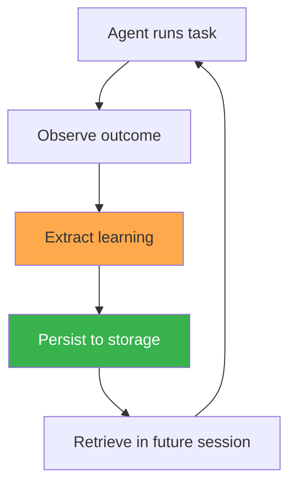
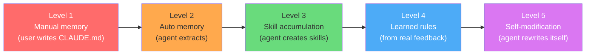

# 自我进化全景

本书涵盖的每一个生产级 Agent 都实现了同一个循环的某种变体：



区别在于**存什么**、**存在哪**、**怎么取**，以及**什么时候触发**。

本章勾勒截至 2026 年 5 月的完整产品全景，提炼每个系统所采用的五种机制，并把每个产品放到成熟度光谱上——从手动记忆文件到实验性自我修改。

---

## 产品全景（2026 年 5 月）

十个生产级 Agent，十种让 Agent 学会学习的策略。以下是它们目前的状态：

| 产品 | 记忆文件 | 自动学习 | 技能系统 | 学习规则 | 自我验证 |
|---------|-----------|---------------|-------------|---------------|-------------------|
| Claude Code | `CLAUDE.md` + `~/.claude/projects/` 中的自动记忆 | 是（从会话中自动提取记忆） | `.claude/skills/*.md` | 否（已提议） | 压缩 + `init.sh` |
| Cursor | `.cursor/rules/` + `AGENTS.md` | 是（持续学习插件） | `.cursor/skills/` | 是（Bugbot：44K+ 规则，110K 仓库） | LSP + 沙箱 |
| Codex | `AGENTS.md` | 是（Chronicle 环境记忆 + 记忆预览） | 通过插件实现技能 | 否 | 沙箱 + hook |
| Hermes | `MEMORY.md` + `~/.hermes/skills/` | 是（任务完成后自动创建技能） | `SKILL.md` (agentskills.io) | 否 | 技能中的自测试 |
| OpenClaw | `MEMORY.md` | 是（Dream 整合） | 13K+ ClawHub 技能 | 通过 self-improving-agent 技能 | 依赖于技能 |
| Copilot | Agent 式记忆（代码引用，跨 Agent） | 是（从代码库推断，引用验证） | 否 | 否（`copilot-instructions.md` 手动） | 引用验证 |
| Gemini CLI | `GEMINI.md`（4 层分级） | 是（从空闲会话脚本提取自动记忆） | 是（Agent 技能 + `skill-creator`） | 否 | 否 |
| Windsurf | `~/.codeium/windsurf/memories/` | 是（自动生成，约 48 小时索引周期） | 否 | 通过 `.windsurf/rules/` | 否 |
| Devin | 内部 wiki（DeepWiki）+ 持久化记忆 | 是（跨会话持久化记忆） | 否 | 否 | 是（自我验证 + 自动修复 + Auto Triage） |
| Manus | 内部上下文 | 否（框架级迭代） | 否 | 否 | 规划器/验证器 Agent |

这张表有三个关键信息：

1. **每个产品都有某种形式的持久化记忆。** 具体格式不同——markdown 文件、JSON 存储、内部数据库——但没有哪个 Agent 是每次会话从零开始的。Devin 曾是最显著的例外，已于 2026 年 5 月上线持久化记忆。
2. **自动学习已成为新的标配。** 十个产品中有九个能在用户无感知的情况下从会话中提取经验。一年前只有 Hermes 做到了这一点。2026 年 5 月集中上线的更新——Devin 的持久化记忆、Codex 的 Chronicle、Gemini CLI 的自动记忆——补上了大部分空白。
3. **技能系统在扩散，但学习规则仍然稀缺。** 四个产品现在有正式的技能库——Gemini CLI 于 2026 年加入，带来了 Agent 技能系统和 `skill-creator` 技能。只有一个——Cursor——在大规模运用学习规则。

---

## 五种机制

每个产品用到以下五种机制中的一种或多种。这不是凭空构造的分类——而是通读十个系统的源代码、文档和产品行为后提炼出的模式。

### 1. 文件系统记忆

会话启动时加载的 markdown 文件。Agent 读取文件、遵循其中的指令，在某些产品中还会回写更新。

| 产品 | 文件 | 谁来写 | 发现逻辑 |
|---------|---------|-----------|-----------------|
| Claude Code | `CLAUDE.md`、`~/.claude/CLAUDE.md` | 人类 + Agent | 从 CWD 向上遍历，每文件 4K，总计 12K |
| Cursor | `.cursor/rules/*.mdc`、`AGENTS.md` | 仅人类 | Glob 匹配 + `alwaysApply` 标志 |
| Codex | `AGENTS.md` | 人类 | 项目根目录的固定路径 |
| Hermes | `MEMORY.md`、`USER.md` | Agent | 相对于数据目录的固定路径 |
| OpenClaw | `MEMORY.md`、每日笔记 | Agent + Dreaming | 固定路径，每次会话生成每日笔记 |
| Copilot | `copilot-instructions.md` | 人类 | 项目根目录 |
| Gemini CLI | `GEMINI.md`（4 层） | 人类 + 记忆管理器 + 自动记忆 | `./GEMINI.md` → 子目录 `GEMINI.md` → 私有 `MEMORY.md` → `~/.gemini/GEMINI.md` |
| Windsurf | `~/.codeium/windsurf/memories/` | Agent（自动生成） | 目录扫描，约 48 小时索引周期 |

这是最普遍的机制，所有产品都支持。关键差异在三个维度：谁来写（人类、Agent 还是两者协作）、如何发现文件（向上遍历、固定路径还是 glob），以及预算上限是多少。

Claude Code 的做法——从 CWD 向上遍历，每文件 4K、总计 12K token——是设计得最精细的。Gemini CLI 现在是层级最丰富的：4 层 markdown 系统（`./GEMINI.md` → 子目录文件 → 私有 `MEMORY.md` → 全局 `~/.gemini/GEMINI.md`），外加一个自动记忆提取器，能从空闲会话脚本中蒸馏可复用技能。Cursor 只允许人类编写规则文件并附带激活条件——控制力最强。

### 2. 自动学习

Agent 从会话中自动提取经验，用户不需要做任何操作。这是区分"支持记忆"和"主动建构记忆"的分水岭。

| 产品 | 触发条件 | 存储内容 | 存储位置 |
|---------|---------|-----------------|-------|
| Claude Code | 会话结束（自动记忆） | 用户偏好、项目模式 | `~/.claude/projects/<hash>/` |
| Cursor | 持续学习插件事件 | 代码模式、lint 规则 | 内部索引管道 |
| Windsurf | 后台进程（约 48 小时周期） | 代码模式、项目上下文 | `~/.codeium/windsurf/memories/` |
| Copilot | 打开仓库时的代码库分析 | 代码规范、架构模式 | Agent 式记忆（代码引用） |
| Gemini CLI | 从空闲会话脚本提取自动记忆 + 记忆管理器 | 可复用技能、关键事实、偏好 | `GEMINI.md` 更新，`/memory inbox` 审查 |
| Codex | Chronicle（环境屏幕捕获，需用户授权）+ 记忆预览 | 应用上下文、工作流模式、代码模式 | 专用 SQLite 数据库 |
| Devin | 跨会话持久化记忆 | 项目上下文、调试模式、团队惯例 | 内部持久化存储 |
| Hermes | 15 次调用检查点 + 任务完成 | 技能、记忆事实、用户偏好 | `MEMORY.md`、`SKILL.md` 文件 |
| OpenClaw | Dreaming 过程（空闲时整合） | 整合后的事实、清理过期数据 | `MEMORY.md`（重写） |

核心设计问题：**学习在什么时候发生？**

- **Hermes** 在会话进行中学习（每 15 次工具调用触发一次）——能在模式还"热乎"的时候捕获，但要消耗 token 做自我评估。
- **Claude Code** 在会话结束时学习——更省 token，但会遗漏那些跨多个会话、用户又没有显式纠正的模式。
- **OpenClaw** 在空闲时段学习（Dreaming）——把学习和任务执行解耦，但依赖空闲窗口。
- **Gemini CLI** 从空闲会话脚本中学习（自动记忆）——和 Dreaming 类似，但提取的是技能而非整合后的事实，并通过 `/memory inbox` 让人审查。
- **Codex** 现在通过 Chronicle 进行环境学习——用户授权后捕获屏幕，从应用上下文而非仅编码会话中构建记忆。这是所有生产级 Agent 中学习面最广的。
- **Devin** 在 2026 年 5 月跨过了重要门槛，上线了跨会话持久化记忆——此前是唯一没有自动学习的主要 Agent。
- **Windsurf** 按后台定时器学习（约 48 小时周期）——最省心，但延迟也最大。

### 3. 技能库

以结构化文档或代码形式存储的可复用流程，在需要时通过搜索检索，而非一次性全部加载。技能系统背后的关键洞察：**事实和流程是两码事**。记忆存储事实（"这个项目用 pnpm"），技能存储流程（"如何通过 7 步把这个项目部署到生产环境"）。

| 产品 | 格式 | 存储 | 发现方式 | 数量 |
|---------|--------|---------|-----------|-------|
| Hermes | `SKILL.md`（agentskills.io 标准） | `~/.hermes/skills/` | 基于名称 + 描述的 FTS5 搜索 | 200+ 内置 |
| OpenClaw | agentskills.io + ClawHub 市场 | 本地 + ClawHub CDN | FTS5 + 依赖图 | ClawHub 上 13K+ |
| Claude Code | `.claude/skills/*.md` + 插件市场 | 项目目录 + 市场 | 名称 + 描述匹配 | 用户创建 + 2,810+ 社区技能 |
| Cursor | `.cursor/skills/` | 项目目录 | Glob + 描述匹配 | 用户创建 |
| Gemini CLI | Agent 技能（基于 markdown） | 项目 + 用户目录 | 技能名称匹配 | 内置 + 通过 `skill-creator` 用户创建 |

**agentskills.io 标准**（Hermes 和 OpenClaw 共用）是最成熟的格式——YAML frontmatter 承载元数据，渐进式披露控制加载粒度（列表 100 token → 完整内容 800 token → 特定段落 300 token），还有一个验证段落告诉 Agent 如何确认技能是否生效。

Claude Code 的技能生态系统在 2026 年 5 月迎来爆发。官方插件市场（`anthropics/claude-plugins-official`）于 5 月 22 日上线，社区仓库已积累 2,810+ 技能和 425+ 插件。插件可以捆绑技能、Agent、hook、MCP 服务器和斜杠命令。hook 系统（`SessionStart`、`PreToolUse`、`PostToolUse`、`MessageDisplay`）让技能不仅能提供信息，还能强制执行工作流纪律。

Gemini CLI 的 Agent 技能系统（2026 年 1 月推出，5 月已完全成熟）走了一条不同的路：`skill-creator` 技能让 Agent 从成功的任务模式中生成新技能，自动记忆则从空闲会话脚本中提取可复用技能。Gemini CLI 由此形成了从执行 → 提取 → 技能创建的闭环。

Cursor 也支持类似技能的文件，但缺少渐进式披露和验证机制。与其说是结构化技能，不如说更像"加长版规则"。

### 4. 学习规则

从真实反馈信号中生成的规则——不是人类手写的，不是 Agent 自我反思产出的，而是从大量真实用户行为中统计推导出的。

**Cursor Bugbot** 是唯一在生产中大规模运行此机制的系统：

```
Input signals:
  - 44K+ rules in the database
  - Derived from 110K+ repositories
  - Signals: user reactions (👍/👎), reply patterns,
    human code review outcomes, CI/CD results

Example learned rule:
  "When generating TypeScript code that uses zod schemas,
   always import z from 'zod' — do not use require().
   Confidence: 0.94
   Source: 8,200 repos with zod, 94% use import syntax"
```

这跟 Claude Code 的 `CLAUDE.md`（人类编写的项目上下文）或 Hermes 的 `MEMORY.md`（Agent 提取的会话事实）有本质区别。Bugbot 规则是从数千个仓库的生产行为中统计推导出来的，代表了 Cursor 整个用户群体的集体编码模式。

目前没有其他生产级 Agent 做到这一点。这需要规模（日均数百万次交互才能产出足够信号）和基础设施（一整条规则提取、验证和分发的管道）。对大多数做 Agent 的团队来说，这条路还很远。

### 5. 自我验证

Agent 在宣布完成之前，先测试自己的成果。这是防止 Agent 交出"看着像那回事、实则有问题"的输出的质量关卡。

| 产品 | 方法 | 范围 | 最大迭代次数 |
|---------|--------|-------|---------------|
| Devin | 运行项目测试套件，分析失败，修复，重新测试 | 完整测试套件 | 5 |
| Cursor | LSP 诊断（类型错误、lint 错误）+ Agent 自我纠正 | 每次编辑 | 直到无错误 |
| Claude Code | 作为任务流程的一部分主动运行测试 | 可配置 | 可配置 |
| Manus | 规划器 Agent 设定验收标准，验证器 Agent 检查 | 每个任务阶段 | 每阶段 |
| Hermes | SKILL.md 中的验证段落（取决于技能定义） | 每次技能执行 | 技能定义 |

Devin 最系统：写代码 → 跑测试 → 分析失败 → 修复 → 重新测试，最多 5 轮迭代。这和一个严谨的人类开发者的工作流完全一致。

Cursor 最轻量：LSP 诊断实时推送错误，Agent 把它当作正常上下文来处理。没有专门的验证设施——跟人类开发者看到的编译器和 linter 输出一样。

Manus 在架构上最独特：独立的规划器和验证器 Agent 使用不同的模型、不同的上下文窗口，硬性隔离了"决定做什么"和"检查做得对不对"。

---

## 成熟度光谱

自我进化并非一视同仁。各产品处于不同的成熟度水平：



| 级别 | 发生了什么 | 处于此级别的产品 |
|-------|-------------|----------------------|
| **L1** 手动记忆 | 用户编写上下文文件，Agent 读取。学习完全由人类驱动。 | 全部（所有产品都支持手动上下文文件） |
| **L2** 自动记忆 | Agent 从会话中提取事实并持久化，用户不需要做任何事。 | Claude Code、Cursor、Windsurf、Copilot、Gemini CLI、Codex、Devin |
| **L3** 技能积累 | Agent 创建可复用流程——不只是事实，还有多步骤工作流。 | Hermes Agent、OpenClaw（ClawHub）、Claude Code（`.claude/skills/`）、Gemini CLI（自动记忆 + `skill-creator`） |
| **L4** 学习规则 | 从大规模真实反馈中统计推导出的规则，而非单次会话的产物。 | Cursor Bugbot（唯一大规模运行此机制的生产系统） |
| **L5** 自我修改 | Agent 修改自身的能力、工具或架构。 | OpenClaw（capability-evolver、self-evolve 技能）——实验性，附有安全警告 |

**各产品目前所处的位置：**

```
Level 1 ██████████  全部 10 个产品
Level 2 ███████     Claude Code、Cursor、Windsurf、Copilot、Gemini CLI、Codex、Devin
Level 3 ████        Hermes、OpenClaw、Claude Code、Gemini CLI
Level 4 █           Cursor（Bugbot）
Level 5 ░           OpenClaw（实验性——尚不稳定）
```

从 L1 到 L2 的跨越发生在 2025 年，如今已近乎普及——只有 Manus 没有自动学习（作为框架级系统，这是有意的设计）。从 L2 到 L3 的跨越正在加速：Gemini CLI 于 2026 年初加入，自动记忆可从空闲会话脚本中提取技能，`skill-creator` 技能则闭合了回路。2026 年 5 月集中上线的一波更新（Devin 持久化记忆、Codex Chronicle、Gemini CLI 自动记忆）说明 L2 已是入门门槛。L4 需要只有 Cursor 才有的用户规模。L5 是最激进的探索，伴随着严重的安全隐患。

---

## 什么决定了产品的级别？

三个因素：

### 1. 架构策略

每个产品都在"智能放在哪里"这件事上做了根本性的取舍：

| 策略 | 产品 | 影响 |
|-----|----------|------------|
| 智能在**模型**中 | Devin、Manus | 模型越强，Agent 越强。重点投入 prompt 工程和上下文工程。 |
| 智能在**平台**中 | Cursor、Copilot | 基础设施越好，Agent 越强。重点投入索引、搜索和检索。 |
| 智能在 **Agent 循环**中 | Hermes、OpenClaw、Claude Code | 循环越好，Agent 越强。重点投入自我评估、技能创建和记忆。 |

这三者并非互斥——Claude Code 就把 Agent 循环的智能和平台能力结合了起来。但主要的策略方向决定了产品能走哪条进化路线。

### 2. 反馈信号的获取

学习规则（L4）需要大规模反馈数据。Cursor 有——日均 4 亿+ AI 请求、用户反应、代码审查、CI/CD 结果。大多数产品没有这个量级的数据。所以只有一个产品跑在 L4。

### 3. 风险容忍度

自我修改（L5）威力大但风险也大。一个能重写自身工具和能力的 Agent，可以快速提升——也可能灾难性地崩溃。OpenClaw 的 self-evolve 技能文档里带有明确的安全警告。其他产品都没有选择承担这种风险。

---

## 横切模式

有四个模式跨越多种机制、贯穿多个产品反复出现：

### 模式 A：静态/动态分离

每个认真管理上下文的产品，都把很少变化的内容和频繁变化的内容分开了：

| 产品 | 静态（可缓存/稳定） | 动态（每轮更新） |
|---------|----------------------|-------------------|
| Claude Code | 身份 + 工具 + `CLAUDE.md`（位于 `__SYSTEM_PROMPT_DYNAMIC_BOUNDARY__` 之上） | 会话上下文、git 状态、任务指令 |
| Cursor | 系统提示 + 工具定义 + 始终激活的规则（高 Priompt 优先级） | 搜索结果、对话历史（低优先级） |
| Manus | 系统提示 + 基础能力（KV-cache 稳定） | 工具集（按阶段遮蔽）、任务状态 |
| Codex | 系统提示 + `AGENTS.md` 内容 | 对话 + 压缩摘要 |

背后的逻辑是经济账：静态内容能命中 KV-cache，动态内容导致缓存失效。把 `CLAUDE.md` 放进静态前缀，意味着项目记忆会被缓存——Anthropic 对缓存 token 的收费更低。

### 模式 B：渐进式披露

不要一股脑全加载。先加载元数据，按需加载完整内容：

```
Hermes skills:    200+ skills × 100 tokens (names) = 20K always loaded
                  1 activated skill × 800 tokens = 800 loaded on demand
                  Savings: 99%+

Cursor search:    100K files × embedding lookup = milliseconds
                  5-20 relevant chunks loaded = 5-20K tokens
                  Savings: load 0.02% of codebase

Claude Code:      All skill names + descriptions always in context
                  1-3 full skills loaded per task
```

凡是扩展到真实场景的产品，都实现了某种形式的渐进式披露。

### 模式 C：返回前验证

2025-2026 年的趋势非常清晰：会检查自己工作的 Agent 比不检查的强。

```
2024: Agent generates → returns to user → user finds errors
2025: Agent generates → infrastructure validates → returns to user
2026: Agent generates → agent verifies → agent fixes → returns to user
```

Cursor 的 shadow workspace（2024，基础设施验证）已被基于 LSP 的自我验证（2025，Agent 自己验证）取代。Devin 的自我验证循环从诞生之日起就是核心功能。Claude Code 现在会在返回结果前主动跑测试。

Copilot 在 2026 年 5 月引入了一种新的验证模式：**带引用的记忆实时验证**。存储的事实附带源代码引用，Agent 在使用前会对照当前代码库验证事实是否仍然成立。这不是对*输出*的自我验证，而是对*记忆*的自我验证——Agent 检查自己"记住"的东西是否还是真的。跨 Agent 记忆（代码审查 Agent 和编码 Agent 共享事实）扩大了验证范围。

方向很明确：把验证前移，让 Agent 对正确性负责，用跟人类开发者一样的工具。

### 模式 D：社区驱动的方法论

2026 年 5 月出现了一种新模式，无法简单归入记忆、技能或学习规则的范畴：**第三方方法论跨 Agent 强制执行**。

**Superpowers**（`obra/superpowers`，213K+ GitHub stars，476K+ 安装量）是典型代表。它不是记忆系统，不是技能库——而是一个工作流纪律层，强制 Agent 走完结构化开发流程：头脑风暴 → 设计审批 → git worktree → 编写计划 → 子 Agent 驱动开发（两阶段审查）→ 严格 TDD（RED-GREEN-REFACTOR）→ 代码审查 → 收尾/合并/清理。

核心机制：
- **SessionStart hook** 在会话初始化时强制执行技能——Agent 无法跳过。
- **"1% 规则"**：只要有 1% 的可能性某个技能适用，Agent 就必须调用它。这把常见的"按需加载"模式反转为"除非你能证明不相关，否则必须加载"。
- **跨平台可移植性**：支持 Claude Code、Codex CLI、Cursor、Gemini CLI、Copilot CLI、OpenCode 和 Factory Droid。同一份方法论文件可以约束不同平台上的不同 Agent。
- 技能可以在 frontmatter 中设置 `disallowed-tools`，限制 Agent 能使用的工具——方法论即能力约束。

这代表了一种新的进化机制：社区编写的纪律，既不来自基座模型，也不来自 Agent 自身的学习，更不来自产品平台。它由第三方实践者打包，将自己的工程实践转化为可执行的约束。Claude Code 的插件生态（2,810+ 技能、425+ 插件）和 hook 系统（`SessionStart`、`PreToolUse`、`PostToolUse`、`MessageDisplay`）提供了基础设施。Snyk 审计发现 13% 的 agent-skills 包存在严重安全缺陷——这种模式的信任与安全隐患尚未解决。

---

## 缺失的拼图

两种模式**尚未**在生产中完全实现，但 2026 年 5 月都取得了显著进展：

### 跨用户学习

目前没有生产级 Agent 能自动把一个用户的经验应用到另一个用户的会话中。每个用户的 `CLAUDE.md` 和 `MEMORY.md` 都是私有的。

但这个差距正在缩小。Claude Code 的插件生态（截至 2026 年 5 月有 2,810+ 技能、425+ 插件）和 Superpowers（476K+ 安装量）等跨平台框架，代表了一种**显式的、社区中介的跨用户学习**——实践者把成功模式编码为技能，通过市场共享。Copilot 的跨 Agent 记忆（代码审查 Agent 和编码 Agent 在单用户范围内共享事实）是另一步推进，但仍限于用户私有。

**为什么还没有完全自动化：** 隐私（用户不希望自己的工作流被共享）、安全（一个用户的方案可能搞坏另一个用户的环境）、责任归属（共享技能出了问题，算谁的？）。Cursor Bugbot 在方向上最接近——跨仓库聚合信号——但学到的是通用编码模式，而非特定用户的工作流。

### 自主实验

Hermes 和 OpenClaw 能发现能力短板，但实验环节仍局限在当前会话——Agent 在当前对话中尝试。没有任何生产系统在后台跑实验："我注意到自己处理 Kubernetes 配置时老出问题。让我今晚拿一些示例配置练习，把经验整理成技能。"

这个空白正在部分填补。Codex 的 Chronicle 在没有 Agent 显式操作的情况下通过屏幕捕获构建环境记忆。Gemini CLI 的自动记忆从空闲会话脚本中提取技能——不算实验，但属于从历史行为中无监督学习。Devin 的持久化记忆意味着一个会话中发现的模式可以延续到后续会话，减少重复学习的需要。Agentic Harness Engineering 论文（arXiv:2604.25850）展示了自动化框架进化——通过 10 轮迭代在 Terminal-Bench 2 上从 69.7% 提升到 77.0%——方法是进化 prompt、工具和中间件，同时保持基座模型不变。这还没有出现在已上线的消费级产品中，但指明了方向。

**为什么还没有完全实现：** 成本（跑实验要消耗 token）、安全（无人看管的 Agent 做实验有风险）、度量（没有人类评判，怎么知道实验成不成功？）。

真正的跨用户学习和自主实验仍然是未解问题。第 12 章会探讨可能的发展方向。

---

## 阅读本书的其余部分

第一部分接下来的章节会深入拆解三个技术细节最丰富的系统：

- **第 2 章（Claude Code）：** 完整的记忆系统、`SystemPromptBuilder`、Agent SDK hook、长时运行 Agent 框架，以及反蒸馏对抗措施——全部基于泄露的 512K 行源代码。
- **第 3 章（Cursor）：** 用于增量索引的 Merkle 树、Priompt 优先级编译、推测性编辑、shadow workspace 事后分析，以及 Bugbot 的学习规则。
- **第 4 章（Hermes）：** 闭环学习系统、`SKILL.md` 格式、基于 FTS5 的渐进式披露、Honcho 用户记忆集成，以及 Atropos RL 管道。

每章结构相同：先是架构概览，然后是驱动进化的具体机制，附有来自真实系统的代码。

第 11 章提供实战手册，帮你在自己的 Agent 中落地各个成熟度级别。
