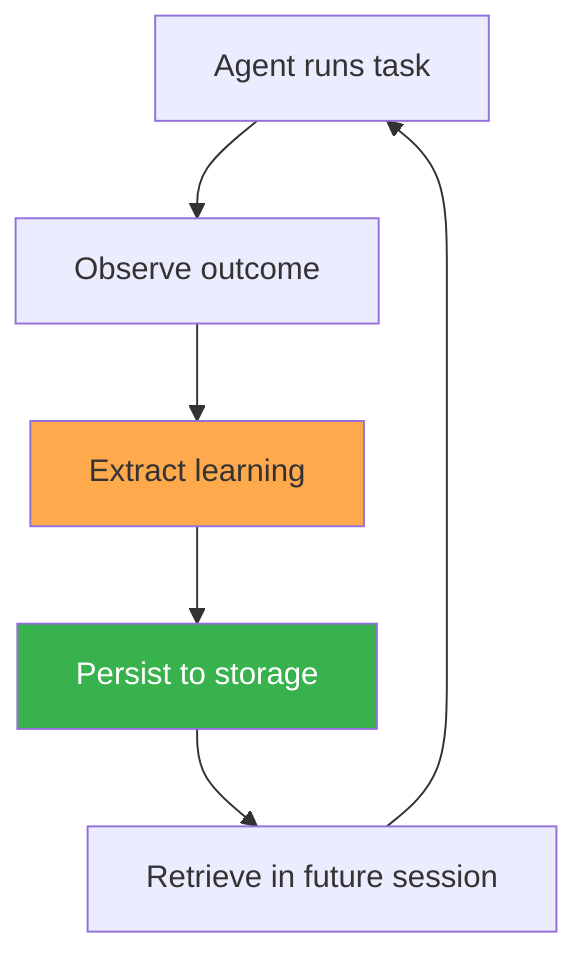
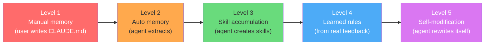

# 自我进化全景

本书涵盖的每一个生产级 Agent 都实现了某种形式的相同循环：



差异在于**什么**被存储、**在哪里**存储、**如何**检索，以及**何时**触发。

本章描绘截至 2026 年 4 月的完整产品全景，提炼每个系统使用的五种机制，并将每个产品置于成熟度光谱上——从手动记忆文件到实验性自我修改。

---

## 产品全景（2026 年 4 月）

十个生产级 Agent。十种关于如何让 Agent 学习的不同策略。以下是它们的现状：

| 产品 | 记忆文件 | 自动学习 | 技能系统 | 学习规则 | 自我验证 |
|---------|-----------|---------------|-------------|---------------|-------------------|
| Claude Code | `CLAUDE.md` + `~/.claude/projects/` 中的自动记忆 | 是（从会话中自动提取记忆） | `.claude/skills/*.md` | 否（已提议） | 压缩 + `init.sh` |
| Cursor | `.cursor/rules/` + `AGENTS.md` | 是（持续学习插件） | `.cursor/skills/` | 是（Bugbot：44K+ 规则，110K 仓库） | LSP + 沙箱 |
| Codex | `AGENTS.md` | 是（记忆预览） | 通过插件实现技能 | 否 | 沙箱 |
| Hermes | `MEMORY.md` + `~/.hermes/skills/` | 是（任务完成后自动创建技能） | `SKILL.md` (agentskills.io) | 否 | 技能中的自测试 |
| OpenClaw | `MEMORY.md` | 是（Dream 整合） | 13K+ ClawHub 技能 | 通过 self-improving-agent 技能 | 依赖于技能 |
| Copilot | Agent 式记忆（代码引用） | 是（从代码库推断） | 否 | 否（`copilot-instructions.md` 手动） | 引用验证 |
| Gemini CLI | `GEMINI.md` | 是（记忆管理器子 Agent） | 否 | 否 | 否 |
| Windsurf | `~/.codeium/windsurf/memories/` | 是（自动生成，约 48 小时索引周期） | 否 | 通过 `.windsurf/rules/` | 否 |
| Devin | 内部 wiki（DeepWiki） | 否（手动） | 否 | 否 | 是（自我验证 + 自动修复） |
| Manus | 内部上下文 | 否（框架级迭代） | 否 | 否 | 规划器/验证器 Agent |

从这张表中可以看出三个关键点：

1. **每个产品都有某种形式的持久化记忆。** 文件格式各不相同——markdown 文件、JSON 存储、内部数据库——但这些 Agent 没有一个在每次会话时从零开始。
2. **自动学习已成为新的默认选项。** 十个产品中有六个现在无需用户操作即可从会话中提取学习内容。一年前，只有 Hermes 能做到这一点。
3. **技能系统和学习规则仍然稀缺。** 只有三个产品拥有正式的技能库。只有一个——Cursor——大规模运行学习规则。

---

## 五种机制

每个产品使用以下五种机制中的一种或多种。这不是从第一性原理发明的分类体系——而是通过阅读所有十个系统的源代码、文档和已发布行为提炼出的模式。

### 1. 文件系统记忆

在会话开始时加载的 markdown 文件。Agent 读取它们，遵循其中的指令，并（在某些产品中）回写这些文件。

| 产品 | 文件 | 谁来写 | 发现逻辑 |
|---------|---------|-----------|-----------------|
| Claude Code | `CLAUDE.md`、`~/.claude/CLAUDE.md` | 人类 + Agent | 从 CWD 向上遍历，每文件 4K，总计 12K |
| Cursor | `.cursor/rules/*.mdc`、`AGENTS.md` | 仅人类 | Glob 匹配 + `alwaysApply` 标志 |
| Codex | `AGENTS.md` | 人类 | 项目根目录的固定路径 |
| Hermes | `MEMORY.md`、`USER.md` | Agent | 相对于数据目录的固定路径 |
| OpenClaw | `MEMORY.md`、每日笔记 | Agent + Dreaming | 固定路径，每次会话生成每日笔记 |
| Copilot | `copilot-instructions.md` | 人类 | 项目根目录 |
| Gemini CLI | `GEMINI.md` | 人类 + 记忆管理器 | 项目根目录 + `~/.gemini/GEMINI.md` |
| Windsurf | `~/.codeium/windsurf/memories/` | Agent（自动生成） | 目录扫描，约 48 小时索引周期 |

这是最通用的机制。每个产品都支持它。差异在于谁来写（人类 vs. Agent vs. 两者兼有）、如何发现文件（向上遍历 vs. 固定路径 vs. glob），以及适用什么预算限制。

Claude Code 的方法——从 CWD 向上遍历并强制执行每文件 4K、总计 12K token 的预算——是最精心设计的。Gemini CLI 的方法——由记忆管理器子 Agent 决定持久化什么——是最自主的。Cursor 的方法——仅人类编写并带有激活条件——是最受控的。

### 2. 自动学习

Agent 在用户无需任何操作的情况下从会话中提取学习内容。这是将*支持*记忆的产品与*构建*记忆的产品区分开来的机制。

| 产品 | 触发条件 | 存储内容 | 存储位置 |
|---------|---------|-----------------|-------|
| Claude Code | 会话结束（自动记忆） | 用户偏好、项目模式 | `~/.claude/projects/<hash>/` |
| Cursor | 持续学习插件事件 | 代码模式、lint 规则 | 内部索引管道 |
| Windsurf | 后台进程（约 48 小时周期） | 代码模式、项目上下文 | `~/.codeium/windsurf/memories/` |
| Copilot | 打开仓库时的代码库分析 | 代码规范、架构模式 | Agent 式记忆（代码引用） |
| Gemini CLI | 记忆管理器子 Agent 的决策 | 关键事实、偏好、项目上下文 | `GEMINI.md` 更新 |
| Codex | 记忆预览（实验性） | 任务上下文、代码模式 | 内部记忆存储 |
| Hermes | 15 次调用检查点 + 任务完成 | 技能、记忆事实、用户偏好 | `MEMORY.md`、`SKILL.md` 文件 |
| OpenClaw | Dreaming 过程（空闲时整合） | 整合的事实、修剪过期数据 | `MEMORY.md`（重写） |

关键设计问题：**学习何时发生？**

- **Hermes** 在会话中期学习（每 15 次工具调用）——这能在模式新鲜时捕获它们，但需要消耗 token 进行自我评估。
- **Claude Code** 在会话结束时学习——这更经济，但会遗漏跨多个会话且没有用户显式纠正的模式。
- **OpenClaw** 在空闲时间学习（Dreaming）——这将学习与任务执行解耦，但需要空闲期。
- **Windsurf** 按后台定时器学习（约 48 小时）——这是最省心的，但延迟也最大。

### 3. 技能库

以结构化文档或代码形式存储的可复用流程。在相关时通过搜索检索，而非一次性全部加载。每个技能系统背后的关键洞察：**事实和流程是不同的**。记忆存储事实（"这个项目使用 pnpm"）。技能存储流程（"如何通过 7 个步骤将此项目部署到生产环境"）。

| 产品 | 格式 | 存储 | 发现方式 | 数量 |
|---------|--------|---------|-----------|-------|
| Hermes | `SKILL.md`（agentskills.io 标准） | `~/.hermes/skills/` | 基于名称 + 描述的 FTS5 搜索 | 200+ 内置 |
| OpenClaw | agentskills.io + ClawHub 市场 | 本地 + ClawHub CDN | FTS5 + 依赖图 | ClawHub 上 13K+ |
| Claude Code | `.claude/skills/*.md` | 项目目录 | 名称 + 描述匹配 | 用户创建 |
| Cursor | `.cursor/skills/` | 项目目录 | Glob + 描述匹配 | 用户创建 |

**agentskills.io 标准**（Hermes 和 OpenClaw 共享）是最成熟的格式——YAML frontmatter 包含元数据，渐进式披露（列表 100 token → 完整内容 800 token → 特定部分 300 token），以及一个验证部分，告诉 Agent 如何测试技能是否生效。

Claude Code 和 Cursor 支持类似技能的文件，但没有渐进式披露或验证基础设施。它们更接近于"长格式规则"而非结构化技能格式。

### 4. 学习规则

从真实世界的反馈信号中生成的规则——不是由人类编写的，不是由 Agent 通过自我反思生成的，而是从实际用户行为中大规模推导出的。

**Cursor Bugbot** 是唯一大规模运行此机制的生产系统：

```
Input signals:
  - 44K+ rules in the database
  - Derived from 110K+ repositories
  - Signals: user reactions (👍/👎), reply patterns,
    human code review outcomes, CI/CD results

Example learned rule:
  "When generating TypeScript code that uses zod schemas,
   always import z from 'zod' — do not use require().
   Confidence: 0.94
   Source: 8,200 repos with zod, 94% use import syntax"
```

这与 Claude Code 的 `CLAUDE.md`（人类编写的项目上下文）或 Hermes 的 `MEMORY.md`（Agent 提取的会话事实）有根本区别。Bugbot 规则是从数千个仓库的生产行为中统计推导出来的。它们代表了 Cursor 用户群体的集体编码模式。

没有其他生产级 Agent 具备这一能力。它需要规模（每天数百万次交互以产生信号）和基础设施（一条用于提取、验证和分发规则的管道）。对于大多数构建 Agent 的团队来说，这种机制仍是一个远景目标。

### 5. 自我验证

Agent 在声明完成之前测试自己的工作。这是防止 Agent 返回看似合理但实际有问题的输出的质量控制循环。

| 产品 | 方法 | 范围 | 最大迭代次数 |
|---------|--------|-------|---------------|
| Devin | 运行项目的测试套件，分析失败，修复，重新测试 | 完整测试套件 | 5 |
| Cursor | LSP 诊断（类型错误、lint 错误）+ Agent 自我纠正 | 每次编辑 | 直到无错误 |
| Claude Code | 作为任务工作流的一部分主动运行测试 | 可配置 | 可配置 |
| Manus | 规划器 Agent 设定验收标准，验证器 Agent 进行检查 | 每个任务阶段 | 每阶段 |
| Hermes | SKILL.md 中的验证部分（依赖于技能） | 每次技能执行 | 技能定义 |

Devin 的方法最为系统化：编写代码 → 运行项目的测试套件 → 分析失败 → 修复 → 重新测试，最多 5 次迭代。这与一个谨慎的人类开发者遵循的循环相同。

Cursor 的方法最为轻量：LSP 诊断实时传播错误，Agent 将其作为正常上下文的一部分看到。没有特殊的验证基础设施——只是人类开发者会看到的同样的编译器和 linter 输出。

Manus 的方法在架构上最为独特：独立的规划器和验证器 Agent 使用不同的模型和不同的上下文窗口，在"决定做什么"和"检查是否做对了"之间强制分离。

---

## 成熟度光谱

并非所有自我进化都是等价的。产品处于不同的成熟度水平：



| 级别 | 发生了什么 | 处于此级别的产品 |
|-------|-------------|----------------------|
| **L1** 手动记忆 | 用户编写上下文文件。Agent 读取它们。学习完全由人类驱动。 | 全部（每个产品都支持手动上下文文件） |
| **L2** 自动记忆 | Agent 从会话中提取事实并持久化。用户无需做任何事情。 | Claude Code、Cursor、Windsurf、Copilot、Gemini CLI、Codex |
| **L3** 技能积累 | Agent 创建可复用的流程——不仅是事实，还包括多步骤工作流。 | Hermes Agent、OpenClaw（ClawHub）、Claude Code（`.claude/skills/`） |
| **L4** 学习规则 | 从聚合的真实世界反馈中推导出的规则，而非来自单个会话。 | Cursor Bugbot（唯一大规模运行此机制的生产系统） |
| **L5** 自我修改 | Agent 修改自身的能力、工具或架构。 | OpenClaw（capability-evolver、self-evolve 技能）——实验性，有安全警告 |

**各产品当前所处的位置：**

```
Level 1 ██████████  全部 10 个产品
Level 2 ██████      Claude Code、Cursor、Windsurf、Copilot、Gemini CLI、Codex
Level 3 ███         Hermes、OpenClaw、Claude Code
Level 4 █           Cursor（Bugbot）
Level 5 ░           OpenClaw（实验性——尚不稳定）
```

从 L1 到 L2 的跨越发生在 2025 年——大多数主要产品现在已能自动提取记忆。从 L2 到 L3 的跨越是当前领域的前沿。L4 需要只有 Cursor 才具备的规模。L5 是最前沿的探索，具有严重的安全隐患。

---

## 什么决定了产品的级别？

三个因素：

### 1. 架构策略

每个产品都对智能存在于哪里做出了根本性的押注：

| 策略 | 产品 | 影响 |
|-----|----------|------------|
| 智能在**模型**中 | Devin、Manus | 更好的模型 = 更好的 Agent。投资于提示工程、上下文工程。 |
| 智能在**平台**中 | Cursor、Copilot | 更好的基础设施 = 更好的 Agent。投资于索引、搜索、检索。 |
| 智能在 **Agent 循环**中 | Hermes、OpenClaw、Claude Code | 更好的循环 = 更好的 Agent。投资于自我评估、技能创建、记忆。 |

这些并不互斥——Claude Code 将 Agent 循环智能与平台特性相结合。但主要的策略方向决定了产品支持何种进化。

### 2. 对反馈信号的获取

学习规则（L4）需要大规模的反馈。Cursor 拥有它——每天 4 亿+ AI 请求、用户反应、代码审查、CI/CD 结果。大多数产品没有。这就是为什么只有一个产品运行在 L4。

### 3. 风险容忍度

自我修改（L5）强大但危险。一个能重写自己工具或能力的 Agent 可以快速提升——或灾难性地崩溃。OpenClaw 的 self-evolve 技能在文档中附有明确的安全警告。没有其他产品选择接受这种风险。

---

## 横切模式

三种模式跨越多种机制和多个产品出现：

### 模式 A：静态/动态分离

每个认真管理上下文的产品都将很少变化的内容与经常变化的内容分离：

| 产品 | 静态（缓存/稳定） | 动态（每轮） |
|---------|----------------------|-------------------|
| Claude Code | 身份 + 工具 + `CLAUDE.md`（位于 `__SYSTEM_PROMPT_DYNAMIC_BOUNDARY__` 之上） | 会话上下文、git 状态、任务指令 |
| Cursor | 系统提示 + 工具定义 + 始终活跃的规则（高 Priompt 优先级） | 搜索结果、对话历史（低优先级） |
| Manus | 系统提示 + 基础能力（KV-cache 稳定） | 工具集（按阶段遮蔽）、任务状态 |
| Codex | 系统提示 + `AGENTS.md` 内容 | 对话 + 压缩摘要 |

原因在于经济性：静态内容获得 KV-cache 命中。动态内容导致缓存未命中。将 `CLAUDE.md` 放在静态前缀中意味着你的项目记忆被缓存——Anthropic 对缓存的 token 收费更低。

### 模式 B：渐进式披露

不要一次性加载所有内容。先加载元数据，按需加载完整内容：

```
Hermes skills:    200+ skills × 100 tokens (names) = 20K always loaded
                  1 activated skill × 800 tokens = 800 loaded on demand
                  Savings: 99%+

Cursor search:    100K files × embedding lookup = milliseconds
                  5-20 relevant chunks loaded = 5-20K tokens
                  Savings: load 0.02% of codebase

Claude Code:      All skill names + descriptions always in context
                  1-3 full skills loaded per task
```

每个扩展到超越玩具示例的产品都实现了某种形式的这种模式。

### 模式 C：返回前验证

2025-2026 年的趋势非常明确：检查自己工作的 Agent 优于不检查的 Agent。

```
2024: Agent generates → returns to user → user finds errors
2025: Agent generates → infrastructure validates → returns to user
2026: Agent generates → agent verifies → agent fixes → returns to user
```

Cursor 的 shadow workspace（2024，基础设施验证）被基于 LSP 的自我验证（2025，Agent 验证）所取代。Devin 的自我验证循环从发布起就是核心功能。Claude Code 现在在返回结果前主动运行测试。

方向是通用的：将验证前移，让 Agent 对正确性负责，使用与人类开发者相同的工具。

---

## 缺失的部分

两种模式**尚未**在生产中大规模实现：

### 跨用户学习

目前没有生产级 Agent 能从一个用户的经验中学习并应用到另一个用户的会话中。每个用户的 `CLAUDE.md` 和 `MEMORY.md` 文件都是私有的。ClawHub 的技能市场是最接近的——用户显式共享技能——但 Agent 不会自动提取和共享成功的模式。

**为什么缺失：** 隐私（用户不希望他们的工作流被共享）、安全（一个用户的解决方案可能会破坏另一个用户的设置）、以及责任归属（当共享的技能造成损害时，是谁的错？）。Cursor Bugbot 接近这一目标——它跨仓库聚合信号——但学习到的规则是通用的编码模式，而非用户特定的工作流。

### 自主实验

Hermes 和 OpenClaw 能检测能力差距，但实验步骤仍然是会话内的 Agent 行为——Agent 在当前对话中尝试。没有生产系统运行后台实验："我注意到我在 Kubernetes 配置方面有困难。让我今晚在一些示例配置上练习并创建技能。"

**为什么缺失：** 成本（运行实验消耗 token）、安全（无人监督的 Agent 实验有风险）、以及度量（没有人类评估，你如何知道实验是否成功？）。

OpenClaw 的 Dreaming 过程是向自主实验迈出的一步——它在空闲时间重组记忆。但真正的跨用户学习和自主实验仍然是开放问题。第 12 章探讨了这些可能的发展方向。

---

## 阅读本书的其余部分

第一部分的其余章节深入探讨三个技术最丰富的系统：

- **第 2 章（Claude Code）：** 完整的记忆系统、`SystemPromptBuilder`、Agent SDK 钩子、长时间运行的 Agent 框架，以及反蒸馏对抗措施——全部来自泄露的 512K 行源代码。
- **第 3 章（Cursor）：** 用于增量索引的 Merkle 树、Priompt 优先级编译、推测性编辑、shadow workspace 事后分析，以及 Bugbot 的学习规则。
- **第 4 章（Hermes）：** 闭环学习系统、`SKILL.md` 格式、基于 FTS5 的渐进式披露、Honcho 用户记忆集成，以及 Atropos RL 管道。

每章都遵循相同的结构：架构概述，然后是实现进化的具体机制，并附有实际系统的代码。

第 11 章提供了一本实战手册，帮助你在自己的 Agent 中实现各个成熟度级别。
