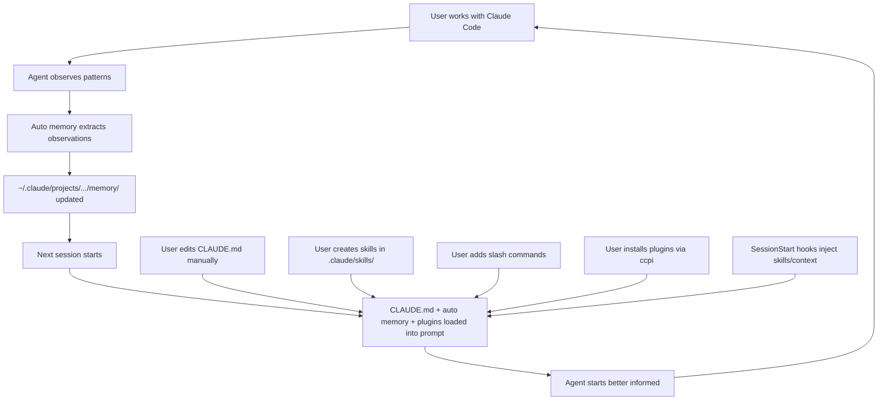

# Claude Code — 记忆、技能与泄露的内部实现

2026 年 3 月，Anthropic 照例更新了 `@anthropic-ai/claude-code` npm 包。但这次更新意外附带了一份完整的 source map——512,000 行 TypeScript，Claude Code 客户端的全部实现。

几小时内，社区就拿到了源代码。source map 一天内被撤下，但代码早已散布在数十个仓库和博客文章里，被反复分析和讨论。

本章基于这份泄露的源代码，并与 Anthropic 官方文档、博客文章和公开的 Claude Agent SDK 做了交叉验证。每个结论都能追溯到具体的代码路径、配置常量或已有文档。

---

## CLAUDE.md — 手动记忆层

CLAUDE.md 就是一个 markdown 文件——你自己创建，自己编写。Claude Code 在每次会话开始时读取它，把内容注入系统提示。机制就这么简单。

值得单独拿出来讲的是它的*层级结构*——Claude Code 不只加载一个文件，而是从多个位置加载一整条文件链，每个文件对应不同的作用域。

### 层级加载

```
Discovery order (all loaded at session start):

1. ~/.claude/CLAUDE.md              Global — your preferences across all projects
2. <project-root>/CLAUDE.md         Project — team-wide conventions (committed to git)
3. <cwd>/.claude/CLAUDE.md          Directory — subdirectory-specific context
4. .claude/CLAUDE.local.md          Personal — your local overrides (gitignored)
```

泄露源代码中 `SystemPromptBuilder` 的发现逻辑：

```typescript
async function discoverMemoryFiles(cwd: string): Promise<ClaudeMemoryFile[]> {
  const files: ClaudeMemoryFile[] = [];
  const seen = new Set<string>();

  // Walk upward from CWD, collecting project-scope files
  let current = cwd;
  while (true) {
    const claudeFile = path.join(current, 'CLAUDE.md');
    const dotClaudeFile = path.join(current, '.claude', 'CLAUDE.md');

    for (const candidate of [claudeFile, dotClaudeFile]) {
      if (!seen.has(candidate) && await fileExists(candidate)) {
        seen.add(candidate);
        const content = await readFile(candidate, 'utf-8');
        files.push({
          path: candidate,
          content: truncateToTokenBudget(content, 4096),
          scope: 'project',
          truncated: content.length > tokenToCharEstimate(4096),
        });
      }
    }

    const parent = path.dirname(current);
    if (parent === current) break;
    current = parent;
  }

  // User-scope: ~/.claude/CLAUDE.md
  const homeFile = path.join(os.homedir(), '.claude', 'CLAUDE.md');
  if (!seen.has(homeFile) && await fileExists(homeFile)) {
    const content = await readFile(homeFile, 'utf-8');
    files.push({
      path: homeFile,
      content: truncateToTokenBudget(content, 4096),
      scope: 'user',
      truncated: content.length > tokenToCharEstimate(4096),
    });
  }

  // Enforce total budget across all files
  return enforceGlobalBudget(files, 12288);
}
```

### Token 预算

| 约束 | 限制 | 超出时的处理 |
|-----------|-------|---------------------------|
| 单文件 | 4,096 token | 截断并提示：*"[truncated — file exceeds 4K token limit]"* |
| 所有文件总计 | 12,288 token | 最低优先级的文件被整体丢弃 |

这些限制在 `SystemPromptBuilder` 中是硬编码的。它们直接占用上下文窗口——CLAUDE.md 多用一个 token，Agent 能用于对话、工具调用和推理的空间就少一个 token。

### /init 命令

`/init` 命令为项目自动生成初始 CLAUDE.md：

```
/init
  → Scans project structure (package.json, pyproject.toml, Makefile, etc.)
  → Reads README.md, CONTRIBUTING.md
  → Identifies build system, test framework, linter
  → Generates CLAUDE.md with:
    - Build and test commands
    - Project structure overview
    - Detected conventions
```

生成的文件只是起点。真正的价值来自你后续不断添加的内容：架构决策、编码规范，以及 Agent 无法从代码库中自行推断的项目上下文。

### CLAUDE.md 中应该放什么

综合 Anthropic 文档和社区经验，最佳实践是：**控制在 50-200 行。**

```markdown
# CLAUDE.md

## Build & Test
- Run tests: `pytest tests/ -x --tb=short`
- Lint: `ruff check . --fix`
- Type check: `pyright`
- Dev server: `uvicorn src.main:app --reload`

## Architecture
- src/core/ — domain logic, no I/O dependencies
- src/adapters/ — external service clients (DB, APIs)
- src/api/ — FastAPI routes, thin layer over core
- Dependency injection via src/core/deps.py

## Conventions
- Dataclasses for structured data, not dicts
- All public functions need Google-style docstrings
- Prefer pathlib over os.path
- Error handling: raise domain exceptions from core/, catch in api/
- Never import from adapters/ in core/

## Known Issues
- The Postgres connection pool leaks under high concurrency — use
  `async with pool.acquire() as conn:` pattern, never raw pool.execute()
```

*不应*放入的内容：与 README 重复的文档、自动生成的 API 参考、大段代码示例。这个文件每次提示都会注入——内容越臃肿，每轮对话浪费的 token 就越多。

### .claude/CLAUDE.local.md 的灵活出口

`.claude/CLAUDE.local.md` 按照约定被 gitignore，用来存放不需要与团队共享的个人偏好：

```markdown
# CLAUDE.local.md

- I use vim keybindings — don't suggest VS Code shortcuts
- My local DB is on port 5433 (not 5432)
- When generating code, include type annotations even on local variables
- I prefer explicit over concise — spell out variable names
```

它和其他 CLAUDE.md 一样受 4K 单文件预算限制，也计入 12K 总预算。

---

## 自动记忆 — 不用你教，Claude 自己学

CLAUDE.md 靠你手写。自动记忆正好反过来：Claude Code 自己写入观察结果，不需要你下任何指令。

### 存储位置

```
~/.claude/projects/<project-hash>/memory/
  ├── observations.md
  └── ... (additional auto-generated files)
```

路径根据项目根目录生成，每个项目有独立的记忆空间。文件存放在用户 home 目录而非项目目录——自动记忆不会进入版本控制。

### 存储内容

自动记忆记录的是 Agent 在会话中观察到的模式：

| 类别 | 示例 |
|----------|---------|
| 编码规范 | *"This project uses single quotes for strings"* |
| 构建命令 | *"Tests run with `npm run test:unit`, not `npm test`"* |
| 调试方法 | *"When the API returns 500, check Redis connection first — it drops under load"* |
| 用户偏好 | *"User prefers functional style over class-based components"* |
| 环境事实 | *"Project requires Node 20 — nvm use 20 before running"* |

会话结束时，如果 Agent 认为学到了新东西，就会写入这些观察。写入时机是隐式的——Agent 自行判断哪些交互值得记住。

### 会话启动时的加载

每次会话开始时，自动记忆和 CLAUDE.md 一起加载：

```
Session start:
  1. Load CLAUDE.md files (hierarchical discovery, 12K budget)
  2. Load auto memory (first 200 lines or 25KB cap, whichever is smaller)
  3. Inject both into system prompt
  4. Begin conversation
```

200 行 / 25KB 的上限防止自动记忆无限膨胀。和 CLAUDE.md 按 token 计量不同，自动记忆用更简单的行数截断——最新的观察排在最前面。

### Agent 自动写入

和 CLAUDE.md 的关键区别是：你不需要主动要求。当你在会话中纠正了 Agent（"不，我们这里用 pnpm，不是 npm"），Agent 会自动记录。下次会话，它就知道了。

这是一种被动学习——Agent 从交互中发现模式并记下来，不需要显式指令，也不需要特殊命令。

### 提议的自我改进循环

一种更有野心的自动记忆玩法已经做出了原型（但还没有作为正式功能发布）：

```
┌─────────────────────────────────┐
│  Analyze usage data              │
│  ~/.claude/usage-data/facets/    │
│  Identify friction patterns      │
└──────────────┬──────────────────┘
               │
               ▼
┌─────────────────────────────────┐
│  Friction detection              │
│  "User corrected me 4 times     │
│   about import ordering"         │
│  "Build command failed 3         │
│   sessions in a row"             │
└──────────────┬──────────────────┘
               │
               ▼
┌─────────────────────────────────┐
│  Suggest CLAUDE.md additions     │
│  "Add: imports sorted with       │
│   isort --profile black"         │
└─────────────────────────────────┘
```

原型分析中，摩擦检测通道发现 **42% 的摩擦率**——将近一半的会话包含至少一次重复纠正或失败命令，而这些本可以通过 CLAUDE.md 条目预防。设想中的闭环会分析 `~/.claude/usage-data/facets/` 里的这些模式，然后建议往 CLAUDE.md 添加条目，补上 Agent 实际知道的（自动记忆）和明确被告知的（CLAUDE.md）之间的缺口。

这还没有正式发布。数据已经有了，但反馈闭环还没接上。

---

## Agent 技能 — .claude/skills/*.md

技能是用来教 Claude Code 特定流程的 markdown 文件。CLAUDE.md 存的是事实和规范，技能存的是*操作指南*——Agent 可以按步骤执行的工作流。

### 格式

技能遵循 `agentskills.io` 标准：

```yaml
---
name: database-migration
description: >
  Run and manage database migrations using Alembic. Handles
  creating new migrations, applying pending migrations,
  rolling back, and resolving common migration conflicts.
version: 1.0.0
author: team
platforms: [linux, macos]
metadata:
  tags: [database, alembic, migrations]
  requires_toolsets: [terminal]
---

## When to Use

- User asks to create, run, or roll back a database migration
- Schema changes are needed for a new feature
- Migration conflicts after merging branches

## Procedure

1. Check current migration state: `alembic current`
2. Create new migration: `alembic revision --autogenerate -m "description"`
3. Review generated migration in alembic/versions/
4. Apply: `alembic upgrade head`
5. Verify: check tables with `psql` or ORM queries

## Pitfalls

- Always review autogenerated migrations — Alembic misses renamed columns
  (shows as drop + create instead)
- Run `alembic check` before committing to catch schema drift
- Never edit a migration that has been applied to shared environments
```

### 渐进式披露

技能不会一股脑全加载。Claude Code 采用三级渐进式加载：

```
Level 0: Skill index (always in context)
  → Name + description only
  → ~100 tokens per skill
  → Used for matching: "Does any skill apply to this task?"

Level 1: Full skill content (loaded on demand)
  → Complete procedure, pitfalls, verification
  → ~500-1500 tokens per skill
  → Loaded when the agent decides a skill is relevant

Level 2: Section-specific (loaded on demand)
  → Just the "Pitfalls" section, or just the "Procedure"
  → ~100-300 tokens
  → For follow-up questions about a specific part
```

匹配只看 `name` 和 `description` 字段——正文不参与搜索。所以描述写得好不好至关重要：描述含糊的技能（"database stuff"）在遇到具体问题（"how do I run an Alembic migration?"）时根本不会被激活。

Token 节省：

```
30 skills at ~800 tokens each:
  Load all:           30 × 800 = 24,000 tokens
  Progressive (L0):   30 × 100 =  3,000 tokens
  + 1 activated (L1):            +   800 tokens
  Total:                          3,800 tokens

  Savings: 84%
```

### 斜杠命令：.claude/commands/*.md

自定义命令位于 `.claude/commands/`：

```
.claude/
  commands/
    deploy.md        →  /deploy
    review.md        →  /review
    test-coverage.md →  /test-coverage
```

每个命令文件就是一个支持变量替换的 markdown 模板：

```markdown
<!-- .claude/commands/review.md -->
Review the following file for:
1. Security vulnerabilities
2. Performance issues
3. Code style violations per our CLAUDE.md conventions
4. Missing error handling

File to review: $ARGUMENTS

Provide a structured report with severity levels.
```

用户输入 `/review src/auth.py` 时，Claude Code 读取模板，把 `$ARGUMENTS` 替换为 `src/auth.py`，然后作为用户消息注入。斜杠命令本质上是用户自定义的技能，把 Agent 的通用能力和项目特定工作流连接起来。

### 跨团队和项目共享技能

`.claude/skills/` 里的技能就是仓库中的普通 markdown 文件，提交到 git，在 PR 中审查，通过常规版本控制共享。团队的技能库会随着大家不断添加常见工作流——部署、测试模式、调试流程——而逐步壮大。

由于遵循 `agentskills.io` 标准，技能具备跨工具互操作性：给 Claude Code 写的技能也能用于 Hermes 和 OpenClaw，反之亦然。格式统一，只是各 Agent 的发现机制不同。

---

## 插件生态系统（2026 年 5 月）

到 2026 年 5 月，Claude Code 的技能系统已发展为一个完整的插件生态。Anthropic 于 5 月 22 日上线了官方插件市场（`anthropics/claude-plugins-official`，首周 20K+ stars）。社区市场（`claude-plugins-community`）紧随其后，并设有自动审查管道。

插件是分发格式，把 Agent 扩展需要的一切捆绑在一起：

```
Plugin = distribution package containing:
  ├── skills/         (SKILL.md files — probabilistic activation)
  ├── agents/         (subagent definitions)
  ├── hooks/          (deterministic lifecycle event handlers)
  ├── mcp-servers/    (Model Context Protocol servers)
  └── commands/       (slash commands)

Namespaced as /plugin-name:skill-name to prevent conflicts
```

技能、hook、Agent、MCP 服务器和斜杠命令——此前散落在不同目录和配置文件中——现在作为单一可安装单元发布。命名空间（`/plugin-name:skill-name`）防止多个插件定义相似名称时产生冲突。

### 市场数据

生态增长迅猛：

| 指标 | 数据（2026 年 5 月） |
|--------|-------------------|
| 官方市场插件 | 425+ |
| 社区技能（tonsofskills.com） | 2,810+ |
| CLI 包管理器 | `ccpi`（Claude Code Plugin Installer） |
| 开源市场 | `jeremylongshore/claude-code-plugins-plus-skills` |

`tonsofskills.com` 成为了 Agent 技能的 npm 式注册中心，可通过 `ccpi` CLI 搜索和安装。开源市场（`claude-code-plugins-plus-skills`）服务于需要自建插件仓库的团队。

并非一切都安全。Snyk 在 2026 年 2 月的审计中发现 **13% 的 agent-skills 包存在严重安全缺陷**——依赖注入漏洞、不受约束的文件系统访问，以及静默向外部端点泄露上下文的技能。社区市场的自动审查管道正是对此的直接回应。

### Hook — 确定性生命周期事件

Hook 是插件系统的另一半，解决了技能的一个根本问题：技能是*概率性*的。Agent 根据描述和当前任务决定是否激活技能。有时该激活的没激活，有时激活了错误的。

Hook 是**确定性**的。它们在特定生命周期事件上触发，每次都触发，无条件触发：

| 事件 | 何时触发 |
|-------|--------------|
| `SessionStart` | 会话开始——在处理第一条用户消息之前 |
| `PreToolUse` | 任何工具调用执行之前 |
| `PostToolUse` | 任何工具调用完成之后 |
| `MessageDisplay` | 助手消息展示给用户之前 |
| `prompt-submit` | 用户提交 prompt 时 |
| `session-stop` | 会话结束时 |
| `pre-commit` | 创建 git commit 之前 |

Hook 在 `settings.json`（项目级或用户全局）中配置，不在 markdown 文件里。`SessionStart` hook 可以返回 `reloadSkills: true` 强制重新扫描技能，或设置 `sessionTitle` 给会话打标签。`MessageDisplay` hook 可以在用户看到之前转换或屏蔽助手消息。

核心区别：

| | 技能 | Hook |
|---|--------|-------|
| **激活** | 概率性——Agent 自行判断 | 确定性——事件驱动 |
| **用途** | 可复用流程、多步骤工作流、专家经验编码 | 护栏、遥测、自动格式化、阻断不安全操作 |
| **可靠性** | Agent 可能在该用时没用 | 注册事件上必然触发 |
| **格式** | Markdown（SKILL.md） | 代码（在 settings.json 中配置） |

技能教 Agent *怎么*做事。Hook 确保某些事*一定会发生*——或*绝对不会发生*。

### 技能系统升级

技能系统随 hook 一起走向成熟：

- **`disallowed-tools` frontmatter**：技能现在可以声明在激活期间应从 Agent 工具集中移除哪些工具。安全审查技能可以剥夺 `bash` 访问权限；文档技能可以剥夺 `write_file`。这是按技能粒度的工具级沙箱。
- **`/reload-skills`**：在会话中途重新扫描技能目录，无需重启。在技能开发过程中或 hook 动态安装新技能时特别有用。
- **`/code-review --fix`**：自动应用审查发现的问题，而非仅仅报告。`/simplify` 是它的语法糖。
- **Security-guidance 插件**：一个官方插件，对代码编辑、diff 和 commit 进行实时漏洞检测。通过 `.claude/claude-security-guidance.md` 和 `.claude/security-patterns.yaml` 配置。使用该插件的团队报告安全相关 PR 审查评论**减少了 30-40%**。

### Superpowers — 占据主导地位的方法论插件

`obra/superpowers` 是 Claude Code 生态中安装量最大的插件：**213K+ stars**，官方市场 **476K+ 安装量**。

Superpowers 是一个方法论插件。它不添加新能力——而是强制 Agent 走完结构化工作流：

```
Superpowers enforced workflow:
  1. Brainstorming     — explore the problem space
  2. Design            — choose an approach
  3. Planning           — break into steps
  4. Subagent-driven development — execute via subagents
  5. TDD               — test-driven development
  6. Code review        — review own output
  7. Finishing          — cleanup and documentation
```

实现方式是一个 `SessionStart` hook，在**第一次响应之前**就把 `using-superpowers` 技能注入上下文。Agent 产出的每条消息都受方法论约束。"1% 规则"——只要有 1% 的可能性某个技能适用，Agent 就必须调用——把技能激活从尽力而为推向了近乎强制。

效果可量化。使用 Superpowers 之前，技能执行可靠性（Agent 在存在相关技能时实际使用的比例）约 **10%**。使用后升至 **66%**。提升不是来自更好的技能匹配，而是方法论迫使 Agent 在每一步都检查技能清单。

Superpowers 支持跨平台：Codex CLI、Cursor、Gemini CLI、Copilot CLI 都能用。插件格式相同，只是安装路径不同。

---

## 泄露的内部实现（2026 年 3 月源代码泄露）

这份 512,000 行的 TypeScript source map 让我们前所未有地看到了 Claude Code 的内部运作。以下是架构层面最有价值的发现。

### SystemPromptBuilder：14,902 行

`SystemPromptBuilder` 按严格顺序动态组装系统提示：

```
┌───────────────────────────────────────────────────┐
│ 1. Core Identity                                   │
│    "You are Claude, an AI assistant by Anthropic"   │
│    Base personality, safety guidelines               │
├───────────────────────────────────────────────────┤
│ 2. Tool Definitions (19 tools)                      │
│    File read/write, terminal, search, browser        │
│    Each with permission tier assignment              │
├───────────────────────────────────────────────────┤
│ 3. Environment Detection Results                    │
│    OS, shell, git status, container detection        │
├───────────────────────────────────────────────────┤
│ 4. CLAUDE.md Content                                │
│    All discovered memory files (4K per / 12K total)  │
├───────────────────────────────────────────────────┤
│ 5. Active Skills                                    │
│    Skills matching current task context              │
│                                                     │
│ ═══ __SYSTEM_PROMPT_DYNAMIC_BOUNDARY__ ═══          │
│                                                     │
│ 6. Session Context (dynamic, per-turn)              │
│    CWD, recent files, git branch, uncommitted changes│
├───────────────────────────────────────────────────┤
│ 7. Task-Specific Instructions                       │
│    Slash command context, mode-specific rules         │
└───────────────────────────────────────────────────┘
```

### __SYSTEM_PROMPT_DYNAMIC_BOUNDARY__

这可能是整个代码库中商业价值最高的一行。它上方的内容是**静态的**——同一会话的各轮之间不变，同一项目的不同会话之间通常也不变。它下方的内容则每轮都在变。

Anthropic 的 API 支持 prompt 缓存。静态前缀（约占整个提示的 70%）可以缓存并低成本复用，动态后缀（约 30%）每轮重新计算。

```typescript
function buildSystemPrompt(config: SessionConfig): string {
  const staticParts = [
    buildCoreIdentity(),
    buildToolDefinitions(config.enabledTools),
    buildEnvironmentContext(config.environment),
    buildMemoryContent(config.memoryFiles),
    buildActiveSkills(config.skills),
  ];

  const dynamicParts = [
    buildSessionContext(config.session),
    buildTaskInstructions(config.task),
  ];

  return [
    ...staticParts,
    '__SYSTEM_PROMPT_DYNAMIC_BOUNDARY__',
    ...dynamicParts,
  ].join('\n\n');
}
```

你的 CLAUDE.md 内容在边界之上，也就是说项目记忆会被缓存——直接省钱。

### 19 个工具及权限层级

泄露源代码揭示了 19 个工具，各自归属三个权限层级之一：

| 层级 | 工具 | 能力 |
|------|-------|-------------|
| **ReadOnly** | `read_file`、`list_directory`、`search_files`、`grep`、`think` | 可以读取任何内容；不能修改 |
| **WorkspaceWrite** | `write_file`、`edit_file`、`create_directory`、`rename` | 可以修改项目内的文件 |
| **FullAccess** | `bash`、`browser`、`http_request`、`install_package` | 可以执行任意命令、访问网络 |

权限由客户端强制执行。用户设定最大权限层级，Agent 只能调用该层级及以下的工具。只读会话确实无法调用 `bash`。

### 自动压缩：隐藏的错误恢复

上下文窗口快满时，Claude Code 的压缩系统有两条路径：

```
Proactive path (normal):
  Context approaching limit → agent-initiated summary
  → compress early turns → continue seamlessly

Reactive path (hidden from user):
  Context EXCEEDS limit → API returns error
  → Claude Code catches the error silently
  → Runs emergency compaction (summarize all but last 3 turns)
  → Retries the failed request
  → User sees the response as if nothing happened
```

实现代码：

```typescript
class ConversationManager {
  private hasAttemptedReactiveCompact: boolean = false;

  async sendMessage(message: Message): Promise<Response> {
    try {
      return await this.api.complete(this.buildRequest(message));
    } catch (error) {
      if (error instanceof ContextLengthError) {
        return this.handleContextOverflow(message);
      }
      throw error;
    }
  }

  private async handleContextOverflow(message: Message): Promise<Response> {
    if (this.hasAttemptedReactiveCompact) {
      // Already tried once — don't loop forever
      throw new UserFacingError(
        'Conversation too long. Please start a new session with /clear.'
      );
    }

    this.hasAttemptedReactiveCompact = true;

    const summary = await this.summarizeHistory(
      this.conversation.slice(0, -3)
    );

    this.conversation = [
      { role: 'system', content: `Previous conversation summary:\n${summary}` },
      ...this.conversation.slice(-3),
    ];

    return this.sendMessage(message);
  }
}
```

### hasAttemptedReactiveCompact

就一个布尔值，却修复了早期版本的无限重试循环——如果对话怎么压缩都不够短，就会陷入死循环：压缩 → 重试 → 失败 → 压缩 → 重试 → 失败。修复方法就一行：重试前先把 `this.hasAttemptedReactiveCompact` 设为 `true`。

### ANTI_DISTILLATION_CC

一种防止 API 流量被拦截窃取的对抗手段：

```typescript
if (config.ANTI_DISTILLATION_CC) {
  toolDefinitions.push(
    buildDecoyTool('internal_search', 'Search internal knowledge base'),
    buildDecoyTool('memory_store', 'Store information in persistent memory'),
    buildDecoyTool('context_extend', 'Extend context window dynamically'),
  );
}

function buildDecoyTool(name: string, description: string): ToolDefinition {
  return {
    name,
    description,
    parameters: generatePlausibleSchema(),
  };
}
```

如果有人拦截了 Claude Code 与 Anthropic API 之间的流量，对话数据里就会混入这些假工具定义。拿这些数据训练模型的人，只会教出一个不断调用不存在工具的模型。这是一种对抗性防御——从源头毒化被窃取的训练数据。

### 容器检测

Claude Code 会检测是否运行在容器中，并据此调整行为：

```typescript
async function detectContainerEnvironment(): Promise<ContainerInfo> {
  const checks = {
    dockerenv: await fileExists('/.dockerenv'),
    containerenv: await fileExists('/run/.containerenv'),
    envFlag: process.env.CONTAINER === 'true'
              || process.env.DOCKER === 'true',
    cgroup: await checkCgroup(),  // /proc/1/cgroup contains "docker"
  };

  const isContainer = Object.values(checks).some(Boolean);

  return {
    isContainer,
    type: checks.dockerenv ? 'docker'
        : checks.containerenv ? 'podman'
        : 'unknown',
    restrictions: isContainer ? {
      noSudo: true,
      limitedFilesystem: true,
      noSystemdServices: true,
    } : {},
  };
}
```

在容器内：不能用 `sudo`，不能装系统软件包，文件路径的假设也会随之调整。检测结果注入系统提示的动态部分——Agent 清楚自己在什么环境里，行为自然也会跟着变。

### CLAUDE.md 加载截断预算

源代码中的具体常量：

| 常量 | 值 | 用途 |
|----------|-------|---------|
| `MEMORY_FILE_TOKEN_BUDGET` | 4,096 | 单个 CLAUDE.md 文件的最大 token 数 |
| `MEMORY_TOTAL_TOKEN_BUDGET` | 12,288 | 所有记忆文件合计的最大 token 数 |
| `AUTO_MEMORY_LINE_CAP` | 200 | 自动记忆加载的最大行数 |
| `AUTO_MEMORY_BYTE_CAP` | 25,600 | 自动记忆加载的最大字节数（约 25KB） |

这些值不可配置，直接编译在 `SystemPromptBuilder` 里。

---

## Claude Code 中的进化实际如何运作

Claude Code 的进化循环：



五个信息来源共同塑造下一次会话：

| 来源 | 谁来写 | 如何进化 |
|--------|--------------|---------------|
| CLAUDE.md | 人类（手动） | 用户添加规范、纠正错误 |
| 自动记忆 | Agent（自动） | Agent 从交互中提取模式 |
| 技能 + 命令 | 人类（手动） | 用户创建可复用的流程 |
| 插件 | 社区 / 官方 | 通过市场安装；捆绑技能、hook、Agent、MCP 服务器 |
| Hook | 插件作者 / 用户 | 确定性生命周期处理器；注入上下文、强制护栏 |

### Claude Code 不做什么

Claude Code 的进化方式是**被动提取，不是从结果中主动学习**。Agent 只管观察和记录，不会：

- **从反馈信号中学习** — Cursor 的 Bugbot 会根据正面反馈提升规则、根据负面反馈降级规则。Claude Code 没有这种"这条有用"和"这条没用"的区分机制。
- **自主创建技能** — Hermes 检测到重复的工具调用模式后会自动创建 SKILL.md。Claude Code 的技能只能人工编写或通过插件安装，不会由 Agent 自动生成。
- **在空闲时整合记忆** — OpenClaw 有 Dreaming 过程，能在后台重组记忆。Claude Code 的自动记忆只追加，没有修剪和整理。
- **通过试错填补能力缺口** — Agent 不会自己做实验看看什么管用。一切学习都来自用户发起的会话。

插件生态系统（2026 年 5 月）显著改变了这幅图景。Superpowers 等方法论插件通过 hook 注入结构化工作流，把技能执行可靠性从约 10% 拉到约 66%。Agent 本身仍然不会*自主学习*，但插件和 hook 确保它*更可靠地运用已有知识*。进化模型依然保守——CLAUDE.md 始终由人类掌控，自动记忆是补充而非替代——但执行层现在是可编程的，这在之前做不到。

### 由此产生的成长轨迹

```
Week 1:  Fresh CLAUDE.md from /init. Auto memory empty.
         Agent asks basic questions: "What test runner do you use?"

Week 2:  CLAUDE.md has build commands, code style notes.
         Auto memory has 30 observations.
         Agent knows the project. Fewer clarifying questions.

Week 4:  CLAUDE.md refined: bad entries removed, edge cases added.
         Auto memory has 80 observations.
         3 slash commands for common workflows.
         Agent operates fluently within project conventions.

Month 3: CLAUDE.md stable (~150 lines, well-curated).
         Skills directory has 5 project-specific skills.
         Auto memory periodically reviewed by user.
         Agent behaves like a team member who read the docs.

Month 4: Plugin ecosystem installed: Superpowers methodology,
         security-guidance, team-specific plugins.
         Hooks enforce guardrails on every tool call.
         Skill execution reliability at 66% (up from ~10%).
         Agent follows structured workflows, not just ad-hoc prompts.
```

这个局限是实实在在的：没有反馈驱动的学习，改进曲线完全取决于人类在记忆管理上花多少心思。CLAUDE.md 维护得好，Agent 表现就明显好；放任不管，Agent 几乎不会比初始状态强多少。但插件生态改变了天花板——安装 Superpowers 这样的方法论插件，不需要任何项目级维护就能带来阶跃式提升。安全隐患也很现实：Snyk 在 2026 年 2 月发现 13% 的社区包存在严重缺陷，插件供应链是 Claude Code 从纯技能时代没有的全新攻击面。

下一章讲 Cursor——一个在基础设施层面押注进化能力、用反馈驱动规则学习的系统，也是目前唯一有确凿证据表明能从大规模真实用户信号中学习的生产系统。
