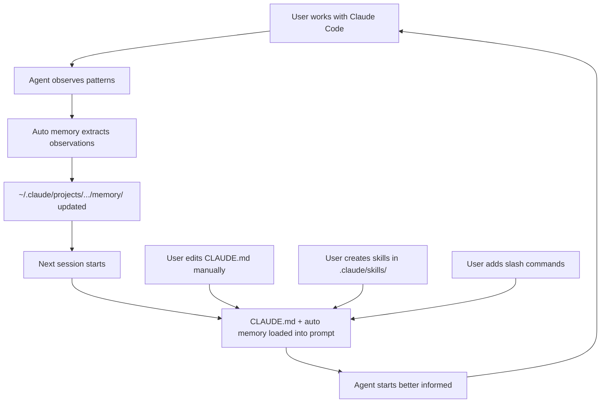

# Claude Code — 记忆、技能与泄露的内部实现

2026 年 3 月，Anthropic 发布了 `@anthropic-ai/claude-code` npm 包的一次常规更新。随之附带的——意外地——是一份完整的 source map：512,000 行 TypeScript 代码，Claude Code 完整的客户端实现。

社区在数小时内获得了源代码。source map 在一天内被撤下。但代码已经在数十个仓库和博客文章中被分析、记录和讨论。

本章基于该泄露的源代码，并与 Anthropic 的官方文档、博客文章以及公开发布的 Claude Agent SDK 进行了交叉验证。每一个论断都可追溯到特定的代码路径、配置常量或已记录的行为。

---

## CLAUDE.md — 手动记忆层

CLAUDE.md 是一个 markdown 文件。由你创建。由你编写。Claude Code 在每次会话开始时读取它，并将内容注入到系统提示中。这就是全部机制。

使它值得在本书中单独成节的是*层级结构*——Claude Code 不是加载一个文件。它从多个位置加载一条文件链，每个文件的作用域对应不同的具体层级。

### 层级加载

```
Discovery order (all loaded at session start):

1. ~/.claude/CLAUDE.md              Global — your preferences across all projects
2. <project-root>/CLAUDE.md         Project — team-wide conventions (committed to git)
3. <cwd>/.claude/CLAUDE.md          Directory — subdirectory-specific context
4. .claude/CLAUDE.local.md          Personal — your local overrides (gitignored)
```

泄露的 `SystemPromptBuilder` 中的发现逻辑：

```typescript
async function discoverMemoryFiles(cwd: string): Promise<ClaudeMemoryFile[]> {
  const files: ClaudeMemoryFile[] = [];
  const seen = new Set<string>();

  // Walk upward from CWD, collecting project-scope files
  let current = cwd;
  while (true) {
    const claudeFile = path.join(current, 'CLAUDE.md');
    const dotClaudeFile = path.join(current, '.claude', 'CLAUDE.md');

    for (const candidate of [claudeFile, dotClaudeFile]) {
      if (!seen.has(candidate) && await fileExists(candidate)) {
        seen.add(candidate);
        const content = await readFile(candidate, 'utf-8');
        files.push({
          path: candidate,
          content: truncateToTokenBudget(content, 4096),
          scope: 'project',
          truncated: content.length > tokenToCharEstimate(4096),
        });
      }
    }

    const parent = path.dirname(current);
    if (parent === current) break;
    current = parent;
  }

  // User-scope: ~/.claude/CLAUDE.md
  const homeFile = path.join(os.homedir(), '.claude', 'CLAUDE.md');
  if (!seen.has(homeFile) && await fileExists(homeFile)) {
    const content = await readFile(homeFile, 'utf-8');
    files.push({
      path: homeFile,
      content: truncateToTokenBudget(content, 4096),
      scope: 'user',
      truncated: content.length > tokenToCharEstimate(4096),
    });
  }

  // Enforce total budget across all files
  return enforceGlobalBudget(files, 12288);
}
```

### Token 预算

| 约束 | 限制 | 超出时的处理 |
|-----------|-------|---------------------------|
| 单文件 | 4,096 token | 截断并提示：*"[truncated — file exceeds 4K token limit]"* |
| 所有文件总计 | 12,288 token | 最低优先级的文件被整体丢弃 |

这些限制在 `SystemPromptBuilder` 中是硬编码的。它们占用上下文窗口——CLAUDE.md 的每一个 token 都是 Agent 无法用于对话、工具结果或推理的 token。

### /init 命令

`/init` 命令为项目自动生成初始 CLAUDE.md：

```
/init
  → Scans project structure (package.json, pyproject.toml, Makefile, etc.)
  → Reads README.md, CONTRIBUTING.md
  → Identifies build system, test framework, linter
  → Generates CLAUDE.md with:
    - Build and test commands
    - Project structure overview
    - Detected conventions
```

生成的文件是一个起点。真正的价值随着你不断添加架构决策、编码规范和 Agent 无法从代码库中推断出的项目特定上下文而逐渐积累。

### CLAUDE.md 中应该放什么

来自 Anthropic 文档和社区经验的最佳实践：**最多 50-200 行。**

```markdown
# CLAUDE.md

## Build & Test
- Run tests: `pytest tests/ -x --tb=short`
- Lint: `ruff check . --fix`
- Type check: `pyright`
- Dev server: `uvicorn src.main:app --reload`

## Architecture
- src/core/ — domain logic, no I/O dependencies
- src/adapters/ — external service clients (DB, APIs)
- src/api/ — FastAPI routes, thin layer over core
- Dependency injection via src/core/deps.py

## Conventions
- Dataclasses for structured data, not dicts
- All public functions need Google-style docstrings
- Prefer pathlib over os.path
- Error handling: raise domain exceptions from core/, catch in api/
- Never import from adapters/ in core/

## Known Issues
- The Postgres connection pool leaks under high concurrency — use
  `async with pool.acquire() as conn:` pattern, never raw pool.execute()
```

*不应*放入的内容：与 README 重复的文档、生成的 API 参考、冗长的代码示例。该文件会注入到每个提示中——臃肿的内容在每一轮对话都会消耗 token。

### .claude/CLAUDE.local.md 的灵活出口

`.claude/CLAUDE.local.md` 按照约定被 gitignore。这是你放置不应与团队共享的个人偏好的地方：

```markdown
# CLAUDE.local.md

- I use vim keybindings — don't suggest VS Code shortcuts
- My local DB is on port 5433 (not 5432)
- When generating code, include type annotations even on local variables
- I prefer explicit over concise — spell out variable names
```

它以相同的每文件 4K 预算加载，并计入 12K 总额。

---

## 自动记忆 — Claude 无需指示即可学习

CLAUDE.md 是手动的——由你编写。自动记忆则相反：Claude Code 自动写入观察结果，无需你的指示。

### 存储位置

```
~/.claude/projects/<project-hash>/memory/
  ├── observations.md
  └── ... (additional auto-generated files)
```

路径由项目根目录派生，因此每个项目都有自己的记忆存储。文件存储在用户的 home 目录中，而非项目中——自动记忆不会被提交到版本控制中。

### 存储内容

自动记忆捕获 Agent 在会话中观察到的模式：

| 类别 | 示例 |
|----------|---------|
| 编码规范 | *"This project uses single quotes for strings"* |
| 构建命令 | *"Tests run with `npm run test:unit`, not `npm test`"* |
| 调试方法 | *"When the API returns 500, check Redis connection first — it drops under load"* |
| 用户偏好 | *"User prefers functional style over class-based components"* |
| 环境事实 | *"Project requires Node 20 — nvm use 20 before running"* |

Agent 在学到新东西的会话结束时写入这些观察。触发是隐式的——Agent 根据交互内容决定什么值得记住。

### 会话启动时的加载

自动记忆与 CLAUDE.md 一起在每次会话开始时加载：

```
Session start:
  1. Load CLAUDE.md files (hierarchical discovery, 12K budget)
  2. Load auto memory (first 200 lines or 25KB cap, whichever is smaller)
  3. Inject both into system prompt
  4. Begin conversation
```

200 行 / 25KB 的上限防止自动记忆无限增长。与 CLAUDE.md 的每文件 4K token 预算不同，自动记忆有一个更简单的行数截断——最近的观察排在最前面。

### Agent 自动写入

与 CLAUDE.md 的关键区别：你不需要主动请求。在你纠正 Agent 的会话之后（"不，我们这里用 pnpm，不是 npm"），Agent 会记录纠正内容。下次会话时，它已经知道了。

这是被动提取——Agent 从交互中观察模式并持久化。它不需要显式指令或特殊命令。

### 提议的自我改进循环

一个更雄心勃勃的自动记忆用法已经被原型化（但尚未作为默认功能发布）：

```
┌─────────────────────────────────┐
│  Analyze usage data              │
│  ~/.claude/usage-data/facets/    │
│  Identify friction patterns      │
└──────────────┬──────────────────┘
               │
               ▼
┌─────────────────────────────────┐
│  Friction detection              │
│  "User corrected me 4 times     │
│   about import ordering"         │
│  "Build command failed 3         │
│   sessions in a row"             │
└──────────────┬──────────────────┘
               │
               ▼
┌─────────────────────────────────┐
│  Suggest CLAUDE.md additions     │
│  "Add: imports sorted with       │
│   isort --profile black"         │
└─────────────────────────────────┘
```

在原型分析中，摩擦检测通道识别出 **42% 的摩擦率**——近一半的会话包含至少一次重复的纠正或失败的命令，而这些本可以通过 CLAUDE.md 条目来预防。提议的循环将分析 `~/.claude/usage-data/facets/` 中的这些模式，并建议向 CLAUDE.md 添加条目，弥合 Agent 知道什么（自动记忆）和 Agent 被*告知*什么（CLAUDE.md）之间的差距。

这尚未作为自动化功能发布。数据已就绪；反馈循环尚未闭合。

---

## Agent 技能 — .claude/skills/*.md

技能是教会 Claude Code 特定流程的 markdown 文件。CLAUDE.md 存储事实和规范，技能则存储*操作指南*知识——Agent 可以遵循的分步工作流。

### 格式

技能遵循 `agentskills.io` 标准：

```yaml
---
name: database-migration
description: >
  Run and manage database migrations using Alembic. Handles
  creating new migrations, applying pending migrations,
  rolling back, and resolving common migration conflicts.
version: 1.0.0
author: team
platforms: [linux, macos]
metadata:
  tags: [database, alembic, migrations]
  requires_toolsets: [terminal]
---

## When to Use

- User asks to create, run, or roll back a database migration
- Schema changes are needed for a new feature
- Migration conflicts after merging branches

## Procedure

1. Check current migration state: `alembic current`
2. Create new migration: `alembic revision --autogenerate -m "description"`
3. Review generated migration in alembic/versions/
4. Apply: `alembic upgrade head`
5. Verify: check tables with `psql` or ORM queries

## Pitfalls

- Always review autogenerated migrations — Alembic misses renamed columns
  (shows as drop + create instead)
- Run `alembic check` before committing to catch schema drift
- Never edit a migration that has been applied to shared environments
```

### 渐进式披露

技能不会一次性全部加载。Claude Code 使用三级加载策略：

```
Level 0: Skill index (always in context)
  → Name + description only
  → ~100 tokens per skill
  → Used for matching: "Does any skill apply to this task?"

Level 1: Full skill content (loaded on demand)
  → Complete procedure, pitfalls, verification
  → ~500-1500 tokens per skill
  → Loaded when the agent decides a skill is relevant

Level 2: Section-specific (loaded on demand)
  → Just the "Pitfalls" section, or just the "Procedure"
  → ~100-300 tokens
  → For follow-up questions about a specific part
```

匹配仅基于技能的 `name` 和 `description` 字段——正文内容从不被搜索。这就是描述为何重要的原因：一个描述含糊的技能（"database stuff"）不会在具体查询（"how do I run an Alembic migration?"）时被激活。

Token 节省：

```
30 skills at ~800 tokens each:
  Load all:           30 × 800 = 24,000 tokens
  Progressive (L0):   30 × 100 =  3,000 tokens
  + 1 activated (L1):            +   800 tokens
  Total:                          3,800 tokens

  Savings: 84%
```

### 斜杠命令：.claude/commands/*.md

自定义命令位于 `.claude/commands/`：

```
.claude/
  commands/
    deploy.md        →  /deploy
    review.md        →  /review
    test-coverage.md →  /test-coverage
```

每个命令文件是一个支持变量替换的 markdown 模板：

```markdown
<!-- .claude/commands/review.md -->
Review the following file for:
1. Security vulnerabilities
2. Performance issues
3. Code style violations per our CLAUDE.md conventions
4. Missing error handling

File to review: $ARGUMENTS

Provide a structured report with severity levels.
```

当用户输入 `/review src/auth.py` 时，Claude Code 读取模板，将 `$ARGUMENTS` 替换为 `src/auth.py`，并将结果作为用户消息注入。斜杠命令是用户编写的技能——连接 Agent 通用能力和项目特定工作流的桥梁。

### 跨团队和项目共享技能

`.claude/skills/` 中的技能是仓库中的纯 markdown 文件。它们被提交到 git，在 PR 中审查，并通过正常的版本控制共享。团队的技能库随着开发者为项目常见工作流——部署、测试模式、调试流程——添加技能而增长。

`agentskills.io` 标准意味着技能是可互操作的：为 Claude Code 编写的技能可以与 Hermes 和 OpenClaw 配合使用，反之亦然。格式相同；发现机制因 Agent 而异。

---

## 泄露的内部实现（2026 年 3 月源代码泄露）

泄露的 512,000 行 TypeScript source map 为我们提供了 Claude Code 实际工作方式的空前可见性。以下是架构上最具意义的发现。

### SystemPromptBuilder：14,902 行

`SystemPromptBuilder` 动态组装系统提示，遵循严格的顺序：

```
┌───────────────────────────────────────────────────┐
│ 1. Core Identity                                   │
│    "You are Claude, an AI assistant by Anthropic"   │
│    Base personality, safety guidelines               │
├───────────────────────────────────────────────────┤
│ 2. Tool Definitions (19 tools)                      │
│    File read/write, terminal, search, browser        │
│    Each with permission tier assignment              │
├───────────────────────────────────────────────────┤
│ 3. Environment Detection Results                    │
│    OS, shell, git status, container detection        │
├───────────────────────────────────────────────────┤
│ 4. CLAUDE.md Content                                │
│    All discovered memory files (4K per / 12K total)  │
├───────────────────────────────────────────────────┤
│ 5. Active Skills                                    │
│    Skills matching current task context              │
│                                                     │
│ ═══ __SYSTEM_PROMPT_DYNAMIC_BOUNDARY__ ═══          │
│                                                     │
│ 6. Session Context (dynamic, per-turn)              │
│    CWD, recent files, git branch, uncommitted changes│
├───────────────────────────────────────────────────┤
│ 7. Task-Specific Instructions                       │
│    Slash command context, mode-specific rules         │
└───────────────────────────────────────────────────┘
```

### __SYSTEM_PROMPT_DYNAMIC_BOUNDARY__

这是代码库中商业意义最重大的一行代码。它之上的所有内容是**静态的**——在一个会话的各轮之间保持不变，对于同一个项目的不同会话通常也相同。它之下的内容每轮都会变化。

Anthropic 的 API 支持提示缓存。静态前缀（约占总提示的 70%）被缓存并以较低成本复用。动态后缀（约 30%）在每轮重新计算。

```typescript
function buildSystemPrompt(config: SessionConfig): string {
  const staticParts = [
    buildCoreIdentity(),
    buildToolDefinitions(config.enabledTools),
    buildEnvironmentContext(config.environment),
    buildMemoryContent(config.memoryFiles),
    buildActiveSkills(config.skills),
  ];

  const dynamicParts = [
    buildSessionContext(config.session),
    buildTaskInstructions(config.task),
  ];

  return [
    ...staticParts,
    '__SYSTEM_PROMPT_DYNAMIC_BOUNDARY__',
    ...dynamicParts,
  ].join('\n\n');
}
```

你的 CLAUDE.md 内容位于边界之上。这意味着项目记忆被缓存——直接的成本优势。

### 19 个工具及权限层级

泄露的源代码揭示了 19 个工具，每个分配到三个权限层级之一：

| 层级 | 工具 | 能力 |
|------|-------|-------------|
| **ReadOnly** | `read_file`、`list_directory`、`search_files`、`grep`、`think` | 可以读取任何内容；不能修改 |
| **WorkspaceWrite** | `write_file`、`edit_file`、`create_directory`、`rename` | 可以修改项目内的文件 |
| **FullAccess** | `bash`、`browser`、`http_request`、`install_package` | 可以执行任意命令、访问网络 |

权限层级在客户端强制执行。用户配置最大层级；Agent 只能使用该层级或更低层级的工具。只读会话确实无法调用 `bash`。

### 自动压缩：隐藏的错误恢复

当上下文窗口被填满时，Claude Code 的压缩系统有两条路径：

```
Proactive path (normal):
  Context approaching limit → agent-initiated summary
  → compress early turns → continue seamlessly

Reactive path (hidden from user):
  Context EXCEEDS limit → API returns error
  → Claude Code catches the error silently
  → Runs emergency compaction (summarize all but last 3 turns)
  → Retries the failed request
  → User sees the response as if nothing happened
```

实现代码：

```typescript
class ConversationManager {
  private hasAttemptedReactiveCompact: boolean = false;

  async sendMessage(message: Message): Promise<Response> {
    try {
      return await this.api.complete(this.buildRequest(message));
    } catch (error) {
      if (error instanceof ContextLengthError) {
        return this.handleContextOverflow(message);
      }
      throw error;
    }
  }

  private async handleContextOverflow(message: Message): Promise<Response> {
    if (this.hasAttemptedReactiveCompact) {
      // Already tried once — don't loop forever
      throw new UserFacingError(
        'Conversation too long. Please start a new session with /clear.'
      );
    }

    this.hasAttemptedReactiveCompact = true;

    const summary = await this.summarizeHistory(
      this.conversation.slice(0, -3)
    );

    this.conversation = [
      { role: 'system', content: `Previous conversation summary:\n${summary}` },
      ...this.conversation.slice(-3),
    ];

    return this.sendMessage(message);
  }
}
```

### hasAttemptedReactiveCompact

一个布尔值。它修复了早期版本中的无限重试循环——一个无法被充分压缩的对话会陷入循环：压缩 → 重试 → 失败 → 压缩 → 重试 → 失败。修复只需一行代码：在重试之前设置 `this.hasAttemptedReactiveCompact = true`。

### ANTI_DISTILLATION_CC

一种针对 API 流量拦截的对抗措施：

```typescript
if (config.ANTI_DISTILLATION_CC) {
  toolDefinitions.push(
    buildDecoyTool('internal_search', 'Search internal knowledge base'),
    buildDecoyTool('memory_store', 'Store information in persistent memory'),
    buildDecoyTool('context_extend', 'Extend context window dynamically'),
  );
}

function buildDecoyTool(name: string, description: string): ToolDefinition {
  return {
    name,
    description,
    parameters: generatePlausibleSchema(),
  };
}
```

如果竞争对手拦截了 Claude Code 与 Anthropic API 之间的 API 流量，对话数据中会包含这些虚假的工具定义。任何用拦截到的数据训练模型的人都会教其模型调用不存在的工具。这是对抗性防御——系统毒化了训练数据提取过程。

### 容器检测

Claude Code 检测是否在容器中运行并调整行为：

```typescript
async function detectContainerEnvironment(): Promise<ContainerInfo> {
  const checks = {
    dockerenv: await fileExists('/.dockerenv'),
    containerenv: await fileExists('/run/.containerenv'),
    envFlag: process.env.CONTAINER === 'true'
              || process.env.DOCKER === 'true',
    cgroup: await checkCgroup(),  // /proc/1/cgroup contains "docker"
  };

  const isContainer = Object.values(checks).some(Boolean);

  return {
    isContainer,
    type: checks.dockerenv ? 'docker'
        : checks.containerenv ? 'podman'
        : 'unknown',
    restrictions: isContainer ? {
      noSudo: true,
      limitedFilesystem: true,
      noSystemdServices: true,
    } : {},
  };
}
```

在容器内：不能使用 `sudo`，不能安装系统软件包，文件路径假设会调整。检测结果被注入到系统提示的动态部分——Agent 了解自己的环境并相应调整。

### CLAUDE.md 加载截断预算

源代码中的具体常量：

| 常量 | 值 | 用途 |
|----------|-------|---------|
| `MEMORY_FILE_TOKEN_BUDGET` | 4,096 | 单个 CLAUDE.md 文件的最大 token 数 |
| `MEMORY_TOTAL_TOKEN_BUDGET` | 12,288 | 所有记忆文件合计的最大 token 数 |
| `AUTO_MEMORY_LINE_CAP` | 200 | 从自动记忆加载的最大行数 |
| `AUTO_MEMORY_BYTE_CAP` | 25,600 | 从自动记忆加载的最大字节数（约 25KB） |

这些值不可配置。它们被编译进 `SystemPromptBuilder` 中。

---

## Claude Code 中的进化实际如何运作

Claude Code 中的进化循环：



三个来源为下一次会话提供信息：

| 来源 | 谁来写 | 如何进化 |
|--------|--------------|---------------|
| CLAUDE.md | 人类（手动） | 用户添加规范、纠正错误 |
| 自动记忆 | Agent（自动） | Agent 从交互中提取模式 |
| 技能 + 命令 | 人类（手动） | 用户创建可复用的流程 |

### Claude Code 不做什么

Claude Code 中的进化是**被动提取，而非从结果中主动学习。** Agent 观察并记录。它不会：

- **从反馈信号中学习** — 不像 Cursor 的 Bugbot 那样根据正面反应提升规则、根据负面反馈降级规则。Claude Code 没有"这个 CLAUDE.md 条目有帮助"vs."这个没有"的机制。
- **自主创建技能** — 不像 Hermes 那样在检测到重复的工具调用模式后创建 SKILL.md 文件。Claude Code 的技能是人类编写的。
- **在空闲时间整合记忆** — 不像 OpenClaw 的 Dreaming 过程那样在后台重组记忆。Claude Code 的自动记忆是只追加的；没有修剪过程。
- **通过实验来填补能力差距** — Agent 不会自己尝试某些事情来看它是否有效。所有学习都来自用户发起的会话。

进化模型在设计上是保守的。Agent 编写的记忆可能漂移、积累噪声或编码错误模式的风险，被换成了 CLAUDE.md 保持在人类控制之下的保障。自动记忆添加了轻量级的自动层，但它补充人类记忆而非取代它。

### 由此产生的成长轨迹

```
Week 1:  Fresh CLAUDE.md from /init. Auto memory empty.
         Agent asks basic questions: "What test runner do you use?"

Week 2:  CLAUDE.md has build commands, code style notes.
         Auto memory has 30 observations.
         Agent knows the project. Fewer clarifying questions.

Week 4:  CLAUDE.md refined: bad entries removed, edge cases added.
         Auto memory has 80 observations.
         3 slash commands for common workflows.
         Agent operates fluently within project conventions.

Month 3: CLAUDE.md stable (~150 lines, well-curated).
         Skills directory has 5 project-specific skills.
         Auto memory periodically reviewed by user.
         Agent behaves like a team member who read the docs.
```

这个限制是真实的：没有反馈驱动的学习，改进曲线完全取决于人类投入在管理上的时间。一个维护良好的 CLAUDE.md 能产生一个显著更好的 Agent；一个被忽视的则几乎没有超越基线的改进。

下一章介绍 Cursor——一个押注于基础设施级进化、反馈驱动规则学习的系统，也是唯一一个确凿地从大规模真实用户信号中学习的生产系统。
