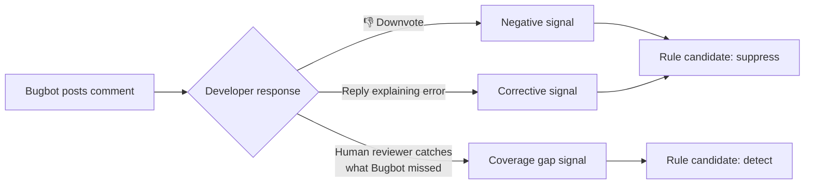

# Cursor — 持续学习、Bugbot 规则与规则系统

Cursor 是商业上最成功的 AI 编程 Agent：年收入 10 亿美元，每天处理超过 4 亿次 AI 请求，被大多数主要科技公司的工程师所使用。由初创公司 Anysphere 开发，该公司已融资超过 9 亿美元。

本章介绍使 Cursor *进化*的功能——即系统通过使用而不断改进的机制。这里不涉及索引管道或推测性编辑（那些属于基础设施，在本章末尾简要提及）。重点在于直接支持学习的三个功能：规则系统、持续学习插件和 Bugbot 的学习规则。

其中，Bugbot 是唯一一个已证明能从大规模真实用户反馈中学习的生产系统。它通过积累规则，将解决率从 52% 提升到了 78%。仅此一点，就足以让 Cursor 成为本书不可或缺的内容。

---

## 规则系统

### .cursor/rules/ — 持久化的项目上下文

Cursor 的规则系统等同于 Claude Code 的 CLAUDE.md，但具有更丰富的激活语义。规则以 `.mdc` 文件（带有 Cursor 元数据的 Markdown）的形式存放在 `.cursor/rules/` 目录中：

```
.cursor/
  rules/
    general.mdc              # 始终加载——项目级别的约定
    python-style.mdc         # 编辑 .py 文件时加载
    react-patterns.mdc       # 编辑 React 组件时加载
    api-conventions.mdc      # 编辑 routes/ 时加载
    database-migrations.mdc  # 按需加载——Agent 可以请求
```

### .mdc 格式

```markdown
---
description: API route conventions for the backend service
globs: ["src/routes/**/*.ts", "src/api/**/*.ts"]
alwaysApply: false
---

# API Route Conventions

## Request Validation
- Use zod schemas for all request bodies
- Validate path params with z.coerce
- Return 400 with structured error on validation failure

## Response Format
Always return:
{
  "data": { ... },
  "meta": { "requestId": "...", "timestamp": "..." }
}

## Error Handling
- Catch all errors in route handler
- Log with request context (requestId, userId, route)
- Never expose internal error details to client
```

### 三种激活类型

| 类型 | Frontmatter | 加载时机 | 使用场景 |
|------|------------|---------|----------|
| **始终加载** | `alwaysApply: true` | 每次提示、每个会话 | 项目级约定、编码规范 |
| **自动附加** | `globs: ["**/*.py"]` | 当活动文件匹配 glob 模式时 | 语言特定或目录特定的规则 |
| **Agent 请求** | 仅有 `description`（无 `alwaysApply`、无 `globs`） | 当 Agent 判断某条规则与当前任务相关时 | Agent 按需拉取的上下文 |

`alwaysApply: true` 规则是最接近 Claude Code 的 CLAUDE.md 的等价物——注入每一次交互。Glob 匹配规则更有针对性：仅在你编辑匹配文件时激活。Agent 请求规则是最动态的——Agent 读取规则描述，然后决定是否加载完整内容。

### 规则捆绑提示词与脚本

与 Claude Code 的纯 Markdown 格式的 CLAUDE.md 不同，Cursor 规则可以引用可执行脚本：

```markdown
---
description: Pre-commit validation for Python files
globs: ["**/*.py"]
alwaysApply: false
---

# Pre-commit Checks

Before suggesting changes to Python files, verify:

1. Run `ruff check $FILE` and confirm no errors
2. Run `pyright $FILE` and confirm no type errors
3. If tests exist in the corresponding test file, run them

Only proceed with changes after all checks pass.
```

规则并不直接*执行*脚本——它指示 Agent 在其工作流程中运行这些脚本。规则系统提供意图；Agent 的工具使用能力提供执行。

### /Generate Cursor Rules

`/Generate Cursor Rules` 命令能从当前对话中自动创建规则：

```
用户进行了一段关于 React 测试模式的对话
  → 输入：/Generate Cursor Rules
  → Cursor 分析对话内容
  → 提取反复出现的模式和偏好
  → 在 .cursor/rules/ 中创建新的 .mdc 文件
```

这是对话时学习与持久化规则之间的桥梁。与 Agent 自行编写规则的方式（Hermes 方法）不同，用户触发提取并在规则永久生效前审核结果。

### rule-generating-agent.mdc：元规则

Cursor 附带一个元规则——一条指导 AI 创建其他规则的规则：

```markdown
---
description: Instructions for generating new Cursor rules from conversation context
alwaysApply: false
---

# Rule Generation Guidelines

When creating a new .mdc rule file:

1. Extract the specific, actionable pattern (not general advice)
2. Choose the appropriate activation type:
   - alwaysApply: true for universal conventions
   - globs for file-type-specific rules
   - Description-only for on-demand context
3. Keep rules concise — 20-50 lines max
4. Include concrete examples, not abstract principles
5. Test the rule by verifying it would have helped in the
   conversation that triggered its creation
```

这是一种元技能模式：系统教会自己如何创建更好的规则。元规则本身就是一个 `.mdc` 文件——它遵循自己所教授的格式。

---

## 持续学习插件

### 它是什么

持续学习插件是 Cursor 的官方插件，可在 GitHub 上的 `cursor/plugins` 仓库中获取。它是 Cursor 的 Agent 基于会话学习自动更新项目文档（AGENTS.md）的机制。

### 架构

```
┌─────────────────────────────┐
│  Cursor Agent 会话            │
│  （与用户的对话）              │
└──────────────┬──────────────┘
               │ 会话结束（stop hook 触发）
               ▼
┌─────────────────────────────┐
│  continual-learning 技能      │
│  （stop hook 处理器）          │
│                              │
│  检查：                       │
│  - 轮次足够？（≥10）          │
│  - 时间足够？（≥120 分钟）     │
│  - 频率合适？（不过于频繁）     │
└──────────────┬──────────────┘
               │ 如果所有检查通过
               ▼
┌─────────────────────────────┐
│  agents-memory-updater       │
│  子 Agent                    │
│                              │
│  1. 读取现有 AGENTS.md        │
│  2. 读取会话记录              │
│  3. 提取高价值观察            │
│  4. 更新 AGENTS.md：          │
│     - 匹配已有条目            │
│       → 原地更新              │
│     - 新的观察                │
│       → 追加                  │
└─────────────────────────────┘
```

### 工作原理

流水线：**stop hook → continual-learning 技能 → agents-memory-updater 子 Agent。**

当 Cursor Agent 会话结束时，stop hook 触发。continual-learning 技能检查会话是否足够充实以值得进行记忆更新：

| 检查项 | 阈值（生产环境） | 阈值（试用版） |
|-------|----------------|---------------|
| 最少轮次 | 10 | 3 |
| 最少经过时间 | 120 分钟 | 15 分钟 |
| 频率控制（距上次更新的最短间隔） | 可配置 | 可配置 |

如果会话超过所有阈值，技能将启动 `agents-memory-updater` 子 Agent。

### 状态追踪

插件在两个 JSON 文件中维护状态：

```
.cursor/hooks/state/
  ├── continual-learning.json        # 频率追踪
  └── continual-learning-index.json  # 文件修改时间
```

`continual-learning.json` 记录上次更新的运行时间，防止插件过于频繁地更新 AGENTS.md。`continual-learning-index.json` 追踪文件修改时间以检测会话期间哪些文件发生了变化——这有助于子 Agent 聚焦于真正的新内容。

### 提取的内容

agents-memory-updater 子 Agent 具有选择性。它只提取**高价值**的观察：

| 提取 | 不提取 |
|------|-------|
| 用户反复纠正的内容（"使用 pnpm，而不是 npm"） | 一次性命令 |
| 持久性工作区事实（"测试需要运行 Redis"） | 临时调试步骤 |
| 用户多次表达的偏好 | 仅提及一次的偏好 |
| 被纠正过的构建/测试命令 | 首次即成功的命令 |

### 更新机制

关键细节：子 Agent **先读取现有的 AGENTS.md**，然后原地更新匹配的条目，而非进行全量重写。

```
现有 AGENTS.md：
  - 运行测试：`pytest tests/`
  - 项目使用 PostgreSQL 15

会话记录揭示：
  用户纠正了 Agent："不，用 `pytest tests/ -x --tb=short` 运行测试"
  用户提到："我们上周迁移到了 PostgreSQL 16"
  用户说："提交前始终运行 ruff"

更新后的 AGENTS.md：
  - 运行测试：`pytest tests/ -x --tb=short`     ← 原地更新
  - 项目使用 PostgreSQL 16                        ← 原地更新
  - 提交前始终运行 ruff                            ← 新条目追加
```

这种原地更新机制防止文件因重复条目而无限增长。它还保留了结构——章节、标题和未修改的条目保持不变。

---

## Bugbot 学习规则——唯一在大规模真实反馈中学习的生产系统

这是所有生产 Agent 中最重要的自进化功能。不是因为它在架构上最复杂——并非如此。而是因为它是唯一一个具有**来自大规模真实反馈信号的可衡量结果**的系统。

### 数据

| 日期 | 解决率 | 变化内容 |
|------|-------|---------|
| 2025 年 7 月（上线） | 52% | 基线——无学习规则 |
| 2025 年 10 月 | 61% | 首批学习规则部署 |
| 2026 年 1 月 | 70% | 规则积累 + 清理趋于稳定 |
| 2026 年 4 月 | **78.13%** | 跨 110,000+ 仓库的 44,000+ 条学习规则 |

从 52% 到 78% 的提升几乎完全来自学习规则——相同的基础模型、相同的核心提示策略，但有一个不断积累的仓库级和模式级规则库来指导 Bugbot 的审查行为。

### Bugbot 做什么

Bugbot 是 Cursor 的自动代码审查 Agent。当 Pull Request 被创建时，Bugbot 会：

1. 读取 PR diff
2. 分析代码变更中的 bug、风格问题、安全隐患
3. 在特定行上发布内联评论
4. 建议修复方案

学习系统基于真实开发者反馈，随时间不断改进第 2-4 步。

### 三种反馈信号



| 信号 | 来源 | 教会系统什么 |
|------|------|------------|
| **反应**（踩） | 开发者对 Bugbot 的评论投反对票 | "这类评论在此仓库中不受欢迎" |
| **开发者回复** | 开发者解释为什么 Bugbot 是错的 | "推理有误——以下才是实际的约定" |
| **人工审查评论** | 人工审查者发现了 Bugbot 遗漏的问题 | "这个模式应该被标记但没有被标记" |

### 规则生命周期

```
1. 候选
   反馈触发规则提案
   "在仓库 X 中，不要标记 __init__.py 文件中的未使用导入"

2. 积累
   相同模式从多个 PR 获得正向信号
   3+ 个一致信号 → 达到置信度阈值

3. 激活
   规则提升为激活状态
   应用于该仓库的所有未来审查

4. 监控
   规则继续积累反馈
   持续的负面反馈 → 规则被禁用

5. 禁用（如有需要）
   规则产生的问题多于解决的问题
   从活跃规则中移除，保留用于审计
```

### 规模

截至 2026 年 4 月：

| 指标 | 数值 |
|------|------|
| 启用 Bugbot 的仓库 | 110,000+ |
| 已生成的学习规则总数 | 44,000+ |
| 每个活跃仓库的平均规则数 | ~3-5 |
| 单个仓库的最大规则数 | 50+（大型 monorepo） |

### @cursor remember [事实]

开发者可以在 PR 上直接教导 Bugbot：

```
@cursor remember In this repo, we allow console.log in test files
@cursor remember Our API responses always include a requestId field
@cursor remember Don't flag TODOs in migration files — they're intentional
```

这些内联教导立即成为规则候选，跳过反馈积累阶段。它们是最直接的教学机制：开发者直接告诉系统应该学什么。

### 竞争表现

Bugbot 的学习规则赋予其对竞争对手的可衡量优势：

| 系统 | 解决率 | 学习规则 |
|------|-------|---------|
| **Cursor Bugbot** | **78.13%** | 有——44,000+ 条规则 |
| Greptile | 63.49% | 无 |
| CodeRabbit | 48.96% | 有限（用户配置） |
| GitHub Copilot | 46.69% | 无 |

性能差距与学习机制直接相关。Greptile、CodeRabbit 和 GitHub Copilot 使用静态提示——无论积累了多少反馈，审查策略都相同。Bugbot 的优势不在于更好的基础模型；而在于系统已经吸收了 110,000 个仓库的开发者纠正并将其编码为规则。

### 对自进化的意义

Bugbot 的学习规则是**生产环境中最接近 Agent 系统强化学习循环的机制**：

1. **动作：** Bugbot 发布审查评论
2. **奖励信号：** 开发者做出反应（正面/负面/纠正性）
3. **策略更新：** 创建、提升或禁用规则
4. **未来行为改变：** 下一次审查纳入学习规则

这不是基于梯度的 RL——而是基于规则的策略修改。但闭环是真实的：动作产生可观察的结果，结果驱动策略变化，改变后的策略产生不同的动作。这就是它在生产 Agent 中独一无二的原因。

---

## reflect-yourself（社区项目）

### 它是什么

`reflect-yourself` 是一个社区项目，为 Cursor 添加自进化 AI 技能。与持续学习插件更新单个 AGENTS.md 文件不同，reflect-yourself 创建了一个结构化的学习行为知识库。

### 工作原理

```
用户在会话中纠正 Agent
  → reflect-yourself 捕获纠正
  → 分类范围：
      项目特定  → .cursor/skills/project/
      个人      → ~/.cursor/skills/personal/
      适合规则  → .cursor/rules/
  → 分配置信度分数（0.3 - 0.9）
  → 创建或更新相应文件
```

### 智能路由

路由逻辑决定知识应存放在哪里：

| 范围 | 目标路径 | 示例 |
|------|---------|------|
| **项目** | `.cursor/skills/project/*.md` | "此仓库使用 Alembic，不用原始 SQL 迁移" |
| **个人** | `~/.cursor/skills/personal/*.md` | "我偏好在所有变量上显式标注类型" |
| **规则** | `.cursor/rules/*.mdc` | "提交前始终运行 `pnpm typecheck`" |

项目技能提交到 git（与团队共享）。个人技能存放在用户的主目录中（私有）。规则进入 `.cursor/rules/`，与 Cursor 的原生规则系统集成。

### 置信度评分

每个学习到的行为都有一个置信度分数：

```
0.3 — 单次纠正，可能是偶发的
0.5 — 在类似上下文中被纠正两次
0.7 — 被纠正 3 次以上，模式一致
0.9 — 被用户明确确认或被纠正 5 次以上
```

低置信度行为（< 0.5）被存储但不会主动加载到上下文中。它们是候选——等待额外信号后再变为活跃状态。高置信度行为（≥ 0.7）在相关会话中被加载。

这与 Bugbot 的规则生命周期类似：候选 → 积累信号 → 提升 → 监控。这种模式是趋同的——多个系统独立地得出了信号门控提升作为学习规则正确策略的结论。

---

## Cursor 上下文引擎（背景知识）

上述进化功能——规则、学习规则、持续学习——运行在一个保持 Agent 对代码库理解始终最新的上下文引擎之上。本节内容简短，因为上下文引擎是基础设施而非进化本身。但它是使进化功能有效运作的关键。

### Merkle 树用于变更检测

Cursor 将整个代码库索引为可搜索的 embedding 存储。每次变更都重新索引一切代价过高。解决方案：**Merkle 树**——驱动 Git 的同一数据结构。

```
变更检测：
  编辑前：  根哈希 = ab3f...
  编辑后：  根哈希 = x92k...（不同）

  遍历树：仅 3 个分支发生了变化
  → 重新索引 3 个文件，而非 100,000 个

  复杂度：O(k log n)，其中 k = 变更文件数，n = 总文件数
```

对于拥有 100,000 个文件且仅 3 个文件变更的仓库，只需访问约 50 个树节点，而不是扫描 100,000 个文件。团队成员索引复用意味着新加入的开发者可以在 525ms 内获得完整索引的代码库（相比全新索引的 7.87s）。

### AST 分块

Tree-sitter 将源代码文件解析为 AST。分块以完整的语义单元（函数、类、模块）而非任意行数窗口为基础：

```
朴素分块：
  第 1-500 行    ← 函数被跨边界拆分
  第 501-1000 行 ← 半个类

Tree-sitter 分块：
  class UserService { ... }        ← 完整单元
  function authenticate() { ... }  ← 完整单元
```

更好的分块 → 更好的 embedding → 更好的检索 → Agent 在需要时获取更相关的代码。

### Turbopuffer Embedding

Embedding 存储在 Turbopuffer（基于 S3 的向量数据库）中。一个重排序器——微调过的 CodeLlama 7B，以 1,000+ token/秒的速度运行——在初始向量搜索返回前 100 个候选后，对 (query, code_chunk) 对进行相关性评分。

### 对进化的意义

上下文引擎本身不进化。但它使其他一切有效运作：

- **规则**在 Agent 拥有正确代码上下文时更有效（glob 匹配规则 + 相关代码 = 准确的建议）
- **Bugbot 的学习规则**能应用到正确的代码上，因为索引管道能识别出 PR 影响了哪些代码
- **持续学习**在 Agent 理解变更的完整上下文时，能提取出更好的观察

上下文引擎是基质。进化功能是生长在其上的内容。

---

## 总结：Cursor 的进化栈

```
┌──────────────────────────────────────────────────────┐
│                    Cursor                              │
├──────────────────────────────────────────────────────┤
│                                                      │
│  规则层（人工编写 + 自动生成）                          │
│  ├── .cursor/rules/*.mdc — Always、Auto、Agent 类型   │
│  ├── /Generate Cursor Rules — 对话提取                 │
│  └── rule-generating-agent.mdc — 元规则                │
│                                                      │
│  持续学习层（插件）                                     │
│  ├── Stop hook → 记录分析 → AGENTS.md                  │
│  ├── 原地条目更新（非全量重写）                          │
│  └── 频率控制（10 轮次 + 120 分钟最低要求）              │
│                                                      │
│  Bugbot 学习规则（生产级 RL 循环）                      │
│  ├── 3 种反馈信号：反应、回复、覆盖缺口                  │
│  ├── 规则生命周期：候选 → 激活 → 监控                    │
│  ├── 跨 110,000 仓库的 44,000+ 条规则                   │
│  ├── 解决率从 52% 提升至 78%，仅靠规则                   │
│  └── @cursor remember 用于直接教导                      │
│                                                      │
│  上下文引擎（基础设施）                                  │
│  ├── Merkle 树变更检测                                  │
│  ├── AST 分块（Tree-sitter）                            │
│  ├── Turbopuffer embedding + CodeLlama 重排序器          │
│  └── Priompt 优先级上下文编排                            │
│                                                      │
│  社区扩展                                               │
│  └── reflect-yourself：带置信度评分的技能捕获             │
│                                                      │
└──────────────────────────────────────────────────────┘
```

### 核心洞察

Cursor 的进化策略是分层的：

| 层级 | 谁驱动 | 反馈来源 |
|------|-------|---------|
| 规则（`.mdc`） | 人类（手动） | 开发者经验 |
| 持续学习 | Agent（自动） | 会话记录 |
| Bugbot 规则 | 系统（自动化） | 大规模真实用户反应 |

最底层——Bugbot 学习规则——是最重要的。它是唯一一个进化循环完全闭合的生产系统：动作 → 反馈 → 策略更新 → 行为改变。本书中的其他系统要么需要人工整理（CLAUDE.md），要么依赖 Agent 的自我评估（Hermes 15 次调用检查点），要么运行在静态规则上（大多数竞争产品）。

Bugbot 证明了信号门控的规则提升在大规模环境下是有效的。解决率 26 个百分点的提升（52% → 78%）来自规则，而非更好的模型。这是生产环境中 Agent 自进化能带来可衡量结果的最有力证据。

下一章将介绍 Hermes——一个全面采用 Agent 驱动进化并具有闭环技能创建能力的系统。
