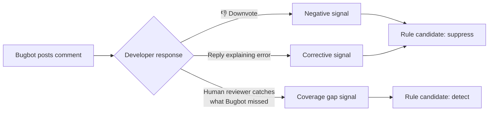

# Cursor — 持续学习、Bugbot 规则与规则系统

Cursor 是目前商业上最成功的 AI 编程 Agent：年收入 10 亿美元，日均处理超过 4 亿次 AI 请求，使用者遍布各大科技公司的工程团队。其背后的初创公司 Anysphere 已累计融资超过 9 亿美元。

本章聚焦让 Cursor *进化*的功能——也就是让系统通过使用而不断变好的机制。索引管道和推测性编辑不在讨论范围内（那属于基础设施，在末尾简单提及）。重点是三个直接支撑学习的功能：规则系统、持续学习插件，以及 Bugbot 的学习规则。

其中 Bugbot 尤其值得关注——它是目前唯一一个已证明能从大规模真实用户反馈中学习的生产系统。靠不断积累规则，解决率从 52% 拉到了 78%。仅凭这一点，Cursor 就值得在本书中占一整章。

---

## 规则系统

### .cursor/rules/ — 持久化的项目上下文

Cursor 的规则系统相当于 Claude Code 的 CLAUDE.md，但激活语义更丰富。规则以 `.mdc` 文件（带 Cursor 元数据的 Markdown）形式存放在 `.cursor/rules/` 中：

```
.cursor/
  rules/
    general.mdc              # 始终加载——项目级别的约定
    python-style.mdc         # 编辑 .py 文件时加载
    react-patterns.mdc       # 编辑 React 组件时加载
    api-conventions.mdc      # 编辑 routes/ 时加载
    database-migrations.mdc  # 按需加载——Agent 可以请求
```

### .mdc 格式

```markdown
---
description: API route conventions for the backend service
globs: ["src/routes/**/*.ts", "src/api/**/*.ts"]
alwaysApply: false
---

# API Route Conventions

## Request Validation
- Use zod schemas for all request bodies
- Validate path params with z.coerce
- Return 400 with structured error on validation failure

## Response Format
Always return:
{
  "data": { ... },
  "meta": { "requestId": "...", "timestamp": "..." }
}

## Error Handling
- Catch all errors in route handler
- Log with request context (requestId, userId, route)
- Never expose internal error details to client
```

### 三种激活类型

| 类型 | Frontmatter | 加载时机 | 使用场景 |
|------|------------|---------|----------|
| **始终加载** | `alwaysApply: true` | 每次提示、每个会话 | 项目级约定、编码规范 |
| **自动附加** | `globs: ["**/*.py"]` | 当活动文件匹配 glob 模式时 | 语言特定或目录特定的规则 |
| **Agent 请求** | 仅有 `description`（无 `alwaysApply`、无 `globs`） | Agent 判断某条规则与当前任务相关时 | Agent 按需拉取的上下文 |

`alwaysApply: true` 是最接近 Claude Code CLAUDE.md 的等价物——每次交互都注入。glob 匹配规则更有针对性，只在你编辑匹配的文件时才激活。Agent 请求规则最灵活——Agent 先看描述，再决定要不要加载完整内容。

### 规则可以捆绑提示词与脚本

与 Claude Code 纯 Markdown 的 CLAUDE.md 不同，Cursor 规则可以引用可执行脚本：

```markdown
---
description: Pre-commit validation for Python files
globs: ["**/*.py"]
alwaysApply: false
---

# Pre-commit Checks

Before suggesting changes to Python files, verify:

1. Run `ruff check $FILE` and confirm no errors
2. Run `pyright $FILE` and confirm no type errors
3. If tests exist in the corresponding test file, run them

Only proceed with changes after all checks pass.
```

规则本身不直接跑脚本——它只是告诉 Agent 在工作流中该执行哪些脚本。规则提供意图，Agent 的工具调用能力负责执行。

### /Generate Cursor Rules

`/Generate Cursor Rules` 命令可以从当前对话自动创建规则：

```
用户进行了一段关于 React 测试模式的对话
  → 输入：/Generate Cursor Rules
  → Cursor 分析对话内容
  → 提取反复出现的模式和偏好
  → 在 .cursor/rules/ 中创建新的 .mdc 文件
```

这是对话中的临时学习与持久化规则之间的桥梁。和 Agent 自主写规则的方式（Hermes 那种）不同，这里由用户主动触发，并在规则正式生效前审核结果。

### rule-generating-agent.mdc：元规则

Cursor 自带一条元规则——一条教 AI 如何创建其他规则的规则：

```markdown
---
description: Instructions for generating new Cursor rules from conversation context
alwaysApply: false
---

# Rule Generation Guidelines

When creating a new .mdc rule file:

1. Extract the specific, actionable pattern (not general advice)
2. Choose the appropriate activation type:
   - alwaysApply: true for universal conventions
   - globs for file-type-specific rules
   - Description-only for on-demand context
3. Keep rules concise — 20-50 lines max
4. Include concrete examples, not abstract principles
5. Test the rule by verifying it would have helped in the
   conversation that triggered its creation
```

这就是元技能模式：系统教自己如何生成更好的规则。而元规则本身也是一个 `.mdc` 文件——它遵循自己制定的格式。

---

## 持续学习插件

### 它是什么

持续学习插件是 Cursor 的官方插件，托管在 GitHub 的 `cursor/plugins` 仓库里。它让 Cursor Agent 能基于会话内容自动更新项目文档（AGENTS.md）。

### 架构

```
┌─────────────────────────────┐
│  Cursor Agent 会话            │
│  （与用户的对话）              │
└──────────────┬──────────────┘
               │ 会话结束（stop hook 触发）
               ▼
┌─────────────────────────────┐
│  continual-learning 技能      │
│  （stop hook 处理器）          │
│                              │
│  检查：                       │
│  - 轮次足够？（≥10）          │
│  - 时间足够？（≥120 分钟）     │
│  - 频率合适？（不过于频繁）     │
└──────────────┬──────────────┘
               │ 如果所有检查通过
               ▼
┌─────────────────────────────┐
│  agents-memory-updater       │
│  子 Agent                    │
│                              │
│  1. 读取现有 AGENTS.md        │
│  2. 读取会话记录              │
│  3. 提取高价值观察            │
│  4. 更新 AGENTS.md：          │
│     - 匹配已有条目            │
│       → 原地更新              │
│     - 新的观察                │
│       → 追加                  │
└─────────────────────────────┘
```

### 工作原理

整条链路：**stop hook → continual-learning 技能 → agents-memory-updater 子 Agent。**

Cursor Agent 会话结束时，stop hook 触发。continual-learning 技能先判断这次会话是否有足够的信息量，值得更新记忆：

| 检查项 | 阈值（生产环境） | 阈值（试用版） |
|-------|----------------|---------------|
| 最少轮次 | 10 | 3 |
| 最少经过时间 | 120 分钟 | 15 分钟 |
| 频率控制（距上次更新的最短间隔） | 可配置 | 可配置 |

全部达标后，技能启动 `agents-memory-updater` 子 Agent。

### 状态追踪

插件用两个 JSON 文件维护状态：

```
.cursor/hooks/state/
  ├── continual-learning.json        # 频率追踪
  └── continual-learning-index.json  # 文件修改时间
```

`continual-learning.json` 记录上次更新的时间，避免过于频繁地改写 AGENTS.md。`continual-learning-index.json` 追踪文件修改时间，用来识别会话期间哪些文件发生了变化——帮助子 Agent 聚焦于真正的新内容。

### 提取的内容

agents-memory-updater 子 Agent 很挑剔，只提取**高价值**观察：

| 提取 | 不提取 |
|------|-------|
| 用户反复纠正的内容（"用 pnpm，不要用 npm"） | 一次性命令 |
| 持久性工作区事实（"跑测试需要先启 Redis"） | 临时调试步骤 |
| 用户多次表达的偏好 | 只提过一次的偏好 |
| 被纠正过的构建/测试命令 | 一次就跑通的命令 |

### 更新机制

关键细节：子 Agent **先读取现有 AGENTS.md**，然后对匹配条目做原地更新，而非整个重写。

```
现有 AGENTS.md：
  - 运行测试：`pytest tests/`
  - 项目使用 PostgreSQL 15

会话记录揭示：
  用户纠正了 Agent："不，用 `pytest tests/ -x --tb=short` 运行测试"
  用户提到："我们上周迁移到了 PostgreSQL 16"
  用户说："提交前始终运行 ruff"

更新后的 AGENTS.md：
  - 运行测试：`pytest tests/ -x --tb=short`     ← 原地更新
  - 项目使用 PostgreSQL 16                        ← 原地更新
  - 提交前始终运行 ruff                            ← 新条目追加
```

原地更新机制避免了文件因重复条目无限膨胀，也保留了原有结构——章节、标题和未修改的条目都保持不变。

---

## Bugbot 学习规则——唯一在大规模真实反馈中学习的生产系统

这是所有生产 Agent 中最重要的自进化功能。不是因为架构最复杂——并不是。而是因为它是唯一一个**有大规模真实反馈信号、且有可衡量结果**的系统。

### 数据

| 日期 | 解决率 | 变化内容 |
|------|-------|---------|
| 2025 年 7 月（上线） | 52% | 基线——无学习规则 |
| 2025 年 10 月 | 61% | 首批学习规则部署 |
| 2026 年 1 月 | 70% | 规则积累 + 清理后趋于稳定 |
| 2026 年 4 月 | **78.13%** | 跨 110,000+ 仓库的 44,000+ 条学习规则 |

从 52% 到 78%，提升几乎完全来自学习规则——基础模型没换，核心提示策略没变，但有一个不断壮大的仓库级和模式级规则库在持续指导 Bugbot 的审查行为。

### Bugbot 做什么

Bugbot 是 Cursor 的自动代码审查 Agent。当有 Pull Request 创建时，Bugbot 会：

1. 读取 PR diff
2. 分析代码变更中的 bug、风格问题、安全隐患
3. 在具体行上发布内联评论
4. 给出修复建议

学习系统做的事情，就是基于真实开发者反馈，持续优化第 2-4 步的表现。

### 三种反馈信号



| 信号 | 来源 | 系统从中学到什么 |
|------|------|------------|
| **反应**（踩） | 开发者对 Bugbot 评论投反对票 | "这类评论在这个仓库不受欢迎" |
| **开发者回复** | 开发者解释 Bugbot 哪里判断错了 | "推理有误——实际约定是这样的" |
| **人工审查评论** | 人工审查者发现了 Bugbot 漏掉的问题 | "这个模式应该标记但没有标记" |

### 规则生命周期

```
1. 候选
   反馈触发规则提案
   "在仓库 X 中，不要标记 __init__.py 文件中的未使用导入"

2. 积累
   相同模式从多个 PR 获得正向信号
   3+ 个一致信号 → 达到置信度阈值

3. 激活
   规则提升为激活状态
   应用于该仓库的所有未来审查

4. 监控
   规则继续积累反馈
   持续的负面反馈 → 规则被禁用

5. 禁用（如有需要）
   规则产生的问题多于解决的问题
   从活跃规则中移除，保留用于审计
```

### 规模

截至 2026 年 4 月：

| 指标 | 数值 |
|------|------|
| 启用 Bugbot 的仓库 | 110,000+ |
| 已生成的学习规则总数 | 44,000+ |
| 每个活跃仓库的平均规则数 | ~3-5 |
| 单个仓库的最大规则数 | 50+（大型 monorepo） |

### @cursor remember [事实]

开发者可以在 PR 上直接教 Bugbot：

```
@cursor remember In this repo, we allow console.log in test files
@cursor remember Our API responses always include a requestId field
@cursor remember Don't flag TODOs in migration files — they're intentional
```

这些内联教导直接成为规则候选，跳过反馈积累阶段。这是最直接的教学方式：开发者明确告诉系统应该记住什么。

### 竞争表现

学习规则给了 Bugbot 对竞品的可衡量优势：

| 系统 | 解决率 | 学习规则 |
|------|-------|---------|
| **Cursor Bugbot** | **78.13%** | 有——44,000+ 条规则 |
| Greptile | 63.49% | 无 |
| CodeRabbit | 48.96% | 有限（用户配置） |
| GitHub Copilot | 46.69% | 无 |

差距与学习机制直接相关。Greptile、CodeRabbit 和 GitHub Copilot 用的都是静态提示——无论积累了多少反馈，审查策略始终不变。Bugbot 的优势不在于基础模型更好，而在于它已经消化了 110,000 个仓库的开发者纠正，并把这些纠正编码成了规则。

### 对自进化的意义

Bugbot 的学习规则是**生产环境中最接近强化学习闭环的 Agent 系统**：

1. **动作：** Bugbot 发布审查评论
2. **奖励信号：** 开发者做出反应（正面/负面/纠正性）
3. **策略更新：** 创建、提升或禁用规则
4. **行为改变：** 下一次审查就会受到新规则影响

严格来说这不是基于梯度的 RL，而是基于规则的策略修改。但闭环是真的：动作产生可观察的结果，结果驱动策略变化，变化后的策略改变后续行为。这就是它在生产 Agent 中独树一帜的原因。

---

## reflect-yourself（社区项目）

### 它是什么

`reflect-yourself` 是一个社区项目，给 Cursor 加上自进化 AI 技能。和持续学习插件更新单个 AGENTS.md 不同，它构建的是一个结构化的学习行为知识库。

### 工作原理

```
用户在会话中纠正 Agent
  → reflect-yourself 捕获纠正
  → 分类范围：
      项目特定  → .cursor/skills/project/
      个人      → ~/.cursor/skills/personal/
      适合规则  → .cursor/rules/
  → 分配置信度分数（0.3 - 0.9）
  → 创建或更新相应文件
```

### 智能路由

路由逻辑决定知识该放在哪里：

| 范围 | 目标路径 | 示例 |
|------|---------|------|
| **项目** | `.cursor/skills/project/*.md` | "此仓库用 Alembic 做迁移，不用原始 SQL" |
| **个人** | `~/.cursor/skills/personal/*.md` | "我偏好给所有变量显式标注类型" |
| **规则** | `.cursor/rules/*.mdc` | "提交前始终运行 `pnpm typecheck`" |

项目技能提交到 git，团队共享。个人技能放在用户主目录，仅自己可见。规则则进入 `.cursor/rules/`，与 Cursor 原生规则系统无缝集成。

### 置信度评分

每个学习到的行为都带有置信度分数：

```
0.3 — 单次纠正，可能只是偶发情况
0.5 — 在类似上下文中被纠正两次
0.7 — 被纠正 3 次以上，模式一致
0.9 — 被用户明确确认或被纠正 5 次以上
```

低置信度行为（< 0.5）会保存但不会主动注入上下文，只是候选——等更多信号后再升为活跃状态。高置信度行为（≥ 0.7）则在相关会话中自动加载。

这和 Bugbot 的规则生命周期异曲同工：候选 → 积累信号 → 提升 → 监控。多个系统独立走到了同一条路上——信号门控的渐进提升，作为学习规则的正确策略。这种趋同本身就很能说明问题。

---

## Cursor 上下文引擎（背景知识）

前面讲的进化功能——规则、学习规则、持续学习——都运行在一个始终保持代码库理解最新的上下文引擎之上。这部分简短介绍，因为上下文引擎是基础设施而非进化机制。但它是让一切进化功能真正起作用的底座。

### Merkle 树变更检测

Cursor 把整个代码库索引为可搜索的 embedding 存储。每次改动都全量重新索引代价太高，解决方案是 **Merkle 树**——驱动 Git 的同一种数据结构。

```
变更检测：
  编辑前：  根哈希 = ab3f...
  编辑后：  根哈希 = x92k...（不同）

  遍历树：仅 3 个分支发生了变化
  → 重新索引 3 个文件，而非 100,000 个

  复杂度：O(k log n)，其中 k = 变更文件数，n = 总文件数
```

对于 100,000 个文件但只改了 3 个的仓库，只需访问约 50 个树节点，而不是扫描全部 100,000 个文件。团队成员间的索引复用意味着新加入的开发者可以在 525ms 内拿到完整索引的代码库（全新索引需要 7.87s）。

### AST 分块

Tree-sitter 将源代码解析为 AST，分块以完整的语义单元（函数、类、模块）为边界，而非按固定行数硬切：

```
朴素分块：
  第 1-500 行    ← 函数被跨边界拆分
  第 501-1000 行 ← 半个类

Tree-sitter 分块：
  class UserService { ... }        ← 完整单元
  function authenticate() { ... }  ← 完整单元
```

分块更合理 → embedding 更准确 → 检索更精准 → Agent 需要代码时拿到的结果更相关。

### Turbopuffer Embedding

Embedding 存储在 Turbopuffer（基于 S3 的向量数据库）中。初始向量搜索返回前 100 个候选后，一个重排序器——微调过的 CodeLlama 7B，推理速度 1,000+ token/秒——对 (query, code_chunk) 对做相关性打分。

### 对进化的意义

上下文引擎本身不进化，但它让其他一切进化功能真正生效：

- **规则**在 Agent 拿到正确代码上下文时才有效（glob 匹配规则 + 相关代码 = 准确的建议）
- **Bugbot 学习规则**需要精确识别 PR 影响了哪些代码，才能应用到正确位置
- **持续学习**在 Agent 理解变更的完整上下文后，才能提取出有价值的观察

上下文引擎是土壤，进化功能是长在上面的东西。

---

## 自动化与自主执行（2026 年 5 月）

2026 年初之前，Cursor 的 Agent 始终和用户紧密耦合：提出修改、等待审批、执行、重复。每一条 shell 命令、每一次 MCP 调用、每一次外部请求都需要用户显式授权。这保证了人类的控制权，但也带来了操作摩擦——老手花在点"允许"上的时间比审查输出还多。

Cursor 3.5（5 月 20 日）和 3.6（5 月 29 日）发布了一系列功能，推动系统走向持续自主工作：更长的 Agent 运行时间、更少的审批提示、多仓库推理以及并行执行。

### Auto-review 运行模式（Cursor 3.6，5 月 29 日）

Auto-review 是一种新的运行模式，让 Agent 在工作时不必每次工具调用都停下来请求权限。它覆盖 Shell、MCP 和 Fetch 三类此前需要用户逐一批准的工具调用。

系统采用三级分类器链：

```
Tool call intercepted
  │
  ├─→ Step 1: Allowlist check
  │     Match in permissions.json allow_instructions?
  │     → YES: Execute immediately
  │     → NO: Continue to Step 2
  │
  ├─→ Step 2: Sandbox check
  │     Can this call run in a sandbox?
  │     (macOS, Linux, Windows/WSL2)
  │     → YES: Execute in sandbox
  │     → NO: Continue to Step 3
  │
  └─→ Step 3: LLM Classifier
        Classifier decides:
        → ALLOW: Execute
        → TRY DIFFERENT APPROACH: Agent replans
        → ASK USER: Fall back to approval prompt
```

在白名单中的调用零延迟执行。可沙箱化的调用在隔离环境中执行——即使命令有破坏性，沙箱也能防止文件系统或网络损害。其余一切交给 LLM 分类器，它根据命令本身、项目上下文和当前任务来评估风险。

分类器通过 `permissions.json` 配置：

```json
{
  "autoRun": {
    "allow_instructions": "npm test, npm run build, git status, git diff",
    "block_instructions": "rm -rf, sudo, curl | bash"
  }
}
```

`allow_instructions` 和 `block_instructions` 是自然语言描述，不是精确的命令匹配——分类器判断的是意图而非语法。这**不是安全边界**，分类器是非确定性的，只是一个尽力而为的便利层。安全关键的限制仍需使用 Cursor 现有的权限层级。

### /loop 技能（Cursor 3.5，5 月 20 日）

`/loop` 按本地计划反复执行 prompt，直到达到预期结果或用户手动停止：

```
/loop "Run the test suite every 5 minutes and fix any failures"
/loop "Check if the staging deployment is healthy"
/loop "Monitor the build output and alert me if it fails"
```

如果没有指定固定间隔，Agent 自行决定唤醒频率——无变化时拉长间隔，活跃工作期间加密检查。`/loop` 把 Agent 从请求-响应工具变成了后台监控者，解锁了此前只能手动完成的场景：持续修复失败测试、部署健康检查、定期维护任务。

### 多仓库自动化（Cursor 3.5，5 月 20 日）

自动化——Cursor 的无头 Agent 任务——现在支持多个仓库：

| 之前（单仓库） | 之后（多仓库） |
|----------------------|-------------------|
| 一个自动化 = 一个仓库 | 一个自动化 = 多个仓库 |
| 跨仓库工作需要人工协调 | Agent 跨所有关联仓库统一推理 |
| 每个仓库各自测试/验证 | Agent 跨仓库完成交付、测试和验证 |

一次自动化可以从共享库仓库读取代码、在服务仓库实现变更、在测试仓库更新集成测试——全在一轮运行中完成，具备完整的跨仓库上下文。

无仓库自动化也是新功能：监控和报告类任务根本不需要代码库。一个自动化可以检查外部服务健康状况、汇总指标或生成报告，无需绑定任何仓库。

自动化从浏览器界面迁移到了 IDE 内的 **Agents Window**。不用再切到浏览器标签页管理后台 Agent 了。

### 并行计划执行

"Build in Parallel" 功能识别 Agent 计划中的独立步骤，通过异步子 Agent 并发执行：

```
Plan with 6 steps:
  Step 1: Update User model          ─┐
  Step 2: Update Product model        ├─ Independent → run in parallel
  Step 3: Update Order model          ─┘
  Step 4: Update shared types         ← Depends on 1-3 → sequential
  Step 5: Update API routes           ← Depends on 4 → sequential
  Step 6: Update tests                ← Depends on 5 → sequential
```

步骤 1–3 改动的是互不相关的模块，同时执行。步骤 4–6 依赖先前结果，按顺序运行。系统从计划中自动识别这些依赖边。

对于涉及大量独立模块的任务——大规模重构、迁移、给多个服务添加相同模式——并行执行按独立分支数量成比例地缩短实际耗时。

### 基础设施更新

支撑自主执行功能的配套更新：

| 更新 | 作用 |
|--------|-------------|
| **Composer 2.5 模型** | 内部模型，针对持续工作和复杂多步指令调优 |
| **环境版本历史** | 云端 Agent 环境现在支持回滚——Agent 搞坏东西可以恢复到任意历史状态 |
| **审计追踪** | 每条 Agent 命令带时间戳记录；支持完整回放 |
| **环境级 secret** | Secret 可限定到特定云端 Agent 环境，不仅限于用户/团队级别 |

环境版本历史对自主工作尤其重要。当 Agent 无人监管地运行数小时，能回滚到已知良好状态这条安全网，才让更长时间的自主运行切实可行。

---

## 总结：Cursor 的进化栈

```
┌──────────────────────────────────────────────────────┐
│                    Cursor                              │
├──────────────────────────────────────────────────────┤
│                                                      │
│  规则层（人工编写 + 自动生成）                          │
│  ├── .cursor/rules/*.mdc — Always、Auto、Agent 类型   │
│  ├── /Generate Cursor Rules — 对话提取                 │
│  └── rule-generating-agent.mdc — 元规则                │
│                                                      │
│  持续学习层（插件）                                     │
│  ├── Stop hook → 记录分析 → AGENTS.md                  │
│  ├── 原地条目更新（非全量重写）                          │
│  └── 频率控制（10 轮次 + 120 分钟最低要求）              │
│                                                      │
│  Bugbot 学习规则（生产级 RL 闭环）                      │
│  ├── 3 种反馈信号：反应、回复、覆盖缺口                  │
│  ├── 规则生命周期：候选 → 激活 → 监控                    │
│  ├── 跨 110,000 仓库的 44,000+ 条规则                   │
│  ├── 解决率从 52% 提升至 78%，纯靠规则                   │
│  └── @cursor remember 用于直接教导                      │
│                                                      │
│  自动化与自主执行（2026 年 5 月）                        │
│  ├── Auto-review：白名单 → 沙箱 → LLM 分类器            │
│  ├── /loop：按计划反复执行 prompt                        │
│  ├── 多仓库自动化，支持跨仓库推理                        │
│  ├── 通过异步子 Agent 并行执行计划                       │
│  └── 环境回滚 + 审计追踪                                │
│                                                      │
│  上下文引擎（基础设施）                                  │
│  ├── Merkle 树变更检测                                  │
│  ├── AST 分块（Tree-sitter）                            │
│  ├── Turbopuffer embedding + CodeLlama 重排序器          │
│  └── Priompt 优先级上下文编排                            │
│                                                      │
│  社区扩展                                               │
│  └── reflect-yourself：带置信度评分的技能捕获             │
│                                                      │
└──────────────────────────────────────────────────────┘
```

### 核心洞察

Cursor 的进化策略是分层的：

| 层级 | 谁驱动 | 反馈来源 |
|------|-------|---------|
| 规则（`.mdc`） | 人类（手动） | 开发者经验 |
| 持续学习 | Agent（自动） | 会话记录 |
| Bugbot 规则 | 系统（自动化） | 大规模真实用户反应 |
|| 自动化 | Agent（自主） | 任务结果、测试结果、部署状态 |

最底层——Bugbot 学习规则——对*进化*最重要。它是唯一一个进化闭环完全跑通的生产系统：动作 → 反馈 → 策略更新 → 行为改变。本书涉及的其他系统要么依赖人工维护（CLAUDE.md），要么靠 Agent 自我评估（Hermes 15 次调用检查点），要么一直跑在静态规则上（大多数竞品）。

2026 年 5 月的自动化层对*自主性*最重要。Auto-review、`/loop`、多仓库自动化和并行执行，共同推动 Cursor 从逐次审批模式迈向持续自主工作。Agent 现在可以跨多个仓库连续运行数小时，沙箱安全机制和环境回滚充当安全网。这套基础设施让进化功能形成*复利*——运行更久、触及更多代码的 Agent 会产生更多反馈信号，反馈注入 Bugbot 学习闭环，进而提升下一轮自主运行的表现。

Bugbot 证明了信号门控的规则渐进提升在大规模环境下确实可行。解决率 26 个百分点的跃升（52% → 78%）来自规则，而非更好的模型。这是目前生产环境中 Agent 自进化能带来可衡量收益的最有力证据。

下一章讲 Hermes——一个全面拥抱 Agent 驱动进化、具备闭环技能创建能力的系统。
