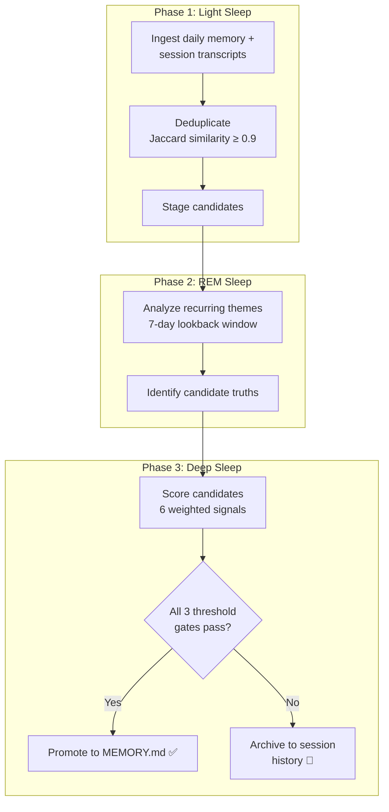

# Hermes Agent — 闭环技能创建

Hermes Agent（Nous Research，2026 年 2 月，99K+ GitHub stars，MIT 许可证）是目前自主技能创建领域最完整的生产系统，也是唯一完全开源的——你可以逐行阅读学习循环的代码，追踪每个技能创建触发器，拿实际源码验证本章的每一个论断。

仓库：`NousResearch/hermes-agent`

---

## 学习循环

Hermes 的核心是一个闭环：执行任务 → 定期自我评估 → 生成技能 → 更新记忆 → 下一个任务做得更好。

```
任务执行
     │
     ▼
自我评估检查点（每 15 次工具调用）
     │
     ├── 检测到可复用模式？ ──→ 生成 SKILL.md
     ├── 学到了重要事实？    ──→ 更新 MEMORY.md
     ├── 观察到用户偏好？    ──→ 更新 USER.md
     └── 现有技能有误？      ──→ skill_manage(EDIT)
     │
     ▼
恢复任务执行（使用更新后的技能 + 记忆）
```

### 触发条件

并非每个检查点都会触发技能创建。以下五类条件各自可以独立触发：

| 触发器 | 检测方式 | 动作 |
|--------|---------|------|
| 单个任务调用工具超过 5 次 | 统计指向同一目标的连续调用 | 创建含完整步骤的技能 |
| 出错后恢复 | 工具调用失败后换了方法成功 | 添加陷阱提醒或创建排障技能 |
| 用户纠正 | Agent 操作后用户消息要求改方向 | 更新 MEMORY.md 或 USER.md |
| 非显而易见的工作流 | 非常规的多步流程 | 创建工作流技能 |
| 重复模式 | 多个会话中出现相同操作序列 | 创建或合并技能 |

### 具体成效

```
任务："搭建一个包含 CI 的新 Python 项目"

会话 1（无技能）：
  25 次工具调用
  3 个错误（pytest 配置错误、pyproject.toml 缺少字段、CI 语法错误）
  12 分钟耗时

  → 创建的技能：
    - python-project-setup（pyproject.toml 模板、目录结构）
    - github-actions-python（带缓存的 CI 工作流）
  → 更新 MEMORY.md："用户偏好 ruff 而非 black+isort"

会话 5（有技能）：
  14 次工具调用
  1 个错误（忘记更新 CI 中的 Python 版本）
  7 分钟

  → 更新技能：github-actions-python（添加了 Python 版本矩阵）

会话 12（技能成熟）：
  8 次工具调用
  0 个错误
  4 分钟

  → 无需更新技能——过程已稳定
```

**25 次工具调用 → 日常使用一个月后降至 8-10 次。** 同类任务工具调用减少 68%，错误完全消除，耗时缩短 67%。

---

## SKILL.md — agentskills.io 标准

Hermes、OpenClaw 和 Claude Code 在技能格式上趋于一致，都采用遵循 agentskills.io 标准的 `SKILL.md` 文件。完整规范如下。

### 完整格式

```yaml
---
name: kubernetes-pod-debugging
description: >
  Diagnose and fix common Kubernetes pod failures including
  CrashLoopBackOff, ImagePullBackOff, OOMKilled, and
  pending pods. Covers log analysis, resource inspection,
  and common remediation steps.
version: 2.1.0
author: hermes-community
license: MIT
platforms: [linux, macos]
metadata:
  hermes:
    tags: [kubernetes, devops, debugging, containers]
    related_skills:
      - docker-container-debugging
      - kubernetes-deployment-management
    requires_toolsets: [terminal]
    config:
      default_namespace: default
      max_log_lines: 200
---

## When to Use

- Pod is in CrashLoopBackOff, ImagePullBackOff, or Error state
- Pod is stuck in Pending for more than 60 seconds
- Application inside pod is not responding but pod shows Running
- User mentions "pod won't start" or "container keeps restarting"
- After a deployment rollout that introduced failures

## Quick Reference

| Symptom | First Command | Likely Cause |
|---------|--------------|-------------|
| CrashLoopBackOff | `kubectl logs <pod> --previous` | Application error or missing config |
| ImagePullBackOff | `kubectl describe pod <pod>` | Wrong image name or missing credentials |
| OOMKilled | `kubectl describe pod <pod>` | Memory limit too low |
| Pending | `kubectl describe pod <pod>` | Insufficient resources or node selector |
| Running but unresponsive | `kubectl exec -it <pod> -- /bin/sh` | Deadlock or misconfiguration |

## Procedure

1. Identify the failing pod:
   kubectl get pods -n <namespace> | grep -v Running | grep -v Completed

2. Get pod details:
   kubectl describe pod <pod-name> -n <namespace>
   Look for: Events section, Conditions, Container statuses

3. Check logs (current + previous):
   kubectl logs <pod-name> -n <namespace>
   kubectl logs <pod-name> -n <namespace> --previous

4. Diagnose by symptom → apply fix → verify

## Pitfalls

- Don't delete pods to fix CrashLoopBackOff — the ReplicaSet recreates
  them with the same broken config. Fix the deployment spec.
- Check init containers separately — kubectl logs defaults to the main
  container.
- OOMKilled can be misleading — check all containers in the pod.
- Liveness probe failures look like crashes — check probe config.

## Verification

1. kubectl get pods -n <namespace> — all pods Running
2. kubectl rollout status deployment/<name> — rollout complete
3. kubectl exec <pod> -- curl -s localhost:<port>/health
4. Monitor for 5 minutes: kubectl get pods -w — no restarts
```

### 描述问题

来自 Hermes SkillDesignBook：

> *"技能没被触发，问题几乎从来不在指令——而在描述。"*

描述决定了技能的检索命中率。用户说"我的 pod 一直在重启"，Agent 靠匹配描述来找技能。如果描述只写了"Kubernetes pod 管理"而非"诊断和修复常见 Kubernetes pod 故障，包括 CrashLoopBackOff"，这个具体症状就无法命中。

写描述的要点：
- 包含用户可能提到的具体症状
- 既要有技术术语，也要有用户日常说法
- 2-4 句话，不超过 100 个 token
- 太模糊（"Kubernetes 相关"）→ 永远不会触发。太窄（"修复 CrashLoopBackOff"）→ 遗漏相关故障。

### 渐进式披露：三个层级

技能需要在 token 预算内加载到上下文。Hermes 用渐进式披露来控制成本：

| 层级 | 加载内容 | 每个技能的 token 数 | 时机 |
|------|---------|-------------------|------|
| **Level 0** | 仅名称 + 描述 | ~100 | 始终存在于系统提示中（或作为 FTS5 搜索结果） |
| **Level 1** | 完整技能内容 | ~500-1,500 | Agent 判断技能相关时 |
| **Level 2** | 特定章节 + 参考 | ~100-300 | Agent 只需某个章节时（如仅需"陷阱"部分） |

200 个技能在 128K 上下文窗口下的 token 经济学：

```
未优化：  200 × 800 平均 token = 160,000 token（超出上下文）
FTS5 筛选后：  ~10 个候选 × 100 token = 1,000 token（Level 0）
              + 3 个激活技能 × 800 token = 2,400 token（Level 1）
              = 总计 3,400 token（上下文的 2.7%）

节省：97.9%
```

---

## 三层记忆

### 第一层：工作上下文

就是标准的上下文窗口：消息、工具调用结果、当前任务。会话结束即消失。

### 第二层：技能文档

持久化的技能文件，存储在 `~/.hermes/skills/` 下，通过 SQLite FTS5（全文搜索 5）建立索引，采用 porter 词干提取和 unicode61 分词：

```python
def search_skills(self, query: str, limit: int = 10) -> list[Skill]:
    """Search skills using FTS5 BM25 ranking."""
    results = self.db.execute("""
        SELECT name, rank
        FROM skill_index
        WHERE skill_index MATCH ?
        ORDER BY rank
        LIMIT ?
    """, (query, limit))
    return [self.get_skill(row["name"]) for row in results]
```

porter 词干提取让"debugging"能匹配到"debug"，BM25 排名按相关性打分。Agent 先搜索检索匹配技能，再按需以 Level 1 或 Level 2 加载。

技能还支持 LLM 摘要：当技能库规模较大时，Agent 可以把相关技能聚类汇总成更高层级的条目，同时引用原始技能。

### 第三层：持久化事实（Honcho 集成）

Hermes 集成了 Honcho（Plastic Labs 开发），在文件级 `USER.md` 之上提供更深层的用户建模。

**辩证式用户建模**——Honcho 不只是存事实，还对用户历史做 LLM 推理，生成深层洞察：

```
基础上下文（已存储事实）：
  "用户偏好 Python，使用 pytest，从事 ML 管道工作"

辩证推理第 1 轮：
  "用户的测试风格表明他们重视可复现性而非速度。
   他们总是要求在随机操作中设置 seed。"

辩证推理第 2 轮：
  "用户的 ML 管道工作涉及频繁的数据格式变更。
   他们将受益于在管道边界处进行 schema 验证。"
```

三个配置项控制用户建模的深度：

| 参数 | 可选值 | 控制内容 |
|------|-------|---------|
| `contextCadence` | `every_message`、`every_n_messages`、`on_topic_change` | 多久注入一次用户上下文 |
| `dialecticCadence` | `every_session`、`every_n_messages`、`on_demand` | 多久运行一次辩证推理 |
| `dialecticDepth` | 1-3 | 推理轮数 |

进化阶段：

```
会话 1-3（冷启动）：
  仅有基础上下文。无辩证推理。Agent 提出澄清性问题。

会话 4-20（热身期）：
  基础上下文已建立。辩证推理深度 1。
  Agent 能自信地做出符合偏好的选择。

会话 20+（深度期）：
  全面的用户画像。辩证推理深度 2-3。
  Agent 变得主动——在用户提问前就建议模式。
```

---

## skill_manage 工具

Agent 可以在会话中直接修补技能，不用全量重写——三种操作覆盖所有场景：

| 操作 | 使用时机 | 变更内容 |
|------|---------|---------|
| `ADD` | 发现新的可复用模式 | 创建新的 SKILL.md 文件 |
| `EDIT` | 现有步骤有误或不完整 | 替换章节内容 |
| `APPEND` | 新发现陷阱、提示或验证步骤 | 向现有章节追加内容 |

例如，Agent 调试 Kubernetes pod 时发现 readiness probe 故障会产生类似崩溃的症状：

```python
await self.skill_manage(
    action="APPEND",
    name="kubernetes-pod-debugging",
    section="Pitfalls",
    content="""
- **Readiness probe failures vs. liveness probe failures** — readiness probe
  failures remove the pod from service endpoints but don't restart it.
  Liveness probe failures restart the pod. Check both:
  `kubectl describe pod <pod> | grep -A5 'Readiness\\|Liveness'`
"""
)
```

技能通过使用不断进化。一个 Kubernetes 调试技能可能起初只有 5 条陷阱提醒，三个月后随着新故障模式的出现增长到 12 条。Agent 从不重新生成整个技能，只做增量修补。

---

## 部署

### 六种终端后端

| 后端 | 使用场景 | 隔离级别 |
|------|---------|---------|
| `local` | 开发、个人使用 | 无（在宿主机上运行） |
| `docker` | 标准部署 | 容器级别 |
| `ssh` | 远程服务器 | 网络级别 |
| `daytona` | 云开发环境 | 完整 VM |
| `singularity` | HPC 集群 | 容器（无 root） |
| `modal` | 无服务器计算 | 函数级别 |

技能库在所有后端上行为一致。一个"使用 Docker Compose 部署"的技能，不管是本地执行还是通过 SSH 执行都能正常工作——终端抽象层屏蔽了差异。

### 单一网关，九个平台

```
                    ┌──────────────┐
                    │  Hermes Core  │
                    │  (run_agent)  │
                    └──────┬───────┘
                           │
     ┌──────────┬──────────┼──────────┬──────────┐
     │          │          │          │          │
  Telegram  Discord     Slack     WhatsApp   Signal
     │          │          │          │          │
  Matrix    iMessage    WeChat      CLI
```

每个适配器把消息规范化为统一格式。在 Telegram 上创建的技能到了 Discord 照样能用；通过 Slack 积累的记忆，切换到 CLI 依然有效。进化与平台无关。

### 200+ 模型

支持 Nous Portal、OpenRouter、OpenAI、Anthropic 和自定义端点（包括本地 Ollama）：

```yaml
providers:
  - name: nous_portal
    models: [hermes-3-70b, hermes-3-405b]
  - name: openrouter
    models: [claude-sonnet-4, gpt-4o, deepseek-v3]
  - name: openai
    models: [gpt-4o, gpt-4o-mini, o3]
  - name: anthropic
    models: [claude-sonnet-4, claude-opus-4]
  - name: local
    models: [any-ollama-model]
    api_base: http://localhost:11434/v1
```

技能和记忆与底层模型无关。用 Hermes-3-70B 创建的技能，切换到 Claude Sonnet 4 后一样有效。进化系统不绑定特定模型。

---

## Atropos RL 管道

**注意：** Atropos 用于训练研究，不是生产运行时的进化机制。收录于此是因为它属于 Hermes 代码库的一部分，且确实有团队在用。

管道：

```
生产 Agent 会话
  → 每个会话自动记录到 SQLite（轨迹）
  → 结构化记录：消息、工具调用、技能激活、
    自我评估结果、用户反馈信号
  → 批量导出为 ShareGPT 格式
  → RLHF / DPO / GRPO 训练

下一代 Hermes 模型
  → 更擅长技能创建，更准确的自我评估
  → 创建更高质量的轨迹数据
  → 循环继续
```

Hermes 可以跑无头批处理模式——多个 Agent 工作进程并行执行数千任务来收集轨迹，同时支持检查点。这就是 Nous Research 从生产级交互中生产训练数据的方式。

对大多数团队来说，运行时进化系统（技能 + 记忆 + 自我评估）才是核心价值所在。Atropos 值得有训练能力的团队关注——它打通了运行时经验到模型改进的闭环。

---

## Dreaming：后台记忆整合

所有生产 Agent 中最精密的自进化机制。Dreaming 是 Hermes 的后台记忆整合系统——灵感来自人类睡眠科学：大脑在睡眠中重放并整合记忆。

**默认关闭，需手动开启。** 在任意 Hermes 会话中执行 `/dreaming on` 即可启用，之后作为托管 cron 任务运行——默认每天凌晨 3 点。

### 三阶段流程



#### 阶段 1：浅睡眠——摄取与去重

Dreaming 的第一步是收集当天所有原始材料：

1. **摄取** —— 读取每日记忆文件（`memory/YYYY-MM-DD.md`）和过去 24 小时的全部会话记录
2. **去重** —— 用 Jaccard 相似度把每个候选事实和现有 MEMORY.md 条目及其他候选做比较，阈值 **0.9**（90% token 重叠即视为重复）。这样就不会出现"用户偏好 ruff"和"用户喜欢 ruff 胜过 black"同时存在的情况
3. **暂存** —— 去重后留下的候选进入暂存区，等待阶段 2 处理

#### 阶段 2：REM 睡眠——主题分析

计算量最大的阶段。Agent 在 **7 天回溯窗口**内分析暂存候选：

1. **主题提取** —— 用 embedding 相似度对暂存候选按主题聚类
2. **跨会话模式检测** —— 识别 7 天内在多个会话中反复出现的事实、偏好或行为
3. **候选真相识别** —— 在 3 个以上会话中措辞一致地出现的模式，标记为"候选真相"

7 天窗口是刻意的设计取舍：足够长，能捕获每周级别的模式；又足够短，不会把过时信息提升上去。周一提了一次之后再没出现的偏好不会成为候选真相；周一、周三、周五都提到的则会。

#### 阶段 3：深度睡眠——评分与提升

每个候选真相按六个加权信号打分，再过三道阈值门控。

### 排名信号（加权）

| 信号 | 权重 | 衡量内容 |
|------|------|---------|
| **相关性** | 0.30 | 对用户核心使用场景的重要程度 |
| **频率** | 0.24 | 跨会话出现的频率 |
| **查询多样性** | 0.15 | 是否在不同类型的查询/任务中出现 |
| **时效性** | 0.15 | 最近一次被观察到的时间 |
| **整合度** | 0.10 | 是否已从多个来源部分整合 |
| **概念丰富度** | 0.06 | 与其他已知事实的关联程度 |

最终得分是加权和：`score = 0.30×相关性 + 0.24×频率 + 0.15×多样性 + 0.15×时效性 + 0.10×整合度 + 0.06×丰富度`

### 提升阈值（全部必须通过）

| 门控 | 阈值 | 目的 |
|------|------|------|
| **minScore** | 0.8 | 综合质量门槛，过滤低信号候选 |
| **minRecallCount** | 3 | 跨会话被回忆/引用的最少次数 |
| **minUniqueQueries** | 3 | 出现在不同查询上下文中的最少次数 |

三道门控必须全部通过。得分再高，回忆实例只有 2 次也不行；被回忆了 10 次，但始终在同一个查询上下文中出现，同样不行。三重门控的设计意图是保守——宁可漏掉有效记忆，也不要让噪声混进来。

### 记忆架构（4 层）

Dreaming 运行在 Hermes 的四层记忆架构之上：

| 层级 | 内容 | Token 预算 | 持久性 | 访问方式 |
|------|------|-----------|--------|---------|
| **第 1 层：提示记忆** | MEMORY.md（~800 token）+ USER.md（~500 token） | ~1,300 token | 永久 | 始终在系统提示中 |
| **第 2 层：会话归档** | 过去的会话记录和每日日志 | 无限 | 90 天滚动窗口 | 通过 `session_search` 工具搜索 |
| **第 3 层：技能** | 来自复杂任务的过程性记忆（SKILL.md 文件） | 每个技能 ~500-1,500 token | 永久 | FTS5 搜索 + 渐进式披露 |
| **第 4 层：外部提供者** | 8 个可插拔记忆后端 | 因提供者而异 | 因提供者而异 | API 调用 |

#### 第 1 层：提示记忆——始终存在

MEMORY.md 和 USER.md 注入每条系统提示。这是 Agent 的"常驻"记忆——应该影响每一次回复的事实。Token 预算很紧（MEMORY.md ~800，USER.md ~500），因为要和技能、指令争抢上下文窗口空间。

Dreaming 的提升管道是事实进入 MEMORY.md 的主要通道。手动插入可以但不推荐——Dreaming 确保只有验证过的高价值事实才占用这块寸土寸金的空间。

#### 第 2 层：会话归档——可搜索的历史

所有过往会话都会归档，通过 `session_search` 工具可搜索。Agent 能查询自己的历史：

```python
results = await session_search(
    query="user's preferred testing framework",
    lookback_days=30,
    max_results=5
)
```

会话归档是 Dreaming 的原始材料，日常操作中也可用——当 Agent 需要回忆 MEMORY.md 中没有的信息时，就会搜索归档。

#### 第 3 层：技能——过程性记忆

技能是 Agent 的"怎么做"记忆，通过前文描述的自我评估检查点创建。Dreaming 不直接创建技能，但会把技能有效性的观察提升到 MEMORY.md（例如"kubernetes-pod-debugging 技能处理 CrashLoopBackOff 很好用，但会漏掉 init container 问题"）。

#### 第 4 层：外部提供者——8 个可插拔后端

Hermes 支持 8 个外部记忆提供者，可以和内置记忆并行启用：

| 提供者 | 类型 | 专长 |
|--------|------|------|
| **Honcho** | 辩证式用户建模 | 多轮推理构建深度用户画像 |
| **Mem0** | 托管记忆服务 | 云端托管，跨设备同步 |
| **Hindsight** | 时序记忆 | 时间感知回忆，支持记忆衰减建模 |
| **Supermemory** | 层次化存储 | 多层记忆，自动提升 |
| **RetainDB** | 向量数据库 | 基于 embedding 的语义搜索 |
| **ByteRover** | 对话记忆 | 针对对话场景优化的存取 |
| **OpenViking** | 开源记忆服务 | 自托管，注重隐私 |
| **Holographic** | 关联记忆 | 关联式回忆（记忆网络） |

每个提供者作为额外记忆源接入第 4 层。Agent 可以同时查询所有已启用提供者并合并结果。Dreaming 也可以把提升的事实同时写入外部提供者和 MEMORY.md。

---

## 40+ 内置技能

Hermes 自带 40 多个内置技能，涵盖 10 个类别。这是每个 Hermes Agent 的"出厂记忆"——不用学就会。

| 类别 | 示例技能 | 数量 |
|------|---------|------|
| **软件开发** | 代码审查、调试、重构、依赖管理 | 8 |
| **研究** | 网络搜索、论文摘要、事实核查、文献综述 | 5 |
| **生产力** | 任务管理、日历集成、笔记、会议总结 | 6 |
| **数据科学** | 数据分析、可视化、统计检验、数据集清洗 | 4 |
| **图表** | Mermaid 图、流程图、架构图、时序图 | 3 |
| **邮件** | 撰写、摘要、分类、后续跟踪 | 4 |
| **GitHub** | PR 审查、Issue 分类、仓库分析、CI 调试 | 4 |
| **媒体处理** | 图像分析、音频转录、视频摘要 | 3 |
| **智能家居** | 设备控制、自动化规则、场景管理 | 2 |
| **MLOps** | 模型部署、实验追踪、管道调试 | 3 |

内置技能有两重作用：

1. **基线能力** —— Agent 第一次会话就能干活，不用先学
2. **进化模板** —— Agent 自己创建的技能会沿用内置技能的格式和质量标准，因为内置技能就是它见过的范例

内置技能还是自我评估的基准。遇到任何内置或已学技能都覆盖不了的任务类型，就是一个强烈的技能创建信号。

---

## 总结

```
┌──────────────────────────────────────────────────────────────┐
│                       Hermes Agent                            │
├──────────────────────────────────────────────────────────────┤
│  记忆：                                                       │
│    第 1 层：提示记忆（MEMORY.md + USER.md，~1300 token）       │
│    第 2 层：会话归档（可搜索，90 天窗口）                       │
│    第 3 层：技能（~/.hermes/skills/，FTS5 索引）               │
│    第 4 层：外部提供者（8 个可插拔后端）                        │
│                                                              │
│  Dreaming（需主动开启，每天凌晨 3 点）：                        │
│    浅睡眠 → REM 睡眠 → 深度睡眠                               │
│    6 个排名信号，3 个提升门控                                   │
│    minScore: 0.8 | minRecallCount: 3 | minUniqueQueries: 3   │
│                                                              │
│  自我评估：15 次调用检查点                                     │
│  5 个触发条件 → 技能创建/更新                                  │
│  skill_manage: ADD / EDIT / APPEND                           │
│                                                              │
│  40+ 内置技能，涵盖 10 个类别                                  │
│  6 种后端 × 9 个平台 × 200+ 模型                              │
│  Atropos：轨迹 → ShareGPT → 微调                             │
└──────────────────────────────────────────────────────────────┘
```

Hermes 是开源领域最完整的自进化系统。与 Claude Code 的关键区别在于：Hermes 的进化由 Agent 自主驱动——自己创建技能、写入记忆、评估表现、改进流程。Claude Code 提供的是进化平台，Hermes 提供的是自主学习循环。

Dreaming 带来了其他生产 Agent 不具备的维度：**离线整合**。用户休息时，Agent 仍在审查、去重、评分和提升记忆。这是目前生产系统中最接近生物记忆整合的机制。

代价也很明显：Agent 驱动的进化虽然强力（一个月后工具调用减少 68%），但可能产生漂移、积累噪声，或创建看似正确实则有误的技能。15 次调用检查点、结构化评估标准和 Dreaming 的三重门控在一定程度上缓解了这些问题，但系统质量归根到底取决于底层模型的判断力。
