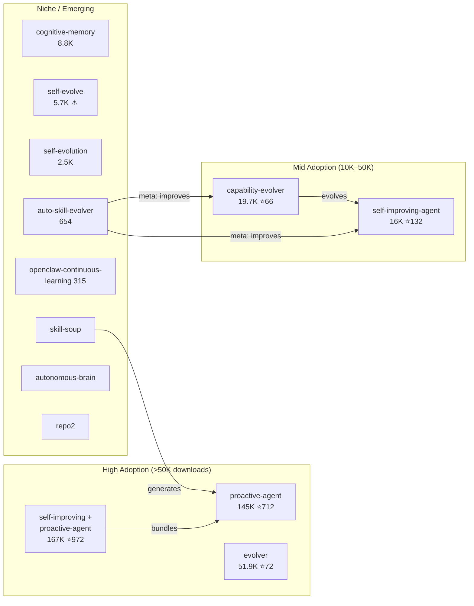
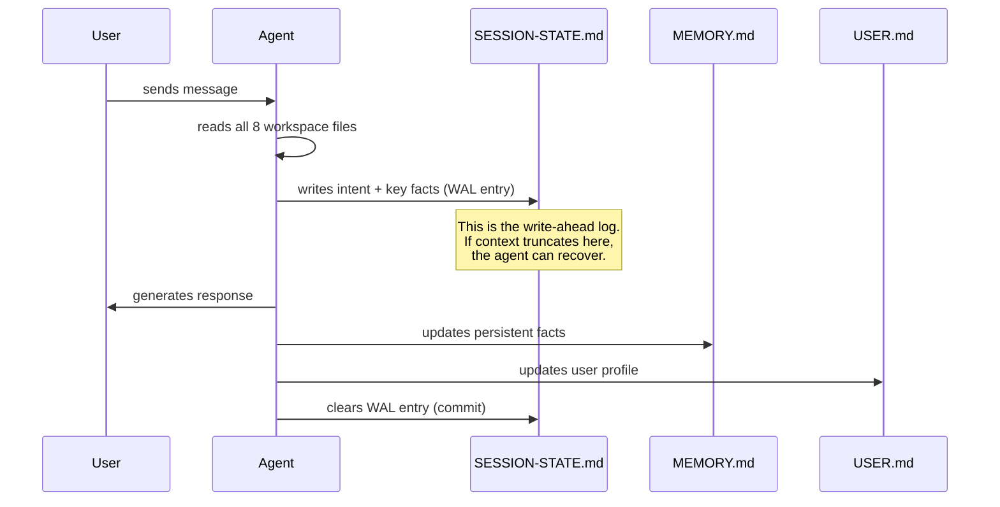

# OpenClaw / ClawHub — 自我改进 Agent 技能

OpenClaw（350K+ GitHub stars）是开源的个人 AI Agent。ClawHub 是它的技能市场：13K+ 个技能，150 万+ 次下载。你可以给 Agent 安装一个让它学会自我改进的技能——这句话是这个生态系统里最有意思的事。

Agent 本身不内置学习循环。社区把学习循环*当技能来做*——可以安装、可以组合，还能通过 ClawHub 共享。其中四个自进化技能获得了可观的采用量。

---

## ClawHub 上完整的自进化生态系统

下表列出了截至 2026 年 4 月 ClawHub 上所有已知的自进化技能。有些已大规模部署，有些还是小众实验。它们合在一起，就是 OpenClaw 社区构建学习循环的完整图谱。

| 技能 | 下载量 | Stars | 版本 | 功能 |
|------|--------|-------|------|------|
| **self-improving + proactive-agent** | 167K | 972 | — | 自我反思 + 自我批评 + 自我学习。采用量最大的组合。 |
| **proactive-agent** | 145K | 712 | — | Hal 栈：SOUL.md + MEMORY.md + HEARTBEAT.md + WAL 协议 |
| **evolver** | 51.9K | 72 | v1.40.4 | 自进化引擎：运行时历史分析 + 协议约束下的 Agent 行为演进 |
| **capability-evolver** | 19.7K | 66 | v1.52.0 | 基因组进化协议（GEP）：genes.json + capsules.json + events.jsonl |
| **self-improving-agent** | 16K | 132 | — | 固化管道：.learnings/ → AGENTS.md/TOOLS.md/SOUL.md |
| **cognitive-memory** | 8.8K | 27 | — | 多存储记忆：情景记忆、语义记忆、过程性记忆、核心记忆 |
| **self-evolve** | 5.7K | — | — | 自主进化：感知 → 搜索 → 实验 → 选择 → 固化。⚠ 被标记为可疑。 |
| **self-evolution** | 2.5K | — | — | 课程式学习 + 能力映射 + 迁移学习验证 |
| **auto-skill-evolver** | 654 | — | — | 元技能：通过追踪 + 反馈驱动改进*其他*技能 |
| **openclaw-continuous-learning** | 315 | — | — | 基于直觉的模式检测 → 带置信度评分的原子学习 |
| **skill-soup** | — | — | — | 自主技能生成 Agent：创建并发布技能 |
| **autonomous-brain** | — | — | — | 主动监控 + 智能决策 + 持续学习 |
| **repo2** | — | — | — | 自进化引擎，支持自修补和持续守护进程 |

这些不是研究原型，而是真实用户在用的东西——安装在生产环境中运行，下载量反映的是通过 ClawHub 市场的实际采用情况。



---

## self-improving + proactive-agent（167K 下载，972 stars）——最广泛采用的组合

ClawHub 上安装量最大的自进化配置。它把 **proactive-agent** 的 Hal 栈与自我反思、自我批评层捆绑在一起，让 OpenClaw 不仅能维护持久状态，还会主动审视和改进自身行为。

### 三种 Self-* 能力

| 能力 | 机制 | 触发时机 |
|------|------|---------|
| **自我反思** | 每次回复后，Agent 评估是否满足了用户意图 | 每轮 |
| **自我批评** | 结构化的对抗性审视——Agent 对自己的计划提出反对意见 | 复杂多步骤任务开始前 |
| **自我学习** | 把检测到的模式和纠正写入持久化工作区文件 | 反思或批评中发现了可复用的洞察 |

### 本地工作区

所有状态存放在用户机器的 `~/self-improving/` 下：

```
~/self-improving/
├── reflections/           # 每次会话的反思日志
│   └── 2026-04-19.md
├── criticisms/            # 对抗性自我批评记录
├── learnings/             # 已验证的洞察，等待提升
├── SOUL.md                # 行为规则（来自 proactive-agent）
├── MEMORY.md              # 持久化事实
├── USER.md                # 积累的用户画像
└── SESSION-STATE.md       # WAL 恢复状态
```

### 安全评级

ClawHub 将此技能评为 **"Benign"（安全）**——最高信任级别。它只在自己的工作区目录中读写，不执行任意 shell 命令，不动其他已安装的技能。自我反思和自我批评循环完全在 LLM 生成过程中完成，没有外部调用。

这一点很重要，因为大多数自进化技能都带安全警告。"Benign" 评级让它成为给 OpenClaw Agent 加自我改进能力的最安全选项。

---

## proactive-agent（145K 下载，712 stars）——Hal 栈

下载量最大的单体自进化技能。它让 OpenClaw 变成一个有状态、能记忆、还能自主做后台操作的 Agent。实现相当有野心：8 个工作区文件、一套预写日志协议，外加一个借鉴数据库内核设计的压缩恢复系统。

### 8 个工作区文件

| 文件 | 用途 | 写入时机 |
|------|------|---------|
| `ONBOARDING.md` | 首次会话问卷结果 | 安装时写入一次 |
| `SOUL.md` | Agent 的个性、价值观、行为规则 | 用户设定，很少改动 |
| `USER.md` | 累积的用户画像（偏好、上下文、历史） | 持续更新 |
| `AGENTS.md` | Agent 维护的操作笔记 | 学到新东西时更新 |
| `MEMORY.md` | 持久化的事实和知识库 | 每次会话更新 |
| `SESSION-STATE.md` | 当前会话状态、活跃任务、阻塞项 | 每次交互更新 |
| `HEARTBEAT.md` | 自主 cron 计划和状态 | 由 cron 系统更新 |
| `memory/YYYY-MM-DD.md` | 每日会话日志 | 每天创建 |

### WAL 协议（预写日志）——详解

借鉴自数据库系统（PostgreSQL 的 WAL、SQLite 的日志）。核心不变量：**对话中途上下文窗口被截断时，不丢失任何状态**。每个关键事实在 Agent 生成回复*之前*就已写入磁盘。



WAL 协议分三个阶段：

| 阶段 | 操作内容 | 类比 |
|------|---------|------|
| **1. 准备** | Agent 读取全部 8 个文件，重建内部状态 | 数据库读取当前状态 |
| **2. 预写** | 回复*之前*先把意图、关键事实和工作上下文写入 SESSION-STATE.md | 数据库提交前写 WAL |
| **3. 提交** | 回复完成、MEMORY.md/USER.md 更新后，SESSION-STATE.md 中的 WAL 条目标记为完成 | 数据库提交并清除 WAL |

如果 Agent 在阶段 2 和阶段 3 之间崩溃（上下文截断），SESSION-STATE.md 中未提交的 WAL 条目包含恢复所需的一切信息。

### 工作缓冲区——压缩危险区

上下文窗口填充超过 70% 时，Agent 进入"压缩危险区"，会主动把最小可行上下文写入 SESSION-STATE.md 的工作缓冲区：

```markdown
## Working Buffer (auto-captured at 72% context)
- Current task: Migrating user database from PostgreSQL 14 to 16
- Completed steps: backup verified, pg_upgrade dry-run passed
- Next step: run pg_upgrade --link on production
- Critical context: user wants zero-downtime, using pglogical for replication
- Active blockers: none
- User preferences recalled: prefers verbose logging, wants Slack notifications
```

工作缓冲区就是 Agent 的"黑匣子"。截断发生后，恢复时最先读取的就是它。

### 压缩恢复——逐步过程

实际发生上下文截断时，Hal 栈按以下步骤恢复：

```
步骤 1：检测
  Agent 发现上下文缩小了——可能是：
  (a) 系统通知："上下文已被压缩"
  (b) 刚才还在的对话历史不见了
  (c) SESSION-STATE.md 里有未提交的 WAL 条目

步骤 2：加载工作缓冲区
  读取 SESSION-STATE.md → 取出工作缓冲区
  拿到：当前任务、已完成步骤、下一步、阻塞项

步骤 3：加载持久状态
  读取 MEMORY.md → 持久化事实和知识
  读取 USER.md → 用户画像和偏好
  读取 AGENTS.md → 操作笔记

步骤 4：加载每日日志
  读取 memory/YYYY-MM-DD.md → 当天的会话记录
  提供近期对话的摘要

步骤 5：重建
  综合所有加载的状态，拼出一个连贯的心智模型
  Agent 现在掌握了：
  - 在做什么（工作缓冲区）
  - 知道什么（MEMORY.md）
  - 用户是谁（USER.md）
  - 今天发生了什么（每日日志）

步骤 6：恢复
  像截断从未发生一样继续对话
  用户可能完全感觉不到——Agent 的下一个回复
  上下文完整，因为关键状态全部保留
```

精妙之处在于恢复本质上就是"读取 Agent 一直在维护的那些文件"。不需要专门的恢复基础设施——工作区文件*本身就是*恢复基础设施。

### 自主 Cron（systemEvent）与提示式 Cron（agentTurn）

Hal 栈内置了一套 cron 系统，有两种截然不同的执行模型：

| | 自主 Cron | 提示式 Cron |
|---|---|---|
| **触发方式** | `systemEvent`——定时器自动触发 | 用户发消息时触发预定检查 |
| **执行上下文** | 独立的 `agentTurn`——Agent 自行运行，无需用户输入 | 在现有对话轮次内 |
| **用户可见性** | 后台运行——用户可能完全不知道 | 内联——用户直接看到结果 |
| **典型用途** | 记忆整合、心跳更新、定期报告 | "帮我查一下 PR 是否合并了"、每日站会提醒 |
| **HEARTBEAT.md 条目** | `type: systemEvent`、`status: completed/failed`、`timestamp` | `type: agentTurn`、`triggered_by: user_message` |

**自主 Cron** 是更有意思的机制，它实现了真正的后台 Agent 操作：

1. **记忆维护** —— 整合每日日志、去重 MEMORY.md、归档过时条目
2. **主动监控** —— 按计划检查外部服务、仓库或 API
3. **定期任务** —— 发送提醒、生成报告、跑周期性工作流
4. **自我维护** —— 清理工作区文件、验证技能完整性

`systemEvent` 触发意味着 Agent 醒来、干完活、再回到睡眠——全程无需用户参与。HEARTBEAT.md 记录每次自主运行：

```markdown
## Heartbeat Log

| Timestamp | Type | Task | Status | Duration |
|-----------|------|------|--------|----------|
| 2026-04-19T03:00:00Z | systemEvent | Memory consolidation | ✅ completed | 12s |
| 2026-04-19T03:00:12Z | systemEvent | Stale entry cleanup | ✅ completed | 3s |
| 2026-04-19T09:15:00Z | agentTurn | PR status check | ✅ completed | 8s |
```

**提示式 Cron** 更简单：用户发送任意消息时，Agent 查看 HEARTBEAT.md 中是否有到期任务，有就内联执行。适合那些不需要精确定时、"下次有机会再做"的任务。

---

## evolver（51.9K 下载，72 stars，v1.40.4）——自进化引擎

下载量排名第三的自进化技能。**evolver** 走了一条和 Hal 栈不同的路：不用工作区文件存记忆，而是分析 Agent 的*运行时历史*——过去的工具调用、报错和用户纠正——然后在协议约束下提出 Agent 行为的修改方案。

### 核心架构

```
运行时历史（工具调用、错误、纠正）
       │
       ▼
┌─────────────────────────┐
│   历史分析器              │
│   （模式提取）            │
└──────────┬──────────────┘
           │
           ▼
┌─────────────────────────┐
│   进化提议器              │
│   （协议约束）            │
└──────────┬──────────────┘
           │
           ▼
┌─────────────────────────┐
│   自修补器                │
│   （应用 + 验证）         │
└──────────────────────────┘
```

### 协议约束下的进化

关键设计选择：evolver 不允许 Agent 随意自我修改。所有提议的变更都必须符合预定义的**进化协议**——一套明确规定以下内容的模式：

- 允许修改哪些文件（白名单）
- 每个进化周期最多改多少（token 预算）
- 回滚元数据必须随每个变更保存（可逆性保障）
- 每次修补后必须跑验证步骤

这就是 evolver 和 `self-evolve`（无限制自我修改）的根本区别。协议是护栏——Agent 可以改进，但只能在划定的范围内。

### 自修补

分析器识别出改进机会时：

1. **生成补丁** —— 针对当前配置生成结构化 diff
2. **协议校验** —— 违反约束则直接拒绝
3. **应用补丁** —— 写入对应文件
4. **验证** —— 跑完整性检查（Agent 对测试 prompt 是否还能正确响应？）
5. **记录** —— 保存补丁内容、修改理由和验证结果

### 持续守护进程

与其他技能只在用户交互时才运行不同，evolver 可以作为**持续守护进程**运行。它定期扫描运行时历史——即使在用户会话间隔期——把进化提案排队。用户下次交互时，Agent 可以说："我在空闲期间发现了 3 个潜在改进，要看看吗？"

---

## capability-evolver（19.7K 下载，66 stars，v1.52.0）——元技能

这就是基因组进化协议（GEP）。它把 Agent 的能力看作基因组，通过结构化循环不断进化。这是 ClawHub 上设计最系统化的自进化技能——实现也最复杂，历史上争议最大。

### GEP 协议：三个持久化文件

| 文件 | 格式 | 内容 | 典型大小 |
|------|------|------|---------|
| `genes.json` | JSON 数组 | 可复用模式——Agent 发现的成功策略 | 50-200 条 |
| `capsules.json` | JSON 数组 | 已验证的修复——特定问题的特定解决方案，带上下文 | 20-100 条 |
| `events.jsonl` | JSON Lines | 审计日志——每个进化事件带时间戳和分类 | 无限增长，每周轮换 |

**genes.json** 就是基因组。每个基因代表一条学到的策略：

```json
{
  "id": "gene-0042",
  "name": "retry-with-backoff",
  "pattern": "When API call fails with 429, retry with exponential backoff",
  "confidence": 0.94,
  "usage_count": 37,
  "last_used": "2026-04-18T14:22:00Z",
  "origin": "observed_failure_recovery"
}
```

**capsules.json** 存储原子级修复——比基因更具体：

```json
{
  "id": "cap-0018",
  "trigger": "pytest fails with 'fixture not found'",
  "fix": "Check conftest.py location — must be in test root or parent",
  "validated": true,
  "success_rate": 0.91
}
```

**events.jsonl** 是审计日志。每次扫描、提案、验证和应用都被记录在案：

```jsonl
{"ts":"2026-04-19T03:00:00Z","type":"scan","genes_checked":142,"gaps_found":3}
{"ts":"2026-04-19T03:00:02Z","type":"propose","gene":"gene-0143","action":"create","reason":"repeated pattern in last 5 sessions"}
{"ts":"2026-04-19T03:00:05Z","type":"validate","gene":"gene-0143","result":"pass","baseline_regression":false}
{"ts":"2026-04-19T03:00:06Z","type":"apply","gene":"gene-0143","status":"committed"}
```

### 进化循环

```
扫描 → 分析 → 提议 → 验证 → 应用
  │                                      │
  └──────────── 反馈 ────────────────────┘
```

1. **扫描**：检查近期交互中的能力缺口、失败和低效之处
2. **分析**：与已知模式（基因）和已验证修复（胶囊）做比对
3. **提议**：生成候选改进方案及预期效果
4. **验证**：用已知正确的基线测试候选方案
5. **应用**：把变更提交到 Agent 的配置或技能中

### 六种策略

根据团队对风险的容忍度，可以选择不同的进化模式：

| 策略 | 行为 | 基因突变率 | 胶囊创建率 |
|------|------|-----------|-----------|
| `balanced` | 默认。改进与稳定兼顾 | 中等 | 中等 |
| `innovate` | 倾向于尝新，风险容忍度更高 | 高 | 低 |
| `harden` | 聚焦健壮性和错误消除，尽量少做实验 | 低 | 高 |
| `repair-only` | 只修有问题的，不主动改进 | 无 | 高 |
| `early-stabilize` | 新部署后的快速稳定化 | 低 | 中等 |
| `steady-state` | 变更最小化，只在指标恶化时才进化 | 极低 | 低 |

### 三种执行模式

| 模式 | 人工参与 | 使用场景 |
|------|---------|---------|
| **全自动** | 无——Agent 自行决策和执行 | 个人助手、低风险任务 |
| **人在回路中（审核）** | Agent 提议，人类批准 | 生产系统、团队环境 |
| **持续后台（循环）** | 按计划运行，提案排队等审核 | 企业部署 |

### 安全历史：整改

capability-evolver 的早期版本（v1.40 之前）在配置模板中**硬编码了凭据**，并且有一个遥测端点会把基因/胶囊数据传到外部服务器——实质上是对 Agent 学到的策略进行**数据泄露**。

社区通过 ClawHub 安全审计发现了这些问题，具体包括：
- 默认 `config.json` 模板中硬编码的 API key
- 把 `genes.json` 内容发送到第三方分析服务的遥测端点
- 没有任何数据传输的选择加入/退出机制

**整改（v1.40+）：** 移除所有硬编码凭据，彻底删掉遥测端点，现在完全离线运行。events.jsonl 审计日志只保留在本地。这就是 capability-evolver 下载量（19.7K）低于其技术含量应有水平的原因——早期信任被破坏了。

---

## self-improving-agent（16K 下载，132 stars）——固化管道

这个技能实现了一套明确的学习模式：发现差距 → 搜索方案 → 测试验证 → 把胜出者提升为永久配置。核心概念叫**固化**——从试探性观察变成永久操作知识。

### 改进循环

```
发现差距
    │
    ▼
搜索方案（网络、文档、现有技能）
    │
    ▼
设计实验（假设 + 测试）
    │
    ▼
运行实验
    │
    ▼
选出胜出者（多个候选时）
    │
    ▼
固化（提升为永久配置）
```

### 固化管道：.learnings/ → 永久配置

原始学习以带时间戳的 markdown 文件存放在 `.learnings/` 中。管道分三个阶段：

```
阶段 1：捕获
  .learnings/2026-04-19_pytest-config.md
  （原始观察，单个实例，未验证）
      │
      ▼
阶段 2：验证
  Agent 遇到相同模式 3 次以上
  .learnings/ 中积累了一组相关文件
      │
      ▼
阶段 3：固化（提升到永久目标）
  综合洞察 → AGENTS.md 或 TOOLS.md 或 SOUL.md
  原始 .learnings/ 文件 → 归档
```

| 提升目标 | 使用时机 | 示例 |
|---------|---------|------|
| `.learnings/` | 初始捕获——原始、未验证 | "pytest 需要 conftest.py 在根目录" |
| `AGENTS.md` | Agent 应始终具备的操作知识 | "pytest fixture 失败时，先查 conftest.py 位置" |
| `TOOLS.md` | 工具相关的使用模式和注意事项 | "pytest：conftest.py 必须在测试根目录或祖先目录中" |
| `SOUL.md` | 行为规则和个性调整 | "调试测试失败时，先查配置再查代码" |
| `CLAUDE.md` | Claude Code 记忆集成（跨平台） | 同样内容，按 Claude Code 记忆系统的格式 |

### 心跳驱动的整合

技能内置了一个 cron，定期扫描 `.learnings/` 中出现 3 次以上相关问题的项目。发现聚类后：

1. 按主题分组相关学习（基于关键词重叠和语义相似度）
2. 综合出一条精炼的洞察，抓住共同模式
3. 把综合结果提升到对应的目标文件（AGENTS.md、TOOLS.md 等）
4. 将原始学习文件归档到 `.learnings/archive/`

这样 `.learnings/` 目录不会无限膨胀，同时确保反复出现的模式能毕业进入永久记忆。3 次的阈值是刻意设计的——既能过滤掉一次性观察，又能提升真正反复出现的模式。

---

## auto-skill-evolver（654 下载）——元技能

一个改进*其他技能*的元技能。大多数自进化技能改进的是 Agent 的行为，而 auto-skill-evolver 改进的是技能本身——它们的步骤、陷阱和触发条件。

### 追踪 + 反馈驱动的进化

工作机制：

1. **追踪收集** —— 监控已安装技能的激活情况：何时触发、用了哪些章节、结果是否成功
2. **反馈分析** —— 技能激活后出现用户纠正或错误恢复序列时，标记该技能待审查
3. **补丁生成** —— 提出对技能 Procedure、Pitfalls 或 When to Use 章节的具体修改
4. **验证** —— 把修改后的版本与原始技能意图做比对，防止偏离

这是唯一一个操作对象是技能而非 Agent 行为的技能——二阶进化，进化系统本身的进化。

---

## self-evolve（5.7K 下载，56 安装）——⚠ 被标记为可疑

自主进化技能，管道完整：感知差距 → 搜索方案 → 实验 → 选出胜出者 → 固化。架构上与 self-improving-agent 类似，但有一个关键区别：**赋予 Agent 不受限制的自我修改权限**。

### 被标记的原因

ClawHub 安全审查标记 self-evolve，理由如下：

- **无修改白名单** —— Agent 可以编辑任何文件，不限于指定工作区
- **无回滚元数据** —— 变更无法通过结构化机制回滚
- **无验证步骤** —— 补丁直接应用，不做完整性检查
- **README 明确声明**："此技能授予 Agent 对自身进化的完全控制。使用风险自负。"

5.7K 下载量对比仅 56 个活跃安装说明了一切——很多人下载了试一试，但极少数人留着用。它代表了一种真实的设计取向（最大自主、最少护栏），但社区在实践中已经用脚投票。

---

## self-evolution（2.5K 下载）——生产级课程式学习

一套精密的系统，带有形式化能力追踪的课程式学习。ClawHub 上结构最严谨的 Agent 自进化方案。

### 能力映射——六种状态

Agent 掌握的每种能力都通过一个状态机来追踪：

```
recorded → understood → practiced → passed → generalized → promoted
```

| 状态 | 含义 | 转换触发器 |
|------|------|-----------|
| **recorded** | Agent 观察到了新模式或新技术 | 首次遇到 |
| **understood** | Agent 能正确解释这个模式及其上下文 | 生成正确解释 |
| **practiced** | Agent 在实际任务中用过这个模式 | 成功应用 |
| **passed** | Agent 已稳定掌握（3 次以上成功） | 达到阈值 |
| **generalized** | Agent 能把模式迁移到新场景 | 观察到跨领域应用 |
| **promoted** | 模式正式进入 Agent 永久技能库 | 手动或自动提升 |

### 课程式学习

和被动学习（只从错误中学）不同，self-evolution 主动设计学习课程：

1. **差距分析** —— 拿当前能力和目标能力画像做对比
2. **课程生成** —— 创建一系列难度递增的任务来补齐短板
3. **练习会话** —— Agent 按课程学习（可以自主也可以用户驱动）
4. **评估** —— 通过结构化测评验证能力提升

### 迁移学习验证

Agent 在某个领域学到一条策略后，self-evolution 会验证它能否迁移到相关领域：

```
策略："带指数退避的重试"
  学习来源：API 集成任务
  迁移候选：数据库连接、文件系统操作、网络请求
  验证：在每个候选领域测试该策略
  结果：可迁移到数据库 + 网络，不适用于文件系统
  → 标记为 API + 数据库 + 网络的"已泛化"
  → 标记为文件系统的"领域特定"
```

---

## cognitive-memory（8.8K 下载，27 stars）——类人记忆架构

这个技能模拟人类记忆过程：编码、整合、衰减和回忆。它维护四个独立的记忆存储，各有不同的持久性和访问模式。

### 四种记忆存储

| 存储 | 类比 | 持久性 | 访问模式 |
|------|------|--------|---------|
| **情景记忆** | "发生了什么" | 会话范围，每天整合 | 按时间顺序回忆 |
| **语义记忆** | "我知道什么" | 永久，随时间增长 | 按概念关联查找 |
| **过程性记忆** | "怎么做" | 永久，通过实践精炼 | 按任务类型模式匹配 |
| **核心记忆** | "我是谁" | 不可变，除非用户主动覆写 | 始终加载 |

### 记忆过程

- **编码** —— 新信息标上上下文（时间、任务、用户状态）写入情景存储
- **整合** —— 定期把验证过的情景记忆迁移到语义或过程性存储（类似人类睡眠整合）
- **衰减** —— 从未被回忆的记忆逐渐降低权重；低于阈值后归档，不再加载到上下文中
- **回忆** —— 综合时效性、频率和相关性打分；高权重记忆优先检索

---

## openclaw-continuous-learning（315 下载）——基于直觉的学习

按采用量算最小的自进化技能，但思路很有意思：**基于直觉**的学习。

### 机制

1. **模式检测** —— 监控 Agent 交互中反复出现的模式（重复问题、相似错误序列、常见工作流）
2. **原子学习创建** —— 检测到模式后，创建一条原子学习：一个聚焦的洞察，附带**置信度分数**（0.0-1.0）
3. **置信度门控提升** —— 置信度低于阈值（默认 0.7）的留在暂存区；高于阈值的提升到活跃记忆
4. **优化建议** —— 定期根据积累的学习建议工作流优化

"直觉"这个隐喻的意思是：Agent 在正式验证之前就对"什么有效"形成感觉。低置信度的直觉轻微影响行为；高置信度的直觉变成明确的操作规则。

---

## skill-soup——自主技能生成 Agent

严格来说不算自进化技能——skill-soup 是一个自主 Agent，它**创建并发布**新技能到 ClawHub。它监控社区讨论、issue 和功能请求，然后生成满足未被满足需求的技能。

### 工作原理

1. **监控** —— 扫描 ClawHub issues、Discord 讨论和 GitHub issues，找出未被满足的技能需求
2. **生成** —— 按 agentskills.io 标准创建 SKILL.md 文件
3. **测试** —— 用验证套件跑一遍
4. **发布** —— 把技能提交到 ClawHub 作为新条目

skill-soup 是第一个"为进化生态系统做贡献"而非"自身进化"的 Agent 示例——给其他 Agent 造工具的 Agent。

---

## autonomous-brain——主动监控与持续学习

一个综合型技能，融合三种能力：

1. **主动监控** —— Agent 监视用户环境的变化（新文件、仓库更新、日历事件），主动提供帮助
2. **智能决策** —— 积累决策日志，学习哪些决策用户倾向于自己做、哪些倾向于交给 Agent
3. **持续学习** —— 后台审查过去的交互，提取模式并更新行为模型

autonomous-brain 是最接近"通用智能增强"的技能——不聚焦于某一个进化机制，而是试图让 Agent 随时间全方位变得更聪明。

---

## repo2——带守护进程模式的自进化引擎

和 **evolver** 共享架构基因，但增加了持续守护进程模式。Agent 作为后台进程运行，定期分析自身表现并自动修补。

### 与 evolver 的关键区别

| | evolver | repo2 |
|---|---|---|
| **运行时分析** | 批处理（定期扫描） | 持续（流式分析） |
| **自修补** | 协议约束 | 协议约束 + 回滚 |
| **守护进程模式** | 可选 | 主要运行模式 |
| **状态持久化** | 运行时历史文件 | 嵌入式数据库（SQLite） |

repo2 专为始终在线的 Agent 部署设计——Agent 需要在无人干预的情况下持续改进。

---

## 安全警告

ClawHub 上每个自进化技能都带安全标识，警告很直白：

```
⚠ 此技能可以：
  - 执行 shell 命令
  - 修改配置文件
  - 访问系统文件
  - 写入文件系统
  - 修改自身行为
```

能重写自身技能的 Agent 也能重写自身约束。整个生态系统中出现了五种应对模式：

| 模式 | 做法 | 局限性 |
|------|---------|--------|
| **沙箱** | 在 Docker/VM 中运行，限制文件系统访问 | 降低风险的同时也降低了能力 |
| **Git 追踪** | 所有技能/配置变更提交到仓库 | 只有审计能力——挡不住坏的变更 |
| **人工审批** | Agent 提议变更，人类批准 | 有延迟，违背自主的初衷 |
| **速率限制** | 限制每个会话的技能修改次数（如最多 3 次） | 阈值是拍脑袋定的，好坏不分 |
| **宪法文件** | Agent 无法修改的不可变规则（SOUL.md 模式） | Agent 仍可通过新技能绕过约束 |

没有一种方案是完整解。根本矛盾在于：一个强大到能改进自己的 Agent，也强大到能搞坏自己。社区的共识做法是沙箱 + Git 追踪 + 速率限制作为基线，生产部署再加上人工审批。

`self-evolve`（5.7K 下载，仅 56 个活跃安装）走的是反方向——完全的自我修改权限，几乎没有护栏。README 写得很明确："此技能授予 Agent 对自身进化的完全控制。使用风险自负。"它确实存在，也有一些采用量（虽然在下降），代表了生态系统中一种真实的设计选择。下载量与活跃安装数之间的鸿沟已经说明了一切：大多数尝试过无限制自我修改的用户，最后都选择了关掉它。
