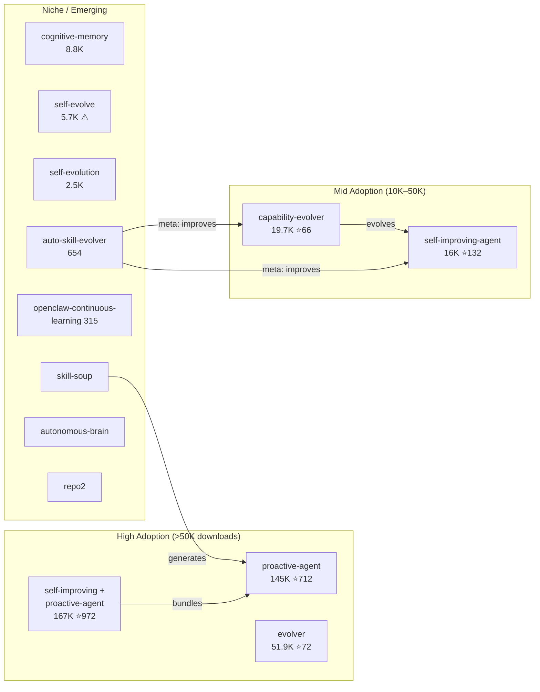
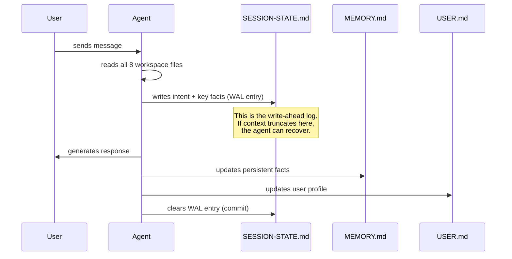

# OpenClaw / ClawHub — 自我改进 Agent 技能

OpenClaw（350K+ GitHub stars）是开源的个人 AI Agent。ClawHub 是其技能市场：13K+ 个技能，150 万+ 次下载。你可以安装一个使 Agent 具备自我改进能力的技能。这句话是这个生态系统中最有趣的事情。

Agent 本身没有内置的学习循环。社区将学习循环*作为技能*来构建——可安装、可组合，并通过 ClawHub 共享。其中四个自进化技能获得了显著的采用量。

---

## ClawHub 上完整的自进化生态系统

下表涵盖了截至 2026 年 4 月 ClawHub 上所有已知的自进化技能。有些被广泛部署；有些是小众实验。它们共同代表了为 OpenClaw 构建的社区学习循环的完整目录。

| 技能 | 下载量 | Stars | 版本 | 功能 |
|------|--------|-------|------|------|
| **self-improving + proactive-agent** | 167K | 972 | — | 自我反思 + 自我批评 + 自我学习。最广泛采用的组合。 |
| **proactive-agent** | 145K | 712 | — | Hal 栈：SOUL.md + MEMORY.md + HEARTBEAT.md + WAL 协议 |
| **evolver** | 51.9K | 72 | v1.40.4 | 自进化引擎：运行时历史分析 + 协议约束进化 |
| **capability-evolver** | 19.7K | 66 | v1.52.0 | 基因组进化协议（GEP）：genes.json + capsules.json + events.jsonl |
| **self-improving-agent** | 16K | 132 | — | 固化管道：.learnings/ → AGENTS.md/TOOLS.md/SOUL.md |
| **cognitive-memory** | 8.8K | 27 | — | 多存储记忆：情景记忆、语义记忆、过程性记忆、核心记忆 |
| **self-evolve** | 5.7K | — | — | 自主进化：感知 → 搜索 → 实验 → 选择 → 固化。⚠ 被标记为可疑。 |
| **self-evolution** | 2.5K | — | — | 课程式学习 + 能力映射 + 迁移学习验证 |
| **auto-skill-evolver** | 654 | — | — | 元技能：通过追踪+反馈驱动的进化改进*其他*技能 |
| **openclaw-continuous-learning** | 315 | — | — | 基于直觉的模式检测 → 带置信度评分的原子学习 |
| **skill-soup** | — | — | — | 自主技能生成 Agent：创建并发布技能 |
| **autonomous-brain** | — | — | — | 主动监控 + 智能决策 + 持续学习 |
| **repo2** | — | — | — | 带自修补和持续守护进程运行的自进化引擎 |

这些不是研究原型。它们被真实用户安装、在生产环境中运行，其下载量反映了通过 ClawHub 市场的实际采用情况。



---

## self-improving + proactive-agent（167K 下载，972 stars）——最广泛采用的组合

ClawHub 上安装量最大的自进化配置。它将 **proactive-agent** 的 Hal 栈与自我反思和自我批评层捆绑在一起。组合后的技能将 OpenClaw 转变为一个不仅维护持久状态，而且主动批评和改进自身行为的 Agent。

### 三种 Self-* 能力

| 能力 | 机制 | 触发时机 |
|------|------|---------|
| **自我反思** | 每次回复后，Agent 评估是否满足了用户意图 | 每轮 |
| **自我批评** | 结构化的对抗性审视——Agent 对自己的计划生成异议 | 复杂多步骤任务之前 |
| **自我学习** | 检测到的模式和纠正被写入持久化工作区文件 | 当反思或批评发现了可复用的洞察时 |

### 本地工作区

所有状态存放在用户机器上的 `~/self-improving/` 中：

```
~/self-improving/
├── reflections/           # 每次会话的反思日志
│   └── 2026-04-19.md
├── criticisms/            # 对抗性自我批评记录
├── learnings/             # 已验证的洞察，等待提升
├── SOUL.md                # 行为规则（来自 proactive-agent）
├── MEMORY.md              # 持久化事实
├── USER.md                # 积累的用户画像
└── SESSION-STATE.md       # WAL 恢复状态
```

### 安全评级

ClawHub 将此技能评为 **"Benign"（安全）**——最高信任级别。它仅在自己的工作区目录中读写，不执行任意 shell 命令，不修改其他已安装的技能。自我反思和自我批评循环完全在 LLM 的生成过程中运行（无外部调用）。

这一点很重要，因为大多数自进化技能都带有安全警告。"Benign" 评级使其成为向 OpenClaw Agent 添加自我改进能力的最安全方式。

---

## proactive-agent（145K 下载，712 stars）——Hal 栈

下载量最大的自进化技能。它将 OpenClaw 转变为有状态、能保留记忆的 Agent，并具备自主后台操作能力。实现颇具雄心：8 个工作区文件、一个预写日志协议，以及一个借鉴自数据库内部原理的压缩恢复系统。

### 8 个工作区文件

| 文件 | 用途 | 写入时机 |
|------|------|---------|
| `ONBOARDING.md` | 首次会话问卷结果 | 安装时写入一次 |
| `SOUL.md` | Agent 的个性、价值观、行为规则 | 用户设定，很少改变 |
| `USER.md` | 积累的用户画像（偏好、上下文、历史） | 持续更新 |
| `AGENTS.md` | Agent 维护的操作笔记 | Agent 学到新知识时更新 |
| `MEMORY.md` | 持久化事实和知识库 | 每次会话更新 |
| `SESSION-STATE.md` | 当前会话状态、活跃任务、阻塞项 | 每次交互更新 |
| `HEARTBEAT.md` | 自主 cron 计划和状态 | 由 cron 系统更新 |
| `memory/YYYY-MM-DD.md` | 每日会话日志 | 每天创建 |

### WAL 协议（预写日志）——详解

借鉴自数据库系统（PostgreSQL 的 WAL、SQLite 的日志）。核心不变量：**如果上下文窗口在对话中途被截断，不会丢失任何状态**。每个关键事实在 Agent 生成回复*之前*就已持久化到磁盘。



WAL 协议有三个具体阶段：

| 阶段 | 操作内容 | 类比 |
|------|---------|------|
| **1. 准备** | Agent 读取所有 8 个文件，构建内部状态 | 数据库读取当前状态 |
| **2. 预写** | Agent 在响应*之前*将意图、关键事实和工作上下文写入 SESSION-STATE.md | 数据库在提交前写入 WAL |
| **3. 提交** | 成功响应并更新 MEMORY.md/USER.md 后，SESSION-STATE.md 中的 WAL 条目标记为完成 | 数据库提交并清除 WAL |

如果 Agent 在阶段 2 和阶段 3 之间崩溃（上下文截断），SESSION-STATE.md 中未提交的 WAL 条目包含恢复所需的一切。

### 工作缓冲区——压缩危险区

当上下文窗口填充超过 70% 时，Agent 进入"压缩危险区"。此时它会主动将最小可行上下文捕获到 SESSION-STATE.md 中的工作缓冲区：

```markdown
## Working Buffer (auto-captured at 72% context)
- Current task: Migrating user database from PostgreSQL 14 to 16
- Completed steps: backup verified, pg_upgrade dry-run passed
- Next step: run pg_upgrade --link on production
- Critical context: user wants zero-downtime, using pglogical for replication
- Active blockers: none
- User preferences recalled: prefers verbose logging, wants Slack notifications
```

此缓冲区是 Agent 的"黑匣子记录器"。如果截断发生，这是恢复时首先读取的内容。

### 压缩恢复——逐步过程

当上下文截断实际发生时，Hal 栈执行精确的恢复序列：

```
步骤 1：检测
  Agent 注意到上下文减少——可能是：
  (a) 系统通知："上下文已被压缩"
  (b) 缺少刚才还存在的对话历史
  (c) SESSION-STATE.md 包含未提交的 WAL 条目

步骤 2：加载工作缓冲区
  读取 SESSION-STATE.md → 提取工作缓冲区
  由此获得：当前任务、已完成步骤、下一步、阻塞项

步骤 3：加载持久状态
  读取 MEMORY.md → 持久化事实和知识
  读取 USER.md → 用户画像和偏好
  读取 AGENTS.md → 操作笔记

步骤 4：加载每日日志
  读取 memory/YYYY-MM-DD.md → 当天的会话日志
  提供近期对话摘要

步骤 5：重建
  从所有加载的状态合成一个连贯的心智模型
  Agent 现在拥有：
  - 它在做什么（工作缓冲区）
  - 它知道什么（MEMORY.md）
  - 用户是谁（USER.md）
  - 今天发生了什么（每日日志）

步骤 6：恢复
  像截断从未发生一样继续对话
  用户可能不会察觉——Agent 的下一个回复是
  上下文恰当的，因为所有关键状态都已保留
```

其优雅之处在于恢复只是"读取 Agent 已经维护的文件"。无需特殊的恢复基础设施——工作区文件*就是*恢复基础设施。

### 自主 Cron（systemEvent）与提示式 Cron（agentTurn）

Hal 栈包含一个具有两种根本不同执行模型的 cron 系统：

| | 自主 Cron | 提示式 Cron |
|---|---|---|
| **触发方式** | `systemEvent`——定时器自动触发 | 用户发送消息触发预定检查 |
| **执行上下文** | 独立的 `agentTurn`——Agent 在自己的轮次中运行，无需用户输入 | 在现有对话轮次内 |
| **用户可见性** | 后台——用户可能不知道它运行过 | 内联——用户看到结果 |
| **典型用途** | 记忆整合、心跳更新、定期报告 | "检查我的 PR 是否合并了"、每日站会提醒 |
| **HEARTBEAT.md 条目** | `type: systemEvent`、`status: completed/failed`、`timestamp` | `type: agentTurn`、`triggered_by: user_message` |

**自主 Cron** 是更有趣的机制。它们实现了真正的后台 Agent 操作：

1. **记忆维护** —— 整合每日日志、去重 MEMORY.md、归档过时条目
2. **主动监控** —— 按计划检查外部服务、仓库或 API
3. **定期任务** —— 发送提醒、生成报告、运行周期性工作流
4. **自我维护** —— 清理工作区文件、验证技能完整性

`systemEvent` 触发意味着 Agent 醒来、完成工作、然后回到睡眠——全程无需用户交互。HEARTBEAT.md 追踪每次自主运行：

```markdown
## Heartbeat Log

| Timestamp | Type | Task | Status | Duration |
|-----------|------|------|--------|----------|
| 2026-04-19T03:00:00Z | systemEvent | Memory consolidation | ✅ completed | 12s |
| 2026-04-19T03:00:12Z | systemEvent | Stale entry cleanup | ✅ completed | 3s |
| 2026-04-19T09:15:00Z | agentTurn | PR status check | ✅ completed | 8s |
```

**提示式 Cron** 更简单：当用户发送任何消息时，Agent 检查 HEARTBEAT.md 中的到期任务并内联执行。这对于应该在"下一次机会"而非精确时间执行的任务很有用。

---

## evolver（51.9K 下载，72 stars，v1.40.4）——自进化引擎

第三大下载量的自进化技能。**evolver** 采用与 Hal 栈不同的方法：不是维护工作区文件来存储记忆，而是分析 Agent 的*运行时历史*——过去的工具调用、错误和用户纠正——并提出协议约束的 Agent 行为修改方案。

### 核心架构

```
运行时历史（工具调用、错误、纠正）
       │
       ▼
┌─────────────────────────┐
│   历史分析器              │
│   （模式提取）            │
└──────────┬──────────────┘
           │
           ▼
┌─────────────────────────┐
│   进化提议器              │
│   （协议约束）            │
└──────────┬──────────────┘
           │
           ▼
┌─────────────────────────┐
│   自修补器                │
│   （应用 + 验证）         │
└──────────────────────────┘
```

### 协议约束的进化

关键设计选择：evolver 不允许任意的自我修改。所有提议的变更必须符合预定义的**进化协议**——一个指定以下内容的模式：

- Agent 被允许修改哪些文件（白名单）
- 每个进化周期的最大变更大小（token 预算）
- 必需的回滚元数据（每个变更可逆）
- 每次修补后的强制验证步骤

这就是 evolver 与 `self-evolve`（授予不受限制的自我修改权限）的区别所在。协议充当护栏——Agent 可以改进，但只能在定义的范围内。

### 自修补

当分析器识别出改进机会时：

1. **生成补丁** —— 针对当前配置的结构化差异
2. **根据协议验证** —— 如果违反约束则拒绝
3. **应用补丁** —— 将变更写入相应文件
4. **验证** —— 运行完整性检查（Agent 对测试提示是否仍能正确响应？）
5. **记录** —— 记录补丁、理由和验证结果

### 持续守护进程运行

与其他响应式技能（仅在用户交互时运行）不同，evolver 可以作为**持续守护进程**运行。它定期扫描运行时历史，即使在用户会话之间也是如此，并将进化提案排入队列。当用户下次交互时，Agent 可以提到："我在空闲期间发现了 3 个潜在改进。你想审查它们吗？"

---

## capability-evolver（19.7K 下载，66 stars，v1.52.0）——元技能

这就是基因组进化协议（GEP）。它将 Agent 的能力视为通过结构化循环进化的基因组。这是该生态系统中设计最系统化的自进化技能——也是实现最复杂（且在历史上最具争议性的）技能。

### GEP 协议：三个持久化文件

| 文件 | 格式 | 内容 | 典型大小 |
|------|------|------|---------|
| `genes.json` | JSON 数组 | 可复用模式——Agent 发现的成功策略 | 50-200 条 |
| `capsules.json` | JSON 数组 | 已验证的修复——带上下文的特定问题特定解决方案 | 20-100 条 |
| `events.jsonl` | JSON Lines | 审计追踪——每个进化事件带时间戳和分类 | 无限增长，每周轮换 |

**genes.json** 是基因组。每个基因代表一个学习到的策略：

```json
{
  "id": "gene-0042",
  "name": "retry-with-backoff",
  "pattern": "When API call fails with 429, retry with exponential backoff",
  "confidence": 0.94,
  "usage_count": 37,
  "last_used": "2026-04-18T14:22:00Z",
  "origin": "observed_failure_recovery"
}
```

**capsules.json** 存储原子级修复——比基因更具体：

```json
{
  "id": "cap-0018",
  "trigger": "pytest fails with 'fixture not found'",
  "fix": "Check conftest.py location — must be in test root or parent",
  "validated": true,
  "success_rate": 0.91
}
```

**events.jsonl** 是审计追踪。每次扫描、提案、验证和应用都被记录：

```jsonl
{"ts":"2026-04-19T03:00:00Z","type":"scan","genes_checked":142,"gaps_found":3}
{"ts":"2026-04-19T03:00:02Z","type":"propose","gene":"gene-0143","action":"create","reason":"repeated pattern in last 5 sessions"}
{"ts":"2026-04-19T03:00:05Z","type":"validate","gene":"gene-0143","result":"pass","baseline_regression":false}
{"ts":"2026-04-19T03:00:06Z","type":"apply","gene":"gene-0143","status":"committed"}
```

### 进化循环

```
扫描 → 分析 → 提议 → 验证 → 应用
  │                                      │
  └──────────── 反馈 ────────────────────┘
```

1. **扫描**：检查近期交互中的能力缺口、失败和低效
2. **分析**：与已知模式（基因）和已验证的修复（胶囊）进行比较
3. **提议**：生成候选改进及其预期影响
4. **验证**：针对已知良好的基线测试提议的变更
5. **应用**：将变更提交到 Agent 的配置或技能中

### 六种策略

该技能根据团队的风险容忍度支持不同的进化模式：

| 策略 | 行为 | 基因突变率 | 胶囊创建率 |
|------|------|-----------|-----------|
| `balanced` | 默认。改进与稳定的均衡组合 | 中等 | 中等 |
| `innovate` | 倾向于尝试新方法，更高的风险容忍度 | 高 | 低 |
| `harden` | 聚焦于健壮性和错误减少，最小化实验 | 低 | 高 |
| `repair-only` | 只修复损坏的东西，不主动改进 | 无 | 高 |
| `early-stabilize` | 新部署的积极稳定化 | 低 | 中等 |
| `steady-state` | 最小变更，仅在指标退化时进化 | 极低 | 低 |

### 三种执行模式

| 模式 | 人工参与 | 使用场景 |
|------|---------|---------|
| **全自动** | 无——Agent 自行决定并应用 | 个人助手、低风险任务 |
| **人在回路中（审核）** | Agent 提议，人类批准 | 生产系统、团队环境 |
| **持续后台（循环）** | 按计划运行，将提案排队等待审核 | 企业部署 |

### 安全历史：整改

capability-evolver 的早期版本（v1.40 之前）在其配置模板中包含**硬编码凭据**和一个将基因/胶囊数据传输到外部服务器的遥测端点——实际上是对 Agent 学习策略的**数据泄露**。

社区通过 ClawHub 安全审计发现了这一问题。具体问题是：
- 默认 `config.json` 模板中的硬编码 API key
- 将 `genes.json` 内容发送到第三方分析服务的遥测端点
- 没有数据传输的选择加入/退出机制

**整改（v1.40+）：** 移除所有硬编码凭据。完全移除遥测端点。该技能现在完全离线运行。events.jsonl 审计追踪保留在本地。这一事件是 capability-evolver 的下载量（19.7K）低于其技术复杂度应有水平的原因——早期信任被破坏了。

---

## self-improving-agent（16K 下载，132 stars）——固化管道

该技能实现了一个特定的学习模式：观察差距、搜索解决方案、测试它们，并将胜出者提升为永久 Agent 配置。关键概念是**固化**——从试探性观察到永久操作知识的转变。

### 改进循环

```
感知差距
    │
    ▼
搜索解决方案（网络、文档、现有技能）
    │
    ▼
设计实验（假设 + 测试）
    │
    ▼
运行实验
    │
    ▼
选择胜出者（如果有多个候选）
    │
    ▼
固化（提升为永久配置）
```

### 固化管道：.learnings/ → 永久配置

原始学习以带时间戳的 markdown 文件开始于 `.learnings/`。管道有三个阶段：

```
阶段 1：捕获
  .learnings/2026-04-19_pytest-config.md
  （原始观察，单个实例，未验证）
      │
      ▼
阶段 2：验证
  Agent 遇到相同模式 3 次以上
  .learnings/ 中现在有一组相关文件
      │
      ▼
阶段 3：固化（提升到永久目标）
  综合洞察 → AGENTS.md 或 TOOLS.md 或 SOUL.md
  原始 .learnings/ 文件 → 归档
```

| 提升目标 | 使用时机 | 示例 |
|---------|---------|------|
| `.learnings/` | 初始捕获——原始、未验证 | "pytest 需要 conftest.py 在根目录" |
| `AGENTS.md` | Agent 应始终具备的操作知识 | "当 pytest fixture 失败时，始终检查 conftest.py 位置" |
| `TOOLS.md` | 工具特定的使用模式和注意事项 | "pytest：conftest.py 必须在测试根目录或祖先目录中" |
| `SOUL.md` | 行为规则和个性调整 | "调试测试失败时，先检查配置再检查代码" |
| `CLAUDE.md` | Claude Code 记忆集成（跨平台） | 相同内容，格式化为 Claude Code 的记忆系统 |

### 心跳驱动的整合

该技能包含一个定期扫描 `.learnings/` 中具有 3 个以上相关问题的项目的 cron。当发现聚类时，它会：

1. 按主题分组相关学习（使用关键词重叠和语义相似度）
2. 综合出一个整合洞察——一个清晰的陈述，捕获该模式
3. 将综合结果提升到相应的目标文件（AGENTS.md、TOOLS.md 等）
4. 将单个学习文件归档到 `.learnings/archive/`

这防止了 `.learnings/` 目录无限增长，同时确保经过验证的模式毕业进入永久记忆。3 个问题的阈值是关键设计选择——它过滤掉一次性观察，同时提升反复出现的模式。

---

## auto-skill-evolver（654 下载）——元技能

一个改进*其他*技能的元技能。虽然大多数自进化技能改进 Agent 的行为，但 auto-skill-evolver 改进技能本身——它们的过程、陷阱和触发条件。

### 追踪 + 反馈驱动的进化

其机制：

1. **追踪收集** —— 监控已安装技能何时被激活、使用了哪些章节以及结果是否成功
2. **反馈分析** —— 当技能激活导致用户纠正或错误恢复序列时，该技能被标记为需要审查
3. **补丁生成** —— 提出对技能的 Procedure、Pitfalls 或 When to Use 章节的具体编辑
4. **验证** —— 将提议的补丁与原始技能的意图进行比较，以防止漂移

这是唯一一个操作对象是技能而非 Agent 直接行为的技能。它是一种二阶进化机制——进化系统的进化。

---

## self-evolve（5.7K 下载，56 安装）——⚠ 被标记为可疑

一个具有完整管道的自主进化技能：感知差距 → 搜索解决方案 → 实验 → 选择胜出者 → 固化。架构上与 self-improving-agent 类似，但有一个关键区别：**它授予 Agent 不受限制的自我修改权限**。

### 被标记的原因

ClawHub 的安全审查标记 self-evolve 的原因：

- **无修改白名单** —— Agent 可以编辑任何文件，不仅限于指定的工作区文件
- **无回滚元数据** —— 变更无法通过结构化机制回滚
- **无验证步骤** —— 补丁在没有完整性检查的情况下被应用
- **README 明确声明**："此技能授予 Agent 对自身进化的完全控制。使用风险自负。"

5.7K 的下载量与仅 56 个活跃安装的对比说明了一切——许多用户下载了它，但很少有人保持启用。它代表了一种真实的设计理念（最大自主、最小护栏），但社区在实践中已基本投票反对了这种方法。

---

## self-evolution（2.5K 下载）——生产级课程式学习

一个精密的系统，添加了带有形式化能力追踪的课程式学习。这是 ClawHub 上最结构化的 Agent 自进化方法。

### 能力映射——六种状态

Agent 发展的每种能力都通过形式化状态机进行追踪：

```
recorded → understood → practiced → passed → generalized → promoted
```

| 状态 | 含义 | 转换触发器 |
|------|------|-----------|
| **recorded** | Agent 观察到新模式或技术 | 首次遇到 |
| **understood** | Agent 能解释该模式及其上下文 | Agent 生成正确解释 |
| **practiced** | Agent 在实际任务中应用了该模式 | 成功应用 |
| **passed** | Agent 已可靠地展示该模式（3+ 次成功） | 达到阈值 |
| **generalized** | Agent 能将该模式应用到新的上下文 | 观察到跨领域应用 |
| **promoted** | 模式成为 Agent 永久技能库的一部分 | 手动或自动提升 |

### 课程式学习

与被动学习（仅从错误中学习）不同，self-evolution 主动设计课程：

1. **差距分析** —— 将当前能力与目标能力画像进行比较
2. **课程生成** —— 创建一系列难度递增的任务来构建缺失的能力
3. **练习会话** —— Agent 按课程学习（可以自主或用户驱动）
4. **评估** —— 通过结构化评估验证能力提升

### 迁移学习验证

当 Agent 在某个领域学到一种策略时，self-evolution 验证该策略是否能迁移到相关领域：

```
策略："带指数退避的重试"
  学习来源：API 集成任务
  迁移候选：数据库连接、文件系统操作、网络请求
  验证：在每个候选领域测试该策略
  结果：可迁移到数据库 + 网络，不适用于文件系统
  → 标记为 API + 数据库 + 网络的"已泛化"
  → 标记为文件系统的"领域特定"
```

---

## cognitive-memory（8.8K 下载，27 stars）——类人记忆架构

该技能模拟人类记忆过程：编码、整合、衰减和回忆。它维护四个独立的记忆存储，每个存储具有不同的持久性和访问模式。

### 四种记忆存储

| 存储 | 类比 | 持久性 | 访问模式 |
|------|------|--------|---------|
| **情景记忆** | "发生了什么" | 会话范围，每天整合 | 按时间顺序回忆 |
| **语义记忆** | "我知道什么" | 永久，随时间增长 | 按概念关联查找 |
| **过程性记忆** | "如何做事" | 永久，通过实践精炼 | 按任务类型模式匹配 |
| **核心记忆** | "我是谁" | 不可变，除非用户覆写 | 始终加载 |

### 记忆过程

- **编码** —— 新信息被标记上下文（时间、任务、用户状态）并写入情景存储
- **整合** —— 定期将经过验证的情景记忆迁移到语义或过程性存储（类似于人类睡眠整合）
- **衰减** —— 从未被回忆的记忆逐渐失去显著性；超过阈值后被归档而非加载到上下文中
- **回忆** —— 检索结合时效性、频率和相关性评分；高显著性记忆优先被检索

---

## openclaw-continuous-learning（315 下载）——基于直觉的学习

按采用量计算最小的自进化技能，但方法有趣：**基于直觉**的学习。

### 机制

1. **模式检测** —— 该技能监控 Agent 的交互以发现反复出现的模式（重复问题、类似错误序列、常见工作流）
2. **原子学习创建** —— 当检测到模式时，创建一个原子学习：一个带有**置信度分数**（0.0-1.0）的单一聚焦洞察
3. **置信度门控提升** —— 置信度低于阈值（默认：0.7）的学习留在暂存区；高于阈值的学习被提升到活跃记忆
4. **优化建议** —— 该技能定期根据积累的学习建议工作流优化

"直觉"隐喻：Agent 在这些感觉被正式验证之前，就会对什么有效产生直觉。低置信度的直觉微妙地影响行为；高置信度的直觉成为明确的操作规则。

---

## skill-soup——自主技能生成 Agent

不是传统意义上的自进化技能——skill-soup 是一个自主 Agent，它**创建并发布**新技能到 ClawHub。它监控社区讨论、问题追踪器和功能请求，然后生成满足未被满足需求的技能实现。

### 工作原理

1. **监控** —— 扫描 ClawHub issues、Discord 讨论和 GitHub issues 以发现未满足的技能请求
2. **生成** —— 按照 agentskills.io 标准创建 SKILL.md 文件
3. **测试** —— 通过验证套件运行生成的技能
4. **发布** —— 将技能作为新列表提交到 ClawHub

skill-soup 是第一个为进化生态系统做贡献而非自身进化的 Agent 示例。它是一个为其他 Agent 制造工具的 Agent。

---

## autonomous-brain——主动监控与持续学习

一个结合三种能力的综合技能：

1. **主动监控** —— Agent 监视用户环境的变化（新文件、仓库更新、日历事件）并主动提供帮助
2. **智能决策** —— 积累决策日志并学习哪些类型的决策用户倾向于自己做，哪些倾向于委托给 Agent
3. **持续学习** —— 一个后台过程，审查过去的交互、提取模式并更新 Agent 的行为模型

autonomous-brain 是最接近"通用智能增强"的技能——它不聚焦于单一进化机制，而是试图使 Agent 随着时间全面变得更聪明。

---

## repo2——带守护进程模式的自进化引擎

一个与 **evolver** 共享架构 DNA 但增加了持续守护进程模式的自进化引擎。Agent 作为后台进程运行，定期分析自身性能并应用自修补。

### 与 evolver 的关键区别

| | evolver | repo2 |
|---|---|---|
| **运行时分析** | 批处理（定期扫描） | 持续（流式分析） |
| **自修补** | 协议约束 | 协议约束 + 回滚 |
| **守护进程模式** | 可选 | 主要运行模式 |
| **状态持久化** | 运行时历史文件 | 嵌入式数据库（SQLite） |

repo2 专为始终在线的 Agent 部署设计，Agent 需要在无用户干预的情况下持续改进。

---

## 安全警告

ClawHub 上的每个自进化技能都带有安全标识。警告是明确的：

```
⚠ 此技能可以：
  - 执行 shell 命令
  - 修改配置文件
  - 访问系统文件
  - 写入文件系统
  - 修改自身行为
```

一个能重写自身技能的 Agent 也能重写自身约束。整个生态系统中出现了五种缓解模式：

| 模式 | 实现方式 | 局限性 |
|------|---------|--------|
| **沙箱** | 在 Docker/VM 中运行 Agent，限制文件系统访问 | 在降低风险的同时也降低了能力 |
| **Git 追踪** | 所有技能/配置变更提交到仓库 | 仅有审计追踪——不能阻止坏的变更 |
| **人工审批** | Agent 提议变更，人类批准 | 有延迟；违背了自主的初衷 |
| **速率限制** | 限制每个会话的技能变更次数（如最多 3 次编辑） | 任意阈值；不区分好坏 |
| **宪法文件** | Agent 无法修改的不可变规则（SOUL.md 模式） | Agent 仍可通过新技能绕过约束 |

这些都不是完整的解决方案。根本矛盾在于：一个强大到能改进自身的 Agent 也强大到能破坏自身。社区共识是将沙箱 + Git 追踪 + 速率限制结合作为实际基线，生产部署则加上人工审批。

`self-evolve` 技能（5.7K 下载，仅 56 个活跃安装）采取了相反的立场——它授予 Agent 完全的自我修改权限且护栏极少。其 README 明确声明："此技能授予 Agent 对自身进化的完全控制。使用风险自负。"它存在，有一定采用量（虽然在下降），并代表了生态系统中的一种真实设计选择。下载量与活跃安装数之间的差距说明了一切：大多数尝试过不受限制自我修改的用户最终决定不保留它。
