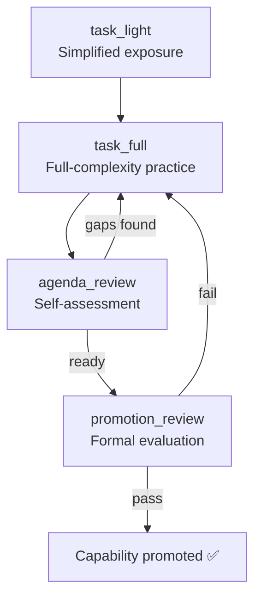

# SkillHub 与中国生态系统

agentskills.io 标准创建了一种可互操作的技能格式。ClawHub 为全球市场托管了 13K+ 技能。但在中国，围绕同一格式形成了一个平行生态系统——拥有自己的分发渠道、自己的策展机制和自己的热门技能。

---

## SkillHub.cn / SkillHub.mobi

腾讯为中国 OpenClaw 用户打造的本地化技能平台。不是分叉——而是针对中国市场优化了基础设施和策展的镜像站。

**它是什么：**
- 镜像 13K+ ClawHub 技能，配合腾讯云 CDN 加速
- 完整的中文界面（技能描述、文档、安装说明）
- 8 大分类：社交媒体、开发、生产力、研究、隐私、办公、娱乐、系统
- 精选 Top 50 榜单——每个技能由腾讯审核团队手动进行安全审计
- 免费。通过 OpenClaw 客户端一键安装

**它不是什么：**
- 不是独立的技能格式。使用相同的 SKILL.md 标准、相同的安装机制
- 不是封闭花园。从 SkillHub.cn 安装的技能与从 ClawHub 安装的技能功能完全一致
- 不是必需的。中国用户仍然可以直接从 ClawHub 安装

核心价值在于速度（从中国访问腾讯云 vs. GitHub/npm CDN）和信任（Top 50 的安全审计）。

---

## 热门下载（2026 年第一季度）

| 排名 | 技能 | 下载量 | 分类 |
|------|-------|-----------|----------|
| 1 | Xiaohongshu Automation | 59K | 社交媒体 |
| 2 | GitHub Collaboration | 48K | 开发 |
| 3 | Summarize | 44K | 生产力 |
| 4 | Tavily Web Search | 39K | 研究 |
| 5 | HaS Anonymizer | 31K | 隐私 |
| 6 | Tencent Docs | 27K | 办公 |

排名第一的是小红书自动化技能——内容排期、互动追踪、跨平台转发。这揭示了用户群体的特点：中国 OpenClaw 的普及在很大程度上由内容创作者和社交媒体从业者驱动，而不仅仅是开发者。

GitHub Collaboration 排名第二，证实了开发者群体的存在，但与更广泛的非技术受众共存。Summarize 和 Tavily Web Search 技能与全球版本相同，只是进行了本地化和 CDN 加速。

HaS Anonymizer 排名第五（隐私类别，31K 下载量）反映了中国市场的一个特定需求——在不同审核政策的平台之间分享内容前进行匿名化处理。

Tencent Docs 集成排名第六，这是腾讯的差异化打法：与腾讯生产力套件的深度集成，相当于西方用户的 Google Docs 技能。

---

## 技能生态系统结构

### agentskills.io 标准

Hermes、OpenClaw 和 Claude Code 使用相同的 SKILL.md 格式。一个技能，三个平台：

```
SKILL.md (agentskills.io format)
     │
     ├── Hermes Agent: ~/.hermes/skills/
     ├── OpenClaw: installed via ClawHub / SkillHub
     └── Claude Code: referenced in CLAUDE.md or .claude/skills/
```

### 安装

两个包注册表，相同的技能：

```bash
# From ClawHub (global)
npx skillhub install [skill-name]

# Alternative registry
npx agent-skills-hub install [skill-name]

# From SkillHub.cn (Tencent-accelerated)
# Same command — the OpenClaw client resolves the source
# based on user's configured registry
```

### 跨平台兼容性

技能在设计上是与 Agent 无关的。通过 SkillHub.cn 为 OpenClaw 安装的技能可以手动复制到 Hermes 的 `~/.hermes/skills/` 目录，或从 Claude Code 的 `CLAUDE.md` 引用。YAML frontmatter 可能包含 Agent 特定的元数据块（`metadata.hermes`、`metadata.openclaw`），但核心章节（使用场景、操作步骤、常见陷阱、验证方法）是通用的。

---

## iflytek/SkillHub（企业版）

科大讯飞（iFlytek），中国的 AI 和语音技术公司，为企业部署提供了一个自托管技能平台。不同的产品，相同的命名模式。

### 它是什么

- 通过 Docker 或 Kubernetes 部署的自托管平台
- 为需要私有技能注册表的组织而设计
- 使用 Java（后端）+ TypeScript（前端）构建
- 当前版本：v0.2.3（2026 年 4 月）

### 企业功能

| 功能 | 实现方式 |
|---------|---------------|
| **RBAC** | 基于角色的访问控制——每个命名空间设有管理员、编辑者、查看者角色 |
| **命名空间** | 按团队、项目或部门组织技能 |
| **版本管理** | 语义化版本控制，支持回滚 |
| **审计日志** | 每次安装、更新和删除都记录用户身份和时间戳 |
| **私有注册表** | 技能永远不会离开组织的基础设施 |

### 部署

```yaml
# Docker Compose (minimal)
services:
  skillhub-api:
    image: iflytek/skillhub-api:0.2.3
    ports: ["8080:8080"]
    environment:
      - DB_URL=jdbc:postgresql://db:5432/skillhub
      - AUTH_PROVIDER=ldap

  skillhub-web:
    image: iflytek/skillhub-web:0.2.3
    ports: ["3000:3000"]

  db:
    image: postgres:16
```

### 企业版 vs. 社区版

| | ClawHub / SkillHub.cn | iflytek/SkillHub |
|---|---|---|
| **托管方式** | 云端（GitHub/npm / 腾讯云） | 自托管（Docker/K8s） |
| **访问控制** | 公开 | 带命名空间的 RBAC |
| **技能来源** | 社区贡献 | 组织内部 + 精选导入 |
| **审计** | 仅下载计数 | 完整审计追踪 |
| **成本** | 免费 | 开源，自托管基础设施成本 |
| **适用场景** | 个人用户、开源项目 | 有合规要求的企业 |

企业版的存在是因为中国大型企业需要具备访问控制和审计追踪的私有技能注册表。agentskills.io 格式是相同的——iflytek/SkillHub 只是用企业基础设施将其包装起来。

---

## 生态系统图谱

```
agentskills.io (format standard)
     │
     ├── ClawHub (global marketplace, 13K+ skills, 1.5M+ downloads)
     │     └── SkillHub.cn (Tencent mirror, CDN-accelerated, safety-audited Top 50)
     │
     ├── Hermes Agent (built-in skill creation + external skill import)
     │
     ├── Claude Code (CLAUDE.md + .claude/skills/ integration)
     │
     └── iflytek/SkillHub (enterprise self-hosted registry)
```

跨 Hermes、OpenClaw、Claude Code 和企业平台收敛到单一技能格式，这是结构性的叙事。技能是可移植的。生态系统在分发、策展和信任层面竞争——而非在格式层面。

---

## SkillHub 上的自我进化：self-evolving-agent 技能

SkillHub 托管了自己的自我进化方案：**self-evolving-agent**（GitHub：`RangeKing/self-evolving-agent`）。它采用了与 ClawHub 自我改进技能根本不同的方法。大多数 ClawHub 技能专注于*被动*改进（记录错误、整合经验教训），而 self-evolving-agent 实现了*主动能力提升*——Agent 通过结构化课程主动寻求新能力。

### 自我改进 vs. 自我进化：区别

| | 自我改进（被动） | 自我进化（主动） |
|---|---|---|
| **触发条件** | 正常使用中检测到错误或缺陷 | Agent 主动发起能力评估 |
| **学习来源** | 过去的错误和用户纠正 | 结构化课程 + 刻意练习 |
| **结果** | "不要重复这个错误" | "我现在能做以前做不到的事了" |
| **能力增长** | 渐进式（逐个修复） | 系统化（逐项能力） |
| **示例** | "记住 pytest 需要在根目录有 conftest.py" | "我已通过 Python 测试的评估，现在可以推广到其他测试框架" |

大多数 ClawHub 技能（self-improving-agent、proactive-agent、openclaw-continuous-learning）是**自我改进**的：它们对失败做出反应并积累修复。self-evolving-agent 是**自我进化**的：它通过练习主动构建新能力。

### 基于课程的学习

self-evolving-agent 将学习组织为四个阶段：

| 阶段 | 发生什么 | 持续时间 |
|-------|-------------|----------|
| **task_light** | Agent 接触某个新能力领域的简化版本。低风险，有引导示例。 | 1–3 个会话 |
| **task_full** | Agent 在该能力领域处理全复杂度的任务。真实风险，最少引导。 | 3–10 个会话 |
| **agenda_review** | Agent 回顾其在所有 task_full 会话中的表现。识别剩余差距。 | 1 个会话 |
| **promotion_review** | 正式评估：Agent 能否可靠地展示这项能力？ | 1 个会话 |



### 能力评估状态

Agent 开发的每项能力都通过一个正式的六状态进程来追踪：

```
recorded → understood → practiced → passed → generalized → promoted
```

| 状态 | 含义 | Agent 如何晋级 |
|-------|---------|-------------------|
| **recorded** | 已识别新的能力领域 | Agent 遇到不熟悉的任务类型 |
| **understood** | Agent 能解释该能力及其上下文 | Agent 生成对该领域的正确解释 |
| **practiced** | Agent 已在该能力领域尝试了实际任务 | task_full 阶段至少完成一次 |
| **passed** | Agent 展示出可靠的胜任力（3+ 次成功，<10% 错误率） | 达到评估阈值 |
| **generalized** | Agent 能将该能力应用到原始领域之外的新场景 | 跨领域迁移已验证 |
| **promoted** | 能力已永久整合到 Agent 的操作技能库中 | promotion_review 通过 |

### 迁移学习：跨任务策略验证

最精妙的功能。当 Agent 在一个场景中学到一种策略时，self-evolving-agent 会验证它是否能**迁移**到相关场景：

```
Strategy: "Use structured output schemas to reduce hallucination"
  Learned in: API response parsing
  
  Transfer validation:
    ✅ Database query results → works (reduces formatting errors)
    ✅ Config file generation → works (enforces valid structure)
    ❌ Creative writing → does NOT transfer (constrains useful variety)
    ✅ Log analysis → works (standardizes extraction)
  
  Result: Strategy marked "generalized" for structured-data tasks
          Strategy marked "domain-specific, do not apply" for creative tasks
```

迁移验证防止 Agent 过度泛化。一种在某个领域有效的策略可能在另一个领域适得其反——评估流水线在它变成习惯之前就将其捕获。

---

## 提案：OpenClaw 核心的自适应记忆

目前有一项活跃提案（RFC 状态，尚未合并），拟将**自适应记忆**作为 OpenClaw 本身的内置功能——不是作为技能，而是作为核心基础设施。这将是第一个内置于平台而非从市场安装的自我进化机制。

### 分层记忆架构

该提案定义了三个记忆层级：

```
Tier 3: MEMORY.md (~1000 tokens)
  Permanent, always in system prompt
  Promoted facts and core knowledge
       ▲ promotion (high confidence + frequency)
       │
Tier 2: Active Context (~5000 tokens)
  Session-spanning working memory
  Current projects, recent decisions, active preferences
       ▲ consolidation (pattern detection)
       │
Tier 1: Daily Notes (unbounded)
  Per-session logs, raw observations
  Automatically captured, ephemeral
```

| 层级 | 名称 | Token 预算 | 持久性 | 加载时机 |
|------|------|-------------|-------------|-------------|
| **Tier 1** | 每日笔记 | 无限制 | 30 天滚动窗口 | 按需（搜索） |
| **Tier 2** | 活跃上下文 | ~5,000 token | 直到被替代 | 每次会话 |
| **Tier 3** | MEMORY.md | ~1,000 token | 永久 | 始终（系统提示词） |

### 为什么选择内置而非技能？

将其构建到 OpenClaw 核心而非作为技能的理由：

1. **一致性** ——每个 OpenClaw 用户无需了解 ClawHub 即可获得基础记忆功能
2. **性能** ——核心记忆可在系统层面进行优化（例如，预索引搜索）
3. **互操作性** ——技能可以读写核心记忆，而非各自维护独立的记忆文件
4. **可靠性** ——不依赖于可能失效或被弃用的第三方技能

反对意见：技能生态系统已经产生了多种竞争性的记忆架构（proactive-agent、cognitive-memory、self-evolution）。将某一种方法内置到核心可能会抑制创新。RFC 仍在讨论中。
