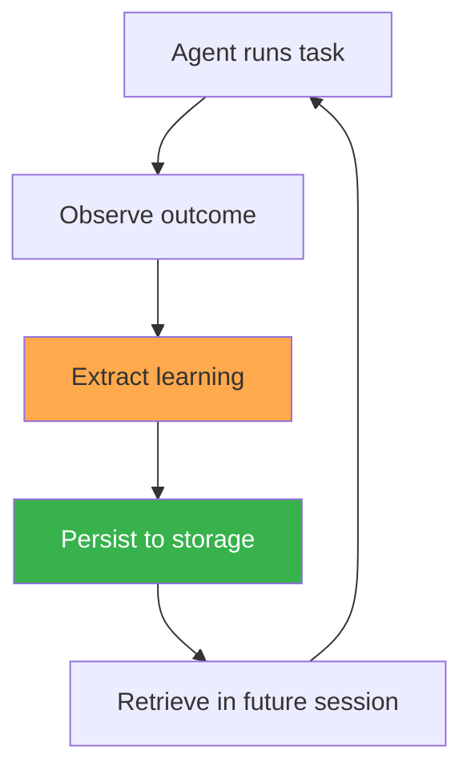
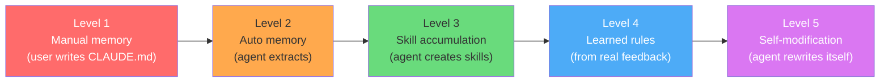

# The Self-Evolution Landscape

Every production agent covered in this book implements some form of the same loop:



The differences are in **what** gets stored, **where** it lives, **how** it's retrieved, and **when** it triggers.

This chapter maps the full product landscape as of April 2026, extracts the five mechanisms that every system uses, and places each product on a maturity spectrum — from manual memory files to experimental self-modification.

---

## The Product Landscape (April 2026)

Ten production agents. Ten different bets on how to make agents learn. Here is where they stand:

| Product | Memory File | Auto-Learning | Skill System | Learned Rules | Self-Verification |
|---------|-----------|---------------|-------------|---------------|-------------------|
| Claude Code | `CLAUDE.md` + auto memory in `~/.claude/projects/` | Yes (auto memory from sessions) | `.claude/skills/*.md` | No (proposed) | Compaction + `init.sh` |
| Cursor | `.cursor/rules/` + `AGENTS.md` | Yes (continual-learning plugin) | `.cursor/skills/` | Yes (Bugbot: 44K+ rules, 110K repos) | LSP + sandbox |
| Codex | `AGENTS.md` | Yes (memory preview) | Skills via plugins | No | Sandbox |
| Hermes | `MEMORY.md` + `~/.hermes/skills/` | Yes (auto skill creation after tasks) | `SKILL.md` (agentskills.io) | No | Self-test in skills |
| OpenClaw | `MEMORY.md` | Yes (Dream consolidation) | 13K+ ClawHub skills | Via self-improving-agent skill | Skill-dependent |
| Copilot | Agentic memory (code-cited) | Yes (deduced from codebase) | No | No (`copilot-instructions.md` manual) | Citation validation |
| Gemini CLI | `GEMINI.md` | Yes (memory manager subagent) | No | No | No |
| Windsurf | `~/.codeium/windsurf/memories/` | Yes (auto-generated ~48hr index) | No | Via `.windsurf/rules/` | No |
| Devin | Internal wiki (DeepWiki) | No (manual) | No | No | Yes (self-verification + auto-fix) |
| Manus | Internal context | No (framework-level iteration) | No | No | Planner/Verifier agents |

Three things jump out of this table:

1. **Every product has some form of persistent memory.** The file format varies — markdown files, JSON stores, internal databases — but none of these agents start from zero every session.
2. **Auto-learning is the new default.** Six of ten products now extract learnings from sessions without requiring user action. A year ago, only Hermes did this.
3. **Skill systems and learned rules are rare.** Only three products have formal skill libraries. Only one — Cursor — operates learned rules at scale.

---

## The Five Mechanisms

Every product uses one or more of these five mechanisms. This is not a taxonomy invented from first principles — it is a pattern extracted from reading the source code, documentation, and shipped behavior of all ten systems.

### 1. Filesystem Memory

Markdown files loaded at session start. The agent reads them, follows the instructions, and (in some products) writes back to them.

| Product | File(s) | Who Writes | Discovery Logic |
|---------|---------|-----------|-----------------|
| Claude Code | `CLAUDE.md`, `~/.claude/CLAUDE.md` | Human + Agent | Walk upward from CWD, 4K/file, 12K total |
| Cursor | `.cursor/rules/*.mdc`, `AGENTS.md` | Human only | Glob matching + `alwaysApply` flag |
| Codex | `AGENTS.md` | Human | Fixed path at project root |
| Hermes | `MEMORY.md`, `USER.md` | Agent | Fixed path relative to data directory |
| OpenClaw | `MEMORY.md`, daily notes | Agent + Dreaming | Fixed path, daily notes per session |
| Copilot | `copilot-instructions.md` | Human | Project root |
| Gemini CLI | `GEMINI.md` | Human + Memory Manager | Project root + `~/.gemini/GEMINI.md` |
| Windsurf | `~/.codeium/windsurf/memories/` | Agent (auto-generated) | Directory scan, ~48hr index cycle |

This is the most universal mechanism. Every product supports it. The differences are in who writes (human vs. agent vs. both), how files are discovered (walk upward vs. fixed path vs. glob), and what budget limits apply.

Claude Code's approach — walking upward from CWD and enforcing a 4K-per-file, 12K-total token budget — is the most engineered. Gemini CLI's approach — a memory manager subagent that decides what to persist — is the most autonomous. Cursor's approach — human-only authoring with activation conditions — is the most controlled.

### 2. Auto-Learning

The agent extracts learnings from sessions without the user doing anything. This is the mechanism that separates products that *support* memory from products that *build* memory.

| Product | Trigger | What Gets Stored | Where |
|---------|---------|-----------------|-------|
| Claude Code | End of session (auto memory) | User preferences, project patterns | `~/.claude/projects/<hash>/` |
| Cursor | Continual-learning plugin events | Code patterns, linting rules | Internal indexing pipeline |
| Windsurf | Background process (~48hr cycle) | Code patterns, project context | `~/.codeium/windsurf/memories/` |
| Copilot | Codebase analysis on repo open | Code conventions, architecture patterns | Agentic memory (code-cited) |
| Gemini CLI | Memory manager subagent decisions | Key facts, preferences, project context | `GEMINI.md` updates |
| Codex | Memory preview (experimental) | Task context, code patterns | Internal memory store |
| Hermes | 15-call checkpoint + task completion | Skills, memory facts, user preferences | `MEMORY.md`, `SKILL.md` files |
| OpenClaw | Dreaming process (idle consolidation) | Consolidated facts, pruned stale data | `MEMORY.md` (rewritten) |

The critical design question: **when does learning happen?**

- **Hermes** learns mid-session (every 15 tool calls) — this catches patterns while they're fresh but costs tokens for self-evaluation.
- **Claude Code** learns at session end — this is cheaper but misses patterns that span multiple sessions without explicit user correction.
- **OpenClaw** learns during idle time (Dreaming) — this decouples learning from task execution but requires idle periods.
- **Windsurf** learns on a background timer (~48 hours) — this is the most hands-off but the most delayed.

### 3. Skill Libraries

Reusable procedures stored as structured documents or code. Retrieved by search when relevant, not loaded all at once. The key insight behind every skill system: **facts and procedures are different**. Memory stores facts ("this project uses pnpm"). Skills store procedures ("how to deploy this project to production in 7 steps").

| Product | Format | Storage | Discovery | Count |
|---------|--------|---------|-----------|-------|
| Hermes | `SKILL.md` (agentskills.io standard) | `~/.hermes/skills/` | FTS5 search on name + description | 200+ built-in |
| OpenClaw | agentskills.io + ClawHub marketplace | Local + ClawHub CDN | FTS5 + dependency graph | 13K+ on ClawHub |
| Claude Code | `.claude/skills/*.md` | Project directory | Name + description matching | User-created |
| Cursor | `.cursor/skills/` | Project directory | Glob + description matching | User-created |

The **agentskills.io standard** (shared by Hermes and OpenClaw) is the most mature format — YAML frontmatter with metadata, progressive disclosure (100 tokens for listing → 800 tokens for full content → 300 tokens for specific section), and a verification section that tells the agent how to test whether the skill worked.

Claude Code and Cursor support skill-like files but without the progressive disclosure or verification infrastructure. They are closer to "long-form rules" than to the structured skill format.

### 4. Learned Rules

Rules generated from real-world feedback signals — not written by a human, not generated by the agent from self-reflection, but derived from actual user behavior at scale.

**Cursor Bugbot** is the only production system operating this mechanism at scale:

```
Input signals:
  - 44K+ rules in the database
  - Derived from 110K+ repositories
  - Signals: user reactions (👍/👎), reply patterns,
    human code review outcomes, CI/CD results

Example learned rule:
  "When generating TypeScript code that uses zod schemas,
   always import z from 'zod' — do not use require().
   Confidence: 0.94
   Source: 8,200 repos with zod, 94% use import syntax"
```

This is fundamentally different from Claude Code's `CLAUDE.md` (human-written project context) or Hermes's `MEMORY.md` (agent-extracted session facts). Bugbot rules are statistically derived from production behavior across thousands of repositories. They represent the collective coding patterns of Cursor's user base.

No other production agent has this. It requires scale (millions of daily interactions to generate signal) and infrastructure (a pipeline to extract, validate, and serve rules). For most teams building agents, this mechanism is aspirational.

### 5. Self-Verification

The agent tests its own work before declaring done. This is the quality control loop that prevents the agent from returning plausible but broken output.

| Product | Method | Scope | Max Iterations |
|---------|--------|-------|---------------|
| Devin | Run project's test suite, analyze failures, fix, retest | Full test suite | 5 |
| Cursor | LSP diagnostics (type errors, lint errors) + agent self-correction | Per-edit | Until clean |
| Claude Code | Run tests proactively as part of task workflow | Configurable | Configurable |
| Manus | Planner agent sets acceptance criteria, Verifier agent checks | Per-task phase | Per-phase |
| Hermes | Verification section in SKILL.md (skill-dependent) | Per-skill execution | Skill-defined |

Devin's approach is the most systematic: write code → run the project's test suite → analyze failures → fix → retest, up to 5 iterations. This is the same loop a careful human developer follows.

Cursor's approach is the most lightweight: LSP diagnostics propagate errors in real time, and the agent sees them as part of its normal context. No special verification infrastructure — just the same compiler and linter output a human would see.

Manus's approach is the most architecturally distinct: separate Planner and Verifier agents with different models and different context windows, enforcing a separation between "deciding what to do" and "checking whether it was done correctly."

---

## The Maturity Spectrum

Not all self-evolution is equal. Products sit at different levels of sophistication:



| Level | What Happens | Products at This Level |
|-------|-------------|----------------------|
| **L1** Manual memory | User writes context files. Agent reads them. Learning is entirely human-driven. | All (every product supports manual context files) |
| **L2** Auto memory | Agent extracts facts from sessions and persists them. User doesn't have to do anything. | Claude Code, Cursor, Windsurf, Copilot, Gemini CLI, Codex |
| **L3** Skill accumulation | Agent creates reusable procedures — not just facts but multi-step workflows. | Hermes Agent, OpenClaw (ClawHub), Claude Code (`.claude/skills/`) |
| **L4** Learned rules | Rules derived from aggregate real-world feedback, not individual sessions. | Cursor Bugbot (only production system with this at scale) |
| **L5** Self-modification | Agent modifies its own capabilities, tools, or architecture. | OpenClaw (capability-evolver, self-evolve skills) — experimental, security warnings |

**Where each product sits today:**

```
Level 1 ██████████  All 10 products
Level 2 ██████      Claude Code, Cursor, Windsurf, Copilot, Gemini CLI, Codex
Level 3 ███         Hermes, OpenClaw, Claude Code
Level 4 █           Cursor (Bugbot)
Level 5 ░           OpenClaw (experimental — not production-stable)
```

The jump from L1 to L2 happened in 2025 — most major products now auto-extract memory. The jump from L2 to L3 is where the field is today. L4 requires scale that only Cursor has. L5 is the frontier, with serious safety implications.

---

## What Determines a Product's Level?

Three factors:

### 1. Architecture Bet

Each product makes a fundamental bet about where intelligence lives:

| Bet | Products | Implication |
|-----|----------|------------|
| Intelligence in the **model** | Devin, Manus | Better models = better agent. Invest in prompting, context engineering. |
| Intelligence in the **platform** | Cursor, Copilot | Better infrastructure = better agent. Invest in indexing, search, retrieval. |
| Intelligence in the **agent loop** | Hermes, OpenClaw, Claude Code | Better loop = better agent. Invest in self-evaluation, skill creation, memory. |

These are not mutually exclusive — Claude Code combines agent-loop intelligence with platform features. But the primary bet shapes what kind of evolution the product supports.

### 2. Access to Feedback Signal

Learned rules (L4) require feedback at scale. Cursor has it — 400M+ AI requests/day, reactions, code reviews, CI/CD outcomes. Most products don't. This is why only one product operates at L4.

### 3. Risk Tolerance

Self-modification (L5) is powerful but dangerous. An agent that rewrites its own tools or capabilities can improve rapidly — or break catastrophically. OpenClaw's self-evolve skills come with explicit security warnings in the documentation. No other product has chosen to accept this risk.

---

## Cross-Cutting Patterns

Three patterns appear across multiple mechanisms and multiple products:

### Pattern A: The Static/Dynamic Split

Every product that manages context carefully separates content that changes rarely from content that changes often:

| Product | Static (cached/stable) | Dynamic (per-turn) |
|---------|----------------------|-------------------|
| Claude Code | Identity + tools + `CLAUDE.md` (above `__SYSTEM_PROMPT_DYNAMIC_BOUNDARY__`) | Session context, git status, task instructions |
| Cursor | System prompt + tool defs + always-active rules (high Priompt priority) | Search results, conversation history (lower priority) |
| Manus | System prompt + base capabilities (KV-cache stable) | Tool set (masked per phase), task state |
| Codex | System prompt + `AGENTS.md` content | Conversation + compaction summaries |

The reason is economics: static content gets KV-cache hits. Dynamic content gets cache misses. Putting `CLAUDE.md` in the static prefix means your project memory is cached — Anthropic charges less for cached tokens.

### Pattern B: Progressive Disclosure

Don't load everything. Load metadata first, full content on demand:

```
Hermes skills:    200+ skills × 100 tokens (names) = 20K always loaded
                  1 activated skill × 800 tokens = 800 loaded on demand
                  Savings: 99%+

Cursor search:    100K files × embedding lookup = milliseconds
                  5-20 relevant chunks loaded = 5-20K tokens
                  Savings: load 0.02% of codebase

Claude Code:      All skill names + descriptions always in context
                  1-3 full skills loaded per task
```

Every product that scales past toy examples implements some form of this pattern.

### Pattern C: Verification Before Return

The trend across 2025-2026 is clear: agents that check their own work outperform agents that don't.

```
2024: Agent generates → returns to user → user finds errors
2025: Agent generates → infrastructure validates → returns to user
2026: Agent generates → agent verifies → agent fixes → returns to user
```

Cursor's shadow workspace (2024, infrastructure validates) was replaced by LSP-based self-verification (2025, agent verifies). Devin's self-verification loop has been core since launch. Claude Code now proactively runs tests before returning results.

The direction is universal: push verification earlier, make the agent responsible for correctness, use the same tools a human developer would use.

---

## What's Missing

Two patterns are **not yet** in production at scale:

### Cross-User Learning

No production agent currently learns from one user's experience and applies it to another user's sessions. Each user's `CLAUDE.md` and `MEMORY.md` files are private. ClawHub's skill marketplace is the closest thing — users share skills explicitly — but the agent doesn't automatically extract and share successful patterns.

**Why it's missing:** Privacy (users don't want their workflows shared), safety (one user's solutions might break another's setup), and liability (whose fault is it when a shared skill causes damage?). Cursor Bugbot gets close — it aggregates signal across repos — but the learned rules are generic coding patterns, not user-specific workflows.

### Autonomous Experimentation

Hermes and OpenClaw detect capability gaps, but the experimentation step is still agent-within-session — the agent tries things in the current conversation. No production system runs background experiments: "I noticed I struggle with Kubernetes configs. Let me practice on some sample configs overnight and create skills."

**Why it's missing:** Cost (running experiments costs tokens), safety (unsupervised agent experimentation is risky), and measurement (how do you know if the experiment succeeded without human evaluation?).

OpenClaw's Dreaming process is a step toward autonomous experimentation — it reorganizes memory during idle time. But true cross-user learning and autonomous experimentation remain open problems. Chapter 12 explores where these might go.

---

## Reading the Rest of This Book

The remaining chapters in Part I go deep on the three most technically rich systems:

- **Chapter 2 (Claude Code):** The full memory system, `SystemPromptBuilder`, Agent SDK hooks, long-running agent harness, and anti-distillation countermeasures — all from the leaked 512K-line source.
- **Chapter 3 (Cursor):** Merkle trees for incremental indexing, Priompt priority compilation, speculative edits, the shadow workspace postmortem, and Bugbot's learned rules.
- **Chapter 4 (Hermes):** The closed-loop learning system, `SKILL.md` format, progressive disclosure with FTS5, Honcho user memory integration, and the Atropos RL pipeline.

Each chapter follows the same structure: architecture overview, then the specific mechanisms that enable evolution, with code from the actual systems.

Chapter 11 provides a playbook for implementing each maturity level in your own agents.
