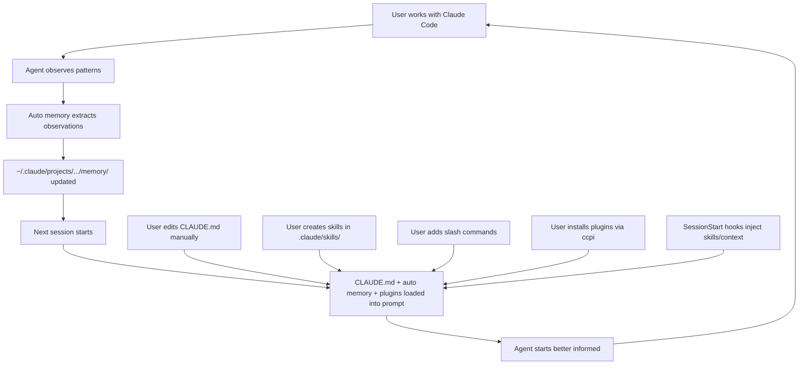

# Claude Code — Memory, Skills, and Leaked Internals

In March 2026, Anthropic published a routine update to the `@anthropic-ai/claude-code` npm package. Bundled with it — accidentally — was a complete source map: 512,000 lines of TypeScript, the entire client-side implementation of Claude Code.

The community had the source within hours. The source map was pulled within a day. But the code had already been analyzed, documented, and discussed across dozens of repositories and blog posts.

This chapter is based on that leaked source, cross-referenced with Anthropic's official documentation, blog posts, and the publicly released Claude Agent SDK. Every claim traces to a specific code path, configuration constant, or documented behavior.

---

## CLAUDE.md — The Manual Memory Layer

CLAUDE.md is a markdown file. You create it. You write in it. Claude Code reads it at the start of every session and injects the contents into its system prompt. That is the entire mechanism.

What makes it worth a section in this book is the *hierarchy* — Claude Code doesn't load one file. It loads a chain of files from multiple locations, each scoped to a different level of specificity.

### Hierarchical Loading

```
Discovery order (all loaded at session start):

1. ~/.claude/CLAUDE.md              Global — your preferences across all projects
2. <project-root>/CLAUDE.md         Project — team-wide conventions (committed to git)
3. <cwd>/.claude/CLAUDE.md          Directory — subdirectory-specific context
4. .claude/CLAUDE.local.md          Personal — your local overrides (gitignored)
```

The discovery logic in the leaked `SystemPromptBuilder`:

```typescript
async function discoverMemoryFiles(cwd: string): Promise<ClaudeMemoryFile[]> {
  const files: ClaudeMemoryFile[] = [];
  const seen = new Set<string>();

  // Walk upward from CWD, collecting project-scope files
  let current = cwd;
  while (true) {
    const claudeFile = path.join(current, 'CLAUDE.md');
    const dotClaudeFile = path.join(current, '.claude', 'CLAUDE.md');

    for (const candidate of [claudeFile, dotClaudeFile]) {
      if (!seen.has(candidate) && await fileExists(candidate)) {
        seen.add(candidate);
        const content = await readFile(candidate, 'utf-8');
        files.push({
          path: candidate,
          content: truncateToTokenBudget(content, 4096),
          scope: 'project',
          truncated: content.length > tokenToCharEstimate(4096),
        });
      }
    }

    const parent = path.dirname(current);
    if (parent === current) break;
    current = parent;
  }

  // User-scope: ~/.claude/CLAUDE.md
  const homeFile = path.join(os.homedir(), '.claude', 'CLAUDE.md');
  if (!seen.has(homeFile) && await fileExists(homeFile)) {
    const content = await readFile(homeFile, 'utf-8');
    files.push({
      path: homeFile,
      content: truncateToTokenBudget(content, 4096),
      scope: 'user',
      truncated: content.length > tokenToCharEstimate(4096),
    });
  }

  // Enforce total budget across all files
  return enforceGlobalBudget(files, 12288);
}
```

### Token Budgets

| Constraint | Limit | What happens when exceeded |
|-----------|-------|---------------------------|
| Per-file | 4,096 tokens | Truncated with notice: *"[truncated — file exceeds 4K token limit]"* |
| Total across all files | 12,288 tokens | Lowest-priority files dropped entirely |

These limits are hard-coded in the `SystemPromptBuilder`. They count against the context window — every token of CLAUDE.md is a token the agent can't use for conversation, tool results, or reasoning.

### The /init Command

The `/init` command auto-generates an initial CLAUDE.md for a project:

```
/init
  → Scans project structure (package.json, pyproject.toml, Makefile, etc.)
  → Reads README.md, CONTRIBUTING.md
  → Identifies build system, test framework, linter
  → Generates CLAUDE.md with:
    - Build and test commands
    - Project structure overview
    - Detected conventions
```

The generated file is a starting point. The real value accumulates over time as you add architecture decisions, coding conventions, and project-specific context that the agent can't infer from the codebase alone.

### What Goes in CLAUDE.md

Best practice from both Anthropic's documentation and community experience: **50–200 lines max.**

```markdown
# CLAUDE.md

## Build & Test
- Run tests: `pytest tests/ -x --tb=short`
- Lint: `ruff check . --fix`
- Type check: `pyright`
- Dev server: `uvicorn src.main:app --reload`

## Architecture
- src/core/ — domain logic, no I/O dependencies
- src/adapters/ — external service clients (DB, APIs)
- src/api/ — FastAPI routes, thin layer over core
- Dependency injection via src/core/deps.py

## Conventions
- Dataclasses for structured data, not dicts
- All public functions need Google-style docstrings
- Prefer pathlib over os.path
- Error handling: raise domain exceptions from core/, catch in api/
- Never import from adapters/ in core/

## Known Issues
- The Postgres connection pool leaks under high concurrency — use
  `async with pool.acquire() as conn:` pattern, never raw pool.execute()
```

What *not* to put in: documentation that duplicates the README, generated API references, long code examples. The file is injected into every prompt — bloat costs tokens on every turn.

### The .claude/CLAUDE.local.md Escape Hatch

`.claude/CLAUDE.local.md` is gitignored by convention. This is where you put personal preferences that shouldn't be shared with the team:

```markdown
# CLAUDE.local.md

- I use vim keybindings — don't suggest VS Code shortcuts
- My local DB is on port 5433 (not 5432)
- When generating code, include type annotations even on local variables
- I prefer explicit over concise — spell out variable names
```

It loads with the same 4K per-file budget and counts toward the 12K total.

---

## Auto Memory — Claude Learns Without Being Told

CLAUDE.md is manual — you write it. Auto memory is the opposite: Claude Code writes observations automatically, without being asked.

### Where It Lives

```
~/.claude/projects/<project-hash>/memory/
  ├── observations.md
  └── ... (additional auto-generated files)
```

The path is derived from the project root, so each project gets its own memory store. Files are stored in the user's home directory, not in the project — auto memory is never committed to version control.

### What Gets Stored

Auto memory captures patterns the agent observes during sessions:

| Category | Example |
|----------|---------|
| Coding conventions | *"This project uses single quotes for strings"* |
| Build commands | *"Tests run with `npm run test:unit`, not `npm test`"* |
| Debugging approaches | *"When the API returns 500, check Redis connection first — it drops under load"* |
| User preferences | *"User prefers functional style over class-based components"* |
| Environment facts | *"Project requires Node 20 — nvm use 20 before running"* |

The agent writes these observations at the end of sessions where it learned something new. The trigger is implicit — the agent decides what's worth remembering based on the interaction.

### Loading at Session Start

Auto memory is loaded alongside CLAUDE.md at the beginning of every session:

```
Session start:
  1. Load CLAUDE.md files (hierarchical discovery, 12K budget)
  2. Load auto memory (first 200 lines or 25KB cap, whichever is smaller)
  3. Inject both into system prompt
  4. Begin conversation
```

The 200-line / 25KB cap prevents auto memory from growing unbounded. Unlike CLAUDE.md's per-file 4K token budget, auto memory has a simpler line-count cutoff — most recent observations at the top.

### The Agent Writes These Automatically

The critical difference from CLAUDE.md: you don't have to ask. After a session where you corrected the agent ("no, we use pnpm here, not npm"), the agent records the correction. Next session, it already knows.

This is passive extraction — the agent observes patterns from the interaction and persists them. It doesn't require explicit instruction or a special command.

### Proposed Self-Improvement Loop

A more ambitious use of auto memory has been prototyped (though not yet shipped as a default feature):

```
┌─────────────────────────────────┐
│  Analyze usage data              │
│  ~/.claude/usage-data/facets/    │
│  Identify friction patterns      │
└──────────────┬──────────────────┘
               │
               ▼
┌─────────────────────────────────┐
│  Friction detection              │
│  "User corrected me 4 times     │
│   about import ordering"         │
│  "Build command failed 3         │
│   sessions in a row"             │
└──────────────┬──────────────────┘
               │
               ▼
┌─────────────────────────────────┐
│  Suggest CLAUDE.md additions     │
│  "Add: imports sorted with       │
│   isort --profile black"         │
└─────────────────────────────────┘
```

In a prototype analysis, the friction detection pass identified a **42% friction rate** — nearly half of sessions contained at least one repeated correction or failed command that could have been prevented by a CLAUDE.md entry. The proposed loop would analyze `~/.claude/usage-data/facets/` for these patterns and suggest additions to CLAUDE.md, closing the gap between what the agent knows (auto memory) and what the agent is *told* (CLAUDE.md).

This has not shipped as an automated feature. The data is there; the feedback loop is not yet closed.

---

## Agent Skills — .claude/skills/*.md

Skills are markdown files that teach Claude Code specific procedures. Where CLAUDE.md stores facts and conventions, skills store *how-to* knowledge — step-by-step workflows the agent can follow.

### Format

Skills follow the `agentskills.io` standard:

```yaml
---
name: database-migration
description: >
  Run and manage database migrations using Alembic. Handles
  creating new migrations, applying pending migrations,
  rolling back, and resolving common migration conflicts.
version: 1.0.0
author: team
platforms: [linux, macos]
metadata:
  tags: [database, alembic, migrations]
  requires_toolsets: [terminal]
---

## When to Use

- User asks to create, run, or roll back a database migration
- Schema changes are needed for a new feature
- Migration conflicts after merging branches

## Procedure

1. Check current migration state: `alembic current`
2. Create new migration: `alembic revision --autogenerate -m "description"`
3. Review generated migration in alembic/versions/
4. Apply: `alembic upgrade head`
5. Verify: check tables with `psql` or ORM queries

## Pitfalls

- Always review autogenerated migrations — Alembic misses renamed columns
  (shows as drop + create instead)
- Run `alembic check` before committing to catch schema drift
- Never edit a migration that has been applied to shared environments
```

### Progressive Disclosure

Skills are not loaded all at once. Claude Code uses a three-level loading strategy:

```
Level 0: Skill index (always in context)
  → Name + description only
  → ~100 tokens per skill
  → Used for matching: "Does any skill apply to this task?"

Level 1: Full skill content (loaded on demand)
  → Complete procedure, pitfalls, verification
  → ~500-1500 tokens per skill
  → Loaded when the agent decides a skill is relevant

Level 2: Section-specific (loaded on demand)
  → Just the "Pitfalls" section, or just the "Procedure"
  → ~100-300 tokens
  → For follow-up questions about a specific part
```

The matching works on the skill's `name` and `description` fields only — the body is never searched. This is why descriptions matter: a skill with a vague description ("database stuff") won't activate for specific queries ("how do I run an Alembic migration?").

Token savings:

```
30 skills at ~800 tokens each:
  Load all:           30 × 800 = 24,000 tokens
  Progressive (L0):   30 × 100 =  3,000 tokens
  + 1 activated (L1):            +   800 tokens
  Total:                          3,800 tokens

  Savings: 84%
```

### Slash Commands: .claude/commands/*.md

Custom commands live in `.claude/commands/`:

```
.claude/
  commands/
    deploy.md        →  /deploy
    review.md        →  /review
    test-coverage.md →  /test-coverage
```

Each command file is a markdown template with variable substitution:

```markdown
<!-- .claude/commands/review.md -->
Review the following file for:
1. Security vulnerabilities
2. Performance issues
3. Code style violations per our CLAUDE.md conventions
4. Missing error handling

File to review: $ARGUMENTS

Provide a structured report with severity levels.
```

When the user types `/review src/auth.py`, Claude Code reads the template, substitutes `$ARGUMENTS` with `src/auth.py`, and injects the result as the user message. Slash commands are user-authored skills — a bridge between the agent's generic capabilities and project-specific workflows.

### Sharing Skills Across Teams and Projects

Skills in `.claude/skills/` are plain markdown files in the repository. They are committed to git, reviewed in PRs, and shared through normal version control. A team's skill library grows as developers add skills for their project's common workflows — deployment, testing patterns, debugging procedures.

The `agentskills.io` standard means skills are interoperable: a skill written for Claude Code works with Hermes and OpenClaw, and vice versa. The format is the same; the discovery mechanism differs by agent.

---

## The Plugin Ecosystem (May 2026)

By May 2026, Claude Code's skills system had grown into a full plugin ecosystem. Anthropic launched an official plugin marketplace on May 22, 2026 (`anthropics/claude-plugins-official`, 20K+ stars in the first week). A community marketplace (`claude-plugins-community`) followed immediately, with an automated review pipeline for submissions.

A plugin is the distribution format. It bundles everything an agent extension needs:

```
Plugin = distribution package containing:
  ├── skills/         (SKILL.md files — probabilistic activation)
  ├── agents/         (subagent definitions)
  ├── hooks/          (deterministic lifecycle event handlers)
  ├── mcp-servers/    (Model Context Protocol servers)
  └── commands/       (slash commands)

Namespaced as /plugin-name:skill-name to prevent conflicts
```

Skills, hooks, agents, MCP servers, and slash commands — previously scattered across separate directories and configuration files — now ship as a single installable unit. Namespacing (`/plugin-name:skill-name`) prevents conflicts when multiple plugins define skills with similar names.

### The Marketplace Numbers

The ecosystem grew fast:

| Metric | Value (May 2026) |
|--------|-------------------|
| Official marketplace plugins | 425+ |
| Community skills (tonsofskills.com) | 2,810+ |
| CLI package manager | `ccpi` (Claude Code Plugin Installer) |
| Open-source marketplace | `jeremylongshore/claude-code-plugins-plus-skills` |

`tonsofskills.com` became the npm-like registry for agent skills, searchable and installable via the `ccpi` CLI. The open-source marketplace (`claude-code-plugins-plus-skills`) serves teams that want to self-host their plugin registry.

Not all of it is safe. A Snyk audit in February 2026 found that **13% of agent-skills packages had critical security flaws** — dependency injection vulnerabilities, unconstrained file system access, and skills that silently exfiltrated context to external endpoints. The community marketplace's automated review pipeline was a direct response.

### Hooks — Deterministic Lifecycle Events

Hooks are the other half of the plugin system, and they solve a fundamental problem with skills: skills are *probabilistic*. The agent decides whether to activate a skill based on its description and the current task. Sometimes it doesn't activate a skill when it should. Sometimes it activates the wrong one.

Hooks are **deterministic**. They fire on specific lifecycle events, every time, unconditionally:

| Event | When It Fires |
|-------|--------------|
| `SessionStart` | Session begins — before the first user message is processed |
| `PreToolUse` | Before any tool call executes |
| `PostToolUse` | After any tool call completes |
| `MessageDisplay` | Before assistant message is shown to the user |
| `prompt-submit` | When the user submits a prompt |
| `session-stop` | When the session ends |
| `pre-commit` | Before a git commit is created |

Hooks are configured in `settings.json` (project-local or user-global), not in markdown files. A `SessionStart` hook can return `reloadSkills: true` to force a skill re-scan, or set `sessionTitle` to label the session. A `MessageDisplay` hook can transform or suppress assistant message text before the user sees it.

The key distinction:

| | Skills | Hooks |
|---|--------|-------|
| **Activation** | Probabilistic — agent decides | Deterministic — event-driven |
| **Purpose** | Reusable procedures, multi-step workflows, codified expertise | Guardrails, telemetry, auto-format, blocking unsafe actions |
| **Reliability** | Agent may not invoke when appropriate | Always fires on the registered event |
| **Format** | Markdown (SKILL.md) | Code (configured in settings.json) |

Skills teach the agent *how* to do things. Hooks ensure certain things *always happen* — or *never happen*.

### Skills System Updates

The skills system itself matured alongside hooks:

- **`disallowed-tools` frontmatter**: Skills can now declare which tools should be removed from the agent's tool set while the skill is active. A security-review skill can strip `bash` access; a documentation skill can strip `write_file`. This is tool-level sandboxing per skill.
- **`/reload-skills`**: Re-scans skill directories mid-session without restarting. Useful during skill development or when a hook installs new skills dynamically.
- **`/code-review --fix`**: Applies review findings automatically instead of just reporting them. The `/simplify` command is syntactic sugar for this.
- **Security-guidance plugin**: A first-party plugin that performs real-time vulnerability detection on code edits, diffs, and commits. Configurable via `.claude/claude-security-guidance.md` and `.claude/security-patterns.yaml`. Teams using it reported a **30–40% reduction** in security-related PR review comments.

### Superpowers — The Dominant Methodology Plugin

`obra/superpowers` is the most installed plugin in the Claude Code ecosystem: **213K+ stars**, **476K+ installs** on the official marketplace.

Superpowers is a methodology plugin. It doesn't add new capabilities — it forces the agent through a structured workflow:

```
Superpowers enforced workflow:
  1. Brainstorming     — explore the problem space
  2. Design            — choose an approach
  3. Planning           — break into steps
  4. Subagent-driven development — execute via subagents
  5. TDD               — test-driven development
  6. Code review        — review own output
  7. Finishing          — cleanup and documentation
```

The implementation is a `SessionStart` hook that injects the `using-superpowers` skill into context **before the first response**. Every message the agent produces is governed by the methodology. The "1% rule" — if there's even a 1% chance a skill applies, the agent must invoke it — pushes skill activation from best-effort to near-mandatory.

The results are measurable. Before Superpowers, skill execution reliability (the agent actually using a relevant skill when one existed) was approximately **10%**. With Superpowers, it climbed to **66%**. The gain comes not from better skill matching but from the methodology forcing the agent to check its skill inventory at every step.

Superpowers is cross-platform: it also works on Codex CLI, Cursor, Gemini CLI, and Copilot CLI. The plugin format is the same; only the installation path differs.

---

## Leaked Internals (March 2026 Source Leak)

The leaked 512,000-line TypeScript source map provided unprecedented visibility into how Claude Code actually works. Here are the most architecturally significant findings.

### SystemPromptBuilder: 14,902 Lines

The `SystemPromptBuilder` assembles the system prompt dynamically, following a strict order:

```
┌───────────────────────────────────────────────────┐
│ 1. Core Identity                                   │
│    "You are Claude, an AI assistant by Anthropic"   │
│    Base personality, safety guidelines               │
├───────────────────────────────────────────────────┤
│ 2. Tool Definitions (19 tools)                      │
│    File read/write, terminal, search, browser        │
│    Each with permission tier assignment              │
├───────────────────────────────────────────────────┤
│ 3. Environment Detection Results                    │
│    OS, shell, git status, container detection        │
├───────────────────────────────────────────────────┤
│ 4. CLAUDE.md Content                                │
│    All discovered memory files (4K per / 12K total)  │
├───────────────────────────────────────────────────┤
│ 5. Active Skills                                    │
│    Skills matching current task context              │
│                                                     │
│ ═══ __SYSTEM_PROMPT_DYNAMIC_BOUNDARY__ ═══          │
│                                                     │
│ 6. Session Context (dynamic, per-turn)              │
│    CWD, recent files, git branch, uncommitted changes│
├───────────────────────────────────────────────────┤
│ 7. Task-Specific Instructions                       │
│    Slash command context, mode-specific rules         │
└───────────────────────────────────────────────────┘
```

### __SYSTEM_PROMPT_DYNAMIC_BOUNDARY__

This is the most commercially significant line in the codebase. Everything above it is **static** — identical across turns within a session, often identical across sessions for the same project. Everything below changes per turn.

Anthropic's API supports prompt caching. The static prefix (~70% of the total prompt) is cached and reused at reduced cost. The dynamic suffix (~30%) is recomputed each turn.

```typescript
function buildSystemPrompt(config: SessionConfig): string {
  const staticParts = [
    buildCoreIdentity(),
    buildToolDefinitions(config.enabledTools),
    buildEnvironmentContext(config.environment),
    buildMemoryContent(config.memoryFiles),
    buildActiveSkills(config.skills),
  ];

  const dynamicParts = [
    buildSessionContext(config.session),
    buildTaskInstructions(config.task),
  ];

  return [
    ...staticParts,
    '__SYSTEM_PROMPT_DYNAMIC_BOUNDARY__',
    ...dynamicParts,
  ].join('\n\n');
}
```

Your CLAUDE.md content sits above the boundary. This means project memory is cached — a direct cost benefit.

### 19 Tools with Permission Tiers

The leaked source revealed 19 tools, each assigned to one of three permission tiers:

| Tier | Tools | Capabilities |
|------|-------|-------------|
| **ReadOnly** | `read_file`, `list_directory`, `search_files`, `grep`, `think` | Can read anything; cannot modify |
| **WorkspaceWrite** | `write_file`, `edit_file`, `create_directory`, `rename` | Can modify files within the project |
| **FullAccess** | `bash`, `browser`, `http_request`, `install_package` | Can execute arbitrary commands, access network |

Permission tiers are enforced client-side. The user configures the maximum tier; the agent can only use tools at or below that tier. A read-only session literally cannot invoke `bash`.

### Auto-Compaction: Hidden Error Recovery

When the context window fills up, Claude Code's compaction system has two paths:

```
Proactive path (normal):
  Context approaching limit → agent-initiated summary
  → compress early turns → continue seamlessly

Reactive path (hidden from user):
  Context EXCEEDS limit → API returns error
  → Claude Code catches the error silently
  → Runs emergency compaction (summarize all but last 3 turns)
  → Retries the failed request
  → User sees the response as if nothing happened
```

The implementation:

```typescript
class ConversationManager {
  private hasAttemptedReactiveCompact: boolean = false;

  async sendMessage(message: Message): Promise<Response> {
    try {
      return await this.api.complete(this.buildRequest(message));
    } catch (error) {
      if (error instanceof ContextLengthError) {
        return this.handleContextOverflow(message);
      }
      throw error;
    }
  }

  private async handleContextOverflow(message: Message): Promise<Response> {
    if (this.hasAttemptedReactiveCompact) {
      // Already tried once — don't loop forever
      throw new UserFacingError(
        'Conversation too long. Please start a new session with /clear.'
      );
    }

    this.hasAttemptedReactiveCompact = true;

    const summary = await this.summarizeHistory(
      this.conversation.slice(0, -3)
    );

    this.conversation = [
      { role: 'system', content: `Previous conversation summary:\n${summary}` },
      ...this.conversation.slice(-3),
    ];

    return this.sendMessage(message);
  }
}
```

### hasAttemptedReactiveCompact

One boolean. It fixed an infinite retry loop in an earlier version where a conversation that couldn't be sufficiently compacted would cycle: compress → retry → fail → compress → retry → fail. The fix was a single line: `this.hasAttemptedReactiveCompact = true` before the retry.

### ANTI_DISTILLATION_CC

A countermeasure against API traffic interception:

```typescript
if (config.ANTI_DISTILLATION_CC) {
  toolDefinitions.push(
    buildDecoyTool('internal_search', 'Search internal knowledge base'),
    buildDecoyTool('memory_store', 'Store information in persistent memory'),
    buildDecoyTool('context_extend', 'Extend context window dynamically'),
  );
}

function buildDecoyTool(name: string, description: string): ToolDefinition {
  return {
    name,
    description,
    parameters: generatePlausibleSchema(),
  };
}
```

If a competitor intercepts API traffic between Claude Code and Anthropic's API, the conversation data includes these fake tool definitions. Anyone training a model on the intercepted data would teach their model to call tools that don't exist. This is adversarial defense — the system poisons training data extraction.

### Container Detection

Claude Code detects whether it's running in a container and adjusts behavior:

```typescript
async function detectContainerEnvironment(): Promise<ContainerInfo> {
  const checks = {
    dockerenv: await fileExists('/.dockerenv'),
    containerenv: await fileExists('/run/.containerenv'),
    envFlag: process.env.CONTAINER === 'true'
              || process.env.DOCKER === 'true',
    cgroup: await checkCgroup(),  // /proc/1/cgroup contains "docker"
  };

  const isContainer = Object.values(checks).some(Boolean);

  return {
    isContainer,
    type: checks.dockerenv ? 'docker'
        : checks.containerenv ? 'podman'
        : 'unknown',
    restrictions: isContainer ? {
      noSudo: true,
      limitedFilesystem: true,
      noSystemdServices: true,
    } : {},
  };
}
```

Inside a container: no `sudo`, no system package installs, adjusted file path assumptions. The detection result is injected into the dynamic section of the system prompt — the agent knows its environment and adapts accordingly.

### CLAUDE.md Loading Truncation Budget

The specific constants from the source:

| Constant | Value | Purpose |
|----------|-------|---------|
| `MEMORY_FILE_TOKEN_BUDGET` | 4,096 | Maximum tokens per individual CLAUDE.md file |
| `MEMORY_TOTAL_TOKEN_BUDGET` | 12,288 | Maximum tokens across all memory files combined |
| `AUTO_MEMORY_LINE_CAP` | 200 | Maximum lines loaded from auto memory |
| `AUTO_MEMORY_BYTE_CAP` | 25,600 | Maximum bytes (~25KB) loaded from auto memory |

These are not configurable. They are compiled into the `SystemPromptBuilder`.

---

## How Evolution Actually Works in Claude Code

The evolution cycle in Claude Code:



Five sources feed the next session:

| Source | Who writes it | How it evolves |
|--------|--------------|---------------|
| CLAUDE.md | Human (manual) | User adds conventions, corrects mistakes |
| Auto memory | Agent (automatic) | Agent extracts patterns from interactions |
| Skills + commands | Human (manual) | User creates reusable procedures |
| Plugins | Community / first-party | Installed via marketplace; bundle skills, hooks, agents, MCP servers |
| Hooks | Plugin authors / user | Deterministic lifecycle handlers; inject context, enforce guardrails |

### What Claude Code Does Not Do

The evolution in Claude Code is **passive extraction, not active learning from outcomes.** The agent observes and records. It does not:

- **Learn from feedback signals** — unlike Cursor's Bugbot, which promotes rules based on positive reactions and demotes rules based on negative feedback. Claude Code has no mechanism for "this CLAUDE.md entry helped" vs. "this one didn't."
- **Create skills autonomously** — unlike Hermes, which creates SKILL.md files after detecting repeated tool-call patterns. Claude Code's skills are human-authored or plugin-installed, not agent-generated.
- **Consolidate memory during idle time** — unlike OpenClaw's Dreaming process, which reorganizes memory in the background. Claude Code's auto memory is append-only; there is no pruning pass.
- **Experiment to fill capability gaps** — the agent never tries something on its own to see if it works. All learning comes from user-initiated sessions.

The plugin ecosystem (May 2026) shifted this picture significantly. Methodology plugins like Superpowers inject structured workflows via hooks, pushing skill execution reliability from ~10% to ~66%. The agent still doesn't *learn* autonomously, but plugins and hooks ensure it *uses what it knows* far more reliably. The evolution model remains conservative — CLAUDE.md stays under human control, auto memory supplements rather than replaces — but the execution layer is now programmable in ways it wasn't before.

### The Resulting Trajectory

```
Week 1:  Fresh CLAUDE.md from /init. Auto memory empty.
         Agent asks basic questions: "What test runner do you use?"

Week 2:  CLAUDE.md has build commands, code style notes.
         Auto memory has 30 observations.
         Agent knows the project. Fewer clarifying questions.

Week 4:  CLAUDE.md refined: bad entries removed, edge cases added.
         Auto memory has 80 observations.
         3 slash commands for common workflows.
         Agent operates fluently within project conventions.

Month 3: CLAUDE.md stable (~150 lines, well-curated).
         Skills directory has 5 project-specific skills.
         Auto memory periodically reviewed by user.
         Agent behaves like a team member who read the docs.

Month 4: Plugin ecosystem installed: Superpowers methodology,
         security-guidance, team-specific plugins.
         Hooks enforce guardrails on every tool call.
         Skill execution reliability at 66% (up from ~10%).
         Agent follows structured workflows, not just ad-hoc prompts.
```

The limitation is real: without feedback-driven learning, the improvement curve depends entirely on the human investing time in curation. A well-maintained CLAUDE.md produces a dramatically better agent; a neglected one produces little improvement over baseline. But the plugin ecosystem has changed the ceiling — installing a methodology plugin like Superpowers produces a step-function improvement without any per-project curation. The security concern is also real: with 13% of community packages flagged for critical flaws (Snyk, February 2026), the plugin supply chain is a new attack surface that didn't exist when Claude Code was skills-only.

The next chapter covers Cursor — a system that bets on infrastructure-level evolution, feedback-driven rule learning, and the only production system that demonstrably learns from real user signals at scale.
