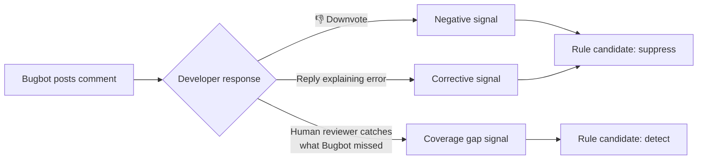

# Cursor — Continual Learning, Bugbot Rules, and the Rules System

Cursor is the most commercially successful AI coding agent: $1B ARR, 400M+ AI requests per day, used by engineers at most major tech companies. Built by Anysphere, a startup that has raised over $900M.

This chapter covers the features that make Cursor *evolve* — the mechanisms by which the system gets better through use. Not the indexing pipeline or speculative edits (those are infrastructure, covered briefly at the end). The focus is on the three features that directly enable learning: the rules system, the continual-learning plugin, and Bugbot's learned rules.

One of these — Bugbot — is the only production system that demonstrably learns from real user feedback at scale. It went from 52% to 78% resolution rate through accumulated rules. That alone makes Cursor essential to this book.

---

## The Rules System

### .cursor/rules/ — Persistent Project Context

Cursor's rules system is the equivalent of Claude Code's CLAUDE.md, but with richer activation semantics. Rules live in the `.cursor/rules/` directory as `.mdc` files (Markdown with Cursor metadata):

```
.cursor/
  rules/
    general.mdc              # Always loaded — project-wide conventions
    python-style.mdc         # Loaded when editing .py files
    react-patterns.mdc       # Loaded when editing React components
    api-conventions.mdc      # Loaded when editing routes/
    database-migrations.mdc  # Available on demand — agent can request
```

### The .mdc Format

```markdown
---
description: API route conventions for the backend service
globs: ["src/routes/**/*.ts", "src/api/**/*.ts"]
alwaysApply: false
---

# API Route Conventions

## Request Validation
- Use zod schemas for all request bodies
- Validate path params with z.coerce
- Return 400 with structured error on validation failure

## Response Format
Always return:
{
  "data": { ... },
  "meta": { "requestId": "...", "timestamp": "..." }
}

## Error Handling
- Catch all errors in route handler
- Log with request context (requestId, userId, route)
- Never expose internal error details to client
```

### Three Activation Types

| Type | Frontmatter | When Loaded | Use Case |
|------|------------|------------|----------|
| **Always** | `alwaysApply: true` | Every prompt, every session | Project-wide conventions, coding standards |
| **Auto Attached** | `globs: ["**/*.py"]` | When active file matches the glob pattern | Language-specific or directory-specific rules |
| **Agent Requested** | `description` only (no `alwaysApply`, no `globs`) | When the agent decides a rule is relevant to the task | On-demand context the agent pulls in as needed |

The `alwaysApply: true` rules are the closest equivalent to Claude Code's CLAUDE.md — injected into every interaction. Glob-matched rules are more targeted: they activate only when you're working in matching files. Agent Requested rules are the most dynamic — the agent reads the rule descriptions and decides whether to load the full content.

### Rules Bundle Prompts + Scripts

Unlike Claude Code's plain-markdown CLAUDE.md, Cursor rules can reference executable scripts:

```markdown
---
description: Pre-commit validation for Python files
globs: ["**/*.py"]
alwaysApply: false
---

# Pre-commit Checks

Before suggesting changes to Python files, verify:

1. Run `ruff check $FILE` and confirm no errors
2. Run `pyright $FILE` and confirm no type errors
3. If tests exist in the corresponding test file, run them

Only proceed with changes after all checks pass.
```

The rule doesn't *execute* the scripts directly — it instructs the agent to run them as part of its workflow. The rules system provides the intent; the agent's tool-use capability provides the execution.

### /Generate Cursor Rules

The `/Generate Cursor Rules` command auto-creates rules from the current conversation:

```
User has a conversation about React testing patterns
  → Types: /Generate Cursor Rules
  → Cursor analyzes the conversation
  → Extracts recurring patterns and preferences
  → Creates a new .mdc file in .cursor/rules/
```

This is the bridge between conversation-time learning and persistent rules. Instead of the agent writing its own rules (Hermes approach), the user triggers the extraction and reviews the result before it becomes permanent.

### rule-generating-agent.mdc: The Meta-Rule

Cursor ships a meta-rule — a rule that guides the AI in creating other rules:

```markdown
---
description: Instructions for generating new Cursor rules from conversation context
alwaysApply: false
---

# Rule Generation Guidelines

When creating a new .mdc rule file:

1. Extract the specific, actionable pattern (not general advice)
2. Choose the appropriate activation type:
   - alwaysApply: true for universal conventions
   - globs for file-type-specific rules
   - Description-only for on-demand context
3. Keep rules concise — 20-50 lines max
4. Include concrete examples, not abstract principles
5. Test the rule by verifying it would have helped in the
   conversation that triggered its creation
```

This is a meta-skill pattern: the system teaches itself how to create better rules. The meta-rule is itself a `.mdc` file — it follows the same format it teaches.

---

## The Continual-Learning Plugin

### What It Is

The continual-learning plugin is an official Cursor plugin, available in the `cursor/plugins` repository on GitHub. It is the mechanism by which Cursor's agent automatically updates project documentation (AGENTS.md) based on what it learns during sessions.

### Architecture

```
┌─────────────────────────────┐
│  Cursor Agent Session        │
│  (conversation with user)    │
└──────────────┬──────────────┘
               │ Session ends (stop hook fires)
               ▼
┌─────────────────────────────┐
│  continual-learning skill    │
│  (stop hook handler)         │
│                              │
│  Checks:                     │
│  - Enough turns? (≥10)       │
│  - Enough time? (≥120 min)   │
│  - Cadence ok? (not too      │
│    frequent)                 │
└──────────────┬──────────────┘
               │ If all checks pass
               ▼
┌─────────────────────────────┐
│  agents-memory-updater       │
│  subagent                    │
│                              │
│  1. Read existing AGENTS.md  │
│  2. Read session transcript  │
│  3. Extract high-signal      │
│     observations             │
│  4. Update AGENTS.md:        │
│     - Match existing bullets │
│       → update in place      │
│     - New observations       │
│       → append               │
└─────────────────────────────┘
```

### How It Works

The pipeline: **stop hook → continual-learning skill → agents-memory-updater subagent.**

When a Cursor agent session ends, the stop hook fires. The continual-learning skill checks whether the session was substantial enough to warrant a memory update:

| Check | Threshold (Production) | Threshold (Trial) |
|-------|----------------------|-------------------|
| Minimum turns | 10 | 3 |
| Minimum elapsed time | 120 minutes | 15 minutes |
| Cadence (minimum time since last update) | Configurable | Configurable |

If the session clears all thresholds, the skill launches the `agents-memory-updater` subagent.

### State Tracking

The plugin maintains state in two JSON files:

```
.cursor/hooks/state/
  ├── continual-learning.json        # Cadence tracking
  └── continual-learning-index.json  # File modification times
```

`continual-learning.json` tracks when the last update ran, preventing the plugin from updating AGENTS.md too frequently. `continual-learning-index.json` tracks file modification times to detect which files changed during the session — this helps the subagent focus on what's actually new.

### What Gets Extracted

The agents-memory-updater subagent is selective. It only extracts **high-signal** observations:

| Extracted | Not Extracted |
|-----------|--------------|
| Recurring user corrections ("use pnpm, not npm") | One-off commands |
| Durable workspace facts ("tests require Redis running") | Temporary debugging steps |
| User preferences expressed multiple times | Single-mention preferences |
| Build/test commands that were corrected | Commands that worked first try |

### The Update Mechanism

The key detail: the subagent **reads existing AGENTS.md first**, then updates matching bullets in place rather than doing full rewrites.

```
Existing AGENTS.md:
  - Run tests with: `pytest tests/`
  - Project uses PostgreSQL 15

Session transcript reveals:
  User corrected agent: "No, run tests with `pytest tests/ -x --tb=short`"
  User mentioned: "We migrated to PostgreSQL 16 last week"
  User said: "Always run ruff before committing"

Updated AGENTS.md:
  - Run tests with: `pytest tests/ -x --tb=short`     ← updated in place
  - Project uses PostgreSQL 16                          ← updated in place
  - Always run ruff before committing                   ← new bullet appended
```

This in-place update prevents the file from growing unboundedly with duplicate entries. It also preserves the structure — sections, headers, and unmodified bullets stay intact.

---

## Bugbot Learned Rules — The Only Production System That Learns From Real Feedback at Scale

This is the most important self-evolution feature in any production agent. Not because it's the most architecturally sophisticated — it's not. Because it's the only one with **measured results from real feedback signals at scale.**

### The Numbers

| Date | Resolution Rate | What Changed |
|------|----------------|-------------|
| July 2025 (launch) | 52% | Baseline — no learned rules |
| October 2025 | 61% | First learned rules deployed |
| January 2026 | 70% | Rule accumulation + pruning stabilized |
| April 2026 | **78.13%** | 44,000+ learned rules across 110,000 repos |

The improvement from 52% to 78% came almost entirely from learned rules — same base model, same core prompting strategy, but with an accumulating library of repository-specific and pattern-specific rules that guide Bugbot's review behavior.

### What Bugbot Does

Bugbot is Cursor's automated code review agent. When a pull request is opened, Bugbot:

1. Reads the PR diff
2. Analyzes code changes for bugs, style issues, security problems
3. Posts inline comments on specific lines
4. Suggests fixes

The learning system improves step 2–4 over time based on real developer feedback.

### Three Feedback Signals



| Signal | Source | What It Teaches |
|--------|--------|----------------|
| **Reactions** (thumbs down) | Developer downvotes Bugbot's comment | "This type of comment is unwanted for this repo" |
| **Developer replies** | Developer explains why Bugbot was wrong | "The reasoning was incorrect — here's the actual convention" |
| **Human reviewer comments** | Human catches something Bugbot missed | "This pattern should be flagged but wasn't" |

### The Rule Lifecycle

```
1. CANDIDATE
   Feedback triggers rule proposal
   "In repo X, don't flag unused imports in __init__.py files"

2. ACCUMULATION
   Same pattern gets positive signal from multiple PRs
   3+ consistent signals → confidence threshold met

3. ACTIVE
   Rule promoted to active status
   Applied to all future reviews for this repo

4. MONITORING
   Rule continues to accumulate feedback
   Consistent negative feedback → rule disabled

5. DISABLED (if needed)
   Rule generated more problems than it solved
   Removed from active rules, kept for audit
```

### Scale

As of April 2026:

| Metric | Value |
|--------|-------|
| Repos with Bugbot enabled | 110,000+ |
| Total learned rules generated | 44,000+ |
| Average rules per active repo | ~3-5 |
| Max rules for a single repo | 50+ (large monorepos) |

### @cursor remember [fact]

Developers can teach Bugbot directly on PRs:

```
@cursor remember In this repo, we allow console.log in test files
@cursor remember Our API responses always include a requestId field
@cursor remember Don't flag TODOs in migration files — they're intentional
```

These inline teachings become rule candidates immediately, bypassing the feedback accumulation phase. They are the most direct teaching mechanism: the developer tells the system exactly what to learn.

### Competitive Performance

Bugbot's learned rules give it a measurable edge over competitors:

| System | Resolution Rate | Learned Rules |
|--------|----------------|--------------|
| **Cursor Bugbot** | **78.13%** | Yes — 44,000+ rules |
| Greptile | 63.49% | No |
| CodeRabbit | 48.96% | Limited (user-configured) |
| GitHub Copilot | 46.69% | No |

The performance gap correlates directly with the learning mechanism. Greptile, CodeRabbit, and GitHub Copilot use static prompting — the same review strategy regardless of accumulated feedback. Bugbot's advantage is not a better base model; it's that the system has seen 110,000 repos' worth of developer corrections and encoded them as rules.

### Why This Matters for Self-Evolution

Bugbot's learned rules are the **closest thing in production to a reinforcement learning loop for an agent system**:

1. **Action:** Bugbot posts a review comment
2. **Reward signal:** Developer reacts (positive/negative/corrective)
3. **Policy update:** Rule created, promoted, or disabled
4. **Future behavior changes:** Next review incorporates learned rules

It's not gradient-based RL — it's rule-based policy modification. But the closed loop is real: actions produce observable outcomes, outcomes drive policy changes, and changed policies produce different actions. This is what makes it unique among production agents.

---

## reflect-yourself (Community)

### What It Is

`reflect-yourself` is a community project that adds self-evolving AI skills to Cursor. Where the continual-learning plugin updates a single AGENTS.md file, reflect-yourself creates a structured knowledge base of learned behaviors.

### How It Works

```
User corrects the agent during a session
  → reflect-yourself captures the correction
  → Classifies the scope:
      Project-specific  → .cursor/skills/project/
      Personal          → ~/.cursor/skills/personal/
      Rule-worthy       → .cursor/rules/
  → Assigns confidence score (0.3 - 0.9)
  → Creates or updates the appropriate file
```

### Smart Routing

The routing logic decides where knowledge should live:

| Scope | Destination | Example |
|-------|------------|---------|
| **Project** | `.cursor/skills/project/*.md` | "This repo uses Alembic, not raw SQL migrations" |
| **Personal** | `~/.cursor/skills/personal/*.md` | "I prefer explicit type annotations on all variables" |
| **Rule** | `.cursor/rules/*.mdc` | "Always run `pnpm typecheck` before committing" |

Project skills are committed to git (shared with team). Personal skills live in the user's home directory (private). Rules go into `.cursor/rules/` where they integrate with Cursor's native rules system.

### Confidence Scoring

Each learned behavior has a confidence score:

```
0.3 — Single correction, might be situational
0.5 — Corrected twice in similar contexts
0.7 — Corrected 3+ times, consistent pattern
0.9 — Explicitly confirmed by user or corrected 5+ times
```

Low-confidence behaviors (< 0.5) are stored but not actively loaded into context. They are candidates — waiting for additional signal before becoming active. High-confidence behaviors (≥ 0.7) are loaded during relevant sessions.

This mirrors Bugbot's rule lifecycle: candidate → accumulate signal → promote → monitor. The pattern is convergent — multiple systems independently arrive at signal-gated promotion as the right policy for learned rules.

---

## The Cursor Context Engine (Background)

The evolution features above — rules, learned rules, continual learning — operate within a context engine that keeps the agent's understanding of the codebase current. This section is brief because the context engine is infrastructure, not evolution itself. But it's what makes the evolution features effective.

### Merkle Trees for Change Detection

Cursor indexes the entire codebase into a searchable embedding store. Re-indexing everything on every change is prohibitive. The solution: **Merkle trees** — the same data structure that powers Git.

```
Change detection:
  Before edit:  Root hash = ab3f...
  After edit:   Root hash = x92k...  (different)

  Walk the tree: only 3 branches changed
  → Re-index 3 files instead of 100,000

  Complexity: O(k log n) where k = changed files, n = total files
```

For a 100,000-file repo with 3 changed files, this touches ~50 tree nodes instead of scanning 100,000 files. Teammate index reuse means a new developer gets a fully indexed codebase in 525ms (vs. 7.87s for fresh indexing).

### AST Chunking

Tree-sitter parses source files into ASTs. Chunks are complete semantic units (functions, classes, modules) rather than arbitrary line-count windows:

```
Naive chunking:
  Lines 1-500    ← Function split across boundary
  Lines 501-1000 ← Half a class

Tree-sitter chunking:
  class UserService { ... }        ← Complete unit
  function authenticate() { ... }  ← Complete unit
```

Better chunks → better embeddings → better retrieval → the agent gets more relevant code when it needs it.

### Turbopuffer Embeddings

Embeddings are stored in Turbopuffer (S3-backed vector database). A reranker — fine-tuned CodeLlama 7B running at 1,000+ tokens/second — scores (query, code_chunk) pairs for relevance after the initial vector search returns the top 100 candidates.

### Why This Matters for Evolution

The context engine doesn't evolve. But it makes everything else work:

- **Rules** are more effective when the agent has the right code in context (glob-matched rules + relevant code = accurate suggestions)
- **Bugbot's learned rules** are applied to the right code because the indexing pipeline identifies which code is affected by a PR
- **Continual learning** extracts better observations when the agent understands the full context of what changed

The context engine is the substrate. The evolution features are what grows on it.

---

## Automations and Autonomous Execution (May 2026)

Through early 2026, Cursor's agent operated in a tight loop with the user: propose a change, wait for approval, execute, repeat. Every shell command, every MCP call, every external fetch required explicit permission. This kept the human in control but created a friction tax — experienced users spent more time clicking "Allow" than reviewing output.

Cursor 3.5 (May 20) and 3.6 (May 29) shipped a set of features that moved the system toward sustained autonomous work: longer-running agents, fewer approval prompts, multi-repo reasoning, and parallel execution.

### Auto-review Run Mode (Cursor 3.6, May 29)

Auto-review is a new run mode that lets the agent work longer without stopping for permission on every tool call. It applies to Shell, MCP, and Fetch tool calls — the three categories that previously required explicit user approval.

The system uses a three-step classifier chain:

```
Tool call intercepted
  │
  ├─→ Step 1: Allowlist check
  │     Match in permissions.json allow_instructions?
  │     → YES: Execute immediately
  │     → NO: Continue to Step 2
  │
  ├─→ Step 2: Sandbox check
  │     Can this call run in a sandbox?
  │     (macOS, Linux, Windows/WSL2)
  │     → YES: Execute in sandbox
  │     → NO: Continue to Step 3
  │
  └─→ Step 3: LLM Classifier
        Classifier decides:
        → ALLOW: Execute
        → TRY DIFFERENT APPROACH: Agent replans
        → ASK USER: Fall back to approval prompt
```

Allowlisted calls run with zero latency. Sandboxable calls run in isolation — the sandbox prevents file system or network damage even if the command is destructive. Everything else goes to an LLM classifier that evaluates risk based on the command, the project context, and the current task.

The classifier is configured via `permissions.json`:

```json
{
  "autoRun": {
    "allow_instructions": "npm test, npm run build, git status, git diff",
    "block_instructions": "rm -rf, sudo, curl | bash"
  }
}
```

`allow_instructions` and `block_instructions` are natural-language descriptions, not exact command matches — the classifier interprets intent, not syntax. This is explicitly **not a security boundary**. The classifier is non-deterministic; it's a best-effort convenience layer. Security-critical restrictions still require Cursor's existing permission tiers.

### /loop Skill (Cursor 3.5, May 20)

`/loop` runs a prompt repeatedly on a local schedule until the desired outcome is achieved or the user stops it:

```
/loop "Run the test suite every 5 minutes and fix any failures"
/loop "Check if the staging deployment is healthy"
/loop "Monitor the build output and alert me if it fails"
```

If no fixed interval is specified, the agent decides when to wake — it can back off when nothing changes and check more frequently during active work. `/loop` turns the agent from a request-response tool into a background monitor. It enables use cases that were previously manual: continuous test-fixing, deployment health checks, periodic maintenance tasks.

### Multi-repo Automations (Cursor 3.5, May 20)

Automations — Cursor's headless agent runs — now support multiple repositories:

| Before (single-repo) | After (multi-repo) |
|----------------------|-------------------|
| One automation = one repo | One automation = multiple repos |
| Cross-repo work requires manual coordination | Agent reasons across all attached repos |
| Separate test/verify steps per repo | Agent works across repos to deliver, test, and verify |

A single automation can now read from a shared library repo, implement changes in a service repo, and update integration tests in a test repo — all in one run, with full cross-repo context.

No-repo automations are also new: monitoring and reporting tasks that don't need a codebase at all. An automation can check external service health, aggregate metrics, or produce reports without being attached to any repository.

Automations moved from a browser-only interface to the **Agents Window** inside the IDE. No more context-switching to a browser tab to manage background agents.

### Parallel Plan Execution

The "Build in Parallel" feature identifies independent steps in the agent's plan and runs them concurrently via async subagents:

```
Plan with 6 steps:
  Step 1: Update User model          ─┐
  Step 2: Update Product model        ├─ Independent → run in parallel
  Step 3: Update Order model          ─┘
  Step 4: Update shared types         ← Depends on 1-3 → sequential
  Step 5: Update API routes           ← Depends on 4 → sequential
  Step 6: Update tests                ← Depends on 5 → sequential
```

Steps 1–3 touch separate modules with no shared state — they execute simultaneously. Steps 4–6 depend on prior results and run sequentially. The system identifies these dependency edges automatically from the plan.

For tasks that touch many independent modules — a large refactor, a migration, adding the same pattern to multiple services — parallel execution collapses wall-clock time proportionally to the number of independent branches.

### Infrastructure Updates

Supporting the autonomous execution features:

| Update | What It Does |
|--------|-------------|
| **Composer 2.5 model** | Internal model tuned for sustained work and complex multi-step instructions |
| **Environment version history** | Cloud agent environments now have rollback — revert to any previous state if an agent breaks something |
| **Audit trails** | Every agent command logged with timestamps; full replay available |
| **Environment-scoped secrets** | Secrets can be scoped to specific cloud agent environments, not just user/team level |

Environment version history is particularly relevant for autonomous work. When an agent runs for hours without supervision, the ability to roll back to a known-good state is a safety net that makes longer autonomy practical.

---

## Summary: Cursor's Evolution Stack

```
┌──────────────────────────────────────────────────────┐
│                    Cursor                              │
├──────────────────────────────────────────────────────┤
│                                                      │
│  Rules Layer (human-authored + auto-generated)        │
│  ├── .cursor/rules/*.mdc — Always, Auto, Agent types │
│  ├── /Generate Cursor Rules — conversation extraction │
│  └── rule-generating-agent.mdc — meta-rule            │
│                                                      │
│  Continual Learning Layer (plugin)                    │
│  ├── Stop hook → transcript analysis → AGENTS.md      │
│  ├── In-place bullet update (not full rewrite)        │
│  └── Cadence control (10 turns + 120 min minimum)     │
│                                                      │
│  Bugbot Learned Rules (production RL loop)            │
│  ├── 3 feedback signals: reactions, replies, coverage │
│  ├── Rule lifecycle: candidate → active → monitored   │
│  ├── 44,000+ rules across 110,000 repos               │
│  ├── 52% → 78% resolution rate from rules alone       │
│  └── @cursor remember for direct teaching              │
│                                                      │
│  Automations & Autonomous Execution (May 2026)        │
│  ├── Auto-review: allowlist → sandbox → LLM classifier│
│  ├── /loop: repeated prompt execution on schedule     │
│  ├── Multi-repo automations with cross-repo reasoning │
│  ├── Parallel plan execution via async subagents      │
│  └── Environment rollback + audit trails              │
│                                                      │
│  Context Engine (infrastructure)                      │
│  ├── Merkle tree change detection                     │
│  ├── AST chunking (Tree-sitter)                       │
│  ├── Turbopuffer embeddings + CodeLlama reranker      │
│  └── Priompt priority-based context compilation       │
│                                                      │
│  Community Extensions                                 │
│  └── reflect-yourself: confidence-scored skill capture │
│                                                      │
└──────────────────────────────────────────────────────┘
```

### The Key Insight

Cursor's evolution strategy is layered:

| Layer | Who Drives It | Feedback Source |
|-------|--------------|----------------|
| Rules (`.mdc`) | Human (manual) | Developer experience |
| Continual learning | Agent (automatic) | Session transcripts |
| Bugbot rules | System (automated) | Real user reactions at scale |
| Automations | Agent (autonomous) | Task outcomes, test results, deployment status |

The bottom layer — Bugbot learned rules — remains the most important for *evolution*. It's the only production system where the evolution loop is fully closed: action → feedback → policy update → changed behavior. Every other system in this book either requires human curation (CLAUDE.md), depends on the agent's self-assessment (Hermes 15-call checkpoint), or operates on static rules (most competitors).

The May 2026 automations layer is the most important for *autonomy*. Auto-review, `/loop`, multi-repo automations, and parallel execution collectively move Cursor from an approval-per-action model to sustained autonomous work. The agent can now run for hours, across multiple repositories, with sandbox-backed safety and environment rollback as the safety net. This is the infrastructure that makes the evolution features *compound* — an agent that runs longer and touches more code generates more feedback signals, which feeds the Bugbot learning loop, which improves the next autonomous run.

Bugbot proves that signal-gated rule promotion works at scale. The 26-point improvement in resolution rate (52% → 78%) came from rules, not from a better model. That's the strongest evidence in production that agent self-evolution delivers measurable results.

The next chapter covers Hermes — the system that goes all-in on agent-driven evolution with closed-loop skill creation.
