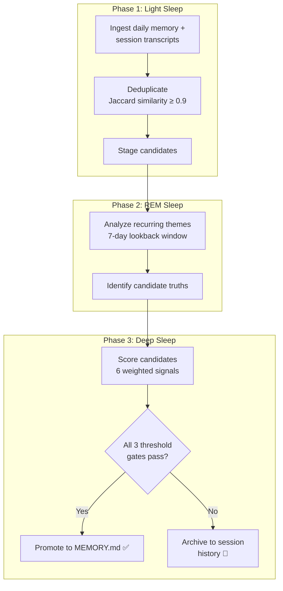

# Hermes Agent — Closed-Loop Skill Creation

Hermes Agent (Nous Research, February 2026, 99K+ GitHub stars, MIT license) is the most complete production system for autonomous skill creation. It is the only open-source agent where you can read every line of the learning loop, trace every skill creation trigger, and verify every claim in this chapter against the actual source code.

Repository: `NousResearch/hermes-agent`

---

## The Learning Loop

Hermes runs a closed loop: execute a task → self-evaluate at fixed intervals → generate skills → update memory → execute the next task better.

```
Task Execution
     │
     ▼
Self-Evaluation Checkpoint (every 15 tool calls)
     │
     ├── Reusable pattern detected? ──→ SKILL.md generation
     ├── Important fact learned?     ──→ MEMORY.md update
     ├── User preference observed?   ──→ USER.md update
     └── Existing skill wrong?       ──→ skill_manage(EDIT)
     │
     ▼
Resume Task Execution (with updated skills + memory)
```

### Trigger Conditions

Not every checkpoint creates a skill. Five specific conditions must be met:

| Trigger | Detection | Action |
|---------|-----------|--------|
| 5+ tool calls for a single task | Count sequential calls toward same goal | Create skill with procedure |
| Error then recovery | Tool call failed → different approach succeeded | Add pitfall or create troubleshooting skill |
| User correction | User message after agent action that redirects | Update MEMORY.md or USER.md |
| Non-obvious workflow | Multi-step process that isn't standard | Create workflow skill |
| Repeated pattern | Same sequence observed across sessions | Create or consolidate skill |

### The Concrete Result

```
Task: "Set up a new Python project with CI"

Session 1 (no skills):
  25 tool calls
  3 errors (wrong pytest config, missing pyproject.toml field, CI syntax)
  12 minutes wall time

  → Created skills:
    - python-project-setup (pyproject.toml template, directory structure)
    - github-actions-python (CI workflow with caching)
  → Updated MEMORY.md: "User prefers ruff over black+isort"

Session 5 (with skills):
  14 tool calls
  1 error (forgot to update Python version in CI)
  7 minutes

  → Updated skill: github-actions-python (added Python version matrix)

Session 12 (mature skills):
  8 tool calls
  0 errors
  4 minutes

  → No skill updates needed — procedure is stable
```

**25 tool calls → 8-10 after a month of regular use.** That's 68% fewer tool calls, 100% fewer errors, 67% less time on the same class of task.

---

## SKILL.md — The agentskills.io Standard

Hermes, OpenClaw, and Claude Code all converge on the same skill format: `SKILL.md` files following the agentskills.io standard. Here is the full specification.

### Full Format

```yaml
---
name: kubernetes-pod-debugging
description: >
  Diagnose and fix common Kubernetes pod failures including
  CrashLoopBackOff, ImagePullBackOff, OOMKilled, and
  pending pods. Covers log analysis, resource inspection,
  and common remediation steps.
version: 2.1.0
author: hermes-community
license: MIT
platforms: [linux, macos]
metadata:
  hermes:
    tags: [kubernetes, devops, debugging, containers]
    related_skills:
      - docker-container-debugging
      - kubernetes-deployment-management
    requires_toolsets: [terminal]
    config:
      default_namespace: default
      max_log_lines: 200
---

## When to Use

- Pod is in CrashLoopBackOff, ImagePullBackOff, or Error state
- Pod is stuck in Pending for more than 60 seconds
- Application inside pod is not responding but pod shows Running
- User mentions "pod won't start" or "container keeps restarting"
- After a deployment rollout that introduced failures

## Quick Reference

| Symptom | First Command | Likely Cause |
|---------|--------------|-------------|
| CrashLoopBackOff | `kubectl logs <pod> --previous` | Application error or missing config |
| ImagePullBackOff | `kubectl describe pod <pod>` | Wrong image name or missing credentials |
| OOMKilled | `kubectl describe pod <pod>` | Memory limit too low |
| Pending | `kubectl describe pod <pod>` | Insufficient resources or node selector |
| Running but unresponsive | `kubectl exec -it <pod> -- /bin/sh` | Deadlock or misconfiguration |

## Procedure

1. Identify the failing pod:
   kubectl get pods -n <namespace> | grep -v Running | grep -v Completed

2. Get pod details:
   kubectl describe pod <pod-name> -n <namespace>
   Look for: Events section, Conditions, Container statuses

3. Check logs (current + previous):
   kubectl logs <pod-name> -n <namespace>
   kubectl logs <pod-name> -n <namespace> --previous

4. Diagnose by symptom → apply fix → verify

## Pitfalls

- Don't delete pods to fix CrashLoopBackOff — the ReplicaSet recreates
  them with the same broken config. Fix the deployment spec.
- Check init containers separately — kubectl logs defaults to the main
  container.
- OOMKilled can be misleading — check all containers in the pod.
- Liveness probe failures look like crashes — check probe config.

## Verification

1. kubectl get pods -n <namespace> — all pods Running
2. kubectl rollout status deployment/<name> — rollout complete
3. kubectl exec <pod> -- curl -s localhost:<port>/health
4. Monitor for 5 minutes: kubectl get pods -w — no restarts
```

### The Description Problem

From the Hermes SkillDesignBook:

> *"If a skill doesn't trigger, the problem is almost never the instructions — it's the description."*

The description is the skill's search surface. When a user says "my pod keeps restarting," the agent searches skills by matching against descriptions. If the description says "Kubernetes pod management" instead of "diagnose and fix common Kubernetes pod failures including CrashLoopBackOff," the skill won't trigger for the specific symptom.

Rules for descriptions:
- Include specific symptoms the user might describe
- Include both technical terms and natural language phrases users actually use
- 2-4 sentences, under 100 tokens
- Too vague ("Kubernetes stuff") → never triggers. Too narrow ("Fix CrashLoopBackOff") → misses related failures.

### Progressive Disclosure: Three Levels

Skills are loaded into context on a budget. Hermes uses progressive disclosure to keep token costs manageable:

| Level | What's Loaded | Tokens per Skill | When |
|-------|--------------|------------------|------|
| **Level 0** | Name + description only | ~100 | Always in system prompt (or via FTS5 search results) |
| **Level 1** | Full skill content | ~500-1,500 | When agent decides a skill is relevant |
| **Level 2** | Specific section + references | ~100-300 | When agent needs one section (e.g., just "Pitfalls") |

Token economics with 200 skills on a 128K context window:

```
Without optimization:  200 × 800 avg tokens = 160,000 tokens (EXCEEDS context)
With FTS5 narrowing:   ~10 candidates × 100 tokens = 1,000 tokens (Level 0)
                       + 3 activated skills × 800 tokens = 2,400 tokens (Level 1)
                       = 3,400 tokens total (2.7% of context)

Savings: 97.9%
```

---

## Three-Layer Memory

### Layer 1: Working Context

The standard context window. Messages, tool call results, and the current task. Ephemeral — gone when the session ends.

### Layer 2: Skill Documents

Persistent skill files stored in `~/.hermes/skills/`. Indexed by SQLite FTS5 (Full-Text Search 5) with porter stemming and unicode61 tokenization:

```python
def search_skills(self, query: str, limit: int = 10) -> list[Skill]:
    """Search skills using FTS5 BM25 ranking."""
    results = self.db.execute("""
        SELECT name, rank
        FROM skill_index
        WHERE skill_index MATCH ?
        ORDER BY rank
        LIMIT ?
    """, (query, limit))
    return [self.get_skill(row["name"]) for row in results]
```

The porter tokenizer means "debugging" matches "debug." BM25 ranking scores by relevance. The agent retrieves matching skills via search, then loads them at Level 1 or Level 2 as needed.

Skills are also backed by LLM summarization: when the skill library grows large, the agent can summarize clusters of related skills into higher-level entries that reference the originals.

### Layer 3: Persistent Facts (Honcho Integration)

Hermes integrates with Honcho (by Plastic Labs) for deep user modeling that goes beyond the file-based `USER.md`.

**Dialectical user modeling** — instead of just storing facts, Honcho runs LLM reasoning passes over the user's history to generate insights:

```
Base context (stored facts):
  "User prefers Python, uses pytest, works on ML pipelines"

Dialectic pass 1:
  "User's testing style suggests they value reproducibility over speed.
   They always ask for seed-setting in random operations."

Dialectic pass 2:
  "User's ML pipeline work involves frequent data format changes.
   They would benefit from schema validation at pipeline boundaries."
```

Three configuration knobs control the user modeling depth:

| Parameter | Values | Controls |
|-----------|--------|----------|
| `contextCadence` | `every_message`, `every_n_messages`, `on_topic_change` | How often to inject user context |
| `dialecticCadence` | `every_session`, `every_n_messages`, `on_demand` | How often to run dialectic reasoning |
| `dialecticDepth` | 1-3 | Number of reasoning passes |

Evolution stages:

```
Sessions 1-3 (Cold Start):
  Base context only. No dialectic. Agent asks clarifying questions.

Sessions 4-20 (Warm):
  Base context established. Dialectic depth 1.
  Agent makes confident choices aligned with preferences.

Sessions 20+ (Deep):
  Comprehensive profile. Dialectic depth 2-3.
  Agent is proactive — suggests patterns before being asked.
```

---

## skill_manage Tool

The agent patches its own skills mid-session. No full rewrite required — three mutation actions cover all cases:

| Action | When Used | What Changes |
|--------|-----------|-------------|
| `ADD` | New capability discovered | Creates new SKILL.md file |
| `EDIT` | Procedure is wrong or incomplete | Replaces section content |
| `APPEND` | New pitfall, tip, or verification step found | Adds to existing section |

Example: the agent is debugging a Kubernetes pod and discovers that readiness probe failures cause symptoms similar to crashes:

```python
await self.skill_manage(
    action="APPEND",
    name="kubernetes-pod-debugging",
    section="Pitfalls",
    content="""
- **Readiness probe failures vs. liveness probe failures** — readiness probe
  failures remove the pod from service endpoints but don't restart it.
  Liveness probe failures restart the pod. Check both:
  `kubectl describe pod <pod> | grep -A5 'Readiness\\|Liveness'`
"""
)
```

Skills evolve through use. A Kubernetes debugging skill might start with 5 pitfalls and grow to 12 over three months as the agent encounters new failure modes. The agent never needs to regenerate the entire skill — it patches incrementally.

---

## Deployment

### Six Terminal Backends

| Backend | Use Case | Isolation Level |
|---------|----------|----------------|
| `local` | Development, personal use | None (runs on host) |
| `docker` | Standard deployment | Container-level |
| `ssh` | Remote servers | Network-level |
| `daytona` | Cloud dev environments | Full VM |
| `singularity` | HPC clusters | Container (no root) |
| `modal` | Serverless compute | Function-level |

The agent's skill library works identically across all backends. A skill for "deploy with Docker Compose" works whether the agent is executing locally or via SSH — the terminal abstraction handles the difference.

### Single Gateway, Nine Platforms

```
                    ┌──────────────┐
                    │  Hermes Core  │
                    │  (run_agent)  │
                    └──────┬───────┘
                           │
     ┌──────────┬──────────┼──────────┬──────────┐
     │          │          │          │          │
  Telegram  Discord     Slack     WhatsApp   Signal
     │          │          │          │          │
  Matrix    iMessage    WeChat      CLI
```

Each adapter normalizes messages into a common format. Skills created on Telegram work on Discord. Memory accumulated via Slack applies when the user switches to CLI. The evolution is platform-independent.

### 200+ Models

Supported via Nous Portal, OpenRouter, OpenAI, Anthropic, and custom endpoints (including local Ollama):

```yaml
providers:
  - name: nous_portal
    models: [hermes-3-70b, hermes-3-405b]
  - name: openrouter
    models: [claude-sonnet-4, gpt-4o, deepseek-v3]
  - name: openai
    models: [gpt-4o, gpt-4o-mini, o3]
  - name: anthropic
    models: [claude-sonnet-4, claude-opus-4]
  - name: local
    models: [any-ollama-model]
    api_base: http://localhost:11434/v1
```

Skills and memory work regardless of the underlying model. A skill created when running Hermes-3-70B works equally well when the user switches to Claude Sonnet 4. The evolution system is not model-dependent.

---

## Atropos RL Pipeline

**Important caveat:** Atropos is for training research, not production runtime evolution. We include it because it's part of the Hermes codebase, and because some teams have the infrastructure to use it.

The pipeline:

```
Production Agent Sessions
  → Every session auto-logged to SQLite (trajectories)
  → Structured records: messages, tool calls, skill activations,
    self-evaluation outcomes, user feedback signals
  → Batch export to ShareGPT format
  → RLHF / DPO / GRPO training

Next-generation Hermes model
  → Better at skill creation, more accurate self-evaluation
  → Creates higher-quality trajectory data
  → Cycle continues
```

Hermes can run in headless batch mode — parallel agent workers executing thousands of tasks for trajectory collection with checkpointing. This is how Nous Research generates training data from production-quality interactions.

For most teams, the runtime evolution system (skills + memory + self-evaluation) is the value. Atropos is noteworthy for teams with training capacity — it closes the loop between runtime experience and model improvement.

---

## Dreaming: Background Memory Consolidation

The most sophisticated self-evolution mechanism in any production agent. Dreaming is Hermes's implementation of background memory consolidation — inspired by human sleep science, where the brain replays and consolidates memories during sleep stages.

**Opt-in, disabled by default.** Enable with `/dreaming on` in any Hermes session. Once enabled, it runs as a managed cron job — default schedule: 3 AM daily.

### The Three-Phase Process



#### Phase 1: Light Sleep — Ingestion and Deduplication

The dreaming process begins by collecting all raw material from the day:

1. **Ingest** — read the daily memory file (`memory/YYYY-MM-DD.md`) and all session transcripts from the past 24 hours
2. **Deduplicate** — compare every candidate fact against existing MEMORY.md entries and other candidates using Jaccard similarity. Threshold: **0.9** (90% token overlap = duplicate). This prevents the memory from accumulating near-identical entries like "User prefers ruff" and "User likes ruff over black"
3. **Stage** — surviving candidates (non-duplicates) are moved to a staging area for Phase 2

#### Phase 2: REM Sleep — Theme Analysis

The most computationally intensive phase. The agent analyzes the staged candidates against a **7-day lookback window** of session history:

1. **Theme extraction** — cluster staged candidates by topic using embedding similarity
2. **Cross-session pattern detection** — identify facts, preferences, or behaviors that appear across multiple sessions within the 7-day window
3. **Candidate truth identification** — patterns that appear in 3+ sessions with consistent phrasing become "candidate truths"

The 7-day window is a design choice: long enough to catch weekly patterns, short enough to avoid promoting stale information. A preference mentioned once on Monday and never again doesn't become a candidate truth; a preference mentioned Monday, Wednesday, and Friday does.

#### Phase 3: Deep Sleep — Scoring and Promotion

Each candidate truth is scored against six weighted signals, then checked against three threshold gates.

### Ranking Signals (Weighted)

| Signal | Weight | What It Measures |
|--------|--------|-----------------|
| **Relevance** | 0.30 | How central is this fact to the user's primary use cases? |
| **Frequency** | 0.24 | How often has this fact appeared across sessions? |
| **Query diversity** | 0.15 | Was this fact surfaced by different types of queries/tasks? |
| **Recency** | 0.15 | How recently was this fact last observed? |
| **Consolidation** | 0.10 | Has this fact already been partially consolidated from multiple sources? |
| **Conceptual richness** | 0.06 | Does this fact connect to multiple other known facts? |

The final score is a weighted sum: `score = 0.30×relevance + 0.24×frequency + 0.15×diversity + 0.15×recency + 0.10×consolidation + 0.06×richness`

### Promotion Thresholds (ALL Must Pass)

| Gate | Threshold | Purpose |
|------|-----------|---------|
| **minScore** | 0.8 | Composite quality bar — filters low-signal candidates |
| **minRecallCount** | 3 | Minimum times the fact was recalled/referenced across sessions |
| **minUniqueQueries** | 3 | Minimum distinct query contexts where the fact appeared |

All three gates must pass simultaneously. A fact with a high score but only 2 recall instances doesn't get promoted. A fact recalled 10 times but always in the same query context doesn't get promoted. This triple-gate system is deliberately conservative — it's better to miss a valid memory than to promote a noisy one.

### Memory Architecture (4 Layers)

Dreaming operates on Hermes's full four-layer memory architecture:

| Layer | Contents | Token Budget | Persistence | Access |
|-------|----------|-------------|-------------|--------|
| **Layer 1: Prompt Memory** | MEMORY.md (~800 tokens) + USER.md (~500 tokens) | ~1,300 tokens | Permanent | Always in system prompt |
| **Layer 2: Session Archive** | Past session transcripts and daily logs | Unbounded | 90-day rolling window | Searchable via `session_search` tool |
| **Layer 3: Skills** | Procedural memory from complex tasks (SKILL.md files) | ~500–1,500 tokens/skill | Permanent | FTS5 search + progressive disclosure |
| **Layer 4: External Providers** | 8 pluggable memory backends | Varies by provider | Provider-dependent | API calls |

#### Layer 1: Prompt Memory — Always Present

MEMORY.md and USER.md are injected into every system prompt. This is the agent's "always-on" memory — facts that should influence every response. The token budget is tight (~800 for MEMORY.md, ~500 for USER.md) because this memory competes with skills and instructions for context window space.

Dreaming's promotion pipeline is the primary mechanism for getting facts into MEMORY.md. Manual insertion is possible but discouraged — the dreaming process ensures only validated, high-signal facts occupy this premium real estate.

#### Layer 2: Session Archive — Searchable History

All past sessions are archived and searchable via the `session_search` tool. The agent can query its own history:

```python
results = await session_search(
    query="user's preferred testing framework",
    lookback_days=30,
    max_results=5
)
```

The session archive is the raw material that Dreaming processes. It's also available during normal operation — when the agent needs to recall something not in MEMORY.md, it searches the archive.

#### Layer 3: Skills — Procedural Memory

Skills are the agent's "how-to" memory. Created through the self-evaluation checkpoint system described earlier. Dreaming doesn't directly create skills, but it can promote observations about skill effectiveness to MEMORY.md (e.g., "The kubernetes-pod-debugging skill works well for CrashLoopBackOff but misses init container issues").

#### Layer 4: External Providers — 8 Pluggable Backends

Hermes supports 8 external memory providers, any of which can be enabled alongside the built-in memory:

| Provider | Type | Specialty |
|----------|------|-----------|
| **Honcho** | Dialectical user modeling | Deep user profile with multi-pass reasoning |
| **Mem0** | Managed memory service | Cloud-hosted, cross-device sync |
| **Hindsight** | Temporal memory | Time-aware recall with decay modeling |
| **Supermemory** | Hierarchical storage | Multi-tier memory with automatic promotion |
| **RetainDB** | Vector database | Embedding-based semantic search |
| **ByteRover** | Conversational memory | Dialogue-optimized storage and retrieval |
| **OpenViking** | Open-source memory service | Self-hosted, privacy-focused |
| **Holographic** | Associative memory | Connection-based recall (memory webs) |

Each provider plugs into Layer 4 as an additional memory source. The agent can query all enabled providers simultaneously and merge results. Dreaming can optionally write promoted facts to external providers in addition to MEMORY.md.

---

## 40+ Bundled Skills

Hermes ships with a library of 40+ built-in skills across 10 categories. These represent procedural memory that every Hermes agent starts with — no learning required.

| Category | Example Skills | Count |
|----------|---------------|-------|
| **Software Development** | Code review, debugging, refactoring, dependency management | 8 |
| **Research** | Web search, paper summarization, fact-checking, literature review | 5 |
| **Productivity** | Task management, calendar integration, note-taking, meeting summaries | 6 |
| **Data Science** | Data analysis, visualization, statistical testing, dataset cleaning | 4 |
| **Diagramming** | Mermaid diagrams, flowcharts, architecture diagrams, sequence diagrams | 3 |
| **Email** | Drafting, summarization, triage, follow-up tracking | 4 |
| **GitHub** | PR review, issue triage, repo analysis, CI debugging | 4 |
| **Media Processing** | Image analysis, audio transcription, video summarization | 3 |
| **Smart Home** | Device control, automation rules, scene management | 2 |
| **MLOps** | Model deployment, experiment tracking, pipeline debugging | 3 |

These bundled skills serve two purposes:

1. **Baseline capability** — the agent is useful from the first session without learning anything
2. **Template for evolution** — the agent's self-created skills follow the same format and quality bar as the bundled skills, because the bundled skills are the examples the agent has seen

The bundled skills are also the starting point for the self-evaluation system. When the agent encounters a task type that doesn't match any bundled or learned skill, that's a strong signal for skill creation.

---

## Summary

```
┌──────────────────────────────────────────────────────────────┐
│                       Hermes Agent                            │
├──────────────────────────────────────────────────────────────┤
│  Memory:                                                      │
│    Layer 1: Prompt Memory (MEMORY.md + USER.md, ~1300 tokens)│
│    Layer 2: Session Archive (searchable, 90-day window)      │
│    Layer 3: Skills (~/.hermes/skills/, FTS5 index)           │
│    Layer 4: External Providers (8 pluggable backends)        │
│                                                              │
│  Dreaming (opt-in, 3 AM daily):                              │
│    Light Sleep → REM Sleep → Deep Sleep                      │
│    6 ranking signals, 3 promotion gates                      │
│    minScore: 0.8 | minRecallCount: 3 | minUniqueQueries: 3  │
│                                                              │
│  Self-Evaluation: 15-call checkpoint                         │
│  5 trigger conditions → skill creation/update                │
│  skill_manage: ADD / EDIT / APPEND                           │
│                                                              │
│  40+ bundled skills across 10 categories                     │
│  6 backends × 9 platforms × 200+ models                      │
│  Atropos: trajectory → ShareGPT → fine-tuning                │
└──────────────────────────────────────────────────────────────┘
```

Hermes is the most complete self-evolution system in open source. The key differentiator from Claude Code: Hermes's evolution is agent-driven. The agent creates its own skills, writes its own memory, evaluates its own performance, and improves its own procedures. Claude Code provides the platform for evolution; Hermes provides the autonomous learning loop.

The Dreaming feature adds a dimension that no other production agent has: **offline consolidation**. While the user sleeps, the agent reviews, deduplicates, scores, and promotes memories. This is the closest any production system comes to biological memory consolidation.

The trade-off: agent-driven evolution is powerful (68% fewer tool calls after a month) but can drift, accumulate noise, or create subtly wrong skills. The 15-call checkpoint, structured evaluation criteria, and Dreaming's triple-gate promotion system mitigate this, but the system's quality ultimately depends on the underlying model's judgment.
