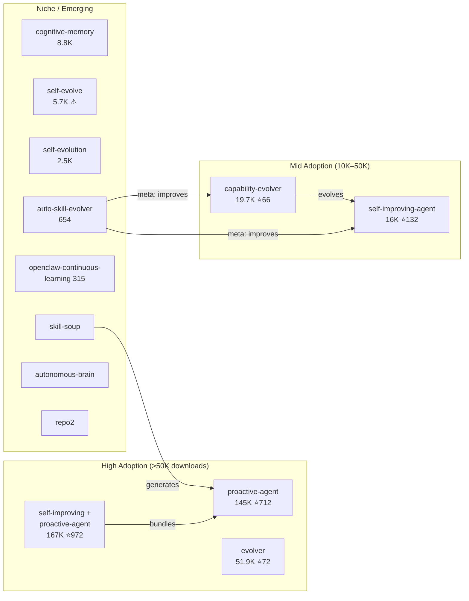
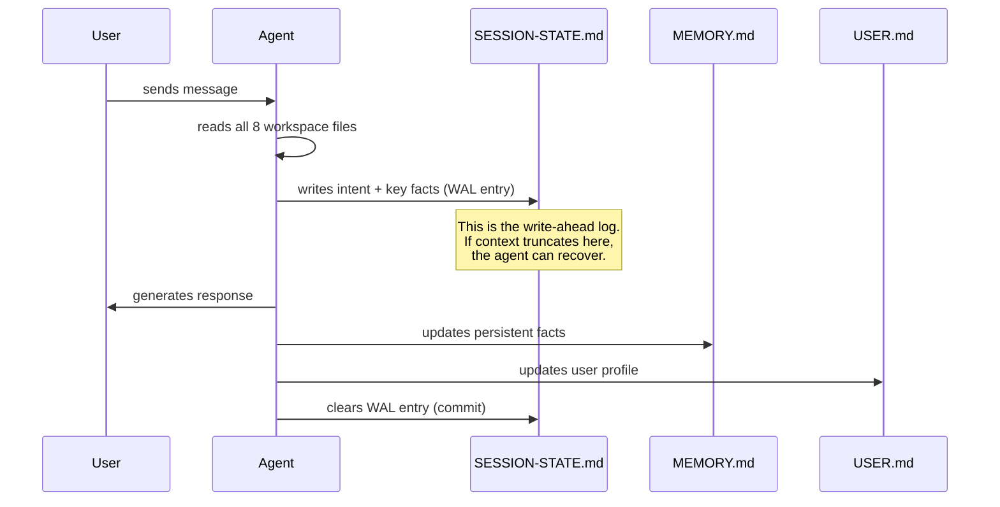

# OpenClaw / ClawHub — The Self-Improving-Agent Skill

OpenClaw (350K+ GitHub stars) is the open-source personal AI agent. ClawHub is its skill marketplace: 13K+ skills, 1.5M+ downloads. You can install a skill that makes the agent self-improving. That sentence is the most interesting thing about this ecosystem.

The agent itself doesn't have a built-in learning loop. The community builds the learning loop *as skills* — installable, composable, and shared through ClawHub. Four of these self-evolution skills have significant adoption.

---

## The Full Self-Evolution Ecosystem on ClawHub

The table below covers every known self-evolution skill on ClawHub as of April 2026. Some are widely deployed; others are niche experiments. Together they represent the complete catalog of community-built learning loops for OpenClaw.

| Skill | Downloads | Stars | Version | What It Does |
|-------|----------|-------|---------|-------------|
| **self-improving + proactive-agent** | 167K | 972 | — | Self-reflection + self-criticism + self-learning. The most adopted combo. |
| **proactive-agent** | 145K | 712 | — | Hal Stack: SOUL.md + MEMORY.md + HEARTBEAT.md + WAL Protocol |
| **evolver** | 51.9K | 72 | v1.40.4 | Self-evolution engine: runtime history analysis + protocol-constrained evolution |
| **capability-evolver** | 19.7K | 66 | v1.52.0 | Genome Evolution Protocol (GEP): genes.json + capsules.json + events.jsonl |
| **self-improving-agent** | 16K | 132 | — | Solidification pipeline: .learnings/ → AGENTS.md/TOOLS.md/SOUL.md |
| **cognitive-memory** | 8.8K | 27 | — | Multi-store memory: episodic, semantic, procedural, core |
| **self-evolve** | 5.7K | — | — | Autonomous evolution: perceive → search → experiment → select → solidify. ⚠ Flagged suspicious. |
| **self-evolution** | 2.5K | — | — | Curriculum-based learning + capability mapping + transfer learning validation |
| **auto-skill-evolver** | 654 | — | — | Meta-skill: improves OTHER skills through trace+feedback-driven evolution |
| **openclaw-continuous-learning** | 315 | — | — | Instinct-based pattern detection → atomic learnings with confidence scoring |
| **skill-soup** | — | — | — | Autonomous skill GENERATION agent: creates and publishes skills |
| **autonomous-brain** | — | — | — | Proactive monitoring + intelligent decision-making + continuous learning |
| **repo2** | — | — | — | Self-evolution engine with self-patching and continuous daemon operation |

These are not research prototypes. They're installed by real users, run in production, and their download counts reflect actual adoption through the ClawHub marketplace.



---

## self-improving + proactive-agent (167K downloads, 972 stars) — The Most Adopted Combo

The single most widely installed self-evolution configuration on ClawHub. It bundles the Hal Stack from **proactive-agent** with a self-reflection and self-criticism layer. The combined skill turns OpenClaw into an agent that not only maintains persistent state but actively critiques and improves its own behavior.

### Three Self-* Capabilities

| Capability | Mechanism | When It Fires |
|-----------|-----------|---------------|
| **Self-reflection** | After each response, the agent evaluates whether it met the user's intent | Every turn |
| **Self-criticism** | Structured adversarial pass — the agent generates objections to its own plan | Before complex multi-step tasks |
| **Self-learning** | Detected patterns and corrections are written to persistent workspace files | When reflection or criticism surfaces a reusable insight |

### Local Workspace

All state lives in `~/self-improving/` on the user's machine:

```
~/self-improving/
├── reflections/           # Per-session reflection logs
│   └── 2026-04-19.md
├── criticisms/            # Adversarial self-critique records
├── learnings/             # Validated insights pending promotion
├── SOUL.md                # Behavioral rules (from proactive-agent)
├── MEMORY.md              # Persistent facts
├── USER.md                # Accumulated user profile
└── SESSION-STATE.md       # WAL recovery state
```

### Security Rating

ClawHub rates this skill as **"Benign"** — the highest trust tier. It reads and writes only to its own workspace directory, does not execute arbitrary shell commands, and does not modify other installed skills. The self-reflection and self-criticism loops operate entirely within the LLM's generation pass (no external calls).

This is significant because most self-evolution skills carry security warnings. The "Benign" rating makes this the safest way to add self-improvement to an OpenClaw agent.

---

## proactive-agent (145K downloads, 712 stars) — The Hal Stack

The most downloaded self-evolution skill. It turns OpenClaw into a stateful, memory-retaining agent with autonomous background operations. The implementation is ambitious: 8 workspace files, a write-ahead log protocol, and a compaction recovery system borrowed from database internals.

### The 8 Workspace Files

| File | Purpose | When Written |
|------|---------|-------------|
| `ONBOARDING.md` | First-session questionnaire results | Once, on install |
| `SOUL.md` | Agent personality, values, behavioral rules | Set by user, rarely changes |
| `USER.md` | Accumulated user profile (preferences, context, history) | Updated continuously |
| `AGENTS.md` | Agent-maintained operational notes | Updated when agent learns |
| `MEMORY.md` | Persistent facts and knowledge base | Updated each session |
| `SESSION-STATE.md` | Current session status, active tasks, blockers | Updated per interaction |
| `HEARTBEAT.md` | Autonomous cron schedule and status | Updated by cron system |
| `memory/YYYY-MM-DD.md` | Daily session logs | Created daily |

### WAL Protocol (Write-Ahead Logging) — In Detail

Borrowed from database systems (PostgreSQL's WAL, SQLite's journal). The core invariant: **no state is lost if the context window is truncated mid-conversation**. Every critical fact is persisted to disk *before* the agent generates a response.



The WAL protocol has three specific phases:

| Phase | What Happens | Analogy |
|-------|-------------|---------|
| **1. Prepare** | Agent reads all 8 files, builds internal state | Database reads current state |
| **2. Write-Ahead** | Agent writes intent, key facts, and working context to SESSION-STATE.md *before* responding | Database writes to WAL before committing |
| **3. Commit** | After successful response + updates to MEMORY.md/USER.md, the SESSION-STATE.md WAL entry is marked complete | Database commits and clears WAL |

If the agent crashes (context truncation) between phases 2 and 3, the uncommitted WAL entry in SESSION-STATE.md contains everything needed to resume.

### Working Buffer — The Compaction Danger Zone

When the context window fills past 70%, the agent enters the "compaction danger zone." At this point it proactively captures the minimum viable context into a working buffer within SESSION-STATE.md:

```markdown
## Working Buffer (auto-captured at 72% context)
- Current task: Migrating user database from PostgreSQL 14 to 16
- Completed steps: backup verified, pg_upgrade dry-run passed
- Next step: run pg_upgrade --link on production
- Critical context: user wants zero-downtime, using pglogical for replication
- Active blockers: none
- User preferences recalled: prefers verbose logging, wants Slack notifications
```

This buffer is the agent's "black box recorder." If truncation occurs, this is what gets read first during recovery.

### Compaction Recovery — Step by Step

When context truncation actually occurs, the Hal Stack executes a precise recovery sequence:

```
Step 1: DETECT
  Agent notices reduced context — either:
  (a) System notification: "Context was compacted"
  (b) Missing conversation history that was present moments ago
  (c) SESSION-STATE.md contains an uncommitted WAL entry

Step 2: LOAD WORKING BUFFER
  Read SESSION-STATE.md → extract the working buffer
  This gives: current task, completed steps, next step, blockers

Step 3: LOAD PERSISTENT STATE
  Read MEMORY.md → persistent facts and knowledge
  Read USER.md → user profile and preferences
  Read AGENTS.md → operational notes

Step 4: LOAD DAILY LOG
  Read memory/YYYY-MM-DD.md → today's session log
  This provides recent conversation summaries

Step 5: RECONSTRUCT
  Synthesize a coherent mental model from all loaded state
  The agent now has:
  - What it was doing (working buffer)
  - What it knows (MEMORY.md)
  - Who the user is (USER.md)
  - What happened today (daily log)

Step 6: RESUME
  Continue the conversation as if truncation never happened
  The user may not notice — the agent's next response is
  contextually appropriate because all critical state was preserved
```

The elegance is that recovery is just "read the files the agent already maintains." No special recovery infrastructure — the workspace files *are* the recovery infrastructure.

### Autonomous Crons (systemEvent) vs. Prompted Crons (agentTurn)

The Hal Stack includes a cron system with two fundamentally different execution models:

| | Autonomous Crons | Prompted Crons |
|---|---|---|
| **Trigger** | `systemEvent` — timer fires automatically | User sends a message that triggers a scheduled check |
| **Execution context** | Isolated `agentTurn` — agent runs in its own turn, no user input required | Within the existing conversation turn |
| **User visibility** | Background — user may not know it ran | Inline — user sees the result |
| **Typical uses** | Memory consolidation, heartbeat updates, scheduled reports | "Check if my PR was merged," daily standup reminders |
| **HEARTBEAT.md entry** | `type: systemEvent`, `status: completed/failed`, `timestamp` | `type: agentTurn`, `triggered_by: user_message` |

**Autonomous Crons** are the more interesting mechanism. They enable true background agent operations:

1. **Memory maintenance** — consolidate daily logs, deduplicate MEMORY.md, archive stale entries
2. **Proactive monitoring** — check external services, repos, or APIs on a schedule
3. **Scheduled tasks** — send reminders, generate reports, run recurring workflows
4. **Self-maintenance** — clean up workspace files, verify skill integrity

The `systemEvent` trigger means the agent wakes up, does its work, and goes back to sleep — all without user interaction. HEARTBEAT.md tracks every autonomous run:

```markdown
## Heartbeat Log

| Timestamp | Type | Task | Status | Duration |
|-----------|------|------|--------|----------|
| 2026-04-19T03:00:00Z | systemEvent | Memory consolidation | ✅ completed | 12s |
| 2026-04-19T03:00:12Z | systemEvent | Stale entry cleanup | ✅ completed | 3s |
| 2026-04-19T09:15:00Z | agentTurn | PR status check | ✅ completed | 8s |
```

**Prompted Crons** are simpler: when the user sends any message, the agent checks HEARTBEAT.md for due tasks and runs them inline. This is useful for tasks that should happen "at the next opportunity" rather than at a precise time.

---

## evolver (51.9K downloads, 72 stars, v1.40.4) — The Self-Evolution Engine

The third most downloaded self-evolution skill. **evolver** takes a different approach from the Hal Stack: instead of maintaining workspace files for memory, it analyzes the agent's *runtime history* — past tool calls, errors, and user corrections — and proposes protocol-constrained modifications to the agent's behavior.

### Core Architecture

```
Runtime History (tool calls, errors, corrections)
       │
       ▼
┌─────────────────────────┐
│   History Analyzer       │
│   (pattern extraction)   │
└──────────┬──────────────┘
           │
           ▼
┌─────────────────────────┐
│   Evolution Proposer     │
│   (protocol-constrained) │
└──────────┬──────────────┘
           │
           ▼
┌─────────────────────────┐
│   Self-Patcher           │
│   (apply + verify)       │
└──────────────────────────┘
```

### Protocol-Constrained Evolution

The key design choice: evolver does not allow arbitrary self-modification. All proposed changes must conform to a predefined **evolution protocol** — a schema that specifies:

- Which files the agent is allowed to modify (whitelist)
- Maximum change size per evolution cycle (token budget)
- Required rollback metadata (every change is reversible)
- Mandatory verification step after each patch

This is what distinguishes evolver from `self-evolve` (which grants unrestricted self-modification authority). The protocol acts as a guardrail — the agent can improve, but only within defined bounds.

### Self-Patching

When the analyzer identifies an improvement opportunity:

1. **Generate patch** — a structured diff against the current configuration
2. **Validate against protocol** — reject if it violates constraints
3. **Apply patch** — write the change to the appropriate file
4. **Verify** — run a sanity check (does the agent still respond correctly to a test prompt?)
5. **Log** — record the patch, its justification, and verification result

### Continuous Daemon Operation

Unlike other skills that run reactively (only when the user interacts), evolver can run as a **continuous daemon**. It periodically scans the runtime history, even between user sessions, and queues evolution proposals. When the user next interacts, the agent can mention: "I identified 3 potential improvements while idle. Would you like to review them?"

---

## capability-evolver (19.7K downloads, 66 stars, v1.52.0) — The Meta-Skill

This is the Genome Evolution Protocol (GEP). It treats the agent's capabilities as a genome that evolves through a structured cycle. It's the most systematically designed self-evolution skill in the ecosystem — and the one with the most complex (and historically controversial) implementation.

### The GEP Protocol: Three Persistence Files

| File | Format | Contents | Size (typical) |
|------|--------|----------|----------------|
| `genes.json` | JSON array | Reusable patterns — successful strategies the agent has discovered | 50–200 entries |
| `capsules.json` | JSON array | Proven fixes — specific solutions to specific problems, with context | 20–100 entries |
| `events.jsonl` | JSON Lines | Audit trail — every evolution event timestamped and categorized | Grows unbounded, rotated weekly |

**genes.json** is the genome. Each gene represents a learned strategy:

```json
{
  "id": "gene-0042",
  "name": "retry-with-backoff",
  "pattern": "When API call fails with 429, retry with exponential backoff",
  "confidence": 0.94,
  "usage_count": 37,
  "last_used": "2026-04-18T14:22:00Z",
  "origin": "observed_failure_recovery"
}
```

**capsules.json** stores atomic fixes — more specific than genes:

```json
{
  "id": "cap-0018",
  "trigger": "pytest fails with 'fixture not found'",
  "fix": "Check conftest.py location — must be in test root or parent",
  "validated": true,
  "success_rate": 0.91
}
```

**events.jsonl** is the audit trail. Every scan, proposal, validation, and application is logged:

```jsonl
{"ts":"2026-04-19T03:00:00Z","type":"scan","genes_checked":142,"gaps_found":3}
{"ts":"2026-04-19T03:00:02Z","type":"propose","gene":"gene-0143","action":"create","reason":"repeated pattern in last 5 sessions"}
{"ts":"2026-04-19T03:00:05Z","type":"validate","gene":"gene-0143","result":"pass","baseline_regression":false}
{"ts":"2026-04-19T03:00:06Z","type":"apply","gene":"gene-0143","status":"committed"}
```

### The Evolution Cycle

```
Scan → Analyze → Propose → Validate → Apply
  │                                      │
  └──────────── feedback ────────────────┘
```

1. **Scan**: Examine recent interactions for capability gaps, failures, and inefficiencies
2. **Analyze**: Compare against known patterns (genes) and proven fixes (capsules)
3. **Propose**: Generate candidate improvements with expected impact
4. **Validate**: Test proposed changes against known-good baselines
5. **Apply**: Commit the change to the agent's configuration or skills

### Six Strategies

The skill supports different evolution modes depending on the team's risk tolerance:

| Strategy | Behavior | Gene Mutation Rate | Capsule Creation Rate |
|----------|----------|-------------------|----------------------|
| `balanced` | Default. Even mix of improvement and stabilization | Medium | Medium |
| `innovate` | Bias toward trying new approaches, higher risk tolerance | High | Low |
| `harden` | Focus on robustness and error reduction, minimal experimentation | Low | High |
| `repair-only` | Only fix broken things, no proactive improvement | None | High |
| `early-stabilize` | Aggressive stabilization for new deployments | Low | Medium |
| `steady-state` | Minimal changes, only evolve when metrics degrade | Very Low | Low |

### Three Execution Modes

| Mode | Human Involvement | Use Case |
|------|-------------------|----------|
| **Fully automated** | None — agent decides and applies | Personal assistants, low-risk tasks |
| **Human-in-the-loop (review)** | Agent proposes, human approves | Production systems, team environments |
| **Continuous background (loop)** | Runs on schedule, queues proposals for review | Enterprise deployments |

### Security History: The Remediation

An earlier version of capability-evolver (pre-v1.40) contained **hardcoded credentials** in its configuration template and a telemetry endpoint that transmitted gene/capsule data to an external server — effectively **data exfiltration** of the agent's learned strategies.

The community discovered this through a ClawHub security audit. The issues were:
- Hardcoded API key in the default `config.json` template
- Telemetry endpoint that sent `genes.json` contents to a third-party analytics service
- No opt-in/opt-out mechanism for data transmission

**Remediation (v1.40+):** All hardcoded credentials removed. Telemetry endpoint removed entirely. The skill now operates fully offline. The events.jsonl audit trail stays local. This incident is why capability-evolver's download count (19.7K) is lower than its technical sophistication would suggest — early trust was damaged.

---

## self-improving-agent (16K downloads, 132 stars) — The Solidification Pipeline

This skill implements a specific learning pattern: observe a gap, search for solutions, test them, and promote the winner to permanent agent configuration. The key concept is **solidification** — the transition from tentative observation to permanent operational knowledge.

### The Improvement Loop

```
Perceive Gap
    │
    ▼
Search Solutions (web, docs, existing skills)
    │
    ▼
Design Experiment (hypothesis + test)
    │
    ▼
Run Experiment
    │
    ▼
Select Winner (if multiple candidates)
    │
    ▼
Solidify (promote to permanent configuration)
```

### The Solidification Pipeline: .learnings/ → Permanent Config

Raw learnings start in `.learnings/` as timestamped markdown files. The pipeline has three stages:

```
Stage 1: CAPTURE
  .learnings/2026-04-19_pytest-config.md
  (raw observation, single instance, unvalidated)
      │
      ▼
Stage 2: VALIDATE
  Agent encounters the same pattern 3+ times
  .learnings/ now has a cluster of related files
      │
      ▼
Stage 3: SOLIDIFY (promote to permanent target)
  Synthesized insight → AGENTS.md or TOOLS.md or SOUL.md
  Original .learnings/ files → archived
```

| Promotion Target | When Used | Example |
|-----------------|-----------|---------|
| `.learnings/` | Initial capture — raw, unvalidated | "pytest needs conftest.py in root" |
| `AGENTS.md` | Operational knowledge the agent should always have | "Always check for conftest.py location when pytest fixtures fail" |
| `TOOLS.md` | Tool-specific usage patterns and gotchas | "pytest: conftest.py must be in test root or ancestor directory" |
| `SOUL.md` | Behavioral rules and personality adjustments | "When debugging test failures, check configuration before code" |
| `CLAUDE.md` | Claude Code memory integration (cross-platform) | Same content, formatted for Claude Code's memory system |

### Heartbeat-Driven Consolidation

The skill includes a cron that periodically scans `.learnings/` for items with 3+ related issues. When it finds a cluster, it:

1. Groups related learnings by topic (using keyword overlap and semantic similarity)
2. Synthesizes a consolidated insight — a single clear statement that captures the pattern
3. Promotes the synthesis to the appropriate target file (AGENTS.md, TOOLS.md, etc.)
4. Archives the individual learning files to `.learnings/archive/`

This prevents the `.learnings/` directory from growing unbounded while ensuring validated patterns graduate to permanent memory. The 3-issue threshold is the key design choice — it filters out one-off observations while promoting recurring patterns.

---

## auto-skill-evolver (654 downloads) — The Meta-Skill

A meta-skill that improves *other* skills. While most self-evolution skills improve the agent's behavior, auto-skill-evolver improves the skills themselves — their procedures, pitfalls, and trigger conditions.

### Trace + Feedback Driven Evolution

The mechanism:

1. **Trace collection** — monitors when installed skills are activated, which sections are used, and whether the outcome was successful
2. **Feedback analysis** — when a skill activation leads to a user correction or an error-recovery sequence, the skill is flagged for review
3. **Patch generation** — proposes specific edits to the skill's Procedure, Pitfalls, or When to Use sections
4. **Validation** — the proposed patch is compared against the original skill's intent to prevent drift

This is the only skill that operates on skills rather than on the agent's direct behavior. It's a second-order evolution mechanism — evolution of the evolution system.

---

## self-evolve (5.7K downloads, 56 installs) — ⚠ Flagged as Suspicious

An autonomous evolution skill with the full pipeline: perceive gaps → search for solutions → experiment → select winners → solidify. Architecturally similar to self-improving-agent but with a critical difference: **it grants the agent unrestricted self-modification authority**.

### Why It's Flagged

ClawHub's security review flagged self-evolve for:

- **No modification whitelist** — the agent can edit any file, not just designated workspace files
- **No rollback metadata** — changes are not reversible through a structured mechanism
- **No verification step** — patches are applied without a sanity check
- **README is explicit**: "This skill gives the agent complete control over its own evolution. Use at your own risk."

The 5.7K download count vs. only 56 active installs tells the story — many users downloaded it, few kept it enabled. It represents a real design philosophy (maximum autonomy, minimal guardrails), but the community has largely voted against this approach in practice.

---

## self-evolution (2.5K downloads) — Production-Grade Curriculum Learning

A sophisticated system that adds curriculum-based learning with formal capability tracking. This is the most structured approach to agent self-evolution on ClawHub.

### Capability Mapping — Six States

Every capability the agent develops is tracked through a formal state machine:

```
recorded → understood → practiced → passed → generalized → promoted
```

| State | Meaning | Transition Trigger |
|-------|---------|-------------------|
| **recorded** | Agent observed a new pattern or technique | First encounter |
| **understood** | Agent can explain the pattern and its context | Agent generates correct explanation |
| **practiced** | Agent has applied the pattern in a real task | Successful application |
| **passed** | Agent has demonstrated the pattern reliably (3+ successes) | Threshold met |
| **generalized** | Agent can apply the pattern to novel contexts | Cross-domain application observed |
| **promoted** | Pattern is part of the agent's permanent repertoire | Manual or automated promotion |

### Curriculum-Based Learning

Instead of learning reactively (only from errors), self-evolution proactively designs a curriculum:

1. **Gap analysis** — compare current capabilities against a target capability profile
2. **Curriculum generation** — create a sequence of increasingly difficult tasks that build the missing capability
3. **Practice sessions** — the agent works through the curriculum (can be autonomous or user-driven)
4. **Assessment** — verify capability advancement through structured evaluation

### Transfer Learning Validation

When the agent learns a strategy in one domain, self-evolution validates whether it transfers to related domains:

```
Strategy: "retry with exponential backoff"
  Learned in: API integration tasks
  Transfer candidates: database connections, file system operations, network requests
  Validation: test the strategy in each candidate domain
  Result: transfers to database + network, does NOT transfer to file system
  → Mark as "generalized" for API + database + network
  → Mark as "domain-specific" for file system
```

---

## cognitive-memory (8.8K downloads, 27 stars) — Human-Like Memory Architecture

This skill models human memory processes: encoding, consolidation, decay, and recall. It maintains four separate memory stores, each with different persistence and access patterns.

### Four Memory Stores

| Store | Analogy | Persistence | Access Pattern |
|-------|---------|-------------|----------------|
| **Episodic** | "What happened" | Session-scoped, consolidated daily | Sequential recall by time |
| **Semantic** | "What I know" | Permanent, grows over time | Associative lookup by concept |
| **Procedural** | "How to do things" | Permanent, refined through practice | Pattern-matched by task type |
| **Core** | "Who I am" | Immutable unless user overrides | Always loaded |

### Memory Processes

- **Encoding** — new information is tagged with context (time, task, user state) and written to the episodic store
- **Consolidation** — periodic process that moves validated episodic memories to semantic or procedural stores (analogous to human sleep consolidation)
- **Decay** — memories that are never recalled gradually lose salience; after a threshold, they're archived rather than loaded into context
- **Recall** — retrieval uses a combination of recency, frequency, and relevance scoring; high-salience memories are retrieved first

---

## openclaw-continuous-learning (315 downloads) — Instinct-Based Learning

The smallest self-evolution skill by adoption, but with an interesting approach: **instinct-based** learning.

### The Mechanism

1. **Pattern detection** — the skill monitors the agent's interactions for recurring patterns (repeated questions, similar error sequences, common workflows)
2. **Atomic learning creation** — when a pattern is detected, an atomic learning is created: a single, focused insight with a **confidence score** (0.0–1.0)
3. **Confidence-gated promotion** — learnings below a confidence threshold (default: 0.7) stay in a staging area; learnings above the threshold are promoted to active memory
4. **Optimization suggestions** — the skill periodically suggests workflow optimizations based on accumulated learnings

The "instinct" metaphor: the agent develops gut feelings about what works before those feelings are formally validated. Low-confidence instincts inform behavior subtly; high-confidence instincts become explicit operational rules.

---

## skill-soup — Autonomous Skill Generation Agent

Not a self-evolution skill in the traditional sense — skill-soup is an autonomous agent that **creates and publishes** new skills to ClawHub. It monitors community discussions, issue trackers, and feature requests, then generates skill implementations that address unmet needs.

### How It Works

1. **Monitor** — scans ClawHub issues, Discord discussions, and GitHub issues for unmet skill requests
2. **Generate** — creates a SKILL.md file following the agentskills.io standard
3. **Test** — runs the generated skill through a validation suite
4. **Publish** — submits the skill to ClawHub as a new listing

skill-soup is the first example of an agent that contributes to the evolution ecosystem rather than evolving itself. It's an agent that makes tools for other agents.

---

## autonomous-brain — Proactive Monitoring and Continuous Learning

A comprehensive skill that combines three capabilities:

1. **Proactive monitoring** — the agent watches for changes in the user's environment (new files, repo updates, calendar events) and proactively offers assistance
2. **Intelligent decision-making** — accumulates a decision log and learns which types of decisions the user prefers to make themselves vs. delegate to the agent
3. **Continuous learning** — a background process that reviews past interactions, extracts patterns, and updates the agent's behavioral model

autonomous-brain is the closest thing to a "general intelligence enhancement" skill — it doesn't focus on a single evolution mechanism but tries to make the agent broadly smarter over time.

---

## repo2 — Self-Evolution Engine with Daemon Mode

A self-evolution engine that shares architectural DNA with **evolver** but adds a continuous daemon mode. The agent runs as a background process, periodically analyzing its own performance and applying self-patches.

### Key Differences from evolver

| | evolver | repo2 |
|---|---|---|
| **Runtime analysis** | Batch (periodic scans) | Continuous (streaming analysis) |
| **Self-patching** | Protocol-constrained | Protocol-constrained + rollback |
| **Daemon mode** | Optional | Primary mode of operation |
| **State persistence** | Runtime history files | Embedded database (SQLite) |

repo2 is designed for always-on agent deployments where the agent needs to continuously improve without user intervention.

---

## Security Warnings

Every self-evolution skill in ClawHub carries security flags. The warnings are explicit:

```
⚠ This skill can:
  - Execute shell commands
  - Modify configuration files
  - Access system files
  - Write to the filesystem
  - Modify its own behavior
```

An agent that can rewrite its own skills can also rewrite its own constraints. Five mitigation patterns have emerged across the ecosystem:

| Pattern | Implementation | Limitation |
|---------|---------------|-----------|
| **Sandboxing** | Run agent in Docker/VM, limit filesystem access | Reduces capability alongside risk |
| **Git tracking** | All skill/config changes committed to a repo | Audit trail only — doesn't prevent bad changes |
| **Human approval** | Agent proposes changes, human approves | Latency; defeats the purpose of autonomy |
| **Rate limiting** | Cap skill mutations per session (e.g., max 3 edits) | Arbitrary threshold; doesn't distinguish good from bad |
| **Constitution file** | Immutable rules the agent cannot modify (SOUL.md pattern) | Agent can still work around constraints via new skills |

None of these are complete solutions. The fundamental tension: an agent powerful enough to improve itself is powerful enough to break itself. The community consensus is to combine sandboxing + git tracking + rate limiting as a practical baseline, with human approval for production deployments.

The `self-evolve` skill (5.7K downloads, only 56 active installs) takes the opposite position — it grants the agent full self-modification authority with minimal guardrails. Its README is explicit: "This skill gives the agent complete control over its own evolution. Use at your own risk." It exists, it has adoption (though declining), and it represents a real design choice in the ecosystem. The gap between downloads and active installs tells the story: most users who tried unrestricted self-modification decided against keeping it.
