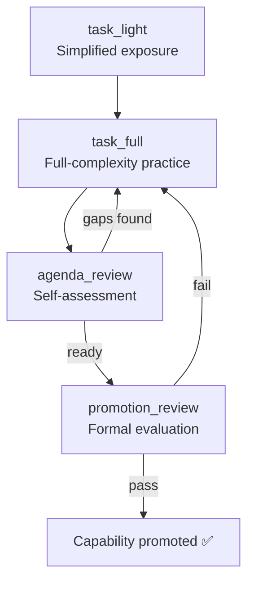

# SkillHub and the Chinese Ecosystem

The agentskills.io standard created an interoperable skill format. ClawHub hosts 13K+ skills for the global market. But in China, a parallel ecosystem has formed around the same format — with its own distribution, its own curation, and its own top skills.

---

## SkillHub.cn / SkillHub.mobi

Tencent's localized skills platform for Chinese OpenClaw users. Not a fork — a mirror with infrastructure and curation optimized for the Chinese market.

**What it is:**
- Mirrors 13K+ ClawHub skills with Tencent Cloud CDN acceleration
- Full Chinese interface (skill descriptions, documentation, installation instructions)
- 8 categories: Social Media, Development, Productivity, Research, Privacy, Office, Entertainment, System
- Curated Top 50 list — each skill manually safety-audited by Tencent's review team
- Free. One-click installation via the OpenClaw client

**What it isn't:**
- Not a separate skill format. Same SKILL.md standard, same installation mechanism
- Not a walled garden. Skills installed from SkillHub.cn work identically to ClawHub-sourced skills
- Not required. Chinese users can still install directly from ClawHub

The value proposition is speed (Tencent Cloud vs. GitHub/npm CDN from China) and trust (safety audit for the Top 50).

---

## Top Downloads (Q1 2026)

| Rank | Skill | Downloads | Category |
|------|-------|-----------|----------|
| 1 | Xiaohongshu Automation | 59K | Social Media |
| 2 | GitHub Collaboration | 48K | Development |
| 3 | Summarize | 44K | Productivity |
| 4 | Tavily Web Search | 39K | Research |
| 5 | HaS Anonymizer | 31K | Privacy |
| 6 | Tencent Docs | 27K | Office |

The top skill is a Xiaohongshu (Little Red Book) automation skill — content scheduling, engagement tracking, cross-posting. This tells you something about the user base: Chinese OpenClaw adoption is driven heavily by content creators and social media professionals, not just developers.

GitHub Collaboration at #2 confirms the developer base exists but coexists with a broader non-technical audience. The Summarize and Tavily Web Search skills are the same global skills, just localized and CDN-accelerated.

HaS Anonymizer at #5 (privacy category, 31K downloads) reflects a specific Chinese market need — anonymizing content before sharing across platforms with different moderation policies.

Tencent Docs integration at #6 is the Tencent-specific play: deep integration with Tencent's productivity suite, equivalent to what a Google Docs skill would be for Western users.

---

## The Skills Ecosystem Structure

### The agentskills.io Standard

The same SKILL.md format used by Hermes, OpenClaw, and Claude Code. One skill, three platforms:

```
SKILL.md (agentskills.io format)
     │
     ├── Hermes Agent: ~/.hermes/skills/
     ├── OpenClaw: installed via ClawHub / SkillHub
     └── Claude Code: referenced in CLAUDE.md or .claude/skills/
```

### Installation

Two package registries, same skills:

```bash
# From ClawHub (global)
npx skillhub install [skill-name]

# Alternative registry
npx agent-skills-hub install [skill-name]

# From SkillHub.cn (Tencent-accelerated)
# Same command — the OpenClaw client resolves the source
# based on user's configured registry
```

### Cross-Platform Compatibility

Skills are agent-agnostic by design. A skill installed via SkillHub.cn for OpenClaw can be manually copied into a Hermes `~/.hermes/skills/` directory or referenced from a Claude Code `CLAUDE.md`. The YAML frontmatter may include agent-specific metadata blocks (`metadata.hermes`, `metadata.openclaw`), but the core sections (When to Use, Procedure, Pitfalls, Verification) are universal.

---

## iflytek/SkillHub (Enterprise)

iFlytek (科大讯飞), the Chinese AI and speech technology company, ships a self-hosted skills platform for enterprise deployments. Different product, same name pattern.

### What It Is

- Self-hosted platform deployed via Docker or Kubernetes
- Designed for organizations that need private skill registries
- Built in Java (backend) + TypeScript (frontend)
- Current version: v0.2.3 (April 2026)

### Enterprise Features

| Feature | Implementation |
|---------|---------------|
| **RBAC** | Role-based access control — admin, editor, viewer roles per namespace |
| **Namespaces** | Organize skills by team, project, or department |
| **Versioning** | Semantic versioning with rollback support |
| **Audit logging** | Every install, update, and deletion logged with user identity and timestamp |
| **Private registry** | Skills never leave the organization's infrastructure |

### Deployment

```yaml
# Docker Compose (minimal)
services:
  skillhub-api:
    image: iflytek/skillhub-api:0.2.3
    ports: ["8080:8080"]
    environment:
      - DB_URL=jdbc:postgresql://db:5432/skillhub
      - AUTH_PROVIDER=ldap

  skillhub-web:
    image: iflytek/skillhub-web:0.2.3
    ports: ["3000:3000"]

  db:
    image: postgres:16
```

### Enterprise vs. Community

| | ClawHub / SkillHub.cn | iflytek/SkillHub |
|---|---|---|
| **Hosting** | Cloud (GitHub/npm / Tencent Cloud) | Self-hosted (Docker/K8s) |
| **Access control** | Public | RBAC with namespaces |
| **Skill source** | Community-contributed | Organization-internal + curated imports |
| **Audit** | Download counts only | Full audit trail |
| **Cost** | Free | Open-source, self-hosted infra costs |
| **Use case** | Individual users, open-source projects | Enterprises with compliance requirements |

The enterprise version exists because large Chinese companies need private skill registries with access control and audit trails. The agentskills.io format is the same — iflytek/SkillHub just wraps it in enterprise infrastructure.

---

## Ecosystem Map

```
agentskills.io (format standard)
     │
     ├── ClawHub (global marketplace, 13K+ skills, 1.5M+ downloads)
     │     └── SkillHub.cn (Tencent mirror, CDN-accelerated, safety-audited Top 50)
     │
     ├── Hermes Agent (built-in skill creation + external skill import)
     │
     ├── Claude Code (CLAUDE.md + .claude/skills/ integration)
     │
     └── iflytek/SkillHub (enterprise self-hosted registry)
```

The convergence on a single skill format across Hermes, OpenClaw, Claude Code, and enterprise platforms is the structural story. Skills are portable. The ecosystem competes on distribution, curation, and trust — not on format.

---

## Self-Evolution on SkillHub: The self-evolving-agent Skill

SkillHub hosts its own self-evolution offering: **self-evolving-agent** (GitHub: `RangeKing/self-evolving-agent`). It takes a fundamentally different approach from the ClawHub self-improving skills. Where most ClawHub skills focus on *passive* improvement (logging errors, consolidating learnings), self-evolving-agent implements *active capability advancement* — the agent proactively seeks out new capabilities through a structured curriculum.

### Self-Improving vs. Self-Evolving: The Distinction

| | Self-Improving (passive) | Self-Evolving (active) |
|---|---|---|
| **Trigger** | Error or gap detected during normal use | Agent proactively initiates capability assessment |
| **Learning source** | Past mistakes and user corrections | Structured curriculum + deliberate practice |
| **Outcome** | "Don't repeat this mistake" | "I can now do something I couldn't before" |
| **Capability growth** | Incremental (fix by fix) | Systematic (capability by capability) |
| **Example** | "Remember that pytest needs conftest.py in root" | "I have passed assessment for Python testing and can now generalize to other test frameworks" |

Most ClawHub skills (self-improving-agent, proactive-agent, openclaw-continuous-learning) are **self-improving**: they react to failures and accumulate fixes. self-evolving-agent is **self-evolving**: it actively builds new capabilities through practice.

### Curriculum-Based Learning

self-evolving-agent organizes learning into four phases:

| Phase | What Happens | Duration |
|-------|-------------|----------|
| **task_light** | Agent encounters a simplified version of a new capability area. Low stakes, guided examples. | 1–3 sessions |
| **task_full** | Agent works on full-complexity tasks in the capability area. Real stakes, minimal guidance. | 3–10 sessions |
| **agenda_review** | Agent reviews its performance across all task_full sessions. Identifies remaining gaps. | 1 session |
| **promotion_review** | Formal assessment: can the agent reliably demonstrate this capability? | 1 session |



### Capability Evaluation States

Every capability the agent develops is tracked through a formal six-state progression:

```
recorded → understood → practiced → passed → generalized → promoted
```

| State | Meaning | How Agent Advances |
|-------|---------|-------------------|
| **recorded** | A new capability area has been identified | Agent encounters an unfamiliar task type |
| **understood** | Agent can explain the capability and its context | Agent generates a correct explanation of the domain |
| **practiced** | Agent has attempted real tasks in this capability area | task_full phase completed at least once |
| **passed** | Agent demonstrates reliable competence (3+ successes, <10% error rate) | Assessment threshold met |
| **generalized** | Agent can apply the capability to novel contexts outside the original domain | Cross-domain transfer validated |
| **promoted** | Capability is permanently integrated into the agent's operational repertoire | promotion_review passed |

### Transfer Learning: Cross-Task Strategy Validation

The most sophisticated feature. When the agent learns a strategy in one context, self-evolving-agent validates whether it **transfers** to related contexts:

```
Strategy: "Use structured output schemas to reduce hallucination"
  Learned in: API response parsing
  
  Transfer validation:
    ✅ Database query results → works (reduces formatting errors)
    ✅ Config file generation → works (enforces valid structure)
    ❌ Creative writing → does NOT transfer (constrains useful variety)
    ✅ Log analysis → works (standardizes extraction)
  
  Result: Strategy marked "generalized" for structured-data tasks
          Strategy marked "domain-specific, do not apply" for creative tasks
```

Transfer validation prevents the agent from overgeneralizing. A strategy that works in one domain might be counterproductive in another — the evaluation pipeline catches this before it becomes a habit.

---

## Proposed: Adaptive Memory for OpenClaw Core

There is an active proposal (RFC status, not yet merged) to add **Adaptive Memory** as a built-in feature of OpenClaw itself — not as a skill, but as core infrastructure. This would be the first self-evolution mechanism built into the platform rather than installed from a marketplace.

### Hierarchical Memory Architecture

The proposal defines three memory tiers:

```
Tier 3: MEMORY.md (~1000 tokens)
  Permanent, always in system prompt
  Promoted facts and core knowledge
       ▲ promotion (high confidence + frequency)
       │
Tier 2: Active Context (~5000 tokens)
  Session-spanning working memory
  Current projects, recent decisions, active preferences
       ▲ consolidation (pattern detection)
       │
Tier 1: Daily Notes (unbounded)
  Per-session logs, raw observations
  Automatically captured, ephemeral
```

| Tier | Name | Token Budget | Persistence | Loaded When |
|------|------|-------------|-------------|-------------|
| **Tier 1** | Daily Notes | Unbounded | 30-day rolling window | On demand (search) |
| **Tier 2** | Active Context | ~5,000 tokens | Until superseded | Every session |
| **Tier 3** | MEMORY.md | ~1,000 tokens | Permanent | Always (system prompt) |

### Why Built-In vs. Skill?

The argument for building this into OpenClaw core rather than leaving it as a skill:

1. **Consistency** — every OpenClaw user gets baseline memory without knowing about ClawHub
2. **Performance** — core memory can be optimized at the system level (e.g., pre-indexed search)
3. **Interoperability** — skills can read/write to the core memory rather than maintaining their own separate memory files
4. **Reliability** — no dependency on a third-party skill that might break or be abandoned

The counterargument: the skill ecosystem has already produced multiple competing memory architectures (proactive-agent, cognitive-memory, self-evolution). Building one approach into core might stifle innovation. The RFC is still under discussion.
